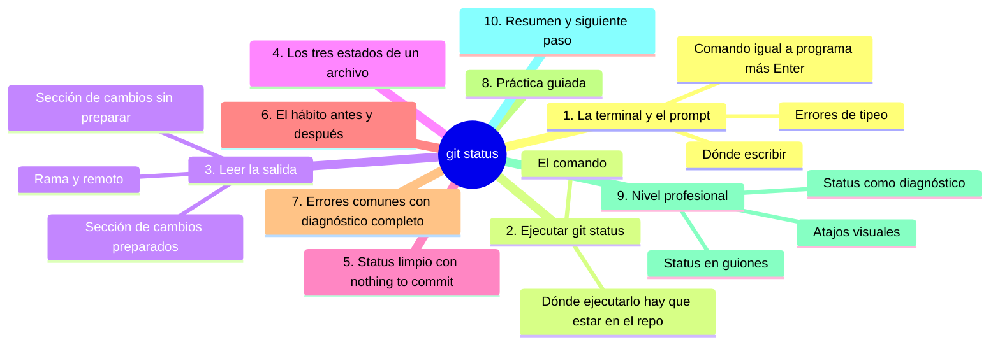
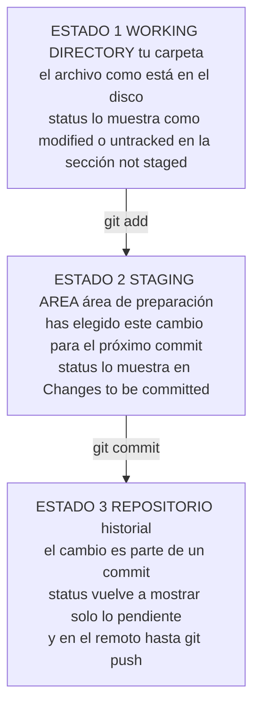

# git status

## Introducción

Si Git tuviera un solo comando que debieras recordar, sería `git status`. Es la brújula: te dice dónde estás, qué has cambiado y qué está a punto de ocurrir.

`git status` responde tres preguntas en una: ¿en qué rama estoy?, ¿qué cambios hay pendientes? y ¿qué ha quedado preparado para el commit? Usarlo antes y después de cada operación convierte el trabajo con Git en algo predecible: nunca improvisas a ciegas.

En este capítulo aprenderás:

* a abrir la terminal y ejecutar tu primer comando de Git;
* a leer la salida de `git status` sección por sección;
* los tres estados de un archivo (sin cambios, modificado, preparado);
* la diferencia entre «changes not staged» y «changes to be committed»;
* el hábito de usar status antes y después de cada paso;
* errores comunes con diagnóstico completo, práctica guiada y nivel profesional (status como punto de entrada a scripts y flujos).

---

## Mapa conceptual de este capítulo



---

## 1. La terminal y el prompt

### 1.1. Dónde escribir

```text
Windows
   │
   ├── Git Bash (recomendado: viene con Git en Windows)
   ├── la app «Terminal»/PowerShell (Git también funciona)
   └── CMD (funciona, pero Git Bash es más cómodo)

macOS
   └── Terminal (o iTerm si prefieres)

Linux
   └── tu terminal habitual (GNOME Terminal, Konsole...)
```

### 1.2. Anatomía de un comando

```text
Prompt (ejemplo simplificado):
   usuario@equipo ~/proyecto %

Tú escribes:
   git status
   [Enter]

   │        │
   │        └── argumento: qué quieres saber
   └── programa: Git

Git responde: texto en pantalla con el estado.
```

### 1.3. Errores de tipeo

```text
Problemas frecuentes al empezar
   │
   ├── «guat status» (mala entrada) → comando no encontrado
   ├── olvidar la barra espaciadora entre comando y opción
   ├── escribirlo en una carpeta que NO es repositorio
   │   → Git dirá «not a git repository» (punto 7)
   └── mayúsculas: los comandos son en minúscula
       (git Status NO existe)
```

---

## 2. Ejecutar git status

### 2.1. El comando

```text
$ git status
```

Sin argumentos, sin configuración: status no modifica nada. **Es de solo lectura**: ejecútalo las veces que quieras.

### 2.2. Dónde ejecutarlo

```text
Requisito: estar DENTRO de una carpeta con repositorio Git
──────────────────────────────────────────────
Opción A: abrir la terminal YA en la carpeta
   · desde el explorador: clic derecho → «Open Git Bash
     here» (Windows) o abrir terminal en esa ruta
   · o navegar con cd hasta ella

Opción B: usar git -C ruta (avanzado)

Si NO estás en un repositorio:
   fatal: not a git repository...
   →  resolución en el punto 7.1
```

### 2.3. Primera salida esperada (repositorio recién clonado)

```text
On branch main
Your branch is up to date with 'origin/main'.

nothing to commit, working tree clean
```

Desglose:

```text
On branch main          →  estás en la rama main
up to date with origin  →  tu rama está sincronizada con
                           el remoto (no hay nada que subir
                           ni bajar)
nothing to commit       →  no hay cambios pendientes
working tree clean      →  tu carpeta de trabajo está limpia
                           (coincide con el último commit)
```

---

## 3. Leer la salida (cuando hay cambios)

### 3.1. Anatomía completa

```text
Salida típica con trabajo pendiente
──────────────────────────────────────────────
On branch main
Your branch is ahead of 'origin/main' by 1 commit.
  (use "git push" to publish your local commits)

Changes not staged for commit:
  (use "git add <file>..." to update what will be committed)
  (use "git restore <file>..." to discard changes in working directory)
        modified:   notas.md

Changes to be committed:
  (use "git rm --cached <file>..." to unstage)
        new file:   README.md
```

### 3.2. Sección por sección

```text
1) On branch main
   → rama actual. Si estuvieras en otra, diría su nombre.

2) Relación con el remoto
   · up to date         → sincronizados
   · ahead by N         → tienes N commits sin subir → push
   · behind by N        → el remoto tiene N que no tienes → pull
   · diverged           → ambos avanzaron (atención: pull)

3) "Changes not staged for commit"
   → cambios en tu carpeta que NO están preparados.
   → para commitearlos hay que añadirlos (git add).

4) "Changes to be committed"
   → cambios YA preparados: lo próximo que commitees.
   → aquí está el «área de preparación» (staging),
     que verás a fondo en la sección 07.
```

### 3.3. Significados de archivo

```text
En la lista aparecen estados:
   │
   ├── modified:   archivo existente con cambios
   ├── new file:   archivo nuevo añadido al staging
   ├── deleted:    archivo borrado
   └── untracked:  archivo nuevo DETECTADO pero sin añadir
                   (Git lo ve, pero no lo gestiona aún)
```

---

## 4. Los tres estados de un archivo

Este es el mapa conceptual que gobierna todo Git:



```text
En status, la traducción es:
──────────────────────────────────────────────
"not staged"    →  estás en el ESTADO 1 (por decidir)
"to be committed" →  estás en el ESTADO 2 (decidido,
                    falta confirmar)
(no aparece)    →  ya está en el ESTADO 3 (o no existe cambio)
```

---

## 5. Status limpio

### 5.1. Qué significa «clean»

```text
nothing to commit, working tree clean
   │
   ├── tu carpeta coincide EXACTAMENTE con el último commit
   ├── no hay nada en el área de preparación
   ├── y si además: "up to date with origin"
   │   →  no hay nada que subir ni bajar
   │
   └── es el estado de reposo: buen momento para empezar
       una tarea nueva
```

### 5.2. Clean no significa «sincronizado»

```text
Dos limpiezas distintas:
   │
   ├── working tree clean  →  sin cambios locales pendientes
   └── up to date          →  sincronizado con el remoto

   Un repositorio puede estar clean pero ADELANTE o ATRÁS
   respecto a origin (commits hechos pero no subidos,
   o no traídos). Status lo dice en la línea de remoto.
```

---

## 6. El hábito: antes y después

```text
Rutina con status (la «brújula»)
──────────────────────────────────────────────
ANTES de empezar:
   git status
   →  ¿estoy en la rama que debo?
   →  ¿hay cambios de alguien/alguna sesión anterior?
   →  ¿estoy al día con origin?

ANTES de add/commit:
   git status
   →  ¿la lista de cambios es exactamente la esperada?

DESPUÉS de commit:
   git status
   →  ¿quedó algo fuera?
   →  ¿la sección "to be committed" está vacía?

ANTES de push/pull:
   git status
   →  ¿ahead? ¿behind? ¿diverged?
```

Cinco segundos de status evitan la mitad de los problemas del flujo diario.

---

## 7. Errores comunes con diagnóstico completo

### Error 1: «not a git repository»

**Qué ocurrió:** Git dice que no hay repositorio.

**Por qué:** estás en una carpeta sin `.git` (fuera del proyecto, o la carpeta equivocada).

**Cómo comprobarlo:**
* `pwd` (Linux/macOS) o `cd` (Windows) para ver dónde estás;
* comprobar si existe `.git` en esa carpeta o en alguna superior.

**Opciones:**
* navegar con `cd nombre-carpeta` hasta el repositorio;
* o clonar si no lo tienes (ya sabes cómo);
* desde el explorador: abrir la terminal «aquí» en la carpeta correcta.

**Riesgos:** ninguno (status no modifica), solo pérdida de tiempo.

**Solución:** estar dentro del repositorio.

**Cómo se evita:** abrir la terminal desde la carpeta del proyecto (clic derecho → Git Bash here).

---

### Error 2: No entender «not staged» vs. «to be committed»

**Qué ocurrió:** se commiteó y «no se guardó lo que esperaba» (o lo contrario).

**Por qué:** se ignoró la distinción de secciones.

**Cómo comprobarlo:** leer la salida de status: ¿en qué sección estaba el archivo?

**Opciones:**
* si quedó sin preparar: `git add` y commit nuevo;
* si entró de más: corregir en el próximo commit (o enseñar a deshacer staging, que verás pronto).

**Riesgos:** commits incompletos.

**Solución:** traducir la salida con la tabla del punto 4.

**Cómo se evita:** leer status SIEMPRE antes de commitear.

---

### Error 3: Creer que «untracked» es un error

**Qué ocurrió:** aparece `untracked files` y se asusta («Git no reconoce mi archivo»).

**Por qué:** es el estado normal de un archivo nuevo que aún no se añade.

**Cómo comprobarlo:** la sección dice exactamente «untracked files» con la sugerencia `git add`.

**Opciones:**
* si debe entrar: `git add` (próximo capítulo);
* si NO debe entrar (temporales, generados): añadirlo a `.gitignore` (sección 06+).

**Riesgos:** pocos; la confusión se resuelve con el concepto.

**Solución:** entender que Git detecta, tú decides.

**Cómo se evita:** recordar los tres estados.

---

### Error 4: Ejecutar status y no leer el remoto

**Qué ocurrió:** status decía «behind by 2» y nadie lo notó; luego el push fue rechazado.

**Por qué:** solo se miró la sección de cambios.

**Cómo comprobarlo:** segunda línea de la salida.

**Opciones:** pull y seguir (o resolver según contexto).

**Riesgos:** sorpresas al sincronizar.

**Solución:** leer la salida COMPLETA.

**Cómo se evita:** hábito: rama → remoto → cambios (en ese orden mental).

---

### Error 5: Status enorme y confuso

**Qué ocurrió:** cientos de archivos listados.

**Por qué:** cambios masivos, archivos generados, o se abrió en una carpeta equivocada con muchos archivos.

**Cómo comprobarlo:** el listado.

**Opciones:**
* revisar por partes (o `git status -s`, punto 9.2, para vista corta);
* identificar generados → `.gitignore`;
* si es ruido de formato: analizar antes de add.

**Riesgos:** añadir basura por agobio.

**Solución:** diagnóstico primero, `git add` después.

**Cómo se evita:** mantener la carpeta de trabajo ordenada y `.gitignore` al día.

---

### Error 6: Ejecutar comandos en la carpeta equivocada por accidente

**Qué ocurrió:** se hizo `git add` u otra operación pensando que se estaba en el repo A, y se estaba en el B.

**Por qué:** varias terminales/ventanas abiertas.

**Cómo comprobarlo:** status dice el nombre de la carpeta/rama; o `pwd`.

**Opciones:** verificar y, si el daño es simple (add en el repo equivocado), repetir en el correcto (add en sí es inofensivo).

**Riesgos:** confusión; en operaciones destructivas (reset, rm) sí importa mucho.

**Solución:** siempre empezar por status (que muestra el contexto).

**Cómo se evita:** una tarea, una terminal, un repositorio.

---

## 8. Práctica guiada

### Objetivo

Interpretar `git status` en cuatro situaciones distintas.

### Preparación

Abre la terminal en tu repositorio de práctica (el clonado en la sección 05).

### Situación 1: repositorio limpio

1. Ejecuta `git status`.
2. Anota: rama, estado con origin, «nothing to commit».

### Situación 2: archivo modificado

1. Edita `notas.md` con tu editor y guarda.
2. `git status`.
3. Identifica: `modified: notas.md` en «not staged».

### Situación 3: archivo nuevo

1. Crea `tareas.md`.
2. `git status`.
3. Identifica: «untracked files» (o similar) con `tareas.md`.

### Situación 4: archivo preparado

1. Ejecuta `git add tareas.md` (esto es del próximo capítulo, solo para ver la transición).
2. `git status`.
3. Identifica: `tareas.md` movido a «Changes to be committed» y `notas.md` sigue «not staged».

### Situación 5: leer el remoto

1. Si tu repositorio está sincronizado con origin, verás «up to date».
2. Si en algún momento viste «ahead» o «behind», anótalo: es información valiosa (la usarás en push/pull).

### Resultado esperado

Capacidad de traducir cada línea de la salida a un estado concreto del flujo.

### Conclusión esperada

`git status` no es un comando más: es la lectura del tablero. Quien lo lee bien, nunca trabaja a ciegas.

### Ejercicio de transferencia

En un repositorio con varios archivos (el de práctica o uno propio), modifica dos archivos, borra uno y crea otro nuevo, sin ejecutar `git add` todavía. Entrega la salida de `git status` junto a una tabla de dos columnas donde cada archivo aparezca traducido a su estado (not staged, untracked o deleted) y a la acción que te corresponde tomar. El entregable es la salida pegada y la tabla completada.

---

## 9. Nivel profesional

### 9.1. Status en guiones

```text
Programación con status
──────────────────────────────────────────────
git status --porcelain     →  salida para MÁQUINA
                              (una línea por archivo,
                               formato estable)

Uso típico:
   · comprobar si hay cambios antes de automatizar
   · scripts de CI/CD que fallan si el árbol no está limpio
   · herramientas que construyen sobre Git
```

La salida `--porcelain` existe exactamente para eso: que los programas no dependan del texto destinado a humanos.

### 9.2. Vistas cortas

```text
Atajos de lectura
──────────────────────────────────────────────
git status -s        (o --short)
   →  una columna de estado + nombre
   ·  M = modificado (según posición: staging/no staging)
   ·  ?? = untracked
   ·  A  = añadido al staging

git status -sb
   →  corto + resumen de la rama (ahead/behind)
```

Con práctica, `-s` es la vista diaria y la salida larga para diagnóstico fino.

### 9.3. Status como diagnóstico

```text
Ante cualquier duda en Git, la secuencia es:
   │
   1. git status         →  dónde estoy y qué hay
   2. git log --oneline  →  qué pasó recientemente
   3. git diff           →  qué cambió exactamente
   │
   └── status es el primer eslabón: casi siempre basta
       para entender qué está pasando
```

### 9.4. Estado limpio en automatización

```text
Flujos profesionales exigen árbol limpio para:
   │
   ├── cambiar de rama con seguridad
   ├── rebase y merge sin sorpresas
   ├── despliegues reproducibles
   └── cierra el ciclo: «termino la tarea con working tree
       clean y rama sincronizada»
```

---

## 10. Resumen

En este capítulo aprendiste que:

* `git status` es el comando de solo lectura que responde: qué rama, qué relación con el remoto y qué cambios hay;
* para ejecutarlo hay que estar dentro de la carpeta del repositorio (o Git responderá «not a git repository»);
* la salida tiene tres bloques: rama y remoto (ahead/behind/diverged), cambios sin preparar (not staged) y cambios preparados (to be committed);
* los tres estados de un archivo son: carpeta de trabajo → área de preparación (add) → historial (commit);
* «untracked» es el estado natural de un archivo nuevo aún sin añadir, no un error;
* «working tree clean» y «up to date» son limpiezas distintas: una es local, otra con el remoto;
* el hábito profesional es usar status antes de empezar, antes de commitear, después de commitear y antes de sincronizar;
* los errores típicos se diagnostican leyendo la salida completa, empezando por dónde está la terminal;
* a nivel profesional, `--porcelain` y `-s` convierten status en herramienta de guiones y lectura rápida.

La idea principal es:

> **Status es la brújula del flujo de Git: no cambia nada, pero hace que cada cambio que hagas sea una decisión consciente y no una suposición.**

---

## Autopreguntas de cierre

Sin mirar el material, responde mentalmente y luego compruébalo con este capítulo:

1. ¿Qué tres preguntas responde `git status` y qué información NO te da?
2. ¿Qué significan «not staged» y «to be committed» y qué harías con cada uno de los dos?
3. ¿Por qué `untracked` no es un error y qué decisión te toca a ti en ese momento?
4. ¿Qué diferencia hay entre «working tree clean» y «up to date with origin»?
5. Si status dice «behind by 2» justo antes de un push, ¿qué harías y por qué?
6. ¿En qué momentos del día deberías ejecutar status y qué problemas evitas si te lo saltas?
7. ¿Qué harías si la salida lista cientos de archivos modificados y no sabes por dónde empezar?
8. ¿Qué significa cada estado de la lista de archivos (modified, new file, deleted, untracked)?

---

## Próximo paso

Ya sabes leer el estado del repositorio.

El siguiente paso es la primera acción sobre el área de preparación: elegir qué cambios entran en el próximo commit con `git add`.

Continúa con:

[`08-git-add.md`](08-git-add.md)
