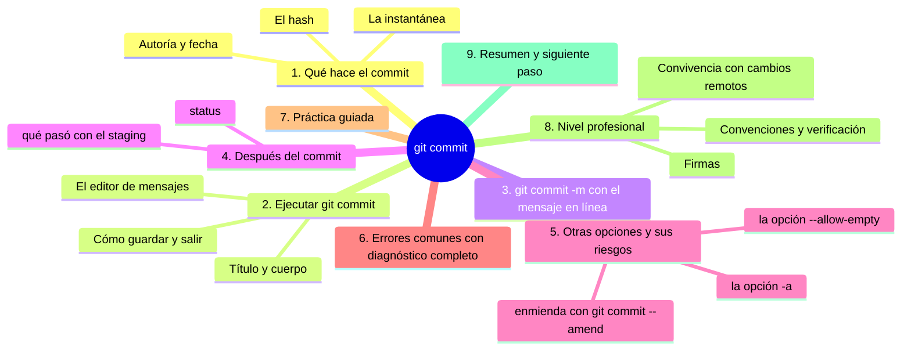
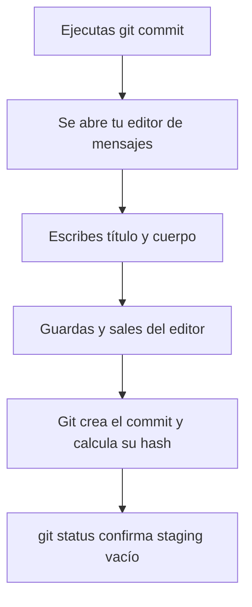

# git commit

## Introducción

`git add` preparó la instantánea; **`git commit`** la confirma. El commit es el acto central de Git: crea un registro permanente en el historial local con el contenido del área de preparación, tu autoría, la fecha y el mensaje que tú escribes.

Ya conoces el concepto desde la web y desde GitHub Desktop; ahora lo ejecutas en la terminal, donde Git te muestra más y te exige más disciplina (el editor de mensaje, las opciones, los códigos de salida). Aquí el mensaje se escribe en un editor real, y esa experiencia refuerza lo que ya sabes: el mensaje es documentación.

En este capítulo aprenderás:

* a ejecutar `git commit` y elegir el editor de mensajes;
* la estructura de un buen mensaje (repaso aplicado);
* opciones útiles (`-m` para mensajes cortos, `-a` y sus riesgos);
* qué contiene el commit resultante y cómo comprobarlo con status/log;
* los errores comunes con diagnóstico completo, práctica guiada y nivel profesional (convenciones, firmas, enmienda con criterio).

---

## Mapa conceptual de este capítulo



---

## 1. Qué hace el commit

### 1.1. La instantánea

```bash
git commit
```

```text
Qué ocurre por debajo
──────────────────────────────────────────────
1. Git toma el contenido ACTUAL del área de preparación
2. lo guarda como un objeto nuevo (instantánea)
3. le asigna un padre (el commit anterior)
4. registra: autor, correo, fecha, mensaje
5. calcula su hash (identificador único)
6. mueve la rama actual (main) para señalar este commit
7. vacía el área de preparación (lo ya guardado no se
   repite en el siguiente)
```

### 1.2. Autoría

```text
Quién aparece como autor
   │
   ├── el nombre y correo que configuraste en
   │   `git config --global user.name / user.email`
   │   (capítulo 04 de esta sección)
   │
   └── si no los configuraste, Git puede advertirte
       o usar valores genéricos: configúralos ANTES
```

### 1.3. El hash

```text
Hash del commit
   │
   ├── 40 caracteres (se muestra abreviado: 7-8)
   ├── identificador ÚNICO de ese commit
   ├── cambia si cambia cualquier contenido/mensaje/padre
   └── te servirá para referirte a commits exactos
       (git show, git log, comparaciones)
```

---

## 2. Ejecutar git commit

### 2.1. El proceso paso a paso

```bash
git commit
```

```text
Lo que verás
──────────────────────────────────────────────
1. Se abre TU EDITOR de mensajes configurado
   (por defecto en muchas instalaciones: vim;
    puedes cambiarlo — capítulo 04)

2. El editor muestra una plantilla con comentarios (#)
   y el cursor listo para escribir
```



### 2.2. Escribir el mensaje

```text
Estructura (la misma de siempre)
──────────────────────────────────────────────
Título (una línea, imperativa, < 50-70 caracteres)
[línea vacía]
Cuerpo opcional: por qué, contexto, efectos
(sin línea vacía tras el título: Git las exige para
 separar título de cuerpo)
```

Ejemplo dentro del editor:

```text
Añade ejercicios del capítulo 3

Incluye cinco preguntas de comprobación con sus
respuestas al final del archivo. Los enlaces apuntan
a los capítulos 1 y 2.
```

### 2.3. Guardar y salir

```text
Si tu editor es VIM (el típico por defecto):
   │
   ├── pulsar  i       →  entrar en modo inserción
   ├── escribir el mensaje
   ├── pulsar  Esc     →  salir de inserción
   ├── escribir  :wq   →  guardar y salir (Enter)
   └── (para abortar sin guardar:  :q!  )
   │
Si usas otro editor: sus atajos habituales de guardar/salir
```

Tras salir, Git confirma el commit con un resumen:

```text
[main abc1234] Añade ejercicios del capítulo 3
 2 files changed, 40 insertions(+)
```

---

## 3. git commit -m (mensaje en línea)

```bash
git commit -m "Añade ejercicios del capítulo 3"
```

```text
Cuándo usarlo
   │
   ├── mensajes de UNA línea (lo más común en la práctica)
   ├── cuando ya sabes exactamente qué escribir
   └── en guiones automatizados

Cuándo preferir el editor
   │
   ├── cuando necesitas cuerpo (contexto amplio)
   └── cuando el mensaje requiere pensar
```

> **Disciplina:** `-m` no es excusa para mensajes vacíos. «cambios» con `-m` sigue siendo un mal mensaje.

---

## 4. Después del commit

### 4.1. status

```bash
git status
```

```text
Esperado:
   │
   ├── "nothing to commit, working tree clean"
   │   (si no quedó nada fuera)
   │
   └── o lista con lo que NO estaba en el staging
       (si añadiste solo una parte: correcto y esperado)
```

### 4.2. El staging se vació

```text
Concepto clave
──────────────────────────────────────────────
El commit guardó lo que estaba EN el staging.
   │
   ├── lo que estaba preparado → historial ✔
   ├── lo que NO estaba preparado → sigue en tu carpeta
   └── el área de preparación queda vacía para el
       próximo commit
```

### 4.3. Local, no remoto (otra vez)

```text
El commit está en TU repositorio.
   │
   ├── GitHub no lo sabe todavía
   ├── para publicarlo: git push (sección 09)
   └── status lo dirá: "ahead of 'origin/main' by 1 commit"
```

---

## 5. Otras opciones y sus riesgos

### 5.1. `-a`: añadir y commitear juntos

```bash
git commit -a -m "Corrige erratas"
```

```text
Qué hace: añade AUTOMÁTICAMENTE los cambios de archivos
ya rastreados (modificados o borrados) y commitea.

   │
   ├── NO incluye archivos nuevos (untracked)
   ├── atajo cómodo... y peligroso: commitea sin revisión
   └── uso recomendado: solo cuando status ya lo verificaste
       y sabes que TODO lo rastreado cambiado es el tema
```

### 5.2. Commits vacíos

```bash
git commit --allow-empty -m "mensaje"
```

Crea un commit sin cambios (casos raros: marcar un punto en el tiempo). No es un error, pero su uso cotidiano es mínimo: si no hay nada que guardar, no hay nada que commitear.

### 5.3. Enmienda (mención)

Para corregir el ÚLTIMO commit local (mensaje con errata, archivo olvidado):

⚠️ **RIESGO:** reemplaza el último commit: el commit anterior deja de estar en la rama y su hash deja de ser válido para quien lo tenga copiado. Si ya lo habías hecho `git push`, reescribes historia compartida (cualquiera que lo tenga local tendrá conflictos); localmente lo recuperas con `git reflog`. Úsalo solo en commits aún no publicados.

```bash
git commit --amend
```

```text
Advertencia profesional
   │
   ├── CREA OTRO commit (reemplaza al anterior:
   │   el antiguo deja de existir en la rama)
   ├── SOLO si NO se ha hecho push
   ├── en ramas compartidas publicadas: jamás
   └── detalle completo en la sección 11
```

---

## 6. Errores comunes con diagnóstico completo

### Error 1: «nothing to commit»

**Qué ocurrió:** Git rechaza el commit: no hay nada preparado.

**Por qué:** no hiciste cambios, o no ejecutaste `git add`, o todo ya estaba commiteado.

**Cómo comprobarlo:** `git status` (secciones vacías).

**Opciones:**
* si hay cambios en carpeta: `git add` y reintentar;
* si no hay cambios: no hay nada que hacer (correcto).

**Riesgos:** ninguno.

**Solución:** seguir la cadena add → commit.

**Cómo se evita:** status antes de commit (el hábito).

---

### Error 2: Mensaje con errata o genérico

**Qué ocurrió:** el mensaje quedó mal («wip», errata, sin sentido).

**Por qué:** prisa; o `-m` con lo primero que pasó por la cabeza.

**Cómo comprobarlo:** `git log` (próximo capítulo) o status.

**Opciones:**
* sin push: `--amend` (punto 5.3) con cuidado;
* con push: commit nuevo con mensaje correcto y, si importa, explicación;
* en repos con reglas: convivir y mejorar el siguiente.

**Riesgos:** historial poco legible.

**Solución:** según el caso (enmienda local o corrección pública).

**Cómo se evita:** redactar antes de pulsar Enter (aun con -m).

---

### Error 3: El editor no cierra (vim confuso)

**Qué ocurrió:** `git commit` abrió algo raro y no sabes salir.

**Por qué:** es vim y no lo conoces (comportamiento normal).

**Cómo comprobarlo:** ves un editor con texto y símbolos `~`.

**Opciones:**
* pulsar `i`, escribir, `Esc`, `:wq`, Enter (punto 2.3);
* o `:q!` para abortar (no se commitea nada);
* a largo plazo: configurar otro editor (`git config --global core.editor ...`, ya visto en el capítulo 04).

**Riesgos:** frustración; abortos repetidos.

**Solución:** aprender la salida de vim o cambiar de editor.

**Cómo se evita:** saber ANTES de ejecutar cómo se sale del editor.

---

### Error 4: Commit sin add (esperando que «commit todo»)

**Qué ocurrió:** cambios en la carpeta, commit sin add, y sale vacío o incompleto.

**Por qué:** confundir que `commit` mire la carpeta de trabajo (mira el STAGING).

**Cómo comprobarlo:** status: cambios siguen «not staged».

**Opciones:** add y reintentar (o `-a` si aplica, con criterio).

**Riesgos:** sensación de que «no funciona».

**Solución:** el modelo de tres estados.

**Cómo se evita:** repetir en voz alta: «commit guarda el staging».

---

### Error 5: Archivos «fantasma» en el commit

**Qué ocurrió:** el commit incluye archivos que no querías.

**Por qué:** staging con contenido sucio (add a ciegas, punto anterior).

**Cómo comprobarlo:** `git show`/`git log -p` (veremos log); o status en el momento previo.

**Opciones:**
* sin push: la enmienda o un commit de reversión de esos archivos;
* con push: commit corrigiendo (quitando lo que no debía estar, si aplica) o convivir si es inofensivo.

**Riesgos:** basura en el historial; en casos graves, secretos.

**Solución:** revisión pos-commit y, si hay secreto: revocar (nunca solo borrar).

**Cómo se evita:** status + diff --staged siempre (el ritual).

---

### Error 6: Autoría equivocada

**Qué ocurrió:** los commits salen con otro nombre o correo (o genéricos).

**Por qué:** configuración global incompleta o múltiples equipos sin ajustar.

**Cómo comprobarlo:** `git log` (aparece el autor) o el resumen tras commit.

**Opciones:**
* corregir la configuración ahora (afecta a futuros commits);
* los pasados: quedan (reescritura = avanzado).

**Riesgos:** atribución incorrecta en equipo.

**Solución:** `git config --global user.name/user.email` correctos (con la noreply si aplica).

**Cómo se evita:** configurar ANTES del primer commit (capítulo 04).

---

## 7. Práctica guiada

### Objetivo

Hacer tres commits reales en la terminal y comprobar su efecto.

### Paso 1: preparación

```bash
git status          # ¿qué hay?
```

Asegúrate de tener cambios preparados (del capítulo 08) o repítelos.

### Paso 2: commit con editor

```bash
git commit
```

1. Abre el editor.
2. Escribe título: `Añade tareas y notas de la práctica`.
3. Línea vacía y cuerpo opcional (una frase).
4. Guarda y sal (vim: `i`, escribir, `Esc`, `:wq`, Enter).
5. Lee la confirmación de Git.

### Paso 3: verificar

```bash
git status        # limpio (o con lo no añadido)
```

### Paso 4: commit con -m

1. Modifica un archivo.
2. `git add ruta/archivo`.
3. `git commit -m "Actualiza notas tras la práctica"`.
4. Comprueba la confirmación.

### Paso 5: el error controlado

```bash
git commit -m "este no debe salir"   # sin cambios preparados
```

1. Observa el rechazo («nothing to commit»).
2. Diagnostica con `git status`.
3. Conclusión: Git no crea historial vacío por capricho.

### Paso 6: comprobar localidad

```bash
git status    # ¿dice "ahead of origin/main"? → aún no subido
```

### Resultado esperado

Tres commits en el historial local con mensajes correctos y la certeza de que nada ha llegado a GitHub.

### Conclusión esperada

El commit en terminal es el mismo acto de siempre, ahora con el control completo en tus manos: el staging que eliges, el mensaje que redactas y la localidad que recuerdas.

### Ejercicio de transferencia

En un repositorio con trabajo real (el de práctica vale), crea tres commits que representen tres decisiones distintas: uno con el editor de mensajes y dos con `git commit -m`. Entrega la salida de `git log --oneline -3` con esos tres mensajes y una línea por commit explicando por qué elegiste ese mensaje y no «cambios». Añade qué harías si el segundo mensaje tuviera una errata y ese commit todavía no se ha subido.

---

## 8. Nivel profesional

### 8.1. Convenciones verificables

```text
Equipos maduros añaden verificación automática:
   │
   ├── hooks de commit (validan formato del mensaje)
   ├── plantillas en el editor (commit.template)
   ├── plantillas del repositorio (.git message template)
   └── reglas de CI que revisan mensajes (sección 15)
```

### 8.2. Firmas y verificación

```text
git commit -S   (si tu clave está configurada)
   │
   ├── firma criptográfica del commit
   ├── GitHub lo muestra como "Verified"
   └── requisito en proyectos con cumplimiento
```

### 8.3. Convivencia con cambios remotos

```text
Antes de commitear en una rama compartida:
   │
   ├── pull si el remoto avanzó (evitar bases viejas)
   ├── status limpio y revisado
   ├── commit
   └── push dentro del flujo del equipo (PR, etc.)
```

### 8.4. Atajos peligrosos que se vetan

```text
En muchos equipos, prohibidos:
   │
   ├── -a sin revisión previa
   ├── --amend en ramas publicadas
   ├── mensajes vacíos o de un solo carácter
   └── commitear archivos generados/secretos
```

---

## 9. Resumen

En este capítulo aprendiste que:

* `git commit` guarda el área de preparación como una instantánea con autoría, fecha, mensaje y hash, y mueve la rama al nuevo commit;
* el comando abre el editor de mensajes configurado (o acepta `-m` para una línea), y el cuerpo se separa del título con una línea en blanco;
* el staging se vacía tras el commit; lo no preparado sigue en la carpeta;
* el commit es local: status lo mostrará como «ahead» hasta que hagas push;
* `-a` añade automáticamente lo rastreado (cuidado: revisión previa);
* `--amend` corrige el último commit local y solo es válido si no se publicó;
* los errores típicos (nada que commit, editor vim, sin add, archivos fantasma, autoría) se diagnostican con status y se resuelven según el estado (local/publicado);
* a nivel profesional, convenciones, firmas y hooks convierten el mensaje en un contrato verificable.

La idea principal es:

> **El commit es la firma que pones en el historial: eliges qué guardar, cómo explicarlo y con qué identidad. Todo lo demás (push, PR, release) construye sobre esa decisión.**

---

## Autopreguntas de cierre

Sin mirar el material, responde mentalmente y luego compruébalo con este capítulo:

1. ¿Qué guarda exactamente un commit y qué ocurre con el área de preparación después de crearlo?
2. ¿Por qué el mensaje se escribe en un editor y qué estructura mínima debería tener?
3. ¿Qué diferencia hay entre `git commit` y `git commit -m` y en qué situaciones usarías cada uno?
4. ¿Qué harías si Git te responde «nothing to commit» cuando tú creías haber hecho cambios?
5. ¿Qué riesgos conlleva `git commit -a` y por qué no conviene usarlo sin mirar `git status` antes?
6. ¿Qué cambia en el historial al usar `git commit --amend` y por qué es peligroso si ya hiciste push?
7. ¿Cómo detectarías que un commit salió con la autoría equivocada y qué se puede y no se puede corregir después?
8. ¿Por qué un commit local todavía no le llega a GitHub y qué línea de `git status` te lo indica?

---

## Próximo paso

Ya tienes commits locales.

El siguiente paso es leerlos: `git log`.

Continúa con:

[`10-git-log.md`](10-git-log.md)
