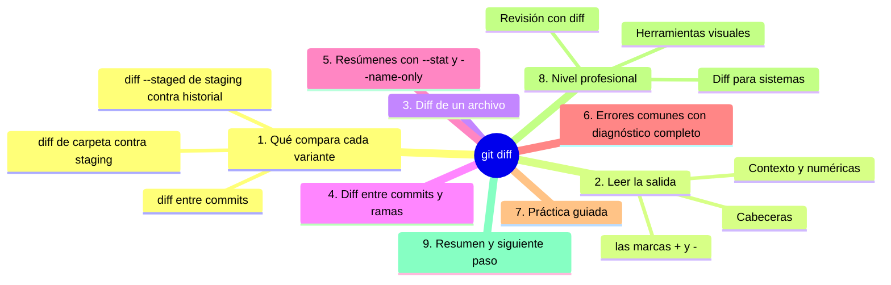
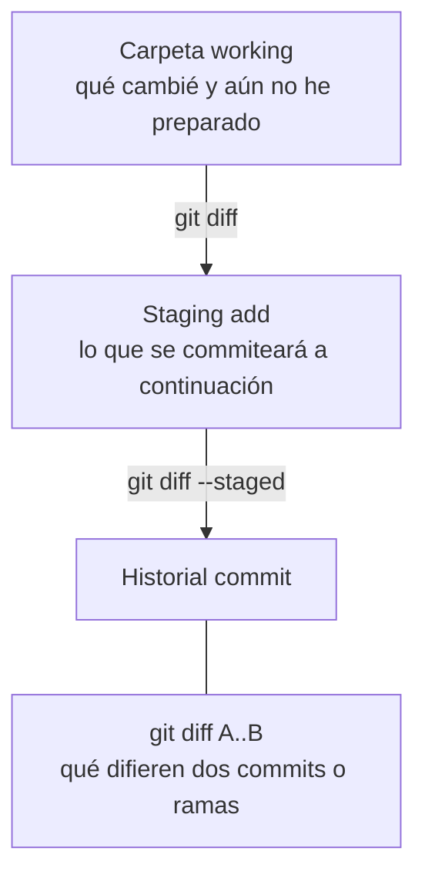

# git diff

## Introducción

`status` te dice QUÉ archivos cambiaron. **`git diff`** te dice EXACTAMENTE QUÉ cambió dentro de ellos, línea a línea. Es la herramienta de inspección por excelencia: la misma diferencia que veías en la web y en GitHub Desktop, ahora bajo tu control total.

Dominar `diff` es dominar la revisión: leer tus cambios antes de commitear, comparar estados, entender qué trajo un pull y diagnosticar problemas. Y es el vocabulario base de la colaboración: los Pull Requests se leen como diffs.

En este capítulo aprenderás:

* a ejecutar `git diff` y leer su salida (`+`, `-`, contexto);
* la diferencia crucial entre diff de carpeta y diff del staging (`--staged`);
* comparar commits y ramas (`git diff a..b`);
* diff de un solo archivo;
* errores comunes con diagnóstico completo, práctica guiada y nivel profesional (herramientas de revisión, diff para máquinas).

---

## Mapa conceptual de este capítulo



---

## 1. Qué compara cada variante

### 1.1. El mapa mental (imprescindible)



### 1.2. Escenarios cotidianos

```text
Situación                                    Comando
──────────────────────────────────────────────────────
Edité y quiero revisar antes de add          git diff
Hice add y quiero revisar el commit          git diff --staged
Quiero ver qué trajo el último pull          git log -p o diff
                                              entre los commits
Antes de abrir PR: ver mi rama vs main      git diff main...mi-rama
Quiero ver qué cambió en un archivo          git diff -- archivo
```

### 1.3. Si no hay diferencias

```bash
git diff          # sin cambios: salida vacía
```

Salida vacía = lo comparado es idéntico. (Ojo: vacío también puede significar «no estás donde crees»; status aclara el contexto.)

---

## 2. Leer la salida

### 2.1. Cabeceras

```text
Salida típica
──────────────────────────────────────────────
diff --git a/notas.md b/notas.md
index 8a1b2c3..4d5e6f7 100644
--- a/notas.md
+++ b/notas.md
@@ -1,4 +1,5 @@
 # Notas del proyecto
+
 Linea de contexto sin cambio
-Linea antigua que quito
+Linea nueva que pongo
 Linea de contexto
```

```text
Lectura de cabeceras
   │
   ├── a/ y b/  →  versión antigua y nueva
   ├── index    →  hashes internos de los objetos
   └── @@       →  bloque de líneas (posiciones)
```

### 2.2. Las marcas

```text
Marca    Significado
──────────────────────────────────────────────
+        línea en la NUEVA versión (se añade)
-        línea en la ANTIGUA que desaparece
(space)  contexto: línea igual en ambas
```

### 2.3. Contexto y numéricas

```text
   │
   ├── Git muestra líneas de alrededor para ubicarte
   ├── el encabezado @@ indica rangos de línea
   └── cambios grandes se agrupan en bloques separados
```

### 2.4. Colores (si tu terminal los muestra)

```text
Suele verse:
   · rojo para quitadas
   · verde para añadidas
Si no hay color: la marca + / - basta (siempre está).
```

---

## 3. Diff de un archivo

```bash
git diff -- notas.md
git diff -- docs/guia.md
```

```text
   │
   ├── solo ese archivo
   ├── el -- separa las rutas de las opciones
   │   (buena práctica en comandos con rutas)
   └── útil cuando el resto es ruido
```

---

## 4. Diff entre commits y ramas

### 4.1. Entre dos commits

```bash
git diff 7b21d04 a3f9c21
git diff 7b21d04..a3f9c21
```

El estado de A convertido en B.

### 4.2. Commit vs. actualidad

```bash
git diff 7b21d04          # de ese commit hasta tu carpeta actual
git diff 7b21d04 --staged # de ese commit hasta tu staging
```

### 4.3. Entre ramas (anticipación)

```bash
git diff main...mi-rama
```

```text
Las TRES puntos (main...mi-rama)
   │
   ├── muestran lo que mi-rama aporta respecto al punto
   │   donde se separó de main
   │
   └── es la base del Pull Request: «mira lo mío»
       (los tres puntos se ven a fondo en la sección 17;
        con DOS puntos es la diferencia directa entre
        los estados actuales)
```

---

## 5. Resúmenes

### 5.1. --stat

```bash
git diff --stat
```

```text
Salida:
 notas.md  | 5 +++--
 guia.md   | 2 +-
 2 files changed, 4 respuestas... (resumen de líneas)

→ qué archivos y cuánto cambiaron, sin el detalle
```

### 5.2. --name-only / --name-status

```bash
git diff --name-only     # solo nombres
git diff --name-status   # nombres + estado (M, A, D)
```

### 5.3. Cuándo usar cada uno

```text
Necesidad                          Variante
──────────────────────────────────────────────
Ver todo (revisión)                git diff
Solo saber QUÉ archivos            --stat / --name-only
Antes de commit (staging)          --staged
Comparar puntos                    A..B o A...B
Focalizar un archivo               -- archivo
```

---

## 6. Errores comunes con diagnóstico completo

### Error 1: git diff vacío «y yo he cambiado cosas»

**Qué ocurrió:** cambiaste, ejecutaste diff y no muestra nada.

**Por qué posibles:**
* los cambios ya están en el STAGING → usa `--staged`;
* guardaste en otra carpeta/archivo;
* Git no rastrea el archivo (untracked no aparece en diff hasta añadirlo).

**Cómo comprobarlo:** `git status` (¿dónde está el cambio?).

**Opciones:** elegir la variante correcta del diff.

**Riesgos:** creer que el cambio se perdió.

**Solución:** mapeo carpeta/staging/historial (punto 1.1).

**Cómo se evita:** status + diff juntos, siempre.

---

### Error 2: Commitear sin mirar el diff

**Qué ocurrió:** entró un cambio no deseado (o se borró una línea).

**Por qué:** se saltó la revisión.

**Cómo comprobarlo:** `git show HEAD` (el último commit).

**Opciones:**
* local no publicado: `--amend` o corrección con criterio;
* publicado: commit de corrección (o revert si toca).

**Riesgos:** historial con errores.

**Solución:** ritual add → diff --staged → commit.

**Cómo se evita:** el diff es parte del acto de commitear.

---

### Error 3: Diferencias de formato que lo ensucian todo

**Qué ocurrió:** el diff muestra todo el archivo cambiado con contenido «igual».

**Por qué:** saltos de línea (CRLF/LF), espacios finales, o codificación.

**Cómo comprobarlo:** leer con detenimiento: si el texto «es igual», es formato.

**Opciones:**
* corregir la configuración del editor y rehacer el cambio;
* `.gitattributes`/`core.autocrlf` (sección 06+);
* si ya está, valorar si conviene commitear el formato aparte.

**Riesgos:** reviews imposibles; conflictos futuros.

**Solución:** normalización de fin de línea.

**Cómo se evita:** editor bien configurado desde el principio (capítulo 05 de la sección 05).

---

### Error 4: Diff enorme en commits ajenos

**Qué ocurrió:** `git show` de un commit con 30 archivos: ilegible.

**Por qué:** commit no atómico ajeno (o regeneración automática).

**Cómo comprobarlo:** `--stat` primero.

**Opciones:** revisar por archivo; empezar por los críticos.

**Riesgos:** pasarse por alto algo.

**Solución:** estrategia por partes.

**Cómo se evita:** (disciplina propia) commits atómicos.

---

### Error 5: Confundir `..` y `...`

**Qué ocurrió:** el diff de ramas no muestra lo esperado.

**Por qué:** `A..B` y `A...B` comparan cosas distintas.

**Cómo comprobarlo:** documentación de la sintaxis (o probar ambos y leer).

**Opciones:** usar `...` para «qué aporta mi rama» (flujo PR) y `..` para estados puntuales.

**Riesgos:** conclusiones incorrectas sobre lo que falta.

**Solución:** recordar la regla práctica del punto 4.3.

**Cómo se evita:** practicar con ramas de ejemplo.

---

### Error 6: Esperar ver archivos nuevos en git diff

**Qué ocurrió:** creaste un archivo y diff no lo muestra.

**Por qué:** untracked NO tiene versión previa con la que comparar; Git lo lista en status, no en diff.

**Cómo comprobarlo:** status lo muestra como `??`.

**Opciones:** `git add` (luego aparecerá en `--staged` como new file).

**Riesgos:** confusión.

**Solución:** recordar el estado untracked.

**Cómo se evitar:** mapeo de estados otra vez.

---

## 7. Práctica guiada

### Objetivo

Leer diffs en todas sus variantes: carpeta, staging y entre puntos.

### Paso 1: diff de carpeta

1. Modifica `notas.md` (2-3 líneas).
2. `git status` → modified, not staged.
3. `git diff` → lee: dos líneas con `+`, las quitadas con `-`.

### Paso 2: añadir y comparar

```bash
git add notas.md
git diff                 # ¿vacío? (ya no está «sin preparar»)
git diff --staged        # ¡ahí está!
```

1. Comprende: add movió el cambio de zona.

### Paso 3: un archivo nuevo

```bash
# crea informe.md con contenido
git status               # untracked
git diff                 # no lo muestra
git add informe.md
git diff --staged        # aparece como new file (todo +)
```

### Paso 4: commit y diff contra el pasado

```bash
git commit -m "Añade informe y actualiza notas"
git diff HEAD            # ahora: vacío (todo commiteado)
git diff HEAD~1          # los cambios del último commit
```

(`HEAD` = último commit; `HEAD~1` = el anterior — se explica en la sección 07.)

### Paso 5: resumen

```bash
git diff --stat HEAD~1
git diff --name-status HEAD~1
```

### Resultado esperado

Capacidad de elegir la variante de diff correcta para cada pregunta y leerla con precisión.

### Conclusión esperada

`diff` es la lupa de Git: donde status señala el mapa, diff abre el detalle. Revisar con él es la garantía de que lo que guardas es lo que quieres guardar.

### Ejercicio de transferencia

En tu repositorio de práctica, cambia dos archivos y añade solo uno de ellos al área de preparación con `git add`. Entrega las salidas de `git diff` y de `git diff --staged` y explica en dos líneas por qué un archivo aparece en una y no en la otra. Cierra con la salida de `git diff --stat` y una frase sobre qué te aporta el resumen que no te da el diff completo.

---

## 8. Nivel profesional

### 8.1. Revisión con diff

```text
Revisión mínima antes de cualquier push
──────────────────────────────────────────────
1. git status              → alcance
2. git diff --staged       → contenido
3. preguntas:
   · ¿hay secretos?
   · ¿hay cambios de formato ajenos al tema?
   · ¿los borrados son intencionados?
   · ¿es UNA cosa?
```

### 8.2. Diff para sistemas

```text
   │
   ├── --stat, --name-only, --name-status: para guiones
   ├── salida determinista que otras herramientas consumen
   └── junto con --exit-code: permite que scripts falten
       si hay diferencias (integración continua)
```

### 8.3. Herramientas visuales

```text
Cuando el diff de terminal se queda corto
   │
   ├── editores con visor de diferencias (abrir dos
   │   versiones lado a lado)
   ├── herramientas dedicadas de diff/merge
   │   (imprescindibles en conflictos; sección 10)
   ├── la vista diff de GitHub (PRs) con anotaciones
   └── git difftool (abre tu herramienta favorita)
```

### 8.4. Diff y entrega continua

```text
En flujos automatizados:
   │
   ├── se publican diffs de cada PR para revisión
   ├── se generan reportes de impacto (qué archivos
   │   sensibles cambian — CODEOWNERS y revisión)
   └── políticas: ciertas rutas requieren revisor
       (basado en lo que el diff toca)
```

---

## 9. Resumen

En este capítulo aprendiste que:

* `git diff` compara tu carpeta con el staging; `--staged` compara el staging con el último commit; `A..B` compara puntos cualesquiera;
* la salida usa `+` para añadidas, `-` para quitadas y espacio para contexto, con cabeceras `@@` que ubican los bloques;
* `git diff -- archivo` focaliza; `--stat` y `--name-only` resumen;
* `HEAD` y `HEAD~1` permiten comparar con el presente y el pasado (conexión con la sección 07);
* los errores típicos (diff vacío tras add, formato ensuciado, untracked invisible, `..` vs `...`) se diagnostican cruzando status y diff;
* a nivel profesional, el ritual status → diff --staged → commit es la revisión mínima, y las variantes de resumen alimentan guiones y políticas de revisión.

La idea principal es:

> **`diff` es la certeza: donde status dice «hay cambios», diff te demuestra exactamente cuáles, para que la decisión de commitear sea conocimiento y no esperanza.**

---

## Autopreguntas de cierre

Sin mirar el material, responde mentalmente y luego compruébalo con este capítulo:

1. ¿Qué compara `git diff` sin opciones y qué compara `git diff --staged`?
2. ¿Por qué el diff sale vacío justo después de `git add` y qué comando te falta ejecutar para verlo?
3. ¿Qué significan las marcas `+`, `-` y el espacio al inicio de cada línea de un diff?
4. ¿Qué diferencia hay entre `git diff A..B` y `git diff A...B` y en qué situaciones usarías cada uno?
5. ¿Por qué un archivo recién creado no aparece en `git diff` y cómo sí puedes verlo?
6. ¿Qué te aportan `--stat` y `--name-only` que el diff completo no te da, y cuándo los usarías?
7. ¿Qué preguntas te haces (y con qué comandos) antes de pulsar `git commit`?

---

## Próximo paso

Ya sabes comparar estados.

El siguiente paso es inspeccionar commits completos: `git show`.

Continúa con:

[`12-git-show.md`](12-git-show.md)
