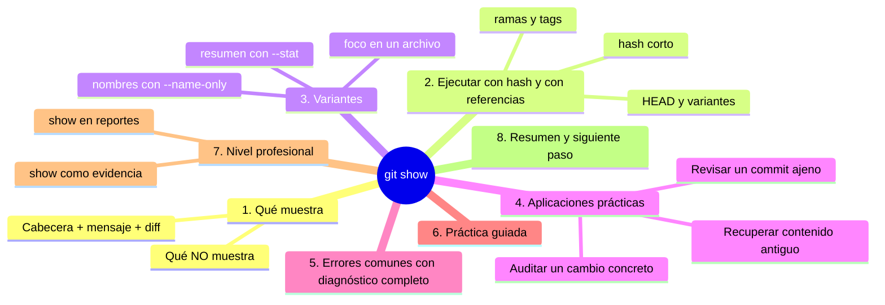
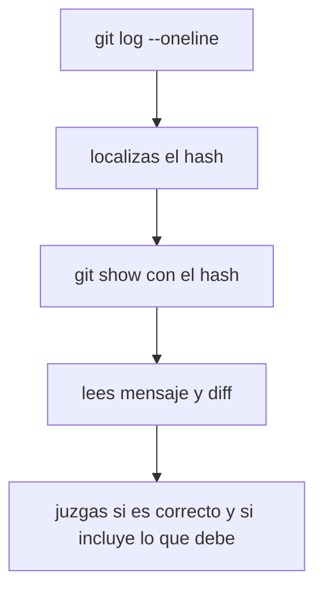

# git show

## Introducción

`git log` lista los commits; `git diff` compara estados. **`git show`** hace algo distinto: abre UN commit concreto y lo muestra completo —cabecera, mensaje y diff—. Es la lupa puntual del historial: «muéstrame exactamente ese».

Cuando buscas el commit que introdujo un cambio, quieres revisar lo que alguien subió o necesitas recuperar el contenido de una versión concreta, `git show` es el comando. Suele ser el siguiente paso después de localizar un hash en `git log`.

En este capítulo aprenderás:

* a ejecutar `git show` con un hash (y con referencias como `HEAD`);
* a leer cabecera, mensaje y diff en la misma salida;
* variantes útiles (`--stat`, `--name-only`, limitar a un archivo);
* aplicaciones prácticas: revisar, recuperar, auditar;
* errores comunes con diagnóstico completo, práctica guiada y nivel profesional.

---

## Mapa conceptual de este capítulo



---

## 1. Qué muestra

### 1.1. Anatomía de la salida

```bash
git show a3f9c21
```

```text
Salida
──────────────────────────────────────────────
commit a3f9c2ab3d4e5f6a7b8c9d0e1f2a3b4c5d6e7f8a9
Author: María López <...>
Date:   Tue Sep 30 18:22:11 2026 +0200

    Añade ejercicios del capítulo 3

    Incluye cinco preguntas con sus respuestas.

 notas.md | 12 ++++++++++++
 guia.md  |  4 ++--
 2 files changed, 14 insertions(+), 4 deletions(-)

diff --git a/notas.md ...
@@ ... @@
+ # Ejercicios
+ ...
```

```text
Tres bloques
   │
   ├── 1. CABECERA: hash, autor, fecha
   ├── 2. MENSAJE: título y cuerpo (la intención)
   └── 3. DIFF: el contenido que cambió (+ resumen --stat
          si Git lo incluye por defecto en la vista)
```

### 1.2. Qué NO muestra

```text
   │
   ├── no muestra otros commits (es de UNO)
   ├── no muestra cambios sin commitear (status/diff)
   └── no muestra el estado actual de los archivos
       (para eso, abre el archivo o navega al commit)
```

### 1.3. Relación con los comandos vecinos

```text
Comando        Pregunta que responde
──────────────────────────────────────────────────
git log        ¿qué pasó? (lista)
git show       ¿qué pasó en ESTE? (detalle)
git diff       ¿qué difieren dos estados?
```

---

## 2. Ejecutar con hash y con referencias

### 2.1. Hash corto o completo

```bash
git show 7b21d04          # corto (suficiente en la práctica)
git show 7b21d04d8e...    # completo (para máxima precisión)
```

### 2.2. HEAD y sus combinaciones

```bash
git show HEAD             # el último commit de la rama
git show HEAD~1           # el anterior
git show HEAD~3           # tres atrás
git show HEAD^            # primer padre (misma idea que ~1)
```

```text
HEAD (visión de la sección 07, consolidada)
   │
   ├── es el puntero a «dónde estás parado» (último commit)
   └── sus combinaciones navegan la cadena:
          HEAD~1 / HEAD^   →  un commit atrás
          HEAD~5           →  cinco atrás
```

### 2.3. Otras referencias

```bash
git show main              # el último commit de main
git show feature/saludo    # último de esa rama
git show v1.0              # de una etiqueta (si existe)
git show HEAD~2..HEAD      # (aquí Git interpretará distinto:
                           # show es de UN objeto; para rangos
                           # usa diff/log)
```

> **Aclaración:** `git show` espera UN objeto (commit, rama en su puntero, tag...). Para rangos de varios commits, `git log`/`git diff` son la herramienta.

---

## 3. Variantes

### 3.1. Solo el resumen

```bash
git show --stat HEAD
git show --stat --oneline HEAD   # aún más compacto
```

```text
Útil para: «¿qué archivos tocó?» sin leer todo el diff.
```

### 3.2. Solo nombres de archivos

```bash
git show --name-status HEAD
```

Incluye el estado (M, A, D) por archivo.

### 3.3. Un archivo dentro del commit

```bash
git show HEAD -- notas.md
git show 7b21d04 -- docs/guia.md
```

El diff de ese archivo DENTRO de ese commit: focalización máxima.

### 3.4. Sin el diff completo

```bash
git show --no-patch HEAD    (o -s)
```

Solo cabecera y mensaje: «¿qué se dijo y quién lo dijo?».

---

## 4. Aplicaciones prácticas

### 4.1. Revisar un commit ajeno



### 4.2. Recuperar contenido antiguo

```text
Necesitas una versión de un archivo tal como estaba
en un commit:
   │
   ├── git show <hash>:ruta/archivo
   │      →  imprime el contenido de ese archivo EN ese
   │         commit (sin tocar nada)
   │
   └── copias lo que necesitas y lo pegas donde haga
       falta (la «vía A» de restaurar que ya conoces)
```

```bash
git show a3f9c21:notas.md
```

(Eso sí: es una referencia avanzada muy útil; practícala en la guía.)

### 4.3. Auditar un cambio concreto

```text
Pregunta: «¿quién puso esta línea y por qué?»
   │
   ├── blame/git log -S  →  identificas el commit
   └── git show <hash>   →  lees su mensaje (el porqué
       del autor) y el contexto completo
```

---

## 5. Errores comunes con diagnóstico completo

### Error 1: «unknown revision»

**Qué ocurrió:** Git no reconoce la referencia (`bad revision`, `unknown revision`).

**Por qué posibles:**
* hash mal copiado (espacios, caracteres de más);
* el hash pertenece a otra rama/repo (o es de otro objeto);
* escribiste un nombre de rama que no existe.

**Cómo comprobarlo:**
* revisar el hash en `git log --oneline`;
* `git branch` para nombres de ramas;
* pegado limpio (copiar de nuevo).

**Opciones:** corregir la referencia.

**Riesgos:** ninguno.

**Solución:** localizar primero con log, mostrar después.

**Cómo se evita:** flujo log → show (nunca hashes de memoria imprecisa).

---

### Error 2: Esperar que show actualice tu carpeta

**Qué ocurrió:** alguien cree que `git show` «carga» esa versión en los archivos.

**Por qué:** confusión con restore/checkout.

**Cómo comprobarlo:** `git status` no cambia; los archivos siguen igual.

**Opciones:** `show` solo IMPRIME; para restaurar: `git restore --source <hash> archivo` (sección 11) o copiar con la sintaxis `hash:archivo`.

**Riesgos:** ninguno (show es seguro).

**Solución:** entender que show es de solo lectura.

**Cómo se evita:** recordar el trío: log (lista), show (imprime), restore (cambia).

---

### Error 3: Salida enorme y no ves nada

**Qué ocurrió:** commit grande; el diff llena la pantalla.

**Por qué:** sin variantes.

**Cómo comprobarlo:** volumen de salida.

**Opciones:** `--stat`, `--name-only`, `-- archivo`, o `q` del paginador.

**Riesgos:** frustración.

**Solución:** focalizar antes de mirar.

**Cómo se evita:** empezar por `--stat` en commits desconocidos.

---

### Error 4: Querer «todo el historial» con show

**Qué ocurrió:** se intenta `git show` para ver la lista.

**Por qué:** confundir con log.

**Cómo comprobarlo:** show muestra UN objeto (o el de HEAD si no se da nada).

**Opciones:** `git log` para lista.

**Riesgos:** pérdida de tiempo.

**Solución:** la tabla del punto 1.3.

**Cómo se evita:** entenderse con cada comando.

---

### Error 5: Mostrar el archivo sin el `:` correcto

**Qué ocurrió:** `git show <hash> archivo` (sin `:` ni `--`) puede interpretarse raro o fallar.

**Por qué:** sintaxis: para el contenido del archivo dentro del commit se usa `hash:ruta`; para el diff de ese archivo, `hash -- ruta`.

**Cómo comprobarlo:** mensaje de error o salida inesperada.

**Opciones:** usar la forma correcta según lo que quieras:
* contenido: `git show hash:ruta`
* diff: `git show hash -- ruta`

**Riesgos:** confusión.

**Solución:** recordar los dos usos.

**Cómo se evita:** practicar las dos variantes.

---

### Error 6: Páginas de less otra vez

**Qué ocurrió:** la salida de show queda «colgada».

**Por qué:** paginador (otra vez).

**Cómo comprobarlo:** `:` al pie.

**Opciones:** `q`.

**Riesgos:** pánico.

**Solución:** salir con q.

**Cómo se evita:** ya lo sabes: el paginador no es un error.

---

## 6. Práctica guiada

### Objetivo

Inspeccionar commits en detalle y recuperar contenido de versiones anteriores.

### Paso 1: show del último commit

```bash
git log --oneline -n 3   # elige el hash más reciente
git show <hash>          # cabecera + mensaje + diff
q                        # salir del paginador si aparece
```

### Paso 2: resumen

```bash
git show --stat HEAD
git show --name-status HEAD
```

1. ¿Qué archivos tocó? ¿Con qué estados?

### Paso 3: solo un archivo

```bash
git show HEAD -- notas.md      # (o el archivo que hayas tocado)
```

### Paso 4: navegar por la cadena

```bash
git show HEAD~1 --stat
git show HEAD~2 --oneline -s   (o --no-patch)
```

1. Identifica: HEAD, HEAD~1, HEAD~2.

### Paso 5: recuperar contenido (sin tocar nada)

```bash
git show HEAD~2:README.md
```

1. Observa: imprime el archivo TAL COMO estaba en ese commit.
2. Compara mentalmente con el actual (¿qué cambió desde entonces?).

### Paso 6: cabecera sin diff

```bash
git show -s HEAD
```

1. Solo mensaje y autoría.

### Resultado esperado

Capacidad de pasar de «un hash en log» a «el detalle completo», y de extraer el contenido de un archivo en una versión antigua sin modificar nada.

### Conclusión esperada

`git show` es la lupa del historial: mira un instante del pasado en detalle, con la seguridad de que solo estás mirando.

### Ejercicio de transferencia

En un repositorio con varios commits, recupera el contenido de un archivo tal como estaba tres commits atrás y compáralo con el actual sin modificar nada. Entrega la salida de `git show HEAD~3:<tu-archivo>` y la de `git show HEAD~3 --stat`, más dos líneas explicando qué cambió desde entonces. Añade una frase sobre por qué puedes mirar ese contenido con total seguridad.

---

## 7. Nivel profesional

### 7.1. show en reportes

```text
Uso en flujos
   │
   ├── confirmar el contenido exacto de una release
   │   (show de la etiqueta)
   ├── revisar el commit que dispara un despliegue
   └── extraer archivos de versiones para comparar
       con la producción
```

### 7.2. show como evidencia

```text
En auditorías:
   │
   ├── el hash identifica el cambio de forma única
   ├── show reproduce lo que se vio ese día
   ├── combinado con firmas (Verified) da trazabilidad
   └── «el cambio X del commit Y del día Z» es
       demostrable y reproducible
```

### 7.3. Variaciones avanzadas (mención)

```text
   │
   ├── git show <hash>^:archivo  →  versión ANTES del commit
   │   (el padre) — para comparar antes/después sin diff
   │
   ├── git show --format=...     →  salida para guiones
   │
   └── con rangos grandes: mejor log -p o diff entre puntos
```

---

## 8. Resumen

En este capítulo aprendiste que:

* `git show` despliega un commit: cabecera (hash, autor, fecha), mensaje y diff de lo que cambió;
* acepta hashes (cortos o completos) y referencias como `HEAD`, `HEAD~1`, nombres de ramas y etiquetas;
* las variantes focalizan: `--stat`, `--name-only/--name-status`, `-- archivo`, `-s/--no-patch`;
* `git show hash:ruta` imprime el contenido de un archivo en ese commit (recuperar sin tocar) y `git show hash -- ruta` su diff;
* es de solo lectura: no modifica tu carpeta ni tu staging;
* los errores típicos (referencia mala, salida enorme, confundir con log, sintaxis de archivo) se resuelven localizando con log y focalizando con variantes;
* a nivel profesional, show es evidencia reproducible del historial y punto de entrada a auditorías y reportes.

La idea principal es:

> **`git show` convierte un hash en historia completa: quién decidió, qué dijeron y qué cambió exactamente, en una sola consulta.**

---

## Autopreguntas de cierre

Sin mirar el material, responde mentalmente y luego compruébalo con este capítulo:

1. ¿Qué tres bloques despliega `git show` de un commit y qué información nunca te da?
2. ¿En qué se diferencia `git show` de `git log` y de `git diff`, y cómo decides cuál usar?
3. ¿Qué puedes recorrer con `HEAD`, `HEAD~1` y `HEAD^`, y cómo localizas primero el hash correcto?
4. ¿Qué variantes usarías para ver solo los archivos que tocó un commit?
5. ¿Qué diferencia hay entre `git show hash:ruta` y `git show hash -- ruta`?
6. ¿Por qué `git show` no cambia tus archivos y qué comando usarías si quisieras restaurarlos?
7. ¿Qué haces cuando la salida es enorme y no encuentras lo que buscas?

---

## Próximo paso

Ya sabes inspeccionar commits.

El siguiente paso de la sección es la ayuda de Git: cómo preguntarle a Git cuando no recuerdas un comando.

Continúa con:

[`13-git-help.md`](13-git-help.md)
