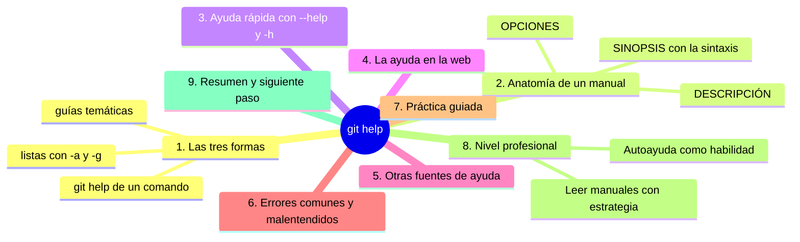
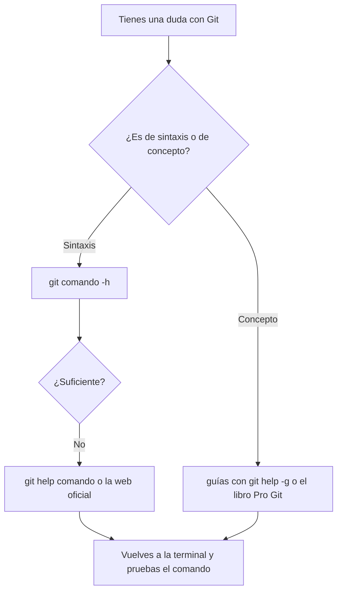

# git help

## Introducción

Nadie memoriza todos los comandos de Git. Lo que separa a quien avanza de quien se estanca es saber **pedirle ayuda a la herramienta**: Git trae su propia documentación integrada, siempre disponible, incluso sin conexión.

`git help` es la puerta a esa documentación: manuales completos, resúmenes de sintaxis y guías por tema. Añadirlo a tu repertorio significa que nunca te quedes sin saber qué hacer: el comando está en la terminal, a un Enter de distancia.

En este capítulo aprenderás:

* las tres formas de usar `git help` (comando, guía, web);
* a leer la sintaxis de un manual sin ahogarte;
* la ayuda rápida con `--help` y `-h`;
* recursos de ayuda adicionales (guías, comunidad);
* errores y malentendidos comunes, práctica guiada y nivel profesional (aprender a autodocumentarse).

---

## Mapa conceptual de este capítulo



---

## 1. Las tres formas de `git help`

### 1.1. Ayuda de un comando

```bash
git help commit
git help add
git help log
```

Abre el manual completo del comando (pasa por el paginador: `q` para salir).

### 1.2. Listas

```bash
git help -a        # lista de comandos disponibles
git help -g        # conceptos/glosarios disponibles
```

Útil cuando no recuerdas el nombre exacto: «¿cómo se llamaba ese comando…?».

### 1.3. Guías temáticas

```bash
git help -g             # lista de guías
git help gitworkflows   # ejemplo de guía por tema
git help everyday       # comandos cotidianos (si existe en tu versión)
```

Las guías son tutoriales cortos de Git sobre flujos completos (no de comandos sueltos).

---

## 2. Anatomía de un manual

### 2.1. Estructura típica

```text
GIT-COMMIT(1)                     Manual de Git

NOMBRE
       git-commit - Registra cambios en el repositorio

SINOPSIS
       git commit [-a] [-m <mensaje>] ...

DESCRIPCIÓN
       (explica el concepto y el comportamiento...)

OPCIONES
       -a, --all
           ...

       -m <mensaje>
           ...

VER TAMBIÉN
       git-add(1), git-status(1)
```

### 2.2. Cómo leerlo sin ahogarte

```text
Estrategia de lectura
──────────────────────────────────────────────
1. SINOPSIS → la forma del comando (qué argumentos acepta)
2. busca la OPCIÓN que necesitas (no leas todo)
3. DESCRIPTION solo si el concepto te confunde
4. VER TAMBIÉN → comandos vecinos para seguir el hilo

Nadie lee los manuales de Git linealmente de pie a pie.
Se consultan como un diccionario.
```

### 2.3. La sinopsis: leer símbolos

```text
Símbolos en SINOPSIS
   │
   ├── []  →  opcional
   ├── <>  →  argumento que tú pones (obligatorio si
   │          no está entre [])
   ├── ... →  se puede repetir
   └── |   →  elige UNA opción entre varias
```

Ejemplo:

```text
git commit [-m <mensaje>] [--amend]
   │
   └── -m con mensaje: opcional pero si lo pones,
       necesitas el mensaje; --amend: opcional
```

---

## 3. Ayuda rápida: `--help` y `-h`

### 3.1. La versión corta

```bash
git commit -h
git add -h
```

```text
   │
   ├── muestra un RESUMEN de opciones (a menudo en la
   │   propia terminal, sin abrir el manual largo)
   └── ideal para «¿cuál era la opción de…?» en caliente
```

### 3.2. --help

```bash
git commit --help
```

```text
   │
   ├── abre el manual completo (equivalente a
   │   git help commit; el formato puede variar:
   │   man, navegador o pager según configuración)
   └── en Windows con Git para Windows, a menudo abre
       el manual en el navegador
```

### 3.3. Cuándo usar cada uno

```text
Necesidad                    Comando
──────────────────────────────────────────────
Recordar una opción ya       git <cmd> -h
conocida (rápido)

Aprender el comando desde    git help <cmd>
cero (completo)

Ver todos los comandos       git help -a

Entrar a un tema de flujo    git help -g
```



---

## 4. La ayuda en la web

```text
Documentación oficial de Git
   │
   ├── sitio: https://git-scm.com/doc
   │      →  mismos manuales, en navegador
   │      →  guías (Pro Git book) y tutoriales
   │
   └── ventaja: buscable y copiable
       (en la terminal a veces cuesta copiar)
```

Cuándo prefieres la web: para leer con calma, buscar dentro del texto y traducir/conceptualizar con el libro de referencia (Pro Git es gratuito).

---

## 5. Otras fuentes de ayuda

```text
Fuera de git help
   │
   ├── git status / log / diff  →  tu diagnóstico diario
   │
   ├── mensajes de error de Git  →  suelen ser claros y
   │   con sugerencia (léelos completos)
   │
   ├── --help de la OPCIÓN en guiones de terceros
   │
   ├── man git en terminales Unix (mismo manual)
   │
   ├── documentación de GitHub (flujo web y PRs)
   │
   └── comunidad: foros y Q&A (bien formulada la pregunta,
       se resuelve rápido — en la sección 00 viste cómo
       pedir ayuda)
```

---

## 6. Errores comunes y malentendidos

### Error 1: No encontrar ayuda de «un comando que no existe»

**Qué ocurrió:** `git help mi-comando` → no hay manual.

**Por qué:** el comando no existe (o se llama distinto).

**Cómo comprobarlo:** `git help -a` para buscar el nombre real.

**Opciones:** usar el nombre correcto (por ejemplo, `restore` en versiones modernas).

**Riesgos:** confusión con documentación antigua que cite comandos obsoletos (`checkout` como recurso general).

**Solución:** lista de comandos de tu versión.

**Cómo se evita:** partir siempre de `git help -a`.

---

### Error 2: Abrir el manual y no saber salir

**Qué ocurrió:** `git help` y la terminal «se queda».

**Por qué:** paginador (menos/man). Otra vez.

**Cómo comprobarlo:** `:` al pie de la salida.

**Opciones:** `q`.

**Riesgos:** creer que Git se rompió.

**Solución:** `q` siempre.

**Cómo se evita:** ya es hábito.

---

### Error 3: Esperar tutoriales de `git help commit`

**Qué ocurrió:** se pidió ayuda de `commit` y sale «mucha letra técnica».

**Por qué:** los manuales son referencia, no tutorial.

**Cómo comprobarlo:** la estructura (sinopsis/opciones).

**Opciones:** para aprender el concepto: guías (`git help -g`), el libro Pro Git, o este recorrido; el manual para DETALLES.

**Riesgos:** abandonar la ayuda por «ilegible».

**Solución:** usar cada fuente para lo que sabe hacer.

**Cómo se evita:** saber que el manual responde «¿qué hace exactamente -X?», no «¿qué es un commit?».

---

### Error 4: Copiar comandos del manual a ciegas

**Qué ocurrió:** se copió un ejemplo con `<placeholder>` y falló (o peor: un comando destructivo de un ejemplo sin contexto).

**Por qué:** sin leer la sinopsis.

**Cómo comprobarlo:** error o resultado no deseado.

**Opciones:** reemplazar los `<...>` por tus valores; entender cada opción antes de ejecutar.

**Riesgos:** en comandos con alcance amplio, cambios no deseados.

**Solución:** leer sinopsis + opciones relevantes.

**Cómo se evita:** disciplina: entender antes de ejecutar (especialmente si el manual menciona «destroys» o «history rewrite»).

---

### Error 5: Ayuda en inglés y bloqueo

**Qué ocurrió:** los manuales están en inglés y no se avanza.

**Por qué:** la documentación oficial no está traducida (oficialmente).

**Cómo comprobarlo:** obvio.

**Opciones:**
* seguir con este recorrido (conceptos en español) + manual (sintaxis);
* traducir términos clave con el glosario (recurso del repositorio);
* foros en español (con cuidado con la calidad).

**Riesgos:** saltarse la ayuda por idioma.

**Solución:** combinar fuentes.

**Cómo se evita:** no hace falta elegir: concepto aquí, referencia allí.

---

### Error 6: No usar ayuda porque «ya lo sé» y teclear mal

**Qué ocurrió:** comando tipeado con error (opción equivocada).

**Por qué:** confianza sin verificar.

**Cómo comprobarlo:** el error de Git.

**Opciones:** `-h` y reintentar.

**Riesgos:** pequeños errores acumulados.

**Solución:** `-h` es de un segundo.

**Cómo se evita:** en duda, pregunta al comando: es baratísimo.

---

## 7. Práctica guiada

### Objetivo

Usar las tres formas de ayuda y encontrar respuestas concretas.

### Paso 1: manual de un comando conocido

```bash
git help status
```

1. Localiza SINOPSIS y DESCRIPCIÓN.
2. Busca la opción `--short` en OPTIONS.
3. Sal con `q`.

### Paso 2: ayuda rápida

```bash
git add -h
git commit -h
```

1. Compara: ¿qué opción extra descubriste en `commit -h`? (por ejemplo, `-a`).

### Paso 3: listas

```bash
git help -a
```

1. Busca: ¿existe `restore`? ¿`rebase`? ¿`bisect`?
2. Sal con `q` (o navega con `/bisect` para buscar).

### Paso 4: guías

```bash
git help -g
```

1. Elige una guía de la lista y ábrela.
2. Observa: es un tutorial temático, no un manual de comando.
3. Sal con `q`.

### Paso 5: respuesta a una pregunta real

Pregúntate: «¿cómo veo solo los commits de un archivo?».

1. `git log -h` (o `git help log`) → busca la opción de ruta.
2. Encuentra: la sintaxis `git log -- <archivo>` (o la forma documentada en tu versión).
3. Pruébalo en tu repositorio.

### Resultado esperado

Capacidad de resolver una duda de sintaxis SIN salir de la terminal, en menos de un minuto.

### Conclusión esperada

La ayuda integrada convierte a Git en un sistema autoexplicativo: el manual, la lista de comandos y las guías están siempre a un comando de distancia.

### Ejercicio de transferencia

Resuelve sin salir de la terminal una duda real que aún no sepas (por ejemplo, cómo limitar el log a N commits o cómo ver solo los archivos de un commit). Entrega el comando exacto que te llevó a la respuesta (por ejemplo `git log -h` o `git help log`), el fragmento de la ayuda donde aparece esa opción y la salida de aplicarla en tu repositorio. Añade una línea explicando por qué no buscaste primero en un buscador.

---

## 8. Nivel profesional

### 8.1. Leer manuales con estrategia

```text
Técnica de lectura profesional
──────────────────────────────────────────────
1. Diagnóstico primero (status, log, diff)
2. duda de sintaxis → -h (rápido)
3. duda de comportamiento → man / web
4. duda de flujo → guías / Pro Git
5. duda de equipo → convención escrita del proyecto
   (CONTRIBUTING, docs internos)
```

### 8.2. Autoayuda como habilidad

```text
En evaluaciones y trabajo real se valora:
   │
   ├── no «saber de memoria», sino saber encontrar
   ├── leer errores completos (la mitad de la solución
   │   está en el mensaje)
   ├── distinguir referencia (man) de tutorial (guía)
   └── documentar lo aprendido para el siguiente
       (notas propias, o contribuir a la doc del equipo)
```

### 8.3. La ayuda como parte del flujo

```text
Rutina sostenible
   │
   ├── duda → intento → ayuda → verificación → práctica
   └── el ciclo se acorta con el tiempo; Git deja de ser
       «memoria» y pasa a ser «flujo»
```

---

## 9. Resumen

En este capítulo aprendiste que:

* `git help <comando>` abre el manual completo; `-a` lista comandos; `-g` lista guías temáticas;
* los manuales se leen por partes: sinopsis (forma), opciones (detalle), descripción (concepto técnico);
* `git <comando> -h` es la ayuda rápida en terminal; `--help` abre la referencia completa;
* la documentación oficial también está en la web (git-scm.com), junto con el libro Pro Git;
* los símbolos de la sinopsis (`[]`, `<>`, `|`, `...`) codifican qué es opcional y qué no;
* los errores típicos (comando inexistente, paginador, manual malinterpretado, copiar sin leer) se resuelven sabiendo qué fuente sirve para cada pregunta;
* a nivel profesional, la autoayuda es una habilidad evaluada: diagnóstico, consulta precisa y verificación.

La idea principal es:

> **No memorices Git: aprende a preguntarle. El manual integrado es tu documentación siempre encendida, y saber leerlo es la última pieza para trabajar con autonomía.**

---

## Autopreguntas de cierre

Sin mirar el material, responde mentalmente y luego compruébalo con este capítulo:

1. ¿Qué tres formas tiene `git help` y cuál usarías para cada tipo de duda?
2. ¿Cómo lees la SINOPSIS de un manual y qué significan `[]`, `<>`, `|` y `...`?
3. ¿En qué se diferencian `git comando -h` y `git help comando` y cuál te conviene en caliente?
4. ¿Por qué los manuales son referencia y no tutorial, y a dónde acudes para aprender un concepto?
5. ¿Qué haces cuando el manual se queda abierto y la terminal «no responde»?
6. ¿Qué riesgo tiene copiar un comando del manual sin haber leído su sinopsis?
7. ¿Qué fuentes combinarías si el manual está en inglés y tú piensas en español?
8. ¿Cómo demuestras que sabes resolver una duda de Git por tu cuenta antes de preguntar a otra persona?

---

## Próximo paso

Has completado la sección «Git desde cero»: instalaste, configuraste y dominaste los comandos básicos de observación y registro (`status`, `add`, `commit`, `log`, `diff`, `show`, `help`).

Continúa con el índice de la sección:

[`README.md`](README.md)
