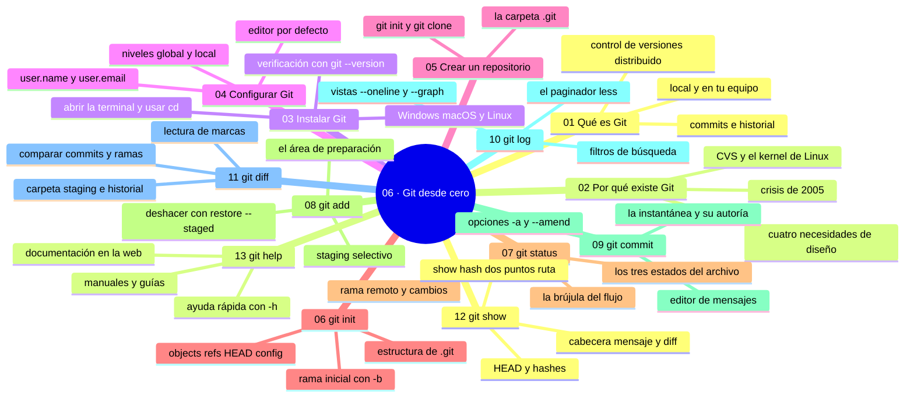

# 06 — Git desde cero

## Bienvenido a la sección de Git desde cero

En esta sección dejas atrás las herramientas gráficas para hablar directamente con Git: la terminal, los comandos y los conceptos que sostienen todo.

Ya has trabajado con GitHub en la web y con GitHub Desktop, y sabes qué es un commit, un push o una rama. Ahora verás lo mismo sin intermediarios: instalar Git, configurarlo y usar sus comandos básicos para observar, preparar y registrar cambios. Es el punto donde dejas de usar Git y empiezas a entenderlo.

En esta sección estudiarás:

* qué es Git, por qué existe y cómo se instala;
* cómo se configura tu identidad y tu editor;
* cómo crear e inicializar repositorios;
* el comando de brújula: `git status` y los tres estados;
* la selección de cambios con `git add`;
* la confirmación con `git commit`;
* la lectura del historial con `git log` y `git show`;
* la comparación de estados con `git diff`;
* cómo pedirle ayuda a Git con `git help`.

Al finalizar esta sección dominarás el ciclo de trabajo local completo (status → add → commit → log/diff), que es la base de todo lo que venga después: cómo funciona Git por dentro, las ramas, el trabajo remoto y los conflictos.

---

## Objetivos de aprendizaje

Al terminar esta sección serás capaz de:

* instalar y configurar Git con tu identidad y tu editor;
* ejecutar el ciclo local completo: `git status` → `git add` → `git commit` → `git log`/`git diff`;
* interpretar los tres estados de un archivo (sin rastrear, preparado, commiteado);
* elegir entre `git diff` y `git show` según la comparación que necesites;
* resolver tus dudas con `git help` sin depender de terceros.

## Mapa conceptual

---

## ¿Qué aprenderás en esta sección?

Cada capítulo de esta sección está diseñado para construir tu comprensión progresivamente:

1. **Qué es Git** - El sistema de control de versiones distribuido y su estructura.
2. **Por qué existe Git** - La historia (CVS, Subversion, el kernel de Linux) que explica sus decisiones.
3. **Instalar Git** - Descarga, instalación por sistema y verificación.
4. **Configurar Git** - Identidad, correo (con noreply), editor y alcances de configuración.
5. **Crear un repositorio** - Del proyecto existente al repositorio remoto.
6. **git init** - Qué hace la inicialización y qué nace en `.git`.
7. **git status** - La brújula: rama, remoto y los tres estados de un archivo.
8. **git add** - El área de preparación y la selección consciente.
9. **git commit** - La instantánea: editor de mensajes, opciones y localidad.
10. **git log** - La memoria: formato, paginador y filtros.
11. **git diff** - La lupa: carpeta, staging y comparaciones.
12. **git show** - La lupa puntual: un commit completo.
13. **git help** - La ayuda integrada: manuales, listas y guías.

---

## Cómo estudiar esta sección

Cada capítulo incluye:

* Mapas conceptuales (los tres estados, los tres lugares, las variantes de cada comando);
* Salidas reales de terminal comentadas línea a línea;
* Errores comunes con diagnóstico completo (qué ocurrió, por qué, cómo comprobarlo, opciones, riesgos, solución y cómo evitarlo);
* Prácticas guiadas encadenadas sobre un repositorio real;
* Un nivel profesional para situar cada comando en flujos reales;
* Resúmenes con la idea principal;
* Enlaces al siguiente capítulo.

Para practicar el ciclo sin riesgo: el sandbox de la sección ([`recursos/sandboxes/06-ciclo-local.md`](../recursos/sandboxes/06-ciclo-local.md)) genera el estado exacto desde donde empezar.

El hilo conductor de la sección es el mapa de estados: carpeta de trabajo → área de preparación → historial, y su relación con el remoto. Cada comando es una operación sobre ese mapa; quien lo entiende, nunca trabaja a ciegas.

Recuerda: los manuales son referencia, no tutorial. Usa `git help` para detalles de sintaxis y este recorrido para conceptos.

---

## Referencias

* Chacon, S. y Straub, B. — *Pro Git* (caps. 1–2).
* Git — Documentación oficial: «git status», «git add», «git commit» (git-scm.com).
* Learn Git Branching (learngitbranching.jsck.io) — lecciones interactivas.

---

## Checkpoint 06 — Comprobación obligatoria

Antes de avanzar a `07-como-funciona-git/`, demuestra que puedes (en un repositorio de práctica real):

1. **Instalar y verificar** Git con `git --version`, abrir la terminal en la carpeta del proyecto y entrar en ella con `cd`.
2. **Configurar** tu identidad con `git config --global user.name` y `git config --global user.email` y comprobarla con `git config --list`.
3. **Crear** un repositorio con `git init` en una carpeta nueva, confirmar que existe `.git` y que `git status` lo reconoce.
4. **Registrar** tres cambios reales con la cadena completa `git status` → `git add` → `git diff --staged` → `git commit -m`.
5. **Romper y recuperar**: meter un archivo de más en el área de preparación con `git add` y sacarlo con `git restore --staged` sin perder el archivo en tu carpeta.
6. **Leer el historial** con `git log --oneline -5`, copiar un hash y abrirlo con `git show <hash>`; después explicar la diferencia entre `git diff` y `git diff --staged`.

Si puedes hacerlo **sin mirar instrucciones**, el checkpoint está cerrado.

---

## Autopreguntas de cierre

Sin mirar el material, responde mentalmente y luego compruébalo con los capítulos de la sección:

1. ¿Qué te dice `git status` que no ves en el explorador de archivos?
2. ¿Qué diferencia hay entre `git add` y `git commit`?
3. ¿Cómo ves los cambios exactos de un commit concreto?
4. ¿Qué muestra `git log --oneline -5`?
5. Si haces `git add` y cierras el equipo sin llegar a `git commit`, ¿se pierde ese cambio o solo sale del área de preparación?
6. ¿Por qué Git te deja trabajar sin internet pero no te deja publicar sin él?
7. ¿Qué miras antes de commitear, `git diff` o `git diff --staged`, y por qué en ese orden?
8. ¿Qué perderías exactamente si borras la carpeta `.git` de un proyecto con trabajo importante y se podría recuperar de alguna manera?

---

## Próximo paso

Una vez que completes esta sección, estarás listo para abrir el capó: entender cómo funciona Git por dentro (working directory, staging, objetos, hash y HEAD).

Continúa con:

[`07-como-funciona-git/`](../07-como-funciona-git/)
