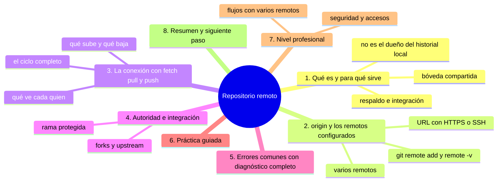
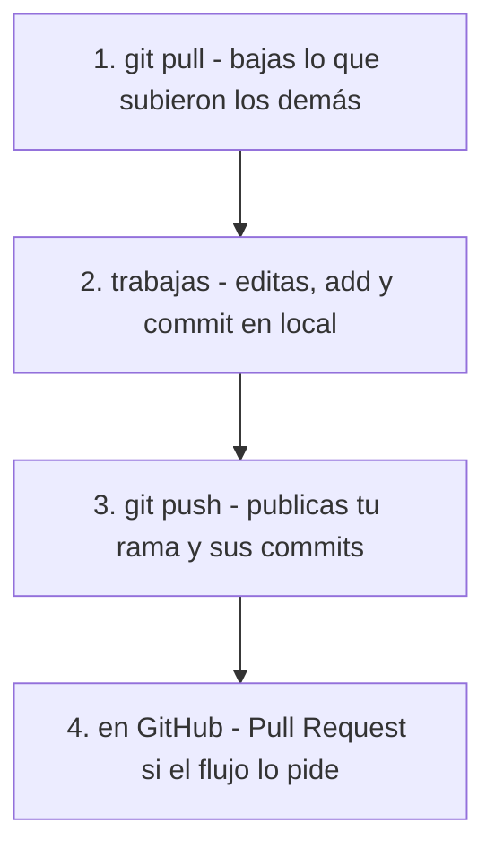

# Repositorio remoto

## Introducción

El repositorio **remoto** es la copia del proyecto que vive en un servidor —GitHub, un servidor propio, o la máquina de un compañero— y sirve de punto de encuentro para todos. Si el repositorio local es tu caja fuerte personal, el remoto es la bóveda del equipo.

Ya lo has tocado sin saberlo: al clonar, `origin` quedó configurado; al hacer push, enviaste tu rama; al hacer pull, bajaste lo ajeno. En este capítulo damos nombre y estructura a esa relación: qué es un remoto, cómo se llama, qué comandos lo gestionan y cómo encaja en el esquema distribuido.

En este capítulo aprenderás:

* qué es un repositorio remoto y para qué sirve;
* `origin` y la configuración de remotos (`git remote`);
* cómo se conectan local y remoto (fetch, pull, push);
* la autoridad del remoto y la integración;
* errores comunes con diagnóstico completo, práctica guiada y nivel profesional (varios remotos, forks, seguridad).

---

## Mapa conceptual de este capítulo



---

## 1. Qué es y para qué sirve

### 1.1. La bóveda compartida

```text
Repositorio remoto
──────────────────────────────────────────────
· copia del proyecto en un servidor accesible por red
· destino de tus push, origen de tus pull/fetch
· allí se integra el trabajo de todas las personas
· en GitHub: el repositorio de la web (issues, PRs,
  Actions viven EN torno a él)
```

### 1.2. Para qué sirve

```text
   │
   ├── COMPARTIR: push/pull distribuyen el trabajo
   ├── RESPALDAR: tu historia tiene copia fuera de tu disco
   ├── INTEGRAR: punto donde se unen las ramas del equipo
   ├── AUTORIZAR: permisos, ramas protegidas, revisiones
   └── AUTOMATIZAR: CI/CD y release corren «hacia» él
       (secciones 21+)
```

### 1.3. Qué NO es

```text
   │
   ├── no es el «original» del que tu local es esclavo:
   │   tu local tiene autoridad sobre SU historial
   │
   ├── no sustituye tu disco: si no haces push, el
   │   remoto no te conoce
   │
   └── no es único: puede haber varios (tuyo, del
       equipo, del fork…) — punto 2.4
```

---

## 2. `origin` y los remotos configurados

### 2.1. Ver los remotos

```bash
git remote -v
```

```text
Salida típica tras clonar:
 origin  https://github.com/usuario/proyecto.git (fetch)
 origin  https://github.com/usuario/proyecto.git (push)

→ «origin» es el NOMBRE; la URL es el destino
```

### 2.2. Añadir, ver, cambiar, quitar

```bash
git remote add origin <URL>
git remote set-url origin <URL>      # cambiar URL
git remote rename origin upstream    # renombrar
git remote remove origin             # quitar
git remote show origin               # detalle (rama local
                                     # asociada, refs)
```

### 2.3. HTTPS y SSH

```text
Esquema     Ventaja                          Requiere
────────────────────────────────────────────────────────
HTTPS       fácil, con navegador y 2FA       token/credencial
            (Git Credential Manager)
SSH         clave pública/privada; sin       par de claves
            contraseña por cada operación    registrado en
                                            GitHub
```

```text
   │
   ├── ambos llegan al MISMO repositorio
   ├── cambias con set-url cuando quieras
   └── SSH es habitual en equipos; HTTPS es el camino
       más corto para empezar (lo viste en la sección 03)
```

### 2.4. Varios remotos

```text
Casos
   │
   ├── upstream  →  el repo ORIGINAL (cuando trabajas en
   │                un fork; muy común en open source)
   ├── origin    →  TU fork (o el repo del equipo)
   └── backups    →  un servidor espejo propio
```

---

## 3. La conexión: fetch, pull, push

### 3.1. Qué sube y qué baja

```text
Acción    Sentido       Comando        ¿modifica tu
                                       trabajo actual?
──────────────────────────────────────────────────────────
bajar     remoto→local  git fetch      no (solo refresca
                                       referencias y objetos)
bajar+    remoto→local  git pull       intenta MERGEAR en
integ.                                 tu rama actual
subir      local→remoto  git push       no (sube tu rama)
```

### 3.2. El ciclo completo

Un día típico:



### 3.3. Qué ve cada quien tras cada paso

```text
Estado        Local tuyo           Remoto
──────────────────────────────────────────────
solo local    tus commits          no los ve
push ok       igual                ve tus commits
pull ok       ve los ajenos        igual
```

```text
Insight clave
   │
   ├── push = TU verdad viaja
   ├── pull = LA verdad del equipo llega a ti
   └── hasta que no haces push, «lo tengo hecho» es
       solo local
```

### 3.4. fetch vs. pull (miniatura)

```text
   │
   ├── fetch: descarga y actualiza origin/* en tu local;
   │   puedes mirar (git log origin/main) SIN tocar tu
   │   rama → seguro
   │
   └── pull = fetch + integrar (merge o rebase según
       configuración) en tu rama ACTUAL → puede tocar
       tu trabajo
```

(El detalle completo: secciones 09 y 10.)

---

## 4. Autoridad e integración

### 4.1. La rama protegida

```text
En GitHub (niveles de protección, sección 14+):
   │
   ├── main suele estar protegida:
   │   · no se empuja directamente
   │   · exige Pull Request + revisiones
   │   · checks verdes antes de unir
   │
   └── así el remoto «cuida» la calidad del proyecto;
       tu local sigue libre para experimentar en ramas
```

### 4.2. Forks y upstream

```text
Open source:
   │
   ├── haces FORK en GitHub (tu copia en tu cuenta)
   ├── clonas TU fork (origin = tu fork)
   ├── añades upstream = repo original
   └── ciclo: fetch upstream → rama nueva → push origin
       → PR al upstream
```

---

## 5. Errores comunes con diagnóstico completo

### Error 1: push rechazado (non-fast-forward)

**Qué ocurrió:** «Tu push fue rechazado: el remoto tiene cambios que tú no tienes».

**Por qué:** alguien subió commits a esa rama desde que bajaste la última vez (o tú no bajaste).

**Cómo comprobarlo:** mensaje del push; `git fetch && git log origin/<rama>..HEAD` (lo tuyo que falta) y `HEAD..origin/<rama>` (lo ajeno).

**Opciones:**
* `git pull` (integrar lo ajeno) y volver a intentar push;
* si el pull crea un merge inútil, valorar `git pull --rebase` (secciones 10/17);
* NUNCA `push --force` en rama compartida.

**Riesgos:** force-push → borrar trabajo ajeno publicado.

**Solución:** pull primero, push después.

**Cómo se evita:** pull antes de empezar a trabajar y antes de push.

---

### Error 2: «authenticated failed» / pedir credenciales

**Qué ocurrió:** push/pull piden usuario y contraseña y fallan (o piden token).

**Por qué posibles:**
* contraseña de cuenta ya no vale: GitHub exige token/2FA por HTTPS;
* SSH sin clave registrada o sin agente;
* credencial guardada caducada.

**Cómo comprobarlo:** mensaje exacto; `git remote -v` (¿qué esquema?); probar abrir la URL en el navegador.

**Opciones:**
* HTTPS: Git Credential Manager + 2FA/token;
* SSH: generar clave, añadirla a GitHub, `set-url` si hace falta.

**Riesgos:** guardar contraseñas/token en texto plano (nunca).

**Solución:** autenticación moderna (sección 03/26).

**Cómo se evita:** configurar 2FA y credencial/gesto SSH al crear la cuenta.

---

### Error 3: No existe la rama en el remoto

**Qué ocurrió:** `git push -u origin rama-x`… o fetch no ve la rama que buscas.

**Por qué posibles:**
* la rama es nueva y nunca se subió;
* la rama la subió otro y no la bajaste (fetch);
* error de nombre (mayúsculas, guiones).

**Cómo comprobarlo:** `git branch -a` (locales y remotas tras fetch).

**Opciones:** push con `-u` para publicar; fetch para ver ajenas.

**Riesgos:** duplicar trabajo en «otra» rama mal nombrada.

**Solución:** publicar con -u; bajar con fetch/pull.

**Cómo se evita:** crear ramas desde la última referencia del remoto (sección 08).

---

### Error 4: push a la rama equivocada

**Qué ocurrió:** subiste tu rama de prueba a `main` (o al repo equivocado).

**Por qué:** sin verificar destino (`git branch` activa, `git remote -v`).

**Cómo comprobarlo:** `git status` (rama activa), log en GitHub.

**Opciones:**
* si está protegida: el remoto te habrá ayudado a no poder;
* si no: valorar revert en la rama pública o (equipo avisado) rehacer — no forcear por tu cuenta.

**Riesgos:** historia ajena ensuciada.

**Solución:** mirar antes de empujar.

**Cómo se evita:** `git status` como ritual previo a push (raíz 26 ya te lo enseñaba).

---

### Error 5: origin mal configurado (URL vieja)

**Qué ocurrió:** repo movido/renombrado; todos los push fallan con «repo not found».

**Por qué:** la URL de `origin` quedó desactualizada.

**Cómo comprobarlo:** `git remote -v`.

**Opciones:** `git remote set-url origin <URL-nueva>`.

**Riesgos:** ninguno si se hace bien.

**Solución:** un set-url.

**Cómo se evita:** al renombrar/mover repos, actualizar remoto en todos los clonos del equipo.

---

### Error 6: Trabajar contra el remoto «equivocado» de un fork

**Qué ocurrió:** PR desde tu propio fork hacia tu propio fork (o cambios al original sin permiso).

**Por qué:** origin/upstream confundidos.

**Cómo comprobarlo:** `git remote -v` y la URL del PR.

**Opciones:** reconfigurar remotos; abrir el PR al repo correcto.

**Riesgos:** esfuerzo perdido, PRs absurdos.

**Solución:** mapeo fork (origin) / original (upstream).

**Cómo se evita:** anotar el esquema al clonar un fork (punto 4.2).

---

## 6. Práctica guiada

### Objetivo

Verificar tu conexión con el remoto, subir trabajo y bajar trabajo ajeno.

### Paso 1: inspecciona

```bash
git remote -v
git remote show origin    # si responde (necesita red)
```

1. Anota: nombre (`origin`) y URL; esquema (https/ssh).

### Paso 2: sube tu último commit

```bash
git log --oneline -n 3        # ¿qué vas a subir?
git push origin HEAD          # o: git push
```

1. Abre GitHub: ¿aparece el commit?
2. Observa: el remoto ahora sabe lo tuyo.

### Paso 3: baja lo ajeno (si hay equipo)

```bash
git fetch origin
git log --oneline HEAD..origin/HEAD   # o origin/main
```

1. Si sale algo: hay commits tuyos que no tienes.
2. `git pull` para integrar (estudia el resultado).

### Paso 4: comprueba la simetría

```bash
git status            # ¿"up to date" con origin/…?
```

1. «Your branch is up to date with 'origin/main'» = local y remoto iguales.

### Paso 5: simula desconexión

1. Sin red: `git remote -v` funciona (config local), `git fetch` falla (red).
2. Entiende: la configuración es local; la comunicación, no.

### Resultado esperado

Capacidad de explicar, para TU repositorio, a qué remoto hablas, con qué esquema, y qué comandos sincronizan cada dirección.

### Conclusión esperada

El remoto no es magia: es una dirección configurada en tu clon y un protocolo de intercambio. Quien controla `remote -v` y el ciclo fetch/pull/push, controla su integración con el equipo.

### Ejercicio de transferencia

En un repositorio real donde colaboras (o simulado con un segundo clon), ejecuta el ciclo completo: `git pull`, un commit propio, `git push`, y después `git fetch` seguido de `git log HEAD..origin/main`. Entrega la salida de `git remote -v` y de ese `git log`, con dos frases explicando qué había en el remoto que tú no tenías.

---

## 7. Nivel profesional

### 7.1. Flujos con varios remotos

```text
Patrón fork (open source y muchas empresas)
──────────────────────────────────────────────
origin   = mi fork / mi copia de trabajo
upstream = repo oficial del proyecto

Ciclo: fetch upstream → rama desde upstream/main
       → trabajar → push origin → PR a upstream
```

```text
Patrón equipo interno
   │
   ├── origin = repo central del equipo
   └── a veces + backup espejo (ci, espejo)
```

### 7.2. Seguridad y accesos

```text
   │
   ├── HTTPS: tokens con permisos mínimos (scopes),
   │   caducidad, 2FA obligatoria
   ├── SSH: una clave por máquina, revocable, con
   │   passphrase
   ├── credenciales: solo en gestor (GCM/ssh-agent),
   │   JAMÁS en el repo o en scripts
   └── repos privados: revisar quién tiene acceso cada
       cierto tiempo (sección 12/14)
```

### 7.3. Rendimiento e integración

```text
   │
   ├── fetch frecuente y barato: mantener origin/* fresco
   ├── pull --rebase en ramas personales (histórico limpio)
   ├── push con frecuencia (respaldo + visibilidad)
   └── en CI: el remoto es el disparador de pipelines
       (sección 21): lo que llega, se verifica
```

---

## 8. Resumen

En este capítulo aprendiste que:

* el repositorio remoto es la copia compartida en un servidor: destino de push, origen de fetch/pull y base de issues, PRs y CI en GitHub;
* los remotos se configuran con nombre (`origin`, `upstream`…) y URL (HTTPS o SSH), y se gestionan con `git remote add/-v/set-url/remove/show`;
* el ciclo básico: `pull` baja e integra, `push` sube; hasta que no haces push, tu trabajo es solo local; `fetch` baja sin tocar tu rama;
* en flujos con protección, el remoto exige PRs y checks; en forks, `origin` es tu copia y `upstream` el original;
* los errores típicos (push rechazado, credenciales, rama inexistente, destino equivocado, URL vieja, remotos confundidos) se diagnostican con `remote -v`, `status` y `fetch`;
* a nivel profesional: remotos mínimos y seguros, autenticación moderna y sincronización constante.

La idea principal es:

> **El remoto es una dirección y un acuerdo: tú decides a dónde hablas y cuándo sincronizas; Git se encarga del resto sin milagros ni magia.**

---

## Autopreguntas de cierre

Sin mirar el material, responde mentalmente y luego compruébalo con este capítulo:

1. ¿Por qué `git fetch` es seguro con trabajo sin preparar y `git pull` puede llevarte por delante ese trabajo?
2. Haces push y tu commit no aparece en GitHub: ¿qué tres comprobaciones haces en orden y qué significa cada resultado?
3. ¿Qué diferencia hay entre tener `origin` configurado y tener el remoto actualizado, y con qué comando compruebas cada cosa?
4. En un fork abres un PR hacia tu propio repositorio: ¿qué remotos están confundidos y cómo lo verificas antes de rehacerlo?
5. ¿Qué gana un equipo con SSH frente a HTTPS y qué configuración exige cada esquema?
6. Si tu push se rechaza con non-fast-forward, ¿por qué `push --force` no es la solución y qué harías en su lugar?
7. ¿En qué momento tu trabajo deja de ser «solo tuyo», y por qué un commit sin push no lo logra?

---

## Próximo paso

Ya sabes qué es el remoto y cómo se relaciona con tu local.

La pieza central que ambos intercambian es el **commit**: el registro de un cambio.

Continúa con:

[`05-commit.md`](05-commit.md)
