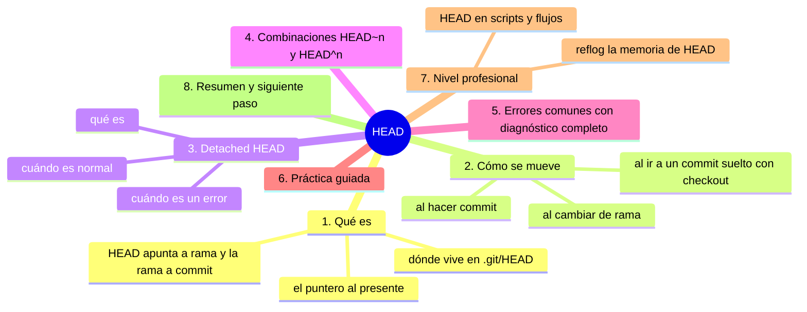
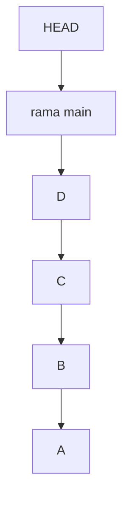
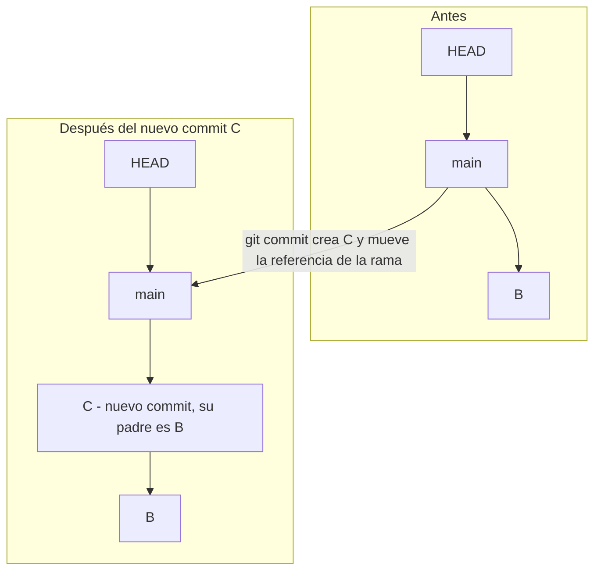

# HEAD

## Introducción

**HEAD** es el puntero de Git: marca «dónde estás parado» en el historial. Cuando haces commit, es HEAD quien avanza; cuando cambias de rama, es HEAD quien se mueve; cuando restauras una versión antigua, es HEAD quien define el «presente».

Si status es la brújula, HEAD es el punto en el mapa donde está tu aguja. Todo lo que has hecho hasta ahora —commits, logs, diffs, restores— depende de esta referencia, aunque no la nombraras: `HEAD~1`, `HEAD^`, `git checkout HEAD~3`… todo sale de aquí.

En este capítulo aprenderás:

* qué es HEAD y dónde vive (`ref: refs/heads/...`);
* HEAD desconectado (detached HEAD): qué es y cuándo ocurre;
* las combinaciones `HEAD~n` y `HEAD^n`;
* cómo se mueve HEAD con commit, checkout y restore;
* errores comunes con diagnóstico completo, práctica guiada y nivel profesional.

---

## Mapa conceptual de este capítulo



---

## 1. Qué es

### 1.1. El puntero al presente



HEAD apunta a la rama, y la rama apunta al commit D: por eso se dice que HEAD y main apuntan a D. Las flechas de la cadena van de cada commit a su padre.

```text
   │
   ├── «presente» = el commit con el que Git está
   │   trabajando en tu carpeta
   │
   └── el HEAD NO guarda historia: guarda un DIRECCIÓN
       (¿a qué commit apunto ahora?)
```

### 1.2. Dónde vive

```bash
cat .git/HEAD        # Windows: type .git\HEAD
```

```text
Salida normal (rama):
   ref: refs/heads/main

Salida desconectada:
   a3f9c21ab3d4e5f6a7b8c9d0e1f2a3b4c5d6e7f8a9

Interpretación:
   │
   ├── apuntando a una RAMA (lo normal) → HEAD→rama→commit
   └── apuntando a un COMMIT directo → detached
```

### 1.3. La cadena de referencias

```text
HEAD ──► refs/heads/main ──► a3f9c21 (commit)

   │
   ├── HEAD es «el puntero al puntero»
   ├── por eso al commitear se actualizan DOS cosas:
   │   la rama avanza Y HEAD la sigue
   └── ver status lo dice en lenguaje llano:
       "on branch main" + "Your branch is up to date
       with 'origin/main'"
```

---

## 2. Cómo se mueve

### 2.1. Al hacer commit



```text
   │
   └── la rama «crece»; HEAD no se «suelta»: apunta
       a la rama, que ahora es C
```

### 2.2. Al cambiar de rama

```bash
git switch feature          (o git checkout feature)
```

```text
Antes:   HEAD → main → C
Después: HEAD → feature → F

   │
   ├── tu carpeta se actualiza al contenido de F
   ├── main no se mueve (sigue en C)
   └── HEAD sólo cambia de OBJETIVO
```

### 2.3. Al ir a un commit suelto

```bash
git switch --detach a3f9c21     (o checkout --detach)
```

```text
Antes:   HEAD → main → C
Ahora:   HEAD ──────────► a3f9c21   (directo, SIN rama)

   │
   ├── HEAD ya no pasa por ninguna rama: DETACHED
   └── ver punto 3
```

### 2.4. Restaurar con HEAD

⚠️ **RIESGO:** `git restore archivo` (con o sin `--source`) sobrescribe el archivo del directorio de trabajo con la versión indicada: los cambios sin preparar de ese archivo se pierden y no son recuperables por Git.

```bash
git restore --source HEAD archivo
git restore archivo            # por defecto: desde el índice
                               # (que suele ser HEAD)
```

```text
HEAD como nombre de «el estado presente»:
   │
   └── el «origen» por excelencia de restauraciones
```

---

## 3. Detached HEAD

### 3.1. Qué es

```text
HEAD apunta DIRECTAMENTE a un commit, sin rama intermedia.
```

### 3.2. Cuándo es NORMAL

```text
   │
   ├── git log / show / diff: nunca «desconectan»
   │   (solo leen)
   │
   ├── ver un tag antiguo: HEAD puede quedar en él
   │   al inspeccionar
   │
   └── inspección temporal: clon profundo, CI revisando
       un commit concreto
```

### 3.3. Cuándo es UN PROBLEMA

```text
   │
   ├── si en detached haces COMMITS → cuelgan de un
   │   hash suelto: ninguna rama los apunta
   │
   ├── al cambiar de rama/checkout, esos commits quedan
   │   «huérfanos» (solo recuperables con reflog
   │   mientras Git no los recoja)
   │
   └── Git te AVISA: "detached HEAD ... new commits
       will be discarded"
```

### 3.4. Cómo salir sano

```text
   │
   ├── si NO hiciste commits: cualquier switch a una
   │   rama (tu carpeta vuelve)
   │
   ├── si hiciste commits y los quieres:
   │   crea rama AHORA: git switch -c rescate
   │   (los commits quedan colgando de esa rama)
   │
   └── si no los quieres: simplemente vuelve a una rama
       y los deja atrás (se recuperan por reflog si
       hicieran falta)
```

---

## 4. Combinaciones: `HEAD~n` y `HEAD^n`

### 4.1. Padre directo y ascendentes

```text
Historial:  A ← B ← C ← D    (D = HEAD)

HEAD      → D
HEAD~1    → C        (un paso «hacia atrás» por padres)
HEAD~2    → B
HEAD~3    → A

HEAD^     → C        (primer padre, como ~1)
HEAD^2    → segundo padre (solo existe en merges)
HEAD~2^   → combinable: abuelo por la rama principal
```

### 4.2. Uso cotidiano

⚠️ **RIESGO:** la última orden (`git restore --source HEAD~2 archivo`) pisa el archivo de tu carpeta con la versión de hace dos commits: los cambios locales sin preparar de ese archivo no se pueden recuperar después.

```bash
git show HEAD~1
git diff HEAD~3..HEAD
git log HEAD~5..HEAD
git restore --source HEAD~2 archivo
```

### 4.3. Ancestros vs. padres (miniatura)

```text
   │
   ├── ~N = «N generaciones atrás» (por la línea)
   ├── ^N = «el N-ésimo padre» (útil en merges)
   └── en merge: HEAD^1 y HEAD^2 son las dos ramas
       que se unieron
```

---

## 5. Errores comunes con diagnóstico completo

### Error 1: «You are in 'detached HEAD' state»

**Qué ocurrió:** quedaste en un commit suelto (por inspección, tag o checkout mal dado).

**Por qué:** HEAD deja de pasar por una rama.

**Cómo comprobarlo:** el aviso de Git; `git switch` o `cat .git/HEAD`.

**Opciones:**
* solo mirar: vuelve con `git switch main`;
* hiciste commits y quieres conservarlos: `git switch -c <nombre>` YA;
* sin interés: vuelve y ya (los commits se dejan atrás).

**Riesgos:** commits huérfanos si no actúas.

**Solución:** crear rama en el momento si hay trabajo que conservar.

**Cómo se evita:** usar `switch` con ramas en lugar de hashes para trabajar; reservar detached para mirar.

---

### Error 2: «HEAD~1 no existe» / bad revision

**Qué ocurrió:** intentaste `HEAD~2` en un repo con 1 commit (o en detached en la raíz).

**Por qué:** no hay suficientes padres.

**Cómo comprobarlo:** `git log --oneline` (¿cuántos commits tienes?).

**Opciones:** usar un número válido.

**Riesgos:** ninguno serio.

**Solución:** comprobar profundidad antes.

**Cómo se evita:** `git log --oneline` es la respuesta a «¿dónde estoy?».

---

### Error 3: Hacer commits pensando que estabas en una rama

**Qué ocurrió:** cambios que «desaparecen» del log al cambiar de sitio (quedaron en detached).

**Por qué:** HEAD apuntaba a un hash, no a rama.

**Cómo comprobarlo:** aviso de Git al salir; `git reflog` los ve.

**Opciones:** `git switch -c rama` mientras sigas en ese HEAD; o recuperar desde reflog (punto 7.1).

**Riesgos:** pánico y creencia de pérdida.

**Solución:** rama siempre antes de producir.

**Cómo se evita:** status al empezar: confirma rama y posición.

---

### Error 4: Restaurar con números equivocados (HEAD~n)

**Qué ocurrió:** restauraste «el archivo de HEAD~5» cuando querías HEAD~2 (o al revés).

**Por qué:** memorias fallibles; sin verificar.

**Cómo comprobarlo:** `git log --oneline -n 8` y ubicar cada hash.

**Opciones:** usar hashes explícitos en operaciones sensibles (`--source <hash>`), ver diff antes.

**Riesgos:** pisar contenido con la versión equivocada.

**Solución:** ubicar → comprobar diff → restaurar.

**Cómo se evita:** en duda, `git show HEAD~n:archivo` (solo imprime) antes que `restore`.

---

### Error 5: Creer que HEAD es «mi última copia de seguridad»

**Qué ocurrió:** se borraron cosas y se pensó que HEAD lo tenía todo.

**Por qué:** HEAD no guarda copias: guarda dirección; el contenido está en los objetos (que sí quedan).

**Cómo comprobarlo:** `git status` / `git log` / `git fsck`.

**Opciones:** recuperar desde commits/objetos (restore, show, reflog).

**Riesgos:** miedo innecesario, pasos precipitados.

**Solución:** entender la arquitectura: HEAD dirige; objects guardan.

**Cómo se evita:** esta sección (07) justamente existe para eso.

---

### Error 6: Confundir HEAD con la rama

**Qué ocurrió:** se espera que «mover HEAD» cambie también main (o viceversa).

**Por qué:** son dos niveles.

**Cómo comprobarlo:** `git branch --show-current` vs. `cat .git/HEAD`.

**Opciones:**
* en detached, la rama NO se mueve (por eso se «salva» con -c);
* al commitear en rama, avanza la rama (HEAD la sigue).

**Riesgos:** conclusiones invertidas al investigar.

**Solución:** mapeo del punto 1.3.

**Cómo se evita:** nombrar siempre: «¿HEAD apunta a rama o a hash?».

---

## 6. Práctica guiada

### Objetivo

Ver HEAD moverse en las tres situaciones típicas y usar sus combinaciones.

### Paso 1: mira tu HEAD actual

```bash
cat .git/HEAD            # type .git\HEAD en Windows
git status               # "on branch …"
```

1. Apunta a `ref: refs/heads/main` (o la rama que uses).

### Paso 2: HEAD avanza con un commit

```bash
# pequeño cambio + add + commit
cat .git/HEAD            # sigue en la rama…
git log --oneline -n 2   # …pero la rama creció: HEAD
                         # «caminó» con ella
```

### Paso 3: HEAD cambia de rama

```bash
git switch -c prueba-head
cat .git/HEAD            # ref: refs/heads/prueba-head
git switch main
cat .git/HEAD            # vuelve a main
```

### Paso 4: combinaciones

```bash
git log --oneline -n 5
git show HEAD~1 --stat
git diff HEAD~2..HEAD --stat
git show HEAD^ --oneline -s
```

1. Ubica cada referencia en la lista de log.

### Paso 5: detached y rescate

```bash
git switch --detach HEAD~1
cat .git/HEAD            # hash directo (sin ref:)
# pequeño commit aquí (opcional)
git switch -c rescate    # si hiciste commit: guárdalo
git switch main          # vuelta a la normalidad
```

1. Practica el aviso y la salida sana.

### Resultado esperado

Capacidad de explicar en qué punto exacto del historial estás, a qué apunta HEAD y cómo se relaciona con tus ramas.

### Conclusión esperada

HEAD es el cursor de tu relación con la historia: lo mueven commit, switch y checkout; lo interpretan status y log; y sus combinaciones (`~`, `^`) te dan navegación libre por la cadena.

### Ejercicio de transferencia

En un repositorio con al menos cinco commits, sitúa HEAD con `cat .git/HEAD`, identifica a qué rama apunta y localiza en `git log --oneline` los commits que corresponden a `HEAD`, `HEAD~1` y `HEAD~3`; después entra en detached con `git switch --detach HEAD~1` y créale una rama de rescate antes de volver a la tuya. Entrega la salida de `cat .git/HEAD` en los tres momentos (rama, detached y rama de rescate).

---

## 7. Nivel profesional

### 7.1. reflog: la memoria de HEAD

```bash
git reflog
```

```text
   │
   ├── registro de cada movimiento de HEAD y de las
   │   puntas de ramas (local): «dónde estuvo tu HEAD»
   │
   ├── commiteaste en detached y «perdiste» el commit:
   │   está en reflog → git switch -c rama <hash>
   │
   ├── reset/rebase mal hechos: reflog es la vía de
   │   recuperación típica (sección 11)
   │
   └── caduca por tiempo por defecto (≈90 días): no es
       respaldo eterno; el respaldo real es push
```

### 7.2. HEAD en scripts y flujos

```text
   │
   ├── HEAD~1 es el ancla universal: «lo que había
   │   antes de este commit»
   │
   ├── CI compara HEAD contra la rama base (diff de PR)
   │
   └── comandos deterministas: referenciar HEAD~1 en vez
       de fechas o nombres frágiles
```

### 7.3. Cuidados de equipo

```text
   │
   ├── avisos de detached en CI se tratan como error
   │   cuando se esperaba rama
   │
   ├── hooks y políticas leen HEAD/refs: manipular
   │   referencias es poder; el flujo normal ya lo hace
   │
   └── entender HEAD es requisito para leer reflogs,
       sequencer (rebase/merge en curso) y estados
       intermedios de Git
```

---

## 8. Resumen

En este capítulo aprendiste que:

* HEAD es un puntero al «presente»: normalmente `ref: refs/heads/<rama>`, a veces directamente a un commit (detached);
* se mueve al commitear (la rama avanza con él), al cambiar de rama y al ir a commits suelto;
* detached HEAD es normal para inspeccionar, pero los commits hechos allí cuelgan de un hash y hay que «salvarlos» con `git switch -c`;
* `HEAD~n` recorre ancestros y `HEAD^n` padres (clave en merges), y son la base de diff/show/log/restore histórico;
* los errores típicos (detached no detectado, referencias inexistentes, commits huérfanos, números equivocados) se resuelven leyendo log y reflog y volviendo a una rama a tiempo;
* a nivel profesional, el reflog da margen de recuperación y HEAD es el ancla determinista de scripts y CI.

La idea principal es:

> **HEAD es tu cursor en la historia: sé siempre consciente de a qué apunta, porque cada orden de Git se ejecuta a partir de ahí.**

---

## Autopreguntas de cierre

Sin mirar el material, responde mentalmente y luego compruébalo con este capítulo:

1. Si solo escribes `git commit`, ¿por qué se actualizan la rama y la lectura de HEAD aunque no ejecutas dos comandos?
2. ¿Qué cambia entre `git switch --detach` y `git switch -c` en el mismo momento, y qué le pasa a los commits que hagas después en cada caso?
3. ¿Por qué `git log` o `git show` no te dejan en detached HEAD y `git switch --detach` sí?
4. `HEAD~2` devuelve bad revision en tu repositorio: ¿qué estás preguntando realmente y qué comprobación haces antes de reintentar?
5. Si commiteas en detached HEAD, ¿por qué `main` no se ha movido aunque tú has creado un commit?
6. ¿Qué guarda HEAD y qué no guarda, y cómo cambia eso tu respuesta ante un archivo que has perdido?
7. ¿Por qué el reflog te da una segunda oportunidad tras un reset mal hecho y cuándo deja de ser fiable?

---

## Próximo paso

Ya sabes leer el presente del historial.

Ahora toca ver el pasado como sistema: cómo los commits se enlazan en un grafo.

Continúa con:

[`08-grafo-de-commits.md`](08-grafo-de-commits.md)
