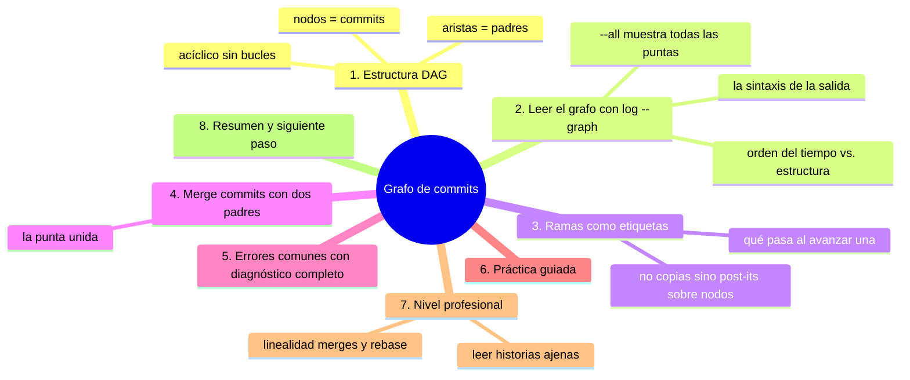
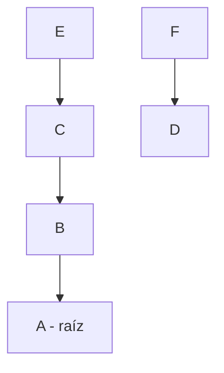
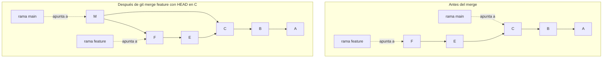

# Grafo de commits

## Introducción

Los commits no son una lista: son un **grafo**. Cada commit apunta a su padre (o padres), y de esa estructura brotan las ramas, se curvan los merges y se entienden los conflictos. `git log` te lo enseña con flechas y ramificaciones cuando pides el formato gráfico; detrás, la realidad es un árbol invertido con la raíz al principio y las puntas (ramas) hacia delante.

Comprender el grafo es pasar de «Git guarda archivos» a «Git guarda relaciones». Cuando en la sección 10 veas conflictos y en la 17 rebases, estarás reescribiendo o fusionando exactamente estos nodos y aristas.

En este capítulo aprenderás:

* el grafo como DAG (grafo acíclico dirigido) de padres;
* cómo leer la salida `git log --graph --oneline --all`;
* ramas como etiquetas sobre nodos, no como copias;
* merge commits (dos padres) y lo que cambian;
* errores comunes con diagnóstico completo, práctica guiada y nivel profesional (historias lineales vs. curvas, `log --graph` como herramienta de equipo).

---

## Mapa conceptual de este capítulo



---

## 1. Estructura: DAG

### 1.1. Nodos y aristas



Cada flecha va de un commit a su padre (raíz A; padres indicados con flecha hacia atrás).

```text
Más formal:
   cada commit NODO tiene 1..N padres ARISTA hacia atrás
   la raíz tiene 0 padres
```

### 1.2. DAG: dirigido y acíclico

```text
Dirigido   →  las aristas van de hijo a padre (el pasado
              señala hacia atrás; el futuro no existe)
Acíclico   →  no puedes volver a un commit por otra
              ruta: si A es ancestro de B, B nunca es
              ancestro de A (imposible viajar al futuro)
Consecuencia práctica:
   el historial es una red creciente SIN bucles:
   por eso «revert de un revert» y otras operaciones
   tienen reglas fijas (sección 11+)
```

### 1.3. Ancestores y puntas

```text
   │
   ├── punta/tip: un commit sin hijos aún (hacia delante)
   │   (las ramas suelen apuntar a puntas)
   │
   ├── ancestros de X: X, su padre, el del padre…
   │   (todo lo que X «recuerda»)
   │
   └── ¿commits que NADIE recuerda? → huérfanos
       (solo reflog/gc sabe de ellos; no los «ves»)
```

---

## 2. Leer el grafo (`log --graph`)

### 2.1. El comando

```bash
git log --graph --oneline --all
```

```text
Salida conceptual:
 * a3f9c21 (HEAD -> main) Añade ejercicios
 * 7b21d04 Corrige enlaces
 |\
 | * 4d5e6f7 (feature) Prueba formato
 |/
 * 1a2b3c4 Punto cero

Lectura:
   │
   ├── * = commit
   ├── |, \, / = aristas (padres)
   ├── la barra doble |\/ = bifurcación y unión
   └── etiquetas entre paréntesis = ramas/HEAD/tags
```

### 2.2. `--all` y el contexto completo

```text
   │
   ├── sin --all: solo la línea de la rama ACTUAL
   ├── con --all: todas las ramas y remotos visibles
   │   → ves el equipo completo local
   └── con --simplify-by-decoration: atajo gráfico
       (solo nodos «decorados»: ramas/tags)
```

### 2.3. Orden del tiempo vs. estructura

```text
   │
   ├── log ordena (por defecto) por fecha de committer
   ├── en grafos con ramas largas, el orden visual
   │   puede engañar: la VERDAD son las flechas
   └── regla: sigue padres, no filas
```

---

## 3. Ramas como etiquetas

### 3.1. No hay copias

```text
Mi idea errónea frecuente:
   "crear feature = copiar el proyecto"

Realidad:
   A ← B ← C ← D
              ↑
           feature (post-it sobre D)

   │
   ├── crear rama = crear un NOMBRE de 41 bytes que
   │   apunta a un commit existente
   │
   └── es instantáneo y gratis (por eso se crean ramas
       sin miedo)
```

### 3.2. Avanzar una rama

```text
Al commitear en feature:
   A ← B ← C ← D
                 ↑
              feature (ahora en E, nuevo commit E)

   │
   ├── el nombre «camina» con cada commit que haces
   └── main no se movió: sigue en D (o donde esté)
```

### 3.3. Múltiples etiquetas en un nodo

```text
   │
   ├── A ← B ← C
   │          ↑  ↑
   │       main  release-1.0
   │
   └── dos nombres, un nodo: «dos formas de hablar
       del mismo commit»
```

---

## 4. Merge commits (dos padres)

### 4.1. La unión



M es el commit de merge y sus padres son C y F: de M se llega a las dos líneas. Las flechas de la cadena van de cada commit a su padre; las punteadas son punteros de rama.

### 4.2. Qué «recuerda» M

```text
   │
   ├── de M se llega a TODO: B, C (línea principal)
   │   y E, F (línea de feature)
   │
   ├── por eso desde entonces, log sin --all ya ve
   │   los dos lados (están unidos)
   │
   └── un merge SIN conflicto = Git encontró la unión
       automática; con conflicto = te pide elegir
       (sección 10)
```

### 4.3. Historias gráficas típicas

```text
lineal (rebase/ff):     * * * * *        fácil de leer

con merges (no --ff):    * * * * *        «árbol» honesto
                          \ / \ /         con contexto
                           *   *
```

(Ambos válidos: la política la decide el equipo; sección 17.)

---

## 5. Errores comunes con diagnóstico completo

### Error 1: «Mi commit no aparece en el log»

**Qué ocurrió:** commiteaste y en `git log` no lo ves (o en otra rama no aparece).

**Por qué posibles:**
* estabas en otra rama (commit colgó de «la tuya»);
* lo hiciste en detached HEAD;
* no miraste con `--all`;
* no hiciste push (GitHub no lo muestra).

**Cómo comprobarlo:** `git status` (rama actual), `git log --all --oneline`, `git reflog`.

**Opciones:** cambiar de rama o usar `--all`; push para publicar.

**Riesgos:** creer que se perdió.

**Solución:** ubicar el nodo con reflog/--all.

**Cómo se evita:** siempre saber en qué rama produces (raíz 26).

---

### Error 2: Entender mal el dibujo

**Qué ocurrió:** se leyó la salida como lista de tiempo y se sacó una conclusión falsa («esto vino después de aquello»).

**Por qué:** el orden visual de filas ≠ orden de padres.

**Cómo comprobarlo:** `git log --graph --parents` (verás los padres explícitos) o seguir flechas.

**Opciones:** re-leer con --parents; usar herramientas visuales si es complejo.

**Riesgos:** diagnósticos invertidos en merges/conflictos.

**Solución:** seguir aristas, no filas.

**Cómo se evita:** práctica con `--graph` en repos con merges reales.

---

### Error 3: Esperar que crear rama «cueste» o duplique

**Qué ocurrió:** alguien evita crear ramas por miedo al espacio/tiempo.

**Por qué:** mentalidad de «copias de carpetas».

**Cómo comprobarlo:** `git branch prueba` es instantáneo (es un archivo de texto con un hash).

**Opciones:** crear ramas sin miedo (borrarlas también es barato).

**Riesgos:** trabajar todo en una rama gigante (peor).

**Solución:** ramas por tema, desde el primer día.

**Cómo se evita:** este capítulo: ver qué es realmente una rama.

---

### Error 4: Confundir rama con ramas remotas

**Qué ocurrió:** «no veo mi rama» en `git branch` (solo tras fetch/clone la ves como `origin/x`).

**Por qué:** hay dos mundos de nombres: locales y `origin/*`.

**Cómo comprobarlo:** `git branch -a`.

**Opciones:** `git switch -c x origin/x` (o `git switch x` en versiones con creación automática) para trabajar sobre ella.

**Riesgos:** duplicar trabajo en «otra» rama local con el mismo nombre.

**Solución:** mapa local vs. remoto (sección 04/09).

**Cómo se evita:** `branch -a` como inspección habitual.

---

### Error 5: Merge con demasiados padres raro (octopus)

**Qué ocurrió:** se ve un commit con N padres en un log (más de dos).

**Por qué:** `git merge` con varias ramas a la vez (octopus merge), o historia heredada.

**Cómo comprobarlo:** `cat-file -p <commit>`.

**Opciones:** leer el mensaje; en equipos normales no se usa a diario.

**Riesgos:** confusión puntual.

**Solución:** saber que existe (no es corrupción).

**Cómo se evita:** merges de dos vías en el día a día.

---

### Error 6: Dar por perdido «lo no empujado»

**Qué ocurrió:** alguien formateó el PC: commits locales nunca pusheados desaparecieron.

**Por qué:** el grafo existía solo en su disco.

**Cómo comprobarlo:** el remoto no los tenía (nunca hubo push).

**Opciones:** si no hay backup: perdidos; si hay reflog/backup: recuperables.

**Riesgos:** pérdida de días de trabajo.

**Solución:** push frecuente (el grafo remoto es tu respaldo).

**Cómo se evita:** hábito: commitear a diario y empujar al menos al final de jornada.

---

## 6. Práctica guiada

### Objetivo

Crear, leer y manipular un grafo pequeño con ramas y un merge.

### Paso 1: base

```bash
git switch main
# 2 commits pequeños encima de la raíz (si no los tienes)
git log --graph --oneline
```

1. Línea simple: * * *.

### Paso 2: rama y divergencia

```bash
git switch -c feature-grafo
# un commit en feature
git switch main
# otro commit distinto en main
git log --graph --oneline --all
```

1. Dibuja el resultado: dos puntas, un ancestro común.

### Paso 3: merge

```bash
git merge feature-grafo
git log --graph --oneline --all
```

1. Aparece el nodo M con dos aristas.
2. `git show M --stat` (o `git cat-file -p HEAD`): confirma `parent` doble.

### Paso 4: etiquetas en un nodo

```bash
git branch etiq-main main
git branch -a
```

1. Dos nombres, un nodo (post-its).

### Paso 5: leer con padres explícitos

```bash
git log --graph --pretty=format:"%h %p %s" -n 6
```

1. `%p` muestra padres: verifica visualmente las aristas.

### Resultado esperado

Capacidad de traducir entre el dibujo del log y la estructura real, y de anticipar dónde caerá cada commit que hagas.

### Conclusión esperada

El grafo es el mapa del territorio: ramas son nombres, merges son puentes y el orden lo mandan los padres, no las fechas.

### Ejercicio de transferencia

En un repositorio con dos ramas reales (la tuya y otra de un compañero, o dos simuladas), ejecuta `git log --graph --oneline --decorate --all` y dibuja en papel el grafo resultante marcando raíz, puntas, ramas y merges; después localiza con `git log --pretty=format:"%h %p %s" -n 6` los padres de cada nodo. Entrega el dibujo comparado con la salida real y una frase explicando qué manda: las filas del log o las flechas.

---

## 7. Nivel profesional

### 7.1. Linealidad y curvas: política de equipo

```text
Estrategias (mención; detalle en sección 17)
──────────────────────────────────────────────
merge commits  →  historia completa con contexto
rebase antes de PR → historia lineal y legible
fast-forward   →  sin commit de merge si es posible

Lo importante aquí: todas son GRÁFOS válidos;
la diferencia es cuánto contexto dejan dibujado.
```

### 7.2. Leer historias ajenas

```text
Rutina de revisión/soporte
   │
   ├── git log --graph --oneline --decorate --all
   ├── identificar: raíz, puntas, merges clave
   ├── git show del merge raro → mensaje (usualmente
   │   explica la decisión)
   └── comparar ramas: git log main..feature
       («lo que trae feature»)
```

### 7.3. Herramientas visuales

```text
   │
   ├── `--graph` para terminal (rápido, suficiente)
   ├── visores de grafo (interfaz) para repos enormes
   ├── GitHub (network graph / historial de PR) para
   │   el grafo REMOTO
   └── en incidentes: el grafo + reflog reconstruyen
       «quién hizo qué y desde dónde»
```

---

## 8. Resumen

En este capítulo aprendiste que:

* el historial es un DAG: nodos = commits, aristas = padres, sin ciclos; las ramas no copian nada, son nombres (post-its) sobre nodos;
* `git log --graph --oneline --all` dibuja la estructura; la verdad está en las flechas (`%p`/`--parents`), no en el orden de filas;
* los merges crean commits con dos padres que «recuerdan» ambos lados; por eso la historia crece como árbol;
* crear ramas es instantáneo y gratis; los commits solo existen donde se hicieron hasta que se empujan;
* los errores típicos (commit «invisible», dibujo mal leído, ramas locales vs. remotas, trabajo no empujado) se resuelven con status, `--all`, `branch -a` y reflog;
* a nivel profesional: políticas de linealidad (merge vs. rebase) son decisiones de equipo sobre el MISMO grafo, y leer grafos ajenos es soporte de nivel avanzado.

La idea principal es:

> **Git no guarda archivos: guarda una red de decisiones. Quien lee el grafo entiende el proyecto; quien solo mira archivos, solo ve el presente.**

---

## Autopreguntas de cierre

Sin mirar el material, responde mentalmente y luego compruébalo con este capítulo:

1. Si una rama es solo un nombre de 41 bytes, ¿qué implica borrarla y por qué no se pierde ningún commit con ella?
2. ¿Por qué el orden de las filas de `git log --graph` puede mentirte y qué debes seguir para saber la verdad?
3. ¿Qué permite recuperar o explicar un commit con dos padres que uno con un solo padre no puede?
4. ¿Por qué crear ramas es gratis pero mantener ramas gigantes sin fusionar sí cuesta al equipo?
5. Si un commit hecho en detached HEAD «no aparece» en ninguna rama, ¿por qué existe y cómo lo encuentras?
6. ¿Qué diferencia hay entre que tu rama esté al día en local y que el remoto la tenga, y con qué comando miras cada cosa?
7. ¿Por qué una historia lineal por rebase y otra con merges pueden representar exactamente el mismo trabajo?
8. Alguien formatea su equipo sin haber empujado nunca: ¿qué parte de su grafo desaparece y cuál sobrevive?

---

## Próximo paso

Has visto la estructura de alto nivel: nodos, aristas y ramas.

Ahora bajamos un nivel: los objetos concretos (blob, árbol, commit) que Git usa para construir esa red.

Continúa con:

[`09-objetos-de-git.md`](09-objetos-de-git.md)
