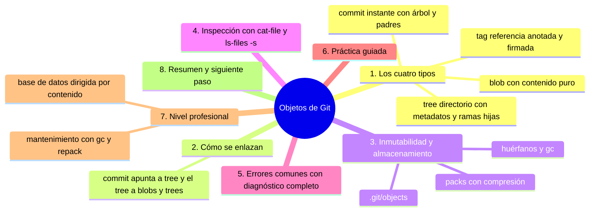
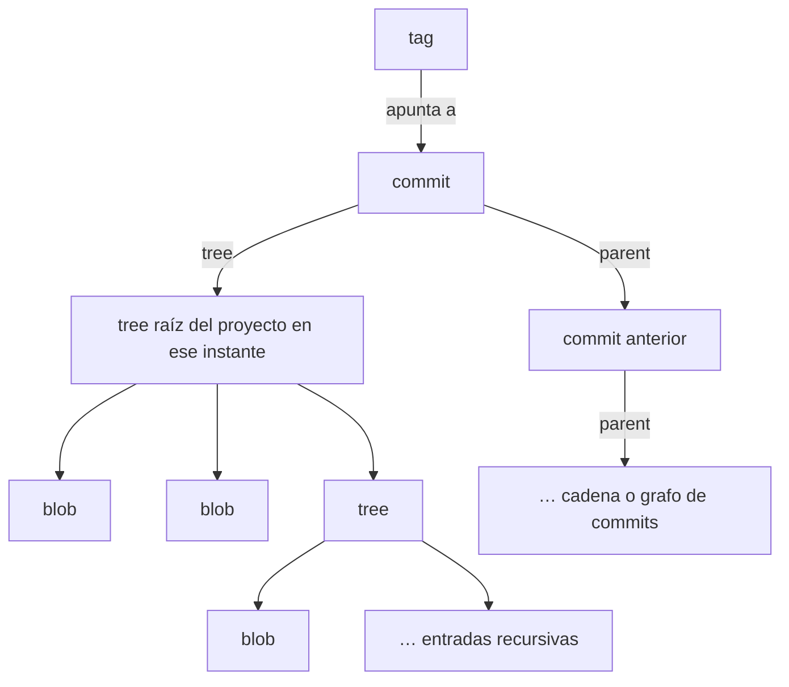

# Objetos de Git

## Introducción

Git es, en el fondo, una base de datos de **cuatro tipos de objetos**: `blob`, `tree`, `commit` y `tag`. Todo lo que has usado —archivos, directorios, historial, etiquetas— se reduce a esos cuatro bloques identificados por hash (capítulo 06) y almacenados en `.git/objects`.

Conocerlos desmitifica Git: no hay «archivos con versiones guardadas» mágicamente; hay contenido empaquetado como objetos inmutables y referencias que apuntan a ellos. Es el conocimiento que separa a quien usa Git de quien lo entiende.

En este capítulo aprenderás:

* los cuatro tipos de objeto y qué guarda cada uno;
* cómo se relacionan (commit → árbol → blobs y árboles);
* cómo inspeccionarlos con `cat-file` y `ls-files -s`;
* por qué son inmutables y cómo se basura lo huérfano (gc);
* errores comunes con diagnóstico completo, práctica guiada y nivel profesional.

---

## Mapa conceptual de este capítulo



---

## 1. Los cuatro tipos

### 1.1. blob: el contenido

```text
Qué guarda:  los BYTES del archivo (tal cual)
Qué NO guarda: nombre, ruta, permisos (eso vive en tree)
Identidad:   hash del contenido (mismo contenido = mismo
             blob, aunque esté en dos rutas)

   │
   └── 10 MB idénticos en dos proyectos → mismo blob
       si el contenido calza (deduplicación)
```

### 1.2. tree: un directorio

```text
Qué guarda:  lista de ENTRADAS:
               modo (100644 archivo, 040000 dir…)
               nombre (hijo)
               hash (blob o tree hijo)
Qué NO guarda: el contenido (solo referencias)

   │
   └── el tree raíz = instantánea COMPLETA del proyecto
       (todos los directorios colgando en cadena)
```

```text
tree raíz
 ├── blob   notas.md
 ├── blob   guia.md
 └── tree   docs/
             ├── blob  guia.md
             └── tree  api/
                        └── blob ref.md
```

### 1.3. commit: el instante

```text
Qué guarda:
   tree  →  hash del árbol raíz (el estado)
   parent(s) →  hash(es) del pasado
   author/committer + fechas
   mensaje
   (opcional: gpgsig, metadatos extra)

   │
   └── el commit NO repite contenido: solo ENLAZA
```

### 1.4. tag: la etiqueta anotada

```text
Qué guarda:
   referencia a un objeto (usualmente commit)
   etiquetador, fecha, mensaje
   opcionalmente FIRMA (GPG/SSH)

   │
   ├── etiqueta LIGERA = solo nombre → hash (no es objeto)
   └── etiqueta ANOTADA = objeto tag firmado → un objeto
       de verdad (sección 19)
```

---

## 2. Cómo se enlazan

### 2.1. La pirámide



### 2.2. Ejemplo mínimo

```text
commit M:  tree T1, parent P, "Añade notas"
T1:        notas.md → blob B1
B1:        "# Mis notas\n"

commit N:  tree T2, parent M, "Amplía notas"
T2:        notas.md → blob B2   (contenido nuevo)
B2:        "# Mis notas\nMás\n"

   │
   ├── T2 ≠ T1 porque B2 ≠ B1
   └── P y M siguen intactos: nadie reescribe nada
```

### 2.3. Equivalencia con lo ya visto

```text
Operación de alto nivel     Objeto resultante
──────────────────────────────────────────────
guardar versión (add/commit) creación de blobs + trees
commit                      creación de commit apuntando
                            a tree nuevo
branch                      crear ref (apunta a commit)
tag anotado                 crear objeto tag
```

---

## 3. Inmutabilidad y almacenamiento

### 3.1. `.git/objects`

```text
   │
   ├── Cada objeto: un archivo con nombre = su hash
   │   (comprimido zlib) en .git/objects/ab/cdef…
   │
   └── se CREAN una vez; después NO se editan:
       cambiar un byte ⇒ objeto nuevo con hash nuevo
```

### 3.2. Packs

```text
   │
   ├── miles de archivos sueltos son lentos: Git los
   │   empaqueta (`.git/objects/pack/*.pack`) reutilizando
   │   contenido similar entre versiones
   │
   └── git gc / git repack = empaquetado/mantenimiento
       (automático periódicamente; a veces manual)
```

### 3.3. Huérfanos y recolección

```text
Objeto huérfano = nadie lo referencia
   │
   ├── un commit sin rama/tag/reflog que lo señale
   │   (ej.: reset brusco sin reflog aún, o expiración
   │   de reflog)
   │
   ├── gc lo elimina eventualmente (ventana de gracia)
   │
   └── por eso reflog es «red de seguridad» temporal
       (capítulo 07 de esta sección)
```

---

## 4. Inspección: `cat-file` / `ls-files -s`

### 4.1. `git cat-file`

```bash
git cat-file -t HEAD        # tipo: commit / tree / blob
git cat-file -p HEAD        # pretty-print: ver el objeto
git cat-file -s HEAD        # tamaño en bytes
git cat-file --batch-check  # para muchos hashes (scripts)
```

```text
-cat-file -p commit:
   tree 3b18e5…
   parent a3f9c2…
   author …
   (mensaje)
```

### 4.2. `git ls-files -s`

```bash
git ls-files -s            # staging: modo + hash + índice
```

```text
Salida:
 100644 a3f9c21… 0 notas.md
   │        │     │
   │        │     └─ número de entrada del índice
   │        └────── hash del BLOB preparado
   └─────────────── modo
```

### 4.3. Cuándo usar cada uno

```text
Pregunta                            Herramienta
──────────────────────────────────────────────────────
¿qué hay preparado?                 ls-files -s
¿qué contiene el objeto X?          cat-file -p X
¿de qué tipo es X?                  cat-file -t X
¿existe X?                          cat-file -e X (exit code)
¿qué árbol tiene commit M?          cat-file -p M
```

---

## 5. Errores comunes con diagnóstico completo

### Error 1: «No such object» en cat-file

**Qué ocurrió:** el hash no existe en TU repositorio.

**Por qué posibles:** hash mal copiado; objeto no descargado (clon parcial/limitado); objeto ya compactado por gc.

**Cómo comprobarlo:** copia exacta de log/show; `git fetch` para traer objetos; verificar con otro identificador.

**Opciones:** fetch; rehacer el hash desde fuente fiable.

**Riesgos:** pensar que «Git borra historial» sin motivo (raro: gc respeta lo referenciado).

**Solución:** trazabilidad del hash.

**Cómo se evita:** trabajar con identidades de la salida oficial.

---

### Error 2: Esperar que ls-files -s muestre TODO el repo

**Qué ocurrió:** salen pocos archivos (o ninguno en repo recién init).

**Por qué:** `ls-files` refleja el ÍNDICE (staging), no el disco completo.

**Cómo comprobarlo:** `git status` (¿untracked?).

**Opciones:** `add` para que entren; `git ls-tree -r HEAD` para ver el árbol del último commit.

**Riesgos:** diagnóstico incompleto.

**Solución:** distinguir índice vs. commit vs. disco.

**Cómo se evita:** el mapa de tres lugares (sección 07).

---

### Error 3: Intentar «editar» un objeto

**Qué ocurrió:** alguien abrió un archivo de `.git/objects` o intentó «arreglar» un commit editándolo.

**Por qué:** concepto erróneo de almacenamiento.

**Cómo comprobarlo:** fsck falla; el hash deja de corresponder.

**Opciones:** deshacer la edición; restaurar desde remoto/backup.

**Riesgos:** corrupción local.

**Solución:** `.git` intocable; usar comandos de alto nivel.

**Cómo se evita:** saber que todo es inmutable por diseño.

---

### Error 4: Pensar que Git guarda «diferencias» como objetos

**Qué ocurrió:** confusión al oír «delta/compression»: creer que los diffs son objetos guardados.

**Por qué:** mezclar capas: internamente sí hay deltas EN los packs (compresión), pero el MODELO de objetos es contenido completo.

**Cómo comprobarlo:** `cat-file -p` de un blob muestra contenido completo.

**Opciones:** aceptar las dos verdades (modelo vs. optimización).

**Riesgos:** confusiones teóricas.

**Solución:** el capítulo 10 lo cierra.

**Cómo se evita:** preguntar «¿qué guarda el objeto?» antes de «¿cómo comprime?».

---

### Error 5: Tamaño descontrolado del repositorio

**Qué ocurrió:** clon gigante, fetch lentísimo.

**Por qué posibles:** binarios versionados históricamente, data dumps, imágenes enormes repetidas.

**Cómo comprobarlo:** `git count-objects -vH`; `git rev-list --objects --all | git cat-file --batch-check` (mirar los más grandes).

**Opciones:**
* PREVENIR: .gitignore + política de equipo;
* corregir historia: requiere REESCRIBIR (filter-repo/LFS) y coordinación total (sección 11/26); nunca unilateral.

**Riesgos:** perder colaboradores si se reescribe a escondidas.

**Solución:** prevención primero; corrección en equipo.

**Cómo se evita:** revisar «qué subo» en cada primer commit.

---

### Error 6: Creer que hay un objeto por «versión editada» a medias

**Qué ocurrió:** se esperaba ver «objetos parciales» al hacer add sin commit.

**Por qué:** el índice guarda referencias; los blobs nuevos se crean al escribir (add escribe objetos en varios flujos, pero el commit es lo que fija el árbol).

**Cómo comprobarlo:** `ls-files -s` tras add muestra hash nuevo; el commit lo enlaza.

**Opciones:** entender el flujo: add materializa en índice; commit materializa tree+commit.

**Riesgos:** mínima (confusión conceptual).

**Solución:** práctica del punto 6.

**Cómo se evita:** hacerlo y verlo.

---

## 6. Práctica guiada

### Objetivo

Tocar los objetos con las manos: tipos, enlaces e inspección.

### Paso 1: mira el commit HEAD

```bash
git cat-file -t HEAD      # commit
git cat-file -p HEAD      # tree, parent, author, mensaje
```

1. Copia el hash de `tree`.

### Paso 2: desciende al árbol

```bash
git cat-file -p <hash-del-tree>
```

1. Verás entradas `modo hash nombre`.
2. Elige el hash de un blob y ábrelo:
```bash
git cat-file -p <hash-del-blob>
```
3. Es tu archivo (¡el contenido puro!).

### Paso 3: el índice

```bash
git ls-files -s
git add un-archivo        # si no había nada staged
git ls-files -s           # ¿hash nuevo del blob?
```

### Paso 4: mismo contenido, mismo blob

1. Crea `copia.md` con contenido idéntico a `notas.md`.
2. `git add copia.md notas.md` → `git ls-files -s` → mismo hash para ambos.
3. Cambia un carácter → add → hashes distintos.

### Paso 5: tipos y existencia

```bash
git cat-file -t main      # o el nombre de tu rama
git cat-file -e <hash-inventado>; echo $?
# salida ≠ 0 → no existe
```

### Paso 6: estado de la base de datos

```bash
git count-objects -vH
git fsck --no-progress
```

1. Cuenta, tamaño y salud.

### Resultado esperado

Habilidad para recorrer commit → tree → blob a mano y explicar qué vive en cada objeto.

### Conclusión esperada

Git no es «una carpeta con versiones»: es una base de datos de objetos inmutables con referencias. Todo lo demás es azúcar sobre eso.

### Ejercicio de transferencia

En un repositorio con varios commits, recorre a mano con `git cat-file -p` el último commit, su árbol raíz y al menos un blob, y anota el tipo, el tamaño y el contenido de cada uno; después crea dos archivos con el mismo contenido, regístralos y comprueba con `git ls-files -s` que comparten blob. Entrega la ruta recorrida (commit → tree → blob) con los hashes y la salida de `ls-files -s`.

---

## 7. Nivel profesional

### 7.1. Base de datos «content-addressable»

```text
Propiedades (lo que Git tiene en común con S3-like stores,
IPFS, etc.)
   │
   ├── dirección = contenido (hash)
   ├── inmutabilidad nativa
   ├── deduplicación automática
   ├── verificación implícita en cada lectura
   └── sincronización eficiente: solo se pide lo que
       falta (por hash)
```

### 7.2. Mantenimiento (gc, repack)

```text
   │
   ├── git gc: empaqueta, limpia huérfanos caducados
   ├── git maintenance (Git moderno): tareas programadas
   ├── gc.reflogExpire: cuánto vive el reflog
   └── en servidores (bare): gc agresivo de rutina
       (GitHub lo hace por ti)
```

### 7.3. Diagnóstico avanzado

```text
Cuando algo «raro» en un repositorio:
   │
   ├── git fsck                 → integridad
   ├── count-objects -vH        → tamaño/estadística
   ├── rev-list --objects       → enumeración completa
   ├── cat-file --batch-check   → inspección masiva
   └── logs/ (reflog)           → historial de referencias
       («quién apuntó a qué y cuándo»)
```

---

## 8. Resumen

En este capítulo aprendiste que:

* Git almacena cuatro tipos de objeto: blob (contenido), tree (directorio con modos y nombres), commit (árbol + padres + autoría + mensaje) y tag (etiqueta anotada con firma opcional);
* se enlazan en pirámide: commit → tree → blobs/trees, y commits entre sí por padres; los tags apuntan a commits;
* los objetos son inmutables y viven comprimidos en `.git/objects` (y en packs); lo no referenciado se recolecta con gc tras caducar el reflog;
* se inspeccionan con `cat-file` (-t/-p/-s/-e) y `ls-files -s` (índice), distinguiendo disco, índice y commit;
* los errores típicos (hash inexistente, ls-files limitado al índice, querer editar objetos, confundir modelo con compresión, repos hinchados) se resuelven con la arquitectura clara y hábitos de prevención;
* a nivel profesional: content-addressable storage, mantenimiento (gc/maintenance) y diagnóstico con fsck/rev-list.

La idea principal es:

> **Cuatro tipos de objetos inmutables + referencias = todo Git; entender esa frase es entender el techo del misterio.**

---

## Autopreguntas de cierre

Sin mirar el material, responde mentalmente y luego compruébalo con este capítulo:

1. Si un blob no guarda nombre ni ruta, ¿dónde vive la ruta de cada archivo y por qué dos archivos iguales en carpetas distintas comparten blob?
2. Si el commit no repite el contenido de los archivos, ¿qué contiene exactamente y qué ocurriría con el tamaño del historial si lo repitiera?
3. ¿Por qué `git ls-files -s` y `git ls-tree -r HEAD` pueden mostrar hashes distintos para el mismo archivo?
4. ¿Qué diferencia hay entre una etiqueta ligera y una anotada a nivel de objetos y por qué importa al verificar una release?
5. ¿Qué es un objeto huérfano, cómo se crea uno sin darte cuenta y cuánto tiempo puede sobrevivir en el repositorio?
6. Si alguien edita un archivo dentro de `.git/objects`, ¿qué comando delata el daño y por qué no sirve «arreglar» el texto a mano?
7. Los packs guardan deltas por compresión: ¿por qué eso no contradice que el modelo de objetos sea de contenido completo?

---

## Próximo paso

Ya conoces los ladrillos.

El último capítulo de la sección los ensambla: el modelo interno completo de Git, de la orden al objeto.

Continúa con:

[`10-modelo-interno-de-git.md`](10-modelo-interno-de-git.md)
