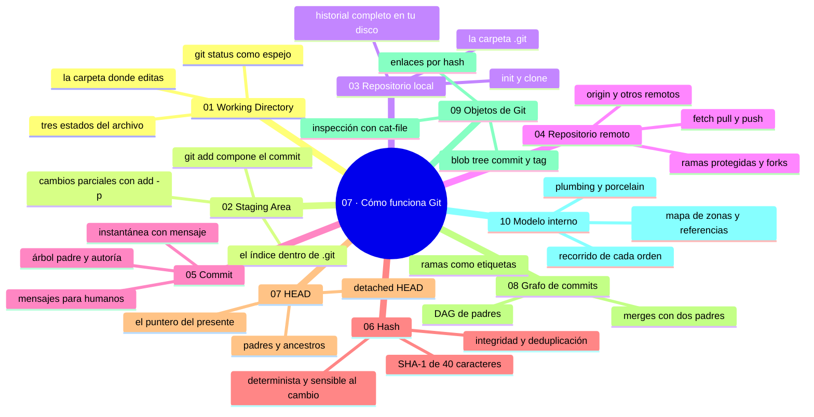

# 07 — Cómo funciona Git

## Bienvenido a la sección de funcionamiento interno

En la sección anterior usaste Git por fuera: instalación, configuración y comandos básicos (`status`, `add`, `commit`, `log`, `diff`, `show`, `help`). En esta sección abres el capó: entenderás **qué hay debajo** de cada orden.

El objetivo no es convertirte en desarrollador de Git, sino eliminar la magia: cuando sepas que `add` escribe blobs en un índice y `commit` crea un objeto y mueve una referencia, cada comando, cada error y cada recuperación futura será comprensible. Es el conocimiento que separa a quien teclea fórmulas de quien decide con criterio.

En esta sección estudiarás:

* las tres zonas de trabajo: directorio de trabajo, staging area y repositorio local;
* el repositorio remoto y cómo se relacionan;
* el commit como objeto y como contrato de comunicación;
* el hash: identidad, integridad y deduplicación;
* HEAD como puntero del presente y sus combinaciones (`HEAD~n`);
* el grafo de commits: ramas como etiquetas, merges como puentes;
* los cuatro objetos de Git: blob, tree, commit y tag;
* el modelo interno completo: qué pasa cuando ejecutas cada orden.

Al finalizar esta sección podrás explicar Git completo en un diagrama y usar ese mapa para diagnosticar casi cualquier situación normal.

---

## Objetivos de aprendizaje

Al terminar esta sección serás capaz de:

* explicar las tres zonas de trabajo (directorio, área de preparación, repositorio local) y en qué vive cada cambio;
* describir un commit como objeto inmutable y su hash como identidad e integridad;
* interpretar HEAD y sus combinaciones (`HEAD~1`, `HEAD~2`);
* leer un grafo de commits: ramas como punteros y merges como puentes;
* identificar los cuatro objetos de Git (blob, tree, commit, tag) en `.git/objects`.

## Mapa conceptual

---

## ¿Qué aprenderás en esta sección?

Cada capítulo de esta sección está diseñado para construir tu comprensión por capas:

1. **Working Directory (directorio de trabajo)** - Dónde editas y qué ve Git en tu carpeta.
2. **Staging Area (área de preparación)** - El índice: componer el próximo commit.
3. **Repositorio local** - El historial completo en tu disco y la carpeta `.git`.
4. **Repositorio remoto** - La bóveda compartida, `origin` y el ciclo fetch/pull/push.
5. **Commit** - Anatomía del registro: árbol, padres, autoría y mensaje.
6. **Hash** - SHA-1, propiedades y consecuencias para integridad y colaboración.
7. **HEAD** - El puntero del presente, detached HEAD y `HEAD~n` / `HEAD^n`.
8. **Grafo de commits** - El historial como DAG: leer `--graph`, ramas y merges.
9. **Objetos de Git** - blob, tree, commit y tag; inspección con `cat-file`.
10. **Modelo interno de Git** - El diagrama maestro y el recorrido de cada orden.

---

## Cómo estudiar esta sección

Cada capítulo incluye:

* Mapas conceptuales y diagramas ASCII de las zonas, referencias y objetos;
* Salidas reales de terminal (`cat-file`, `ls-files`, `rev-parse`, `reflog`);
* Errores comunes con diagnóstico completo (qué ocurrió, por qué, cómo comprobarlo, opciones, riesgos, solución y cómo evitarlo);
* Prácticas guiadas encadenadas que tocan los objetos con las manos;
* Un nivel profesional (content-addressable storage, gc, firmas, diagnóstico);
* Resúmenes con la idea principal y enlaces al siguiente capítulo.

La sección es más conceptual que las anteriores: si algo se queda abstracto, haz la práctica del capítulo en un repositorio de prueba antes de seguir. El capítulo final («Modelo interno») es la síntesis: vuelve a él como a un mapa cuando necesites orientarte.

---

## Referencias

* Chacon, S. y Straub, B. — *Pro Git* (cap. 1: el modelo de Git).
* Git — *Git Internals: Plumbing and Porcelain* (git-scm.com/book/en/v2).
* Learn Git Branching — lecciones del grafo de commits.

---

## Checkpoint 07 — Comprobación obligatoria

Antes de avanzar a `08-git-ramas/`, demuestra que puedes (en un repositorio de práctica real):

1. **Señalar** en `.git` dónde vive el índice (`index`), dónde la base de datos (`objects/`) y dónde las referencias (`refs/`, `HEAD`), y explicar qué guarda cada una.
2. **Demostrar** el recorrido de un cambio: editar un archivo, `git add`, `git diff --staged`, `git commit`, y mostrar con `git cat-file -p HEAD` su `tree`, su `parent` y su mensaje.
3. **Leer** un hash: copiar el prefijo de `git log --oneline`, abrirlo con `git show` y comprobar la salud con `git fsck --no-progress`.
4. **Interpretar** `cat .git/HEAD` (¿apunta a rama o a un hash?) y ubicar `HEAD~1` y `HEAD^` en la salida de `git log`.
5. **Interpretar** `git log --graph --oneline --all` de un repositorio con merges: señalar la raíz, las puntas, las ramas y el commit de merge con sus dos padres.
6. **Romper y recuperar**: sacar un cambio del índice con `git restore --staged` sin perderlo en la carpeta y recuperar un archivo rastreado borrado con `git restore`.

Si puedes hacerlo **sin mirar instrucciones**, el checkpoint está cerrado.

---

## Autopreguntas de cierre

Sin mirar el material, responde mentalmente y luego compruébalo con los capítulos de la sección:

1. Tras hacer `git add`, ¿dónde vive el contenido del archivo?
2. ¿Qué hace que dos commits con contenido idéntico tengan hashes distintos?
3. ¿A qué apunta HEAD y a qué apunta `HEAD~1`?
4. ¿Por qué una rama «cuesta» casi nada de crear?
5. ¿Por qué un archivo preparado en el staging sigue sin existir para el resto del equipo hasta que haces commit y push?
6. Si editas con `--amend` un commit que ya se publicó, ¿qué cambia exactamente y cómo se enteraría el resto del equipo?
7. ¿Qué perderías si borras la carpeta `.git` de un proyecto sin haber hecho nunca push, y en qué se diferencia de empujar a diario?
8. Si `git status` compara el directorio de trabajo con el índice y con HEAD, ¿por qué un archivo puede aparecer a la vez en «Changes to be committed» y en «Changes not staged»?

---

## Próximo paso

Cuando completes esta sección, dominarás la teoría que sostiene todo lo demás.

Continúa con la siguiente sección, donde esa teoría se convierte en flujo de trabajo diario: las ramas.

[`../08-git-ramas/`](../08-git-ramas/)
