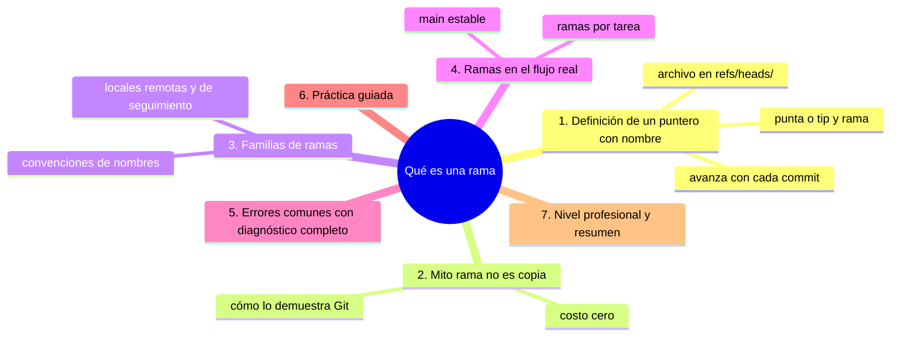
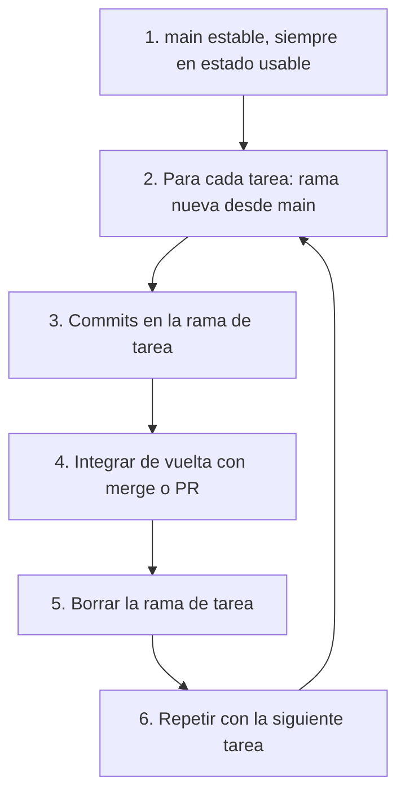

# Qué es una rama

## Introducción

La rama es la herramienta de trabajo diario de Git: te permite desarrollar una función, corregir un error o experimentar sin tocar la línea principal del proyecto. Si el commit es un nodo y el grafo es la red, **la rama es un nombre que apunta a un nodo** —y que camina contigo cada vez que commiteas.

En este capítulo no haces clics: defines conceptos. Verás qué es realmente una rama (spoiler: es un archivo de texto de 41 bytes), por qué crearla es gratis, cómo convive con HEAD y por qué el flujo moderno gira entorno a ellas.

En este capítulo aprenderás:

* la definición precisa de rama y punta (tip);
* la diferencia entre rama y copia (mito derrumbado);
* ramas locales, remotas y de seguimiento (vista previa);
* convenciones de nombres y flujos típicos;
* errores comunes con diagnóstico completo, práctica guiada y nivel profesional.

---

## Mapa conceptual de este capítulo



---

## 1. Definición: un puntero con nombre

### 1.1. La verdad mecánica

```bash
cat .git/refs/heads/main      (Windows: type)
```

```text
Salida:  a3f9c21ab3d4e5f6a7b8c9d0e1f2a3b4c5d6e7f8a9

   │
   ├── una rama es un ARCHIVO DE TEXTO de 41 bytes
   │   (hash + salto de línea) en .git/refs/heads/
   │
   ├── no contiene archivos, historial ni «cosas»:
   │   solo una DIRECCIÓN a un commit
   │
   └── por eso crear/borrar/renombrar rama es instantáneo
```

### 1.2. Puntas y avance

```text
Estado inicial:
   A ← B ← C
             ↑
          main (rama = punta actual)

Commiteas:
   A ← B ← C ← D
                ↑
             main (el puntero CAMINÓ a D)

   │
   ├── la rama no «contiene» D: D existe porque lo
   │   creaste; main solo señala a D
   │
   └── HEAD → main → D (la cadena completa: sección 07
       de la sección anterior)
```

### 1.3. Puntas (tip)

```text
   │
   ├── punta/tip = el commit más reciente de una rama
   │
   ├── «avanzar la rama» = apuntar su punta a un commit
   │   nuevo (o a otro existente, si haces eso)
   │
   └── varias ramas pueden compartir punta (dos nombres,
       un nodo) hasta que diverjan
```

---

## 2. Mito: rama ≠ copia

### 2.1. Lo que la gente cree

```text
Idea errónea (de otros VCS clásicos):
   "crear rama = duplicar todos los archivos en otra
    carpeta / otra versión completa"

Costo real en Git:
   · escribir un archivo de 41 bytes
   · tiempo: milisegundos
   · espacio: 41 bytes
```

### 2.2. La demostración

```bash
git branch demo-ramas          # solo eso
ls .git/refs/heads/
git branch                     # aparece en la lista
git switch -c demo2            # crea Y cambia
```

1. No se copió contenido: los blobs y trees se REUTILIZAN (sección 09 de la sección anterior).
2. Tu carpeta solo cambia cuando cambias de rama (y solo en los archivos que difieren).

### 2.3. Por qué importa este mito

```text
   │
   ├── si crees que «cuesta», no crearás ramas y
   │   trabajarás todo en main → historial sucio
   │
   ├── la verdad invita al flujo sano:
   │   una rama por tarea, aunque sea pequeña
   │
   └── borradores personales: guárdalos en ramas, no
       en la memoria
```

---

## 3. Familias de ramas

### 3.1. Locales, remotas, seguimiento

```text
Tipo            Nombre                  Vive en
────────────────────────────────────────────────────────
local           main, feature-x         tus refs/heads
remota          origin/main             tus refs/remotes
                (copia del remoto)      (tras fetch)
seguimiento     tu feature-x →          config local:
                origin/feature-x        rama apunta y
                                        «sabe» su pareja
```

```bash
git branch -a          # locales y remotas (con -a)
git branch -vv         # locales + seguimiento (vv = muy
                       # detallado)
```

### 3.2. Convenciones de nombres

```text
Patrones comunes (el equipo decide; lo importante es
ser coherente y legible):
   │
   ├── feature/nombre-del-modulo
   ├── fix/issue-123
   ├── bugfix/login-2fa
   ├── docs/guia-entrada
   ├── hotfix/produccion-urgente
   │
   └── en español o inglés: lo que el equipo entienda;
       sin espacios ni caracteres exóticos (los guiones
       y barras son seguros)
```

### 3.3. main (o master) como rama por defecto

```text
   │
   ├── nombre moderno: main (GitHub la crea así);
   │   repos antiguos: master — es OTRA rama, mismo
   │   concepto (cambiarla: sección 12)
   │
   └── su papel: línea principal integrada y (suele
       estar) protegida
```

---

## 4. Ramas en el flujo real

### 4.1. El patrón universal



```text
main ──────────────●──────────●──────────
                    \        /
feature-a ──────────●──●──●─
```

### 4.2. Qué NO va a main

```text
   │
   ├── experimentos a ciegas
   ├── trabajo a medias («luego lo remato»)
   └── pruebas de concepto

Todo eso vive en ramas; main solo recibe lo aprobado.
```

### 4.3. Trabajo solo vs. equipo

```text
Situación              Flujo
──────────────────────────────────────────────────────
un solo dev            ramas locales; merge directo a
                       main si no la protegen
equipo                 rama → push → Pull Request →
                       revisiones/checks → merge
open source            fork + rama + PR al upstream
```

---

## 5. Errores comunes con diagnóstico completo

### Error 1: Trabajar directo en main

**Qué ocurrió:** commits de prueba/incómodo en la rama principal; vergüenza al empujar.

**Por qué:** no se creó rama (por desconocimiento o prisa).

**Cómo comprobarlo:** `git log --oneline` + estado de la rama.

**Opciones:**
* sin publicar y si no importa reescribir: reset/rehacer (sección 11) o dejarlo y enderezar con disciplina;
* publicado en rama protegida: el remoto ya te habría frenado;
* si ya se integró: siguiente commit correcto (o revert si hace falta).

**Riesgos:** historial de main ensuciado, ramas de release complicadas.

**Solución:** rama antes de producir (raíz 26).

**Cómo se evita:** convención «nunca commiteo en main».

---

### Error 2: Creer que las ramas tardan o pesan

**Qué ocurrió:** evitación de ramas por miedo a coste/velocidad.

**Por qué:** mito de la copia (punto 2).

**Cómo comprobarlo:** `git branch x` + `count-objects` antes/después.

**Opciones:** crear ramas sin miedo.

**Riesgos:** el opuesto: todo en una rama gigante.

**Solución:** coste = 41 bytes.

**Cómo se evita:** práctica del punto 6.

---

### Error 3: «Creé la rama pero no la veo / sigo en main»

**Qué ocurrió:** `git branch x` no te cambió (correcto: solo crea); o `git branch` no muestra la remota sin fetch.

**Por qué:** confundir crear con cambiar; local vs. remota.

**Cómo comprobarlo:** `git branch` (locales), `git branch -a`, `git status` (rama activa).

**Opciones:** `git switch x` para cambiar; `git fetch` para ver remotas nuevas.

**Riesgos:** sensación de que «no funcionó».

**Solución:** crear ≠ cambiar; local ≠ remota.

**Cómo se evita:** recordar los dos comandos (siguiente capítulo: switch).

---

### Error 4: Dos ramas con el mismo nombre (local y remota confusas)

**Qué ocurrió:** cambios «duplicados» o PR desde la rama equivocada.

**Por qué:** no entender que `feature` (tuya) y `origin/feature` (copia del remoto) son entes distintos (la de allí solo se actualiza con fetch).

**Cómo comprobarlo:** `git branch -vv` (muestra su pareja); `git log feature..origin/feature`.

**Opciones:** sincronizar con fetch/pull; publicar con `-u` para enlazar.

**Riesgos:** confusiones de sincronía.

**Solución:** mapa local/remoto (sección 04/09).

**Cómo se evita:** `branch -vv` al empezar.

---

### Error 5: Nombres de rama malos

**Qué ocurrió:** `git push` falla por nombre (espacios, mayúsculas ambiguas, caracteres extraños); o historial de ramas inmantenible (`test1`, `test2-final-2`).

**Por qué:** sin convención.

**Cómo comprobarlo:** mensajes de Git; `git branch`.

**Opciones:** renombrar (`git branch -m vieja nueva`) si es local; acordar patrón en equipo.

**Riesgos:** colisiones en remoto, dolor al revisar.

**Solución:** convención simple y legible.

**Cómo se evita:** definirla en CONTRIBUTING.

---

### Error 6: Borrar rama «a la buena de Dios» (con trabajo dentro)

**Qué ocurrió:** `git branch -d` falla o (con -D) se pierden commits no integrados.

**Por qué:** no saber que -d protege y -D fuerza.

**Cómo comprobarlo:** el aviso de Git («not fully merged»).

**Opciones:**
* -d: seguro (Git se niega si no está integrada);
* -D: solo si estás SEGURO (reflog como red de seguridad);
* si quedaron commits «perdidos»: `git log` desde el hash o reflog, luego cherry-pick/merge.

**Riesgos:** pérdida de trabajo (recuperable poco tiempo).

**Solución:** -d por defecto; -D con motivo escrito.

**Cómo se evita:** integrar ANTES de borrar; revisar con `log <rama>` («¿qué traería?»).

---

## 6. Práctica guiada

### Objetivo

Crear y observar ramas como lo que son: puntas que caminan.

### Paso 1: lista actual

```bash
git branch
git branch -a
cat .git/refs/heads/main       (o type)
```

1. Anota el hash de main.

### Paso 2: crea una rama sin cambiar

```bash
git branch demo-concepto
git branch
ls .git/refs/heads/            # aparece el archivo
cat .git/refs/heads/demo-concepto   # ¿mismo hash que
                                    # main? (sí)
```

### Paso 3: avanza la rama con un commit

```bash
git switch demo-concepto
# pequeño cambio + add + commit
cat .git/refs/heads/demo-concepto   # hash NUEVO
cat .git/refs/heads/main            # hash viejo
git log --graph --oneline --all -n 6
```

1. main NO se movió; demo-concepto caminó.

### Paso 4: dos nombres, un nodo

```bash
git branch gemela main
git log --graph --oneline --decorate -n 3
```

1. Observa ambas etiquetas en el mismo nodo.

### Paso 5: vista de seguimiento (muestra)

```bash
git branch -vv
```

1. Si no hay parejas remotas: aparecen sin «origin/…»; con ellas (tras push -u): verás la columna de seguimiento.

### Paso 6: borra con seguridad

```bash
git switch main
git branch -d demo-concepto       # si no está integrado,
                                  # Git se NIEGA (¡bien!)
git branch -d gemela              # sí la borra (punta
                                  # compartida)
```

### Resultado esperado

Certeza de que una rama es solo un puntero: crearla no copia nada, avanza con commits y se borra en milisegundos.

### Conclusión esperada

Las ramas son el mecanismo barato que hace posible el flujo moderno: experimenta sin miedo, integra con criterio y borra sin drama.

### Ejercicio de transferencia

En un repositorio real (o simulado con un segundo clon), aplica el patrón universal a una tarea pequeña de verdad: crea la rama, haz dos commits, intégrala y bórrala. Entrega el `git log --graph --oneline` final y la salida de `cat .git/refs/heads/<rama>` antes y después de cada commit, con una frase que explique por qué crear la rama no ralentizó nada.

---

## 7. Nivel profesional + resumen

### 7.1. Disciplina de ramas en equipos

```text
   │
   ├── rama por unidad de trabajo (issue/PR), no por día
   │
   ├── vida corta: cuanto más vive una rama, más
   │   conflictos acumula (sección 10)
   │
   ├── integrar a diario (no «la rama de tres semanas»)
   │
   └── nombrar con el «porqué» (issue, módulo, no
       «prueba»)
```

### 7.2. Ramas como política

```text
   │
   ├── main protegida + CI = calidad obligatoria
   ├── ramas de release (release/1.2) donde aplique
   ├── ramas de soporte para versiones viejas (con
   │   merges de vuelta) — solo si el producto lo pide
   └── todo eso son REFERENCIAS: la política es de
       gente y proceso, no de Git
```

### 7.3. Resumen

En este capítulo aprendiste que:

* una rama es un puntero con nombre (archivo en `refs/heads/`) que señala a un commit y avanza con cada commit tuyo en ella;
* crear ramas no copia nada: 41 bytes y milisegundos; el contenido se comparte (blobs/trees reutilizados);
* conviven ramas locales, remotas (`origin/*`) y parejas de seguimiento (`-u`, `branch -vv`);
* el flujo universal: main estable → rama por tarea → integrar → borrar;
* los errores típicos (trabajar en main, miedo al coste, confundir crear/cambiar, nombres malos, borrados precipitados) se resuelven con la definición correcta y convenciones de equipo;
* a nivel profesional: ramas cortas, nombradas por tarea y con política de integración frecuente.

La idea principal es:

> **Una rama no es una versión del proyecto: es un nombre que dice «aquí estoy» —y por eso crearla es gratis y usarla, obligatorio.**

---

## Autopreguntas de cierre

Sin mirar el material, responde mentalmente y luego compruébalo con este capítulo:

1. Si `git branch feature` no copia nada, ¿dónde está «guardada» la rama y por qué desaparece al borrarla?
2. ¿Por qué dos ramas pueden apuntar al mismo commit y qué tiene que ocurrir para que dejen de hacerlo?
3. ¿Qué argumento usarías para defender delante de un compañero crear una rama para una tarea de dos horas, con el costo real en la mano?
4. ¿Qué diferencias prácticas hay entre `origin/main` y tu `main` local cuando trabajas sin conexión?
5. ¿Qué paso del patrón universal evita que `main` reciba trabajo a medias y por qué es el más difícil de sostener en equipo?
6. Cuando Git se niega a borrar una rama con `-d`, ¿qué te está diciendo exactamente y cómo averiguas si tiene razón?

---

## Próximo paso

Ya sabes qué es una rama.

El siguiente paso es crearlas con el comando adecuado.

Continúa con:

[`02-crear-rama.md`](02-crear-rama.md)
