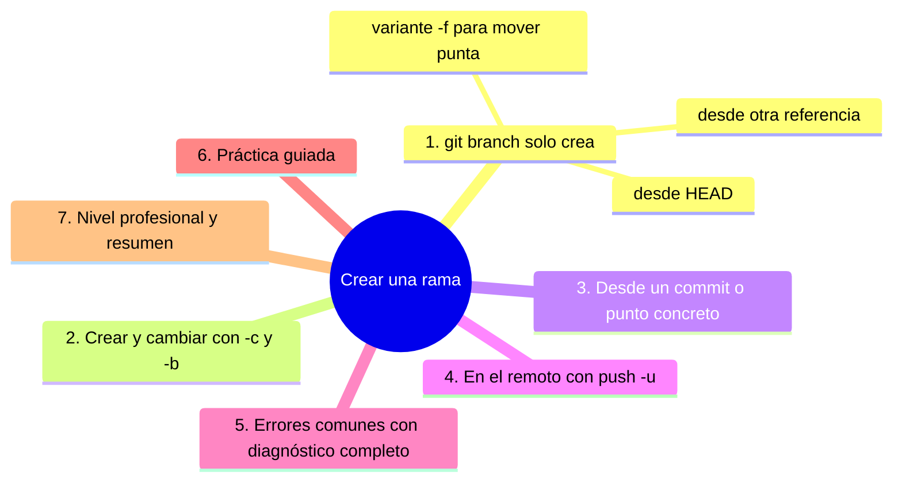
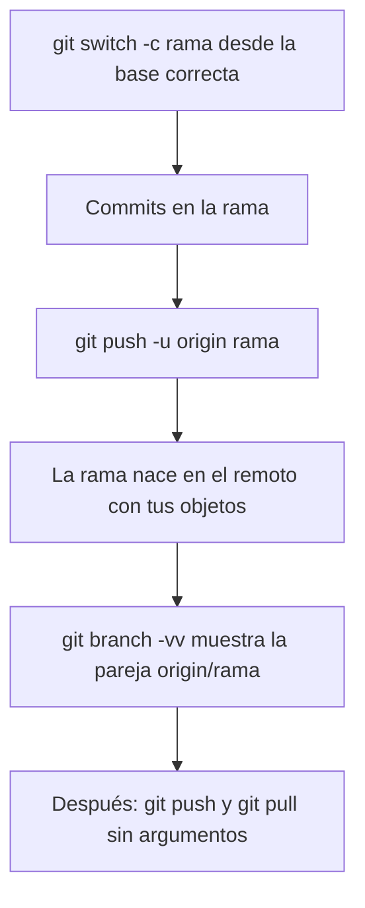

# Crear una rama

## Introducción

Crear ramas es la operación más barata y más subutilizada de Git: un comando, milisegundos, 41 bytes. En este capítulo ves las formas de crear una rama, desde la más simple hasta crear-y-cambiar en un solo paso, además de cómo duplicar una rama existente y qué NO crea una rama (el remoto esperará a tu push).

Dominar este gesto es el umbral del flujo por ramas: a partir de aquí, cada tarea nueva empieza aquí.

En este capítulo aprenderás:

* `git branch` en todas sus variantes útiles;
* crear + cambiar de una vez (`git switch -c` y `git checkout -b`);
* crear desde un commit o referencia distinta;
* crear la rama remota y enlazar seguimiento (vista previa);
* errores comunes con diagnóstico completo, práctica guiada y nivel profesional.

---

## Mapa conceptual de este capítulo



---

## 1. `git branch` (solo crea)

### 1.1. Desde HEAD (lo habitual)

```bash
git branch feature-login
```

```text
   │
   ├── crea refs/heads/feature-login con el hash al que
   │   apunta HEAD AHORA
   │
   ├── NO te cambia (sigues en la rama anterior)
   │
   └── también: git branch (sin argumentos) = listar
```

### 1.2. Listar con información

```bash
git branch                  # lista simple; * = activa
git branch -v               # + último commit de cada una
git branch -vv              # + seguimiento remoto
git branch -a               # + remotas (origin/…)
```

```text
Salida típica -vv:
* main        a3f9c21 Añade ejercicios   [origin/main]
  feature-x   7b21d04 Primer avance
   │             │              │            │
   activa     punta actual   su mensaje   pareja remota
```

### 1.3. `git branch -f` (mover punta a mano)

⚠️ **RIESGO:** al mover el puntero a mano, los commits que cubría esa rama dejan de tener nombre: quedan huérfanos y solo el reflog los conserva un tiempo.

```bash
git branch -f feature-x a3f9c21
```

```text
   │
   ├── mueve el nombre a otro commit SIN cambiar tu
   │   HEAD ni tu carpeta
   │
   ├── cuidado: si la rama tenía commits «atrás» de la
   │   nueva punta, dejan de estar en esa rama (solo
   │   reflog los recuerda)
   │
   └── uso: arreglos puntuales; en día a día casi
       siempre usas switch/checkout o reset (sección 11)
```

---

## 2. Crear y cambiar: `-c` / `-b`

### 2.1. `git switch -c` (forma moderna)

```bash
git switch -c feature-login
```

```text
   │
   ├── crea refs/heads/feature-login desde HEAD
   ├── apunta HEAD a la rama nueva
   └── actualiza tu carpeta (como cualquier switch)
```

### 2.2. `git checkout -b` (forma clásica)

```bash
git checkout -b feature-login
```

```text
   │
   ├── hace lo mismo: crear + cambiar
   │
   ├── checkout es el comando histórico con MUCHOS
   │   usos (restaurar, cambiar, crear…); por eso Git
   │   moderno separa: switch (ramas) + restore
   │   (archivos) — lo vemos en los dos próximos
   │   capítulos
   │
   └── las dos formas conviven: elige la que el equipo
       use y sé coherente
```

### 2.3. ¿Cuándo cada una?

```text
Objetivo                        Comando
──────────────────────────────────────────────────────
solo crear (cambias luego)      git branch nombre
crear + cambiar (lo habitual)   git switch -c nombre
misma idea en clásico           git checkout -b nombre
```

---

## 3. Desde un commit o punto concreto

### 3.1. Partir de otro punto

```bash
git switch -c fix-antiguo a3f9c21
git branch reparacion HEAD~3
git checkout -b desde-tag v1.0
```

```text
   │
   ├── la nueva rama apunta al punto indicado
   │   (no a HEAD)
   │
   └── usos: hotfix desde un release viejo, revisitar
       un commit, ramificar desde otra rama
```

### 3.2. Partir de una rama remota

```bash
git switch feature-x
# Git moderno: si existe origin/feature-x y no hay
# local, la crea y enlaza el seguimiento sola

# forma explícita:
git switch -c feature-x --track origin/feature-x
git branch --set-upstream-to=origin/main main
```

(El seguimiento en detalle: capítulo 10.)

### 3.3. Duplicar otra rama local

```bash
git branch copia feature-x
```

1. `copia` apunta al mismo commit que `feature-x` (dos nombres, un nodo; divergirán si commiteas en una).

---

## 4. En el remoto: `push -u`

```bash
git switch -c feature-login
# ... commits ...
git push -u origin feature-login
```

```text
Qué hace -u (--set-upstream):
   │
   ├── crea la rama feature-login EN el remoto (con
   │   tus objetos)
   │
   └── configura localmente: tu feature-login →
       origin/feature-login (seguimiento)
       ⇒ después: git push / git pull sin argumentos

Sin -u, el primer push necesitas decir destino:
git push origin feature-login
```



---

## 5. Errores comunes con diagnóstico completo

### Error 1: «Ya existe una rama con ese nombre»

**Qué ocurrió:** `git branch feature-x` cuando ya hay una local (o remota visible con ciertos flujos).

**Por qué:** nombre repetido.

**Cómo comprobarlo:** `git branch -a`.

**Opciones:**
* elige otro nombre;
* si la vieja no sirve: bórrala (capítulo 08) con seguridad;
* si necesitas el MISMO nombre en otra base: es un caso raro (borrar y recrear, o -f con conciencia).

**Riesgos:** usar `-f` a la ligera (ver capítulo/punto 1.3).

**Solución:** nombre nuevo o limpieza deliberada.

**Cómo se evita:** `branch -vv` antes de crear; convención de nombres descriptivos.

---

### Error 2: «No puedo empujar / no aparece en GitHub»

**Qué ocurrió:** creaste la rama local, la subiste… y en GitHub no la ves (o push pide destino).

**Por qué posibles:**
* no hiciste push (crear es local);
* no dijiste destino la primera vez;
* error de permisos.

**Cómo comprobarlo:** `git status` (¿«has no upstream branch»?), `git remote -v`, mensajes.

**Opciones:** `git push -u origin <rama>`.

**Riesgos:** creer que «push crea todo» sin verificar.

**Solución:** flujo: switch -c → commits → push -u.

**Cómo se evita:** ritual de publicación.

---

### Error 3: Crear la rama desde el punto equivocado

**Qué ocurrió:** la nueva rama arranca de un commit viejo/experimental («¿por qué diverge de main?»).

**Por qué:** estaba en otra rama o HEAD desconectado al crear.

**Cómo comprobarlo:** `git log --graph --oneline --all` (¿de dónde nace?).

**Opciones:**
* sin commits en la nueva: bórrala y recrea desde main (`git switch main; git switch -c …`);
* con commits: integrar o cherry-pick según convenga (secciones 10/15).

**Riesgos:** merges raros con ancestro inesperado.

**Solución:** siempre crear desde main/actual con `switch -c` estando donde toca.

**Cómo se evita:** `status` antes de crear (raíz 26).

---

### Error 4: Esperar que crear rama la publique

**Qué ocurrió:** equipo espera el trabajo; tu rama es local.

**Por qué:** no confundir local/remoto (lo mismo que Error 2, pero de expectativas).

**Cómo comprobarlo:** GitHub no la muestra; `git branch -a`.

**Opciones:** push -u.

**Riesgos:** demoras.

**Solución:** publicar al empezar o al terminar, según equipo.

**Cómo se evita:** flujo consciente local→remoto.

---

### Error 5: Creación fallida por HEAD en detached sin querer

**Qué ocurrió:** `git branch x` creó la rama en un commit raro (o el aviso de detached te confundió).

**Por qué:** HEAD apuntaba a hash (capítulo 07 de la sección 07).

**Cómo comprobarlo:** `cat .git/HEAD`; `log --graph --all`.

**Opciones:** recrear desde la rama correcta.

**Riesgos:** base extraña.

**Solución:** ubicarse (`git switch main`) y volver a crear.

**Cómo se evita:** comprobar rama activa al empezar.

---

### Error 6: Nombre que el remoto rechaza

**Qué ocurrió:** push falla con «prohibited»/«invalid refspec».

**Por qué posibles:** espacios/acentos, mayúsculas que chocan con política, nombres reservados, rama protegida.

**Cómo comprobarlo:** mensaje de Git/GitHub.

**Opciones:** `git branch -m nuevo-nombre` (renombrar local) y publicar con el válido.

**Riesgos:** tiempo perdido.

**Solución:** nombres ASCII simples con guiones.

**Cómo se evita:** convención escrita (punto 5.4 de «qué es una rama»).

---

## 6. Práctica guiada

### Objetivo

Practicar las tres formas de crear ramas y publicar la primera.

### Paso 1: crear sin cambiar

```bash
git branch solo-crear
git branch -v          # ¿aparece con el punta de main?
```

### Paso 2: crear y cambiar

```bash
git switch -c crear-cambiar
git status             # ahora estás en la nueva
# haz un commit pequeño
git log --oneline -n 2 # nace de main y avanza
```

### Paso 3: forma clásica

```bash
git switch main
git checkout -b forma-clasica
git branch -vv          # ¿dónde apunta cada una?
```

### Paso 4: crear desde otro punto

```bash
git branch desde-viejo HEAD~1
git log --graph --oneline --decorate --all -n 8
```

1. Localiza `desde-viejo` en el grafo.

### Paso 5: borrar las de prueba

⚠️ **RIESGO:** `git branch -D` borra la rama aunque tenga commits no integrados: esos commits quedan sin nombre (huérfanos) y solo el reflog los guarda un tiempo. Revisa `git log <rama>` antes de forzar.

```bash
git branch -d solo-crear forma-clasica desde-viejo
# la que tiene commits (crear-cambiar):
git branch -d crear-cambiar   # ¿-d la deja? (si no está
                              # integrada, se NIEGA)
git log crear-cambiar --oneline -n 3   # inspecciona
git branch -D crear-cambiar   # con conocimiento: fuerza
```

### Paso 6: publica una real (si tienes remoto)

```bash
git switch -c feature-primera
# pequeño commit
git push -u origin feature-primera
git branch -vv         # ahora con seguimiento [origin/…]
```

1. Comprueba en GitHub: la rama existe allí.

### Resultado esperado

Fluidez con `branch`, `switch -c`, `checkout -b`, creación desde puntos y publicación con `-u`.

### Conclusión esperada

Crear rama es un gesto de un segundo; la disciplina está en partir del punto correcto y publicar cuando toque.

### Ejercicio de transferencia

En un repositorio con una rama remota que no tienes localmente, crea tu rama desde un punto que no es HEAD (un tag o `HEAD~2`), publicala con `git push -u origin <rama>` y demuestra el enlace con `git branch -vv`. Entrega la salida de `branch -vv` y el enlace de la rama en GitHub, más una frase que explique por qué crear la rama no la publica.

---

## 7. Nivel profesional + resumen

### 7.1. Patrones de creación

```text
   │
   ├── desde la punta ACTUALIZADA de main:
   │      git switch main; git pull; git switch -c x
   │   (evita bases viejas → menos conflictos)
   │
   ├── rama efímera para probar algo: créala, pruébala,
   │   bórrala (-d) sin miedo
   │
   ├── plantillas/equipo: scripts crean rama desde issue:
   │      nombre = tipo-issue-descripción
   │
   └── ramas publicadas AL INICIO con -u: visibilidad
       temprana y backup desde el primer commit
```

### 7.2. Rama + protección desde el minuto cero

```text
   │
   ├── push -u activa seguimiento → pull/push sin args
   ├── si el remoto exige PR: la rama ya está «en el
   │   sistema» para abrirlo
   └── CI puede correr sobre ella desde su primer push
```

### 7.3. Resumen

En este capítulo aprendiste que:

* `git branch <nombre>` crea la rama sin moverte; `switch -c` / `checkout -b` crean y cambian en un paso;
* puedes crear desde cualquier referencia (commit, HEAD~n, otra rama, tag, rama remota);
* `-f` mueve puntas: poderoso y peligroso; el flujo normal no lo necesita;
* la rama REMOTA nace con `git push -u origin <rama>`, que además enlaza el seguimiento para trabajar sin argumentos;
* los errores típicos (nombre duplicado, no publicada, base equivocada, nombre rechazado) se diagnostican con `branch -a/-vv`, `status` y `log --graph`;
* a nivel profesional: crear desde main actualizado, publicar pronto y nombrar por tarea.

La idea principal es:

> **Crea ramas sin miedo y desde el punto correcto: es la operación más barata de Git y la que más orden trae a tu historial.**

---

## Autopreguntas de cierre

Sin mirar el material, responde mentalmente y luego compruébalo con este capítulo:

1. ¿Por qué `git branch nombre` no te cambia de rama y por qué eso se considera una ventaja?
2. Si creas la rama estando en la rama equivocada, ¿qué síntomas tendrás después y cómo los detectas con `git log --graph --decorate`?
3. ¿Qué aporta exactamente `git push -u origin <rama>` además de subir los commits?
4. ¿En qué se diferencia `git switch -c` de `git branch -f` si los dos terminan con un nombre apuntando a un commit?
5. ¿Por qué el mismo nombre puede existir a la vez en tu repositorio y en el remoto sin que eso sea un error?
6. Ante «ya existe una rama con ese nombre», ¿qué mirarías: `-a`, `-vv` o el reflog? Justifica la elección.

---

## Próximo paso

Ya sabes crearlas.

Ahora toca moverte entre ellas: cambiar de rama sin perder nada.

Continúa con:

[`03-cambiar-de-rama.md`](03-cambiar-de-rama.md)
