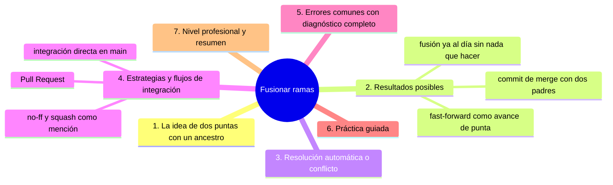
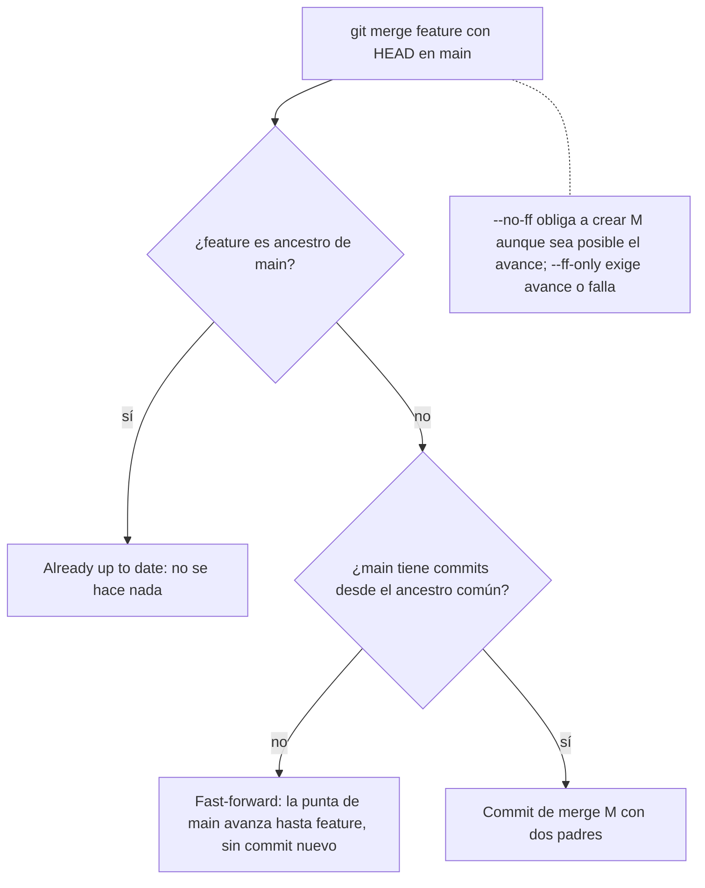

# Fusionar ramas

## Introducción

Fusionar (merge) es el acto de unir dos líneas de trabajo en una sola historia: tus commits de la rama de tarea vuelven a la línea principal. Es el punto donde el grafo crece —con un commit de dos padres o un avance de punta— y donde, a veces, aparecen los conflictos que tanto asustan.

En este capítulo de concepto (el siguiente dedica la orden `git merge`) verás QUÉ significa fusionar: los tipos de resultado (fast-forward, merge real, resolución automática), qué se le pide al sistema y cómo prepararte para que la unión sea limpia.

En este capítulo aprenderás:

* la semántica de unir dos puntas con ancestro común;
* fast-forward vs. commit de merge (y `--no-ff`);
* anarquía ordenada: qué fusiona limpio y qué genera conflicto;
* los flujos de integración (directo, PR, relevo);
* errores comunes con diagnóstico completo, práctica guiada y nivel profesional.

---

## Mapa conceptual de este capítulo



---

## 1. La idea: dos puntas, un ancestro común

```text
Antes:
   A ─── B ─── C            (main, puntal C)
             \
              D ─── E       (feature, puntal E)

   │
   ├── común: B (la bifurcación)
   ├── main tiene C («por su cuenta»)
   └── feature tiene D, E

Con merge (HEAD en main):
   A ─── B ─── C ──── M     (main ahora en M)
             \      /
              D ─── E

   M = merge commit, padres: C y E
```

```text
Qué «decide» Git al unir:
   │
   ├── el resultado contiene TODO lo de ambos lados
   │   (lo de main y lo de feature)
   │
   └── el ANCESTRO común sirve de referencia para
       saber qué cambió cada quien (three-way merge)
```

---

## 2. Resultados posibles

### 2.1. Fast-forward (avance de punta)

```text
Cuando: main NO tiene commits nuevos desde la bifurcación.

   A ─── B ─── C              (main en C)
                 \
                  D ─── E     (feature)

   merge feature → main simplemente APUNTA a E:

   A ─── B ─── C ─── D ─── E  (main en E, sin M nuevo)

   │
   ├── Git NO crea commit de merge: solo mueve el punta
   ├── linealidad perfecta
   └── en GitHub PR: «fast-forward merge» = botón
       que no añade nodo
```

### 2.2. Commit de merge

```text
Cuando: main avanzó (C) mientras feature crecía (D, E):
o cuando pides --no-ff.

   → se crea M con dos padres (como el diagrama 1)

   │
   ├── el grafo «guarda» que existió la rama
   │   (contexto: útil para auditar y para `log --follow`
   │   de merges)
   └── en GitHub: «Create a merge commit»
```

### 2.3. Nada que hacer (ya al día)

```text
Si feature es ancestro de main (o están en el mismo
commit):
   │
   ├── «Already up to date» (Git no hace nada)
   │
   └── caso normal tras fusión previa o ramas
       apuntando al mismo sitio
```



---

## 3. Resolución automática vs. conflicto

### 3.1. La unión se resuelve sola cuando…

```text
   │
   ├── cambiaron archivos DISTINTOS
   │
   ├── cambiaron líneas DISTINTAS del mismo archivo
   │
   └── uno tocó y el otro no
       → Git combina y sigue
```

### 3.2. Conflicto cuando…

```text
   │
   ├── ambos tocaron el MISMO tramo (muy cerca)
   │
   ├── uno añadió y otro borró el mismo sitio
   │
   └── cambios de estructura (mismo nombre/archivo)

Entonces Git PARA y te pide elegir (marcadores <<<<<<<
=======>>>>>>>); tú resuelves, `git add` por archivo y
completas el merge (capítulo 07 + sección 10).
```

### 3.3. Ansiedad: conflicto no es error

```text`
   │
   ├── es Git diciendo «aquí hay que decidir, humana»
   │
   ├── rama VIVA y corta → conflictos pequeños
   ├── rama muerta de 3 semanas → conflicto monstruo
   │
   └── prevención: integrar a menudo (pull en main,
       merges cortos)
```

---

## 4. Estrategias y flujos de integración

### 4.1. Integración directa (un dev)

```text
git switch main; git pull
git switch -c tarea; ...commits...
git switch main; git merge tarea
git push
```

### 4.2. Integración por Pull Request (equipo)

```text
   │
   ├── push de la rama → PR → revisiones + checks
   ├── GitHub ofrece: merge commit, squash o rebase
   │   (política del repo)
   │
   └── el merge ocurre en el SERVIDOR; tu local
       solo baja el resultado (pull)
```

### 4.3. Opciones de forma (mención)

```text
Opción        Efecto                       Cuándo
──────────────────────────────────────────────────────
--no-ff       fuerza commit de merge       conservar «hubo
                                           rama» (versionado,
                                           release)
--ff-only     solo fast-forward (¿si no?   integraciones
              falla)                        limpias y simples
squash        toda la rama → UN commit     historial de main
(Pr/flag)     (en GitHub es opción del PR)  muy limpio
rebase + ff   historia lineal sin M        políticas
                                           «lineales»
(17)
```

---

## 5. Errores comunes con diagnóstico completo

### Error 1: Merge en la rama equivocada

**Qué ocurrió:** fusionaste «al revés» (feature sobre main cuando querías main sobre feature) o en otra rama.

**Por qué:** HEAD no estaba donde creías.

**Cómo comprobarlo:** `git status` («on branch …»); `git log --graph --decorate`.

**Opciones:**
* sin publicar: `git reset --hard` al estado previo (sección 11; con cuidado) o `git merge --abort` si sigue en curso;
* publicado: revert o asumir (depende del equipo).

**Riesgos:** historia confusa; en la práctica, equívocos de reversa son comunes y poco graves.

**Solución:** status + «¿en qué rama estoy y cuál va hacia dónde?» antes de merge.

**Cómo se evita:** frase literal en voz alta: «traigo feature A dentro de main».

---

### Error 2: «Already up to date» y el trabajo «no aparece»

**Qué ocurrió:** `git merge feature` dice nada que hacer… ¿y mi trabajo?

**Por qué posibles:**
* feature es ancestro de main (ya lo tenías);
* estabas en feature (te fusionaste contigo mismo);
* el trabajo está en OTRO branch/remoto sin traer.

**Cómo comprobarlo:** `git log main..feature` (¿commits que trae?); `status`.

**Opciones:** ubicar la rama correcta; fetch/pull si es remota.

**Riesgos:** creer que Git ignoró cambios.

**Solución:** leer `log a..b` antes y después de merge.

**Cómo se evita:** entender ancestría (punto 1).

---

### Error 3: Conflictos en bloqueo (paralización)

**Qué ocurrió:** merge pausado con marcadores; «ya no puedo trabajar».

**Por qué:** cambios solapados + rama larga.

**Cómo comprobarlo:** `git status` («Unmerged paths»); `git diff` muestra marcadores.

**Opciones:**
* resolver (sección 10 da el método completo);
* `git merge --abort` para cancelar y volver como estaba;
* si el merge sigue: `git status` siempre te dice dónde estás (merging).

**Riesgos:** dejar marcadores commiteados (ver Error 4).

**Solución:** método: leer → editar → add → commit.

**Cómo se evita:** integrar a menudo; traer main a la rama con frecuencia.

---

### Error 4: Commitear con marcadores de conflicto

**Qué ocurrió:** llegó a main un archivo con `<<<<<<<`.

**Por qué:** se dio a `add`/`commit` sin cerrar bien la resolución (o CI no estaba).

**Cómo comprobarlo:** `git grep -n "<<<<<<<"` (buscador); revisión.

**Opciones:** corregir en commit inmediato (o revert del merge si es grave y ya salió).

**Riesgos:** build roto en producción.

**Solución:** rito: `git diff --check` antes de terminar (detecta restos); CI obligatorio (sección 21).

**Cómo se evita:** nunca dar por cerrado un merge sin revisión final del diff.

---

### Error 5: Pierden el trabajo de la rama tras merge («solo fue ff»)

**Qué ocurrió:** en fast-forward, creyeron que «se movió todo» y luego borraron la rama con `-D`… y resulta que no había merge real (si no estaba integrada, -d se negó; con -D a la ligera se pierden).

**Por qué:** confusión entre mover punta e integrar contenido.

**Cómo comprobarlo:** `git log main --graph` (¿hay M? ¿o solo avance?); reflog.

**Opciones:** recuperar por reflog/cherry-pick (sección 11/15).

**Riesgos:** pérdida temporal de commits.

**Solución:** tras merge, comprobar `log main..tarea` vacío («todo integrado») ANTES de borrar.

**Cómo se evita:** rutina: merge → log a..b → -d (capítulo 08).

---

### Error 6: Fusionar historias «ajenas» sin entender (merge de weirdos)

**Qué ocurrió:** un merge con ancestro inesperado (grafo extraño) que nadie entiende.

**Por qué:** merges de ramas que no debían unirse, o repos «heredados».

**Cómo comprobarlo:** `git log --graph --all`; mensajes de merge.

**Opciones:** investigar con graph; a veces se asume (es historia); a veces revert+reintegrar bien.

**Riesgos:** comprensión perdida del historial.

**Solución:** flujo con PRs (alguien revisa antes).

**Cómo se evita:** no fusionar «por probar» en ramas compartidas.

---

## 6. Práctica guiada

### Objetivo

Provocar los tres resultados (ff, merge real, ya al día) y reconocerlos.

### Paso 1: fast-forward

```bash
git switch main
git switch -c ff-demo
# 2 commits
git switch main
git merge ff-demo
git log --graph --oneline -n 6
```

1. ¿Hubo nodo M o solo avance? (Solo avance.)

### Paso 2: merge real

```bash
git switch -c rama-x main
# commit A en rama-x
git switch main
# commit B en main (archivo distinto)
git merge rama-x
git log --graph --oneline --decorate -n 8
```

1. Aparece M con dos padres: `git cat-file -p HEAD`.

### Paso 3: ya al día

```bash
git merge rama-x      # otra vez
# "Already up to date."
```

### Paso 4: resolución automática

```bash
git switch -c auto1 main   # edita archivo-1
git switch main            # edita archivo-2
git merge auto1            # ¡merge limpio sin avisos!
```

### Paso 5: conflicto provocado

```bash
git switch -c conflicto main
# en el MISMO archivo y MISMAS líneas: ambos cambios
git switch main            # cambia esas mismas líneas
git merge conflicto         # ← conflicto
git status                 # unmerged paths
git merge --abort          # cancela limpio (otra vez)
```

1. No resuelvas aún: se practica en la sección 10; aquí solo provoca y aborta.

### Paso 6: integridad de la integración

```bash
git log main..rama-x --oneline   # ¿queda algo?
git branch -d rama-x              # si vacío: -d deja
```

### Resultado esperado

Capacidad de reconocer, en el grafo, qué tipo de fusión acabó de ocurrir y de comprobar que NADA quedó fuera.

### Conclusión esperada

Fusionar es la reunión de dos puntas con su ancestro: a veces avanza sin más, a veces deja constancia (M) y a veces discute (conflicto) — y tú diriges.

### Ejercicio de transferencia

En un repositorio con dos ramas de práctica, provoca los tres resultados (fast-forward, merge con commit de merge y «already up to date») y captura `git log --graph --oneline` de cada uno. Entrega las tres salidas y explica, leyendo el grafo, cómo identificarías cada resultado sin haber visto el mensaje de Git.

---

## 7. Nivel profesional + resumen

### 7.1. Políticas de integración sanas

```text
   │
   ├── main siempre integrable (CI verde)
   ├── integrar ≥ 1 vez/día (rama viva corta)
   ├── PRs obligatorios en main compartida
   ├── revisar el DIFF DEL MERGE (no solo el de la rama)
   └── elegir y documentar: ff-only, merge commit o
       squash (repo → Settings / CONTRIBUTING)
```

### 7.2. Higiene del grafo

```text
   │
   ├── merge commits con mensaje útil (Git pone el
   │   default; en releases conviene mejor)
   │
   ├── evitar «megamerges» de 40 archivos: parte la
   │   rama en PRs pequeños
   │
   └── si la rama vive mucho: trae main con frecuencia
       (merge main→rama o rebase, sección 17) para
       que el conflicto final sea pequeño
```

### 7.3. Resumen

En este capítulo aprendiste que:

* fusionar une dos puntas respecto a su ancestro común (three-way): el resultado contiene ambos lados;
* los tres desenlaces: fast-forward (solo mueve punta), commit de merge (dos padres, constancia) y «already up to date»;
* la resolución es automática cuando no hay solape; si lo hay, Git pausa y tú decides (sección 10);
* flujos: integración directa (un dev) o PR (equipo); formas: ff, --no-ff, squash, rebase — políticas de equipo;
* los errores típicos (rama equivocada, ff malinterpretado, conflictos paralizantes, marcadores commiteados, borrado prematuro) se prevén con status, `log a..b`, `diff --check` y CI;
* a nivel profesional: main integrable siempre, ramas cortas y revisar el diff final de la unión.

La idea principal es:

> **Un merge no es «pegar archivos»: es unir historias con respecto a su ancestro —y la calidad de la unión depende de lo corta y viva que estuvo la rama.**

---

## Autopreguntas de cierre

Sin mirar el material, responde mentalmente y luego compruébalo con este capítulo:

1. ¿Qué información usa Git para saber qué cambió cada lado si no hubiera ancestro común?
2. ¿Por qué un fast-forward no deja constancia de que existió una rama y cuándo eso importa?
3. Si `git merge` dice «Already up to date» y tú esperabas ver trabajo nuevo, ¿qué tres comprobaciones harías?
4. ¿Qué cambia, respecto a la probabilidad de conflicto, entre ramas de un día y una rama abierta hace tres semanas?
5. ¿Por qué revisar el diff del merge es distinto (e incluso más importante) que revisar el diff de la rama?
6. En un equipo que integra con PRs, ¿quién ejecuta el merge y qué debe bajar tu local después?

---

## Próximo paso

Ahora la orden que lo hace posible: `git merge`.

Continúa con:

[`07-git-merge.md`](07-git-merge.md)
