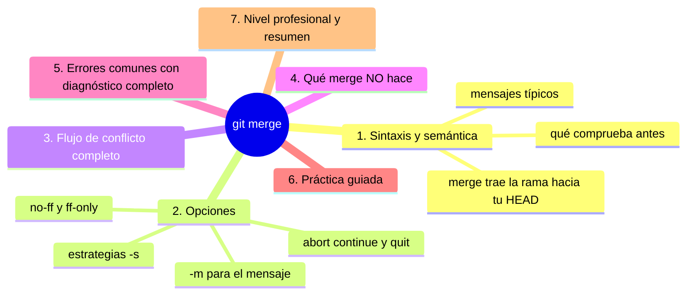
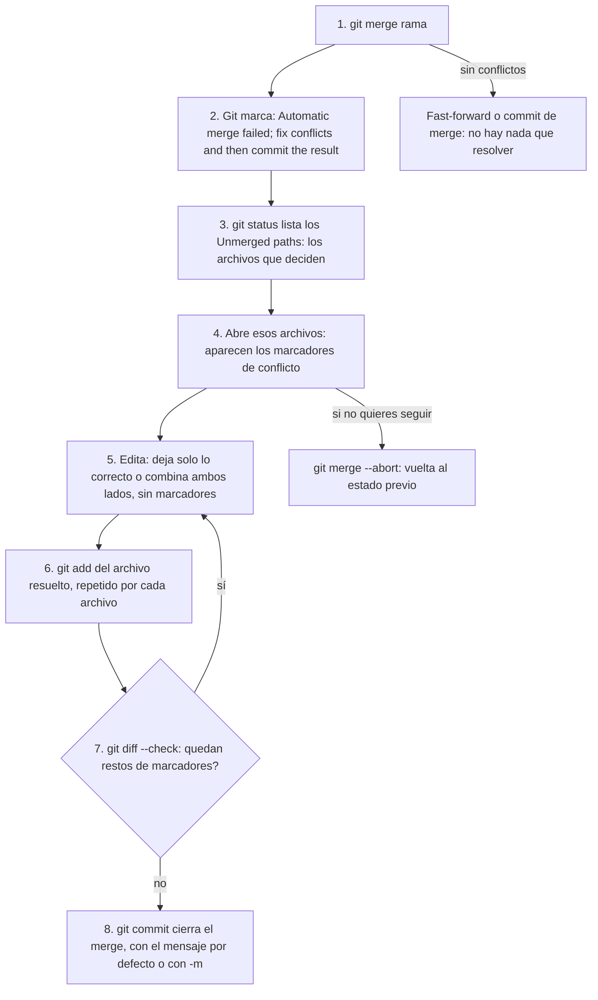

# git merge

## Introducción

`git merge` es la orden que ejecuta la fusión: unir el trabajo de otra rama en la que tienes ahora mismo. Como viste en el capítulo anterior, el resultado puede ser un fast-forward, un commit de merge o una pausa con conflictos; aquí tomas la orden por completo: sintaxis, opciones de forma (`--no-ff`, `--ff-only`, `--abort`), el flujo de conflicto paso a paso y los límites de lo que merge hará por ti.

En este capítulo aprenderás:

* sintaxis y semántica de `git merge <rama>`;
* opciones de integración y de cancelación;
* el flujo completo de conflicto con merge (marcadores → add → commit);
* qué merge NO hace (no empuja, no elimina rama, no respeta staging sucio);
* errores comunes con diagnóstico completo, práctica guiada y nivel profesional.

---

## Mapa conceptual de este capítulo



---

## 1. Sintaxis y semántica

### 1.1. La orden

```bash
git merge feature-login
```

```text
Semántica: «trae los cambios de feature-login AQUÍ»
   │
   ├── HEAD (tu rama) es el destino
   ├── <rama> es la fuente
   │
   └── NUNCA al revés: git merge main estando en
       feature = traer main a feature (también válido,
       otro propósito)
```

### 1.2. Qué comprueba antes

```text
Precondiciones de merge
──────────────────────────────────────────────
1. ¿merge en curso ya? (¡a una sola vez!)
2. ¿index/árbol limpio? (cambios sucios bloquean si
   interfieren)
3. ¿la fuente existe? (rama/hash/tag…)
4. ¿hay ancestro común? (si no: puede pedir --allow-
   unrelated-histories — casos raros de repos unidos)
```

### 1.3. Mensajes típicos

```text
Mensaje                     Significado
──────────────────────────────────────────────────────────
Fast-forward                solo movió tu punta
Merge made by the 'ort'…    creó commit M (resolución
                            automática por estrategia ort)
Automatic merge failed      ¡conflicto! estás en «merging»
Already up to date          nada que traer
```

---

## 2. Opciones

### 2.1. Forma del resultado

```bash
git merge --ff-only feature     # solo si es ff; si no,
                                # FALLA (estilo estricto)
git merge --no-ff feature       # SIEMPRE crea M
git merge feature               # default: ff si puede
```

```text
Cuándo cada uno
   │
   ├── --ff-only: integraciones donde la rama solo
   │   avanzó (pull de main en equipo con rebase/ff)
   │
   ├── --no-ff: conservar la constancia «hubo rama»
   │   (releases, políticas que auditan integraciones)
   │
   └── default: cómodo; produce grafos mixtos según
       el caso
```

### 2.2. Cancelar y continuar

```bash
git merge --abort         # como estaba antes del merge
git merge --quit          # abandona el estado pero deja
                          # resoluciones donde estaban
git merge --continue      # (tras resolver: seguir; en
                          # la práctica suele usarse
                          # git commit para cerrarlo)
git merge -m "Mensaje"    # mensaje del commit de merge
```

### 2.3. Estrategias (mención)

```bash
git merge -s recursive feature   # la clásica
git merge -s ours feature        # «guardo quién manda»
# la moderna 'ort' es el default en Git reciente
```

```text
   │
   ├── -s ours: trae «estructura» sin contenido ajeno
   │   (usos: políticas especiales de integración)
   │
   └── para el día a día: déjalo en default
```

---

## 3. Flujo de conflicto completo



```text
Marcadores dentro del archivo (detalle del paso 4):

<<<<<<< HEAD
tu versión (tu rama)
=======
su versión (la rama)
>>>>>>> rama
```

```text
Trucos
   │
   ├── git diff --name-only --diff-filter=U  → solo
   │   los pendientes
   ├── herramientas: git mergetool (tres paneles)
   └── muy perdido: git merge --abort (volver a casa)
```

---

## 4. Qué merge NO hace

```text
   │
   ├── NO hace push: el remoto no se entera hasta que
   │   empujas
   │
   ├── NO borra la rama fuente: sigue ahí (borrada es
   │   tu decisión: capítulo 08)
   │
   ├── NO respeta trabajo sucio que entre en conflicto
   │   (se niega: termina con lo sucio o stash)
   │
   ├── NO funciona con otro merge en curso a la vez
   │
   └── NO «arregla» historia antigua: solo une puntas
       presentes
```

---

## 5. Errores comunes con diagnóstico completo

### Error 1: Merge fallido por cambios sucios

**Qué ocurrió:** «Please commit your changes or stash them before you merge».

**Por qué:** tienes trabajo sin preparar/commitear que choca con lo que merge traería.

**Cómo comprobarlo:** `git status`.

**Opciones:** commit / stash / restore si se pierde a propósito.

**Riesgos:** ninguno (Git te protege).

**Solución:** limpiar antes de integrar.

**Cómo se evita:** status ritual (otra vez).

---

### Error 2: Merge en dirección contraria

**Qué ocurrió:** querías traer feature a main y acabaste trayendo main a feature (o fusionaste sobre la rama equivocada).

**Por qué:** HEAD no era la que creías.

**Cómo comprobarlo:** `status`; `log --graph --decorate`.

**Opciones:** si no publicado y no quieres el resultado: `git merge --abort` si sigue en curso; si ya terminó: `reset --hard` al punto previo (sección 11, con cuidado) o revert.

**Riesgos:** grafo con merges inesperados (fastidio, no tragedia).

**Solución:** frase explícita antes de ejecutar: «estoy en X, traigo Y».

**Cómo se evita:** `status` + lógica del punto 1.1.

---

### Error 3: Conflicto y pánico (dejarlo a medias)

**Qué ocurrió:** se fue la luz / se fue la persona y el repo queda «merging» para siempre.

**Por qué:** conflicto sin resolver.

**Cómo comprobarlo:** `git status` («You have unmerged paths»).

**Opciones:**
* continuar (sección 3);
* cancelar: `git merge --abort`.

**Riesgos:** repo atascado (bloquea cambios de rama).

**Solución:** cualquier camino de los dos es válido: resolver o abortar.

**Cómo se evita:** saber ANTES que abortar es limpio y sin pena.

---

### Error 4: Marcadores en el commit

**Qué ocurrió:** merge «terminado» con `<<<<<<<` dentro.

**Por qué:** add sin revisar (o commit automático).

**Cómo comprobarlo:** `git grep -n "<<<<<<<"`; `git diff --check`.

**Opciones:** commit de corrección inmediato (o revert si ya se publicó y rompe).

**Riesgos:** build roto, vergüenza.

**Solución:** `diff --check` como paso obligatorio (punto 3, paso 7).

**Cómo se evita:** revisión humana del diff del merge.

---

### Error 5: «No merge porque otra cosa en curso»

**Qué ocurrió:** «You have not concluded your merge» (u otra operación: rebase/cherry-pick/revert en pausa).

**Por qué:** Git permite UNA operación con estado a la vez.

**Cómo comprobarlo:** `git status` (lo dice arriba del todo); mira `.git/MERGE_HEAD` / `rebase-merge` si quieres ver la maquinaria.

**Opciones:** concluir (`commit`/`--continue`) o abortar (`--abort`/`--quit`/`--abort` específico de cada operación).

**Riesgos:** meter una operación dentro de otra.

**Solución:** status manda.

**Cómo se evita:** una operación a la vez; revisar estado antes de la siguiente.

---

### Error 6: Esperar que merge «guarde» en el remoto

**Qué ocurrió:** el equipo no ve la unión tras tu merge local.

**Por qué:** falta push (o el flujo es PR: hay que abrirlo).

**Cómo comprobarlo:** GitHub sin cambios; `status` (adelante de origin).

**Opciones:** push; o flujo de PR.

**Riesgos:** trabajo integrado solo en tu disco.

**Solución:** ritmo: merge → push.

**Cómo se evita:** local vs. remoto, siempre.

---

## 6. Práctica guiada

### Objetivo

Ejecutar merge en sus tres salidas y transitar un conflicto con el método completo.

### Paso 1: fast-forward

```bash
git switch main
git switch -c m1
# 2 commits
git switch main
git merge m1
git log --graph --oneline -n 5   # ¿hubo M?
```

### Paso 2: merge con M

```bash
git switch -c m2 main
# commit en archivo-a
git switch main
# commit en archivo-b
git merge -m "Une m2 (archivos a y b)" m2
git show HEAD --stat             # padres dobles
git log --graph --oneline -n 6
```

### Paso 3: ff-only que falla

```bash
git switch -c m3 main
git switch main
# commit en main para que diverja
git merge --ff-only m3            # falla (esperado)
git merge --no-ff m3              # ahora sí con M
```

### Paso 4: conflicto y abort

```bash
git switch -c mc main
# mismo archivo, mismas líneas: edita
git switch main                   # mismas líneas: edita
git merge mc                       # conflicto
git status
git merge --abort
git status                         # limpio, como antes
```

### Paso 5: conflicto y resolución (miniatura)

1. Repite el Paso 4 hasta el conflicto.
2. Abre el archivo: borra marcadores dejando la versión final (o combina).
3. `git diff --check` → vacío.
4. `git add <archivo>` → `git commit`.
5. `git log --graph --oneline -n 6` → M en su sitio.
6. `git grep -n "<<<<<<<"` → sin resultados.

### Paso 6: cierre del flujo

```bash
git log main..m1 main..m2 --oneline  # vacío = todo dentro
git branch -d m1 m2 mc
```

### Resultado Esperado

Seguridad para ejecutar merge, reconocer su salida, salir de un conflicto con método y cancelar sin miedo cuando toque.

### Conclusión esperada

`merge` es una orden corta con responsabilidad grande: le dices a Git qué unir, y Git hace el trabajo mecánico — la decisión humana (conflictos) y la publicación (push) siguen siendo tuyas.

### Ejercicio de transferencia

En un repositorio de práctica, provoca un conflicto real y recórrelo dos veces: una cancelándolo con `git merge --abort` y otra resolviéndolo con el método completo (`status`, edición, `add`, `diff --check`, `commit`). Entrega el `git status` de ambos caminos y el `git log --graph --oneline` final donde se vea el commit de merge.

---

## 7. Nivel profesional + resumen

### 7.1. merge en producción del equipo

```text
Flujos maduros
──────────────────────────────────────────────
· local: merge de main a tu rama para mantenerla viva
  (git switch rama; git merge main)
· integración final: en el PR (servidor ejecuta la
  política: ff, merge commit o squash)
· releases: --no-ff o tags sobre merges para auditar
· automático: git config pull.rebase false/true según
  política del equipo (sección 09/17)
```

### 7.2. Diagnóstico de merges raros

```text
   │
   ├── git log --graph --decorate --all  (estructura)
   ├── git show <M>                       (padres/mensaje)
   ├── git cat-file -p MERGE_HEAD         (¿qué se estaba
   │   fusionando si está en curso)
   └── reflog                             (qué merge se
       abortó/deshizo)
```

### 7.3. Resumen

En este capítulo aprendiste que:

* `git merge <rama>` trae la fuente a tu HEAD actual; comprueba limpieza y ancestro antes de actuar;
* opciones: `--ff-only` (estricto), `--no-ff` (fuerza M), `-m` (mensaje) y `--abort/--quit/--continue` (control del estado);
* el flujo de conflicto: status → marcadores → editar → `add` → `diff --check` → commit; abortar siempre es una salida limpia;
* merge no empuja, no borra la rama y convive con una sola operación en curso;
* los errores típicos (suciedad, dirección invertida, pánico, marcadores, operación en curso, push olvidado) se leen de `git status` y se resuelven con método;
* a nivel profesional: vida de rama al día con merges de main hacia la rama, integración final vía PR y diagnóstico con graph/show/reflog.

La idea principal es:

> **`merge` une historias; tú eliges dónde, cuándo y con qué forma —y si aprieta, resuelves con método o vuelves a empezar con `--abort`.**

---

## Autopreguntas de cierre

Sin mirar el material, responde mentalmente y luego compruébalo con este capítulo:

1. Si estás en `feature` y ejecutas `git merge main`, ¿qué se fusiona en qué dirección y por qué confunde a tanta gente?
2. ¿Qué comprueba Git antes de empezar a fusionar y qué haces si te dice que ya hay otra operación en curso?
3. ¿Para qué sirve `--ff-only` si en el día a día casi siempre usas el comportamiento por defecto?
4. Tras resolver un conflicto, ¿por qué `git add` sin revisar y `git commit` pueden llevarte a publicar marcadores?
5. Cuando no sabes si continuar o cancelar un conflicto, ¿qué haces y qué garantiza cada camino?
6. ¿Qué tres cosas no hace `git merge` que mucha gente asume que hace?

---

## Próximo paso

Fusionaste (o sabrás hacerlo).

El siguiente paso: cuándo y cómo borrar ramas ya integradas sin perder nada.

Continúa con:

[`08-eliminar-ramas.md`](08-eliminar-ramas.md)
