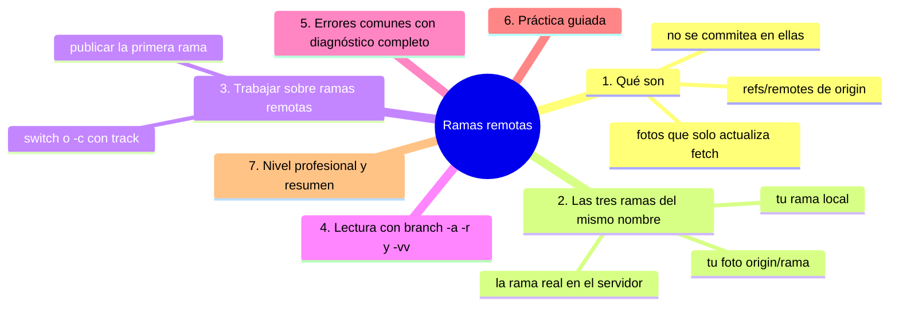
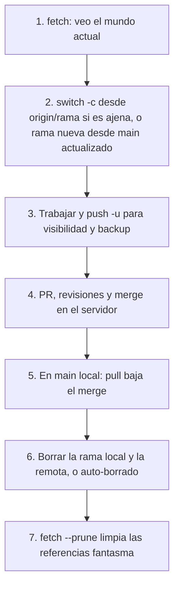

# Ramas remotas

## Introducción

Las ramas remotas son la copia local de DÓNDE están las puntas en el servidor: `origin/main`, `origin/feature-x`… No son «tus ramas» (no commiteas en ellas), sino tus fotografías del estado del remoto, actualizadas con cada fetch. Entender esta tercera familia de referencias es el puente entre las secciones de ramas y la de remoto: sin ella, `git branch -a`, los PRs y los mensajes de push no se entienden.

En este capítulo aprenderás:

* qué es `refs/remotes/origin/*` y cuándo se actualizan;
* la relación entre tu rama local, su pareja remota y la rama real del servidor;
* trabajar sobre ramas remotas (crear local con seguimiento);
* `branch -a`, `branch -r` y lectura de la tabla;
* errores comunes con diagnóstico completo, práctica guiada y nivel profesional (ciclo completo de una rama compartida).

---

## Mapa conceptual de este capítulo



---

## 1. Qué son

### 1.1. La definición

```text
Rama remota (en TU repositorio)
──────────────────────────────────────────────
· referencia refs/remotes/origin/main = «la última vez
  que vi, el servidor apuntaba aquí»
· solo fetch/pull la actualiza (push también la
  refresca tras éxito)
· es LECTURA: no haces commit en origin/main local
```

```bash
git branch -r            # lista de remotas
cat .git/refs/remotes/origin/main   # un hash
```

### 1.2. Por qué no se commitea en ellas

```text
   │
   ├── Git lo rechaza («refusing to update remote
   │   branch used in worktree» / avisos): son espejos
   │
   ├── tu vía para «moverlas» es: commitear en tu rama
   │   LOCAL y hacer push
   │
   └── así el flujo siempre pasa por tu rama = puedes
       revisar antes de publicar
```

### 1.3. Cuándo se actualizan

```text
Evento                    ¿refs/remotes/… cambia?
──────────────────────────────────────────────────────
git fetch / pull          sí (baja lo nuevo)
git push (exitoso)        sí (tu rama subida)
git clone                 sí (estado inicial)
tiempo solo (sin red)     no
```

---

## 2. Las tres ramas del mismo nombre

```text
Mismo «nombre», tres cosas:
──────────────────────────────────────────────
(1) feature-x           TU rama local (commiteas aquí)
(2) origin/feature-x    TU foto del remoto
(3) feature-x EN        LA rama real (otros la ven
    el servidor              allí)
```

```text
Sincronías posibles (branch -vv lo muestra):
   │
   ├── igual:           local == origin/x  (al día)
   ├── adelante:        local tiene commits sin push
   ├── atrás:           el remoto tiene nuevos (pull)
   └── divergida:       ambos (coordinar integración)
```

```bash
git status          # "Your branch is ahead of 'origin/main'
                    #  by 2 commits"
git log origin/main..main --oneline    # lo tuyo sin push
git log main..origin/main --oneline    # lo ajeno sin bajar
```

---

## 3. Trabajar sobre ramas remotas

### 3.1. Traer una rama remota a tu mesa

```bash
git switch feature-x            # moderno: si solo existe
                                # origin/feature-x, la
                                # crea con seguimiento

git switch -c feature-x --track origin/feature-x   # explícito
git checkout -b feature-x origin/feature-x         # clásico
```

### 3.2. Publicar tu primera rama

```bash
git switch -c feature-mia
# commits...
git push -u origin feature-mia
```

```text
-u crea la rama remota Y enlaza el seguimiento:
   │
   ├── ahora (2) existe: origin/feature-mia
   └── push/pull sin argumentos en esa rama
```

### 3.3. Actualizar tu local desde la remota

```bash
git fetch origin                # refresca origin/*
git switch feature-x            # o ya estás: git pull
```

---

## 4. Lectura: `-a` / `-r` / `-vv`

```bash
git branch -a
```

```text
Salida:
* main                     a3f9c21  ← local (activa)
  feature-x                7b21d04  ← local
  remotes/origin/HEAD      -> origin/main
  remotes/origin/main      a3f9c21  ← foto
  remotes/origin/feature-x 4d5e6f7  ← foto

   │
   ├── sin -a: solo locales
   ├── -r: solo remotas
   └── -vv (locales): + columna de seguimiento y
       adelante/atrás
```

---

## 5. Errores comunes con diagnóstico completo

### Error 1: «origin/feature no existe» tras su creación por otra persona

**Qué ocurrió:** tu compañera creó la rama y tú no la ves.

**Por qué:** tu foto no se ha actualizado (falta fetch).

**Cómo comprobarlo:** `git branch -r`; `git fetch origin` y volver a mirar.

**Opciones:** fetch.

**Riesgos:** duplicar el trabajo creando otra rama con el nombre.

**Solución:** fetch antes de crear ramas con nombre compartido.

**Cómo se evita:** `fetch.prune` + hábito de fetch al empezar.

---

### Error 2: Intentar commitear/dar push directo en origin/x

**Qué ocurrió:** Git rechaza actualizar la rama remota desde tu árbol de trabajo.

**Por qué:** no se commitea en espejos (punto 1.2).

**Cómo comprobarlo:** mensaje de error; `status`.

**Opciones:** crear/switch a tu rama LOCAL correspondiente y hacer push desde allí.

**Riesgos:** frustración (leve).

**Solución:** el flujo: local → push → remoto.

**Cómo se evita:** entender las tres copias (punto 2).

---

### Error 3: «Mi rama y origin/… divergieron»

**Qué ocurrió:** tu local y tu foto del remoto ya no comparten punta simple (vosotros subisteis cosas distintas, o reescribisteis).

**Por qué:** trabajo simultáneo o rebase/push -f de alguien.

**Cómo comprobarlo:** `status`; `log --graph main origin/main --left-right`.

**Opciones:**
* integrar (pull con merge/rebase según política);
* si el remoto se reescribió (y tú no): reset a origin/x si tu trabajo está cubierto;
* coordinar siempre en ramas compartidas.

**Riesgos:** perder trabajo si se resetea sin leer.

**Solución:** mensaje de Git + graph + conversación con el equipo.

**Cómo se evita:** no reescribir ramas compartidas (sección 17).

---

### Error 4: Confundir la foto con la realidad (foto vieja)

**Qué ocurrió:** `git log origin/main` muestra algo distinto a lo que GitHub muestra.

**Por qué:** tu origin/* está desactualizado (sin fetch).

**Cómo comprobarlo:** fetch y comparar de nuevo; `git fetch && git log origin/main`.

**Opciones:** fetch siempre antes de diagnósticos «de equipo».

**Riesgos:** conclusiones falsas («¿alguien borró mi commit?» cuando es foto vieja).

**Solución:** refresco antes de juzgar.

**Cómo se evita:** pruner + fetch rutinario.

---

### Error 5: Crear local «desde cero» cuando ya existe remota

**Qué ocurrió:** tu rama local y origin/… no tienen relación (o el push rechaza por no ser descendiente).

**Por qué:** no partiste de la remota (capítulo 02, Error 3).

**Cómo comprobarlo:** `git log main..origin/feature-x` / grafo.

**Opciones:** recrear desde `origin/feature-x` si lo tuyo no vale; si vale: integración consciente.

**Riesgos:** push rechazado, confusión.

**Solución:** crear siempre desde la foto actual (switch -c desde origin/x).

**Cómo se evita:** rutina: fetch → switch -c desde remota.

---

### Error 6: Eliminar la remota y quedarse con la foto obsoleta

**Qué ocurrió:** tras borrar en servidor, `git branch -a` la sigue listando (visto en capítulo 08).

**Por qué:** falta pruner.

**Cómo comprobarlo:** `branch -a` vs. servidor.

**Opciones:** `git fetch --prune`.

**Riesgos:** ilusión de existencia.

**Solución:** pruner.

**Cómo se evita:** `fetch.prune=true`.

---

## 6. Práctica guiada

### Objetivo

Observar el ciclo completo de una rama remota: verla, trabajarla, publicarla, actualizarla y limpiarla.

### Paso 1: inventario inicial

```bash
git fetch origin
git branch -a
git branch -r
```

1. Identifica: locales (sin `remotes/`) y fotos.

### Paso 2: foto y realidad (dos terminales / dos clonos)

Con tu clon A publica algo:
```bash
git switch -c ciclica
# commit
git push -u origin ciclica
```
En el clon B:
```bash
git branch -r                # ¿ciclica?
git fetch origin
git branch -r                # ahí está
git switch ciclica           # la crea local con track
git log origin/ciclica --oneline -n 3
```

### Paso 3: estados con -vv

```bash
# en A, tras otro commit sin push:
git branch -vv               # "ahead by 1"
git push
git branch -vv               # al día
```

### Paso 4: divergencia simulada

```bash
# en A: commit + push
# en B: (sin pull) commit en ciclica + push → rechazado
# en B: git pull (integra) + push → ok
git status                   # practica leer ahead/behind
```

### Paso 5: pruner

⚠️ **RIESGO:** el `git push origin --delete ciclica` de este paso borra la rama en el servidor para todos; hazlo solo con ramas de prueba tuyas y coordinadas.

```bash
# en A: git push origin --delete ciclica
# en B:
git branch -r                # aún la ve (foto vieja)
git fetch --prune
git branch -r                # fuera
```

### Resultado Esperado

Capacidad de explicar, para cualquier rama, la relación entre local, foto y servidor — y de mover información en las tres direcciones con confianza.

### Conclusión esperada

Las ramas remotas son el espejo sincronizable: lo que no refrescas con fetch es opinión vieja; el servidor manda y tu rama local produce.

### Ejercicio de transferencia

Con dos clonos del mismo repositorio (o dos cuentas), publica una rama desde el clon A y, desde el B, observa antes y después de `git fetch` los comandos `git branch -r`, `git log origin/<rama> --oneline` y `git switch <rama>`. Entrega las salidas que demuestran la diferencia entre foto y realidad, y la lista del ciclo completo de una rama compartida.

---

## 7. Nivel profesional + resumen

### 7.1. Flujos con varias personas

Ciclo de rama compartida:



### 7.2. Automatización y reflejos

```text
   │
   ├── fetch.prune en config por defecto
   ├── en CI: fetch explícito con refs completas
   ├── diagnósticos: nunca juzgar el remoto sin fetch
   └── herramientas (VS Code, GitHub Desktop) también
       manejan estas copias: saber lo que hacen evita
       sorpresas
```

### 7.3. Resumen

En este capítulo aprendiste que:

* las ramas remotas (`refs/remotes/origin/*`) son fotos locales del servidor, actualizadas con fetch/pull/push y no admitten commits directos;
* del mismo nombre hay tres entidades: tu rama, tu foto y la real del servidor; `branch -vv` y `status` revelan sincronías (adelante/atrás/divergida);
* se trabaja sobre ellas creando tu local con seguimiento (`switch -c --track`, `switch` moderno, `checkout -b`);
* `branch -a/-r` es el inventario; fetch refresca; prune limpia;
* los errores típicos (foto vieja, commit en espejo, divergencias, local desde cero) se resuelven con fetch, lectura de graph y el flujo local→push→remoto;
* a nivel profesional: ciclo completo fetch→rama→push→PR→pull→borrar→prune.

La idea principal es:

> **Origen no es Git en la nube: es tu espejo local del servidor —actualízalo con fetch antes de creerte nada sobre él.**

---

## Autopreguntas de cierre

Sin mirar el material, responde mentalmente y luego compruébalo con este capítulo:

1. ¿Por qué `origin/main` puede tener un hash distinto de `main` sin que nadie haya «hecho nada»?
2. ¿Qué actualiza exactamente `refs/remotes/origin/*` y qué comando no lo toca nunca?
3. Si tu compañera publicó una rama y tú no la ves, ¿qué comandos descartan cada causa posible?
4. ¿Por qué no puedes commitear directamente en `origin/feature` y cuál es el flujo correcto?
5. ¿Cómo lees `git log origin/main..main` y `git log main..origin/main` para decidir si falta push o pull?
6. ¿Qué problema resuelve `--prune` y cómo quedaría tu inventario de ramas sin él?

---

## Próximo paso

Ya ves las ramas remotas.

El siguiente capítulo cierra la sección: el seguimiento (upstream) que conecta tu rama con su pareja y hace simples a push y pull.

Continúa con:

[`10-seguimiento-de-ramas.md`](10-seguimiento-de-ramas.md)
