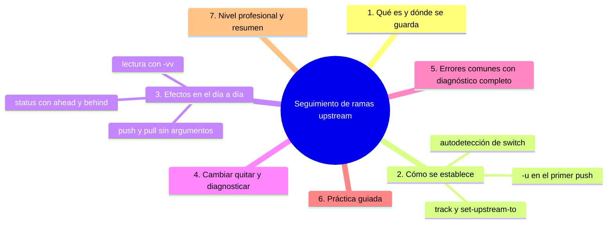
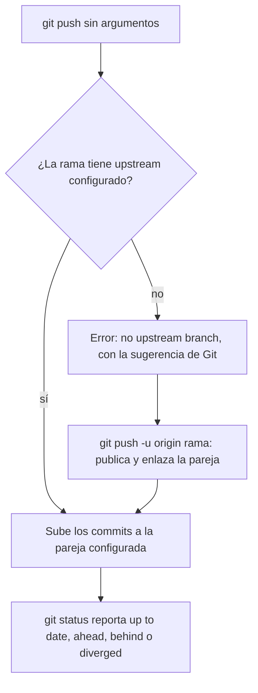

# Seguimiento de ramas (upstream)

## Introducción

El **seguimiento** (upstream) es la relación que enlaza tu rama local con su pareja remota: una vez configurada, `git push` y `git pull` funcionan sin argumentos, `git status` te dice si estás adelante o atrás y `git branch -vv` muestra la pareja. Es el cable invisible que hace cómodo el flujo diario.

Sin seguimiento, cada operación escribes destino (`push origin rama`); con él, Git sabe a dónde hablar. Pero también es una fuente de confusiones («¿por qué hizo pull de esa rama?»), así que este capítulo cierra la sección explicando cómo se configura, cómo se lee y cómo se rompe cuando ya no sirve.

En este capítulo aprenderás:

* qué es el upstream y cómo Git lo guarda en config;
* cómo se establece (`-u/--set-upstream-to`, `--track`, autodetección);
* el efecto en `push`, `pull`, `status` y `branch -vv`;
* cambiar, quitar y diagnosticar el seguimiento;
* errores comunes con diagnóstico completo, práctica guiada y nivel profesional (`branch.autoSetupMerge`, políticas de equipo).

---

## Mapa conceptual de este capítulo



---

## 1. Qué es y dónde se guarda

### 1.1. La definición

```text
upstream de tu rama = la referencia remota que Git
considera «tu pareja» (usualmente origin/<misma-rama>)

   │
   ├── la config lo guarda en .git/config:
   │
   │   [branch "feature-login"]
   │       remote = origin
   │       merge = refs/heads/feature-login
   │
   └── «cuando hagas pull/push sin decir más, usa
       origin y esa rama»
```

### 1.2. Una rama con y sin pareja

```text
Sin seguimiento                Con seguimiento
──────────────────────────────────────────────────
push: exige destino            push: git push
pull: exige refspec            pull: git pull
status: solo                   status: ahead/behind
   "on branch x"                   "… ahead by 2,
                                    behind origin/x"
```

---

## 2. Cómo se establece

### 2.1. El atajo de oro: `-u`

```bash
git push -u origin feature-login
git push --set-upstream origin feature-login
```

```text
   │
   ├── publica la rama (si no existía) Y configura el
   │   seguimiento en un solo paso
   │
   └── el 90% de las veces: esto es todo lo que
       necesitas saber
```

### 2.2. Describir una pareja existente

```bash
git branch --set-upstream-to=origin/main main
git branch -u origin/feature-x feature-x
```

### 2.3. Autodetección de `switch`

```bash
git switch feature-x
```

```text
Si NO hay local feature-x y SÍ origin/feature-x:
   │
   ├── la crea con seguimiento automáticamente
   │   (Git ≥ 2.23+; depende de
   │   branch.autoSetupMerge/branch.autoSetupRebase
   │   y del modo de clon)
   │
   └── clones con --no-single-branch o configuraciones
       raras pueden variar: en duda, -c --track explícito
```

### 2.4. El parámetro de configuración

```bash
git config branch.autoSetupMerge always   # (default:
                                           # solo en ramas
                                           # remotas)
```

```text
   │
   └── controla cuándo Git PROPONE seguimiento por
       defecto; tocarlo es decisión de equipo/política
```

---

## 3. Efectos en el día a día

### 3.1. push y pull sin argumentos

```bash
git push                 # sube mi rama a su pareja
git pull                 # baja + integra de su pareja
git push --all           # (todas; con cuidado)
git pull                 # sin upstream: ERROR claro
```

### 3.2. status con cifras

```text
git status (ejemplos)
   │
   ├── "Your branch is up to date with 'origin/main'."
   ├── "… ahead of 'origin/main' by 2 commits."
   ├── "… behind 'origin/main' by 1 commit."
   └── "… and have diverged, and have '2' and '1'
        different commits each way."
```

```text
Cómo usarlo
   │
   ├── ahead  →  te falta push (¿o aún no acabas?)
   ├── behind →  te falta pull (¿quién subió?)
   └── divergida →  integración pendiente (coordinar)
```

### 3.3. `-vv` y el log comparativo

```bash
git branch -vv
git log @{upstream}..HEAD --oneline     # lo mío sin subir
git log HEAD..@{upstream} --oneline     # lo ajeno sin bajar
```

```text
@{upstream} = «la pareja de la rama actual»: atajo
que evita teclear origin/…
```



---

## 4. Cambiar, quitar y diagnosticar

```bash
# ver configuración
git config --get branch.<rama>.remote
git config --get branch.<rama>.merge
git branch -vv

# cambiar pareja
git branch -u origin/otra-rama mi-rama

# quitar seguimiento
git branch --unset-upstream mi-rama
```

```text
Cuándo cambiar/quitar
   │
   ├── la rama se renombró/movió en el remoto
   ├── tu pareja ya no existe (borrada)
   ├── querías enlazar con otra (caso raro)
   └── reset de config por higiene
```

---

## 5. Errores comunes con diagnóstico completo

### Error 1: «no upstream branch» al hacer push/pull

**Qué ocurrió:** Git no sabe a dónde hablar: la rama no tiene pareja.

**Por qué:** nunca hiciste push con `-u` ni configuraste seguimiento.

**Cómo comprobarlo:** `git status` («has no upstream branch» con sugerencia); `branch -vv`.

**Opciones:**
* `git push -u origin <rama>` (lo habitual);
* `git push origin <rama>` sin enlazar (temporal).

**Riesgos:** ninguno (el mensaje lo dice todo).

**Solución:** -u en el primer push.

**Cómo se evita:** rutina publicadora.

---

### Error 2: Pull «trae» de una rama inesperada

**Qué ocurrió:** `git pull` bajó cosas de `origin/otra` o falló con refspec raro.

**Por qué:** el seguimiento apunta a una pareja que ya no es la que crees (o `-` de configuración).

**Cómo comprobarlo:** `branch -vv`; `git config --get branch.<rama>.remote`.

**Opciones:** re-enlazar (`-u`) o quitar (`--unset-upstream`) y hacer pull explícito (`git pull origin <rama>`).

**Riesgos:** integrar en la rama equivocada si no se mira.

**Solución:** revisar pareja antes de pull a ciegas.

**Cómo se evita:** -vv como inspección habitual; no mezclar configuraciones heredadas.

---

### Error 3: Divergencia tras cambios del equipo

**Qué ocurrió:** status dice «diverged»: tú subiste A y B; el servidor tiene C y D.

**Por qué posibles:**
* alguien hizo cambios en tu rama (¿está compartida?);
* tú hiciste rebase local de lo publicado;
* rebase/push -f de otra persona.

**Cómo comprobarlo:** `git log --graph HEAD @{upstream} --left-right`; preguntar al equipo.

**Opciones:**
* integrar: `git pull` (merge) o `git pull --rebase` (si la política lo permite);
* si tu lado NO importa (todo cubierto arriba): reset a la pareja;
* si ELLOS reescribieron: normalmente adaptarte tú.

**Riesgos:** perder trabajo si se resetea sin leer; enredos si cada quien reescribe.

**Solución:** coordinación + graph.

**Cómo se evita:** no compartir ramas personales; no reescribir lo publicado (sección 17).

---

### Error 4: Renombrar rama y romper el enlace

**Qué ocurrió:** `git branch -m nueva` y el upstream sigue apuntando al nombre viejo (o el remoto quedó con la rama vieja).

**Por qué:** renombrar local no renombra remoto ni arregla config (Git moderno ajusta parte, pero el remoto queda).

**Cómo comprobarlo:** `branch -vv`; `remote -r`/GitHub.

**Opciones:** publicar la nueva (`push -u origin nueva`), borrar la vieja remota, `fetch --prune`; si hace falta, `--unset-upstream` previo.

**Riesgos:** fantasmas y enlaces rotos.

**Solución:** renombrar = actualizar las TRES copias (local, foto, servidor).

**Cómo se evita:** no renombrar ramas ya publicadas salvo necesidad; si la hay, checklist del punto 7.1.

---

### Error 5: Creer que seguimiento = sincronización

**Qué ocurrió:** la pareja está enlazada pero tu foto está vieja (meses sin fetch) y status mintió «por lo que sabía».

**Por qué:** upstream no actualiza solo: necesita fetch/pull/push.

**Cómo comprobarlo:** fetch y re-leer status.

**Opciones:** fetch (mejor: pruner + hábito).

**Riesgos:** diagnósticos congelados en el pasado.

**Solución:** red = tus ojos; sin red, foto vieja.

**Cómo se evita:** fetch al empezar a trabajar.

---

### Error 6: Enlazar con la copia equivocada de un fork

**Qué ocurrió:** tu `main` trackea tu propio fork cuando «debería» ver el upstream, o al revés.

**Por qué:** en forks hay DOS remotos: lo que trackeas importa.

**Cómo comprobarlo:** `remote -v` + `branch -vv`.

**Opciones:** `git branch -u upstream/main main` (si tu flujo es «main = oficial») o mantener main = tu fork y trackear solo tus ramas de trabajo (ambos flujos son válidos: el equipo lo define).

**Riesgos:** pull/push al repo inesperado.

**Solución:** mapear remotos (sección 04).

**Cómo se evita:** configurar upstreams con intención al clonar forks.

---

## 6. Práctica guiada

### Objetivo

Establecer, leer, usar y romper un seguimiento a conciencia.

### Paso 1: una rama sin pareja

```bash
git switch -c seg-libre
git status                  # «no upstream branch»
git push                    # falla con sugerencia
```

### Paso 2: enlazar con -u

```bash
# un commit para tener algo
git push -u origin seg-libre
git status                  # ahora: up to date / ahead…
git branch -vv              # aparece [origin/seg-libre]
```

### Paso 3: config interna

```bash
git config --get branch.seg-libre.remote    # origin
git config --get branch.seg-libre.merge     # refs/heads/…
```

### Paso 4: día a día

```bash
# sin argumentos:
git push
git pull
git log @{upstream}..HEAD --oneline   # nada (subido)
```

### Paso 5: cambiar y quitar

```bash
git branch -u origin/main seg-libre    # apunta a otra
git branch -vv                         # ¿cambió?
git branch --unset-upstream seg-libre
git push                               # otra vez «no
                                       # upstream»
git push -u origin seg-libre           # re-enlaza
```

### Paso 6: limpieza

⚠️ **RIESGO:** `git push origin --delete seg-libre` borra la rama en el servidor de tu remoto y rompe el enlace de seguimiento de todo el que la trackeara. Hazlo solo con ramas tuyas ya integradas.

```bash
git switch main
git branch -d seg-libre
git push origin --delete seg-libre
git fetch --prune
git branch -a
```

### Resultado Esperado

Cero misterio alrededor de `@{upstream}`, `ahead/behind` y las columnas de `-vv`; capacidad de arreglar un enlace roto en segundos.

### Conclusión esperada

El seguimiento es solo config que enlaza dos nombres; cuando lo entiendes, los mensajes de Git dejan de ser adivinanzas y se vuelven instrucciones.

### Ejercicio de transferencia

Rompe y repara un seguimiento en tu repositorio de práctica: `git branch --unset-upstream`, observa el error de `git push`, vuelve a enlazarlo con `-u` y luego redirígelo a otra pareja con `-u`. Entrega los tres `git status` y las tres salidas de `git branch -vv` (sin pareja, con la pareja correcta y con la pareja distinta), con una frase de explicación para cada una.

---

## 7. Nivel profesional + resumen

### 7.1. Renombrar publicada con checklist

⚠️ **RIESGO:** el `git push origin --delete vieja` de este checklist retira la rama remota original para todo el mundo; si alguien seguía trabajando en ella, su push fallará. Ejecútalo solo tras confirmar que la nueva rama publicada es la buena.

```text
git branch -m vieja nueva
git push -u origin nueva          # publica y enlaza
git push origin --delete vieja    # retira la remota
git fetch --prune                 # limpia fotos
git branch -u origin/nueva nueva  # (si -u ya lo hizo,
                                  # verificado con -vv)
```

### 7.2. Políticas de equipo

```text
   │
   ├── ramas personales: su pareja es su nombre en el
   │   fork/origen; pull/push sin argumentos
   │
   ├── main local: pareja origin/main; pull frecuente
   │   (o rebase, según config pull.rebase del equipo)
   │
   ├── CI/CD: usa explícitamente refs (no depende de
   │   tus enlaces locales)
   │
   └── documentar en CONTRIBUTING: cómo se publica
       (¿-u? ¿squash en PR? ¿rebase?)
```

### 7.3. Resumen

En este capítulo aprendiste que:

* el upstream es la config `branch.<rama>.remote` + `.merge` que enlaza tu rama con su pareja remota; se crea con `-u` (primer push), `--track` o autodetección de switch;
* con él, `push`/`pull` van sin argumentos y `status`/`-vv` reportan ahead/behind/diverged; `@{upstream}` es su atajo;
* se diagnostica con `branch -vv` y config; se cambia con `-u` y se rompe con `--unset-upstream`;
* los errores típicos (no upstream, pareja inesperada, divergencia, renombre roto, foto vieja, forks mal enlazados) se resuelven leyendo enlaces y coordinando con el equipo;
* a nivel profesional: checklists al renombrar, políticas de pull/push por repo y CI que no depende de enlaces personales.

La idea principal es:

> **El seguimiento es un nombre pegado a otro nombre: una vez entendido, cada mensaje de Git sobre adelante/atrás es una instrucción, no un enigma.**

---

## Autopreguntas de cierre

Sin mirar el material, responde mentalmente y luego compruébalo con este capítulo:

1. ¿Dónde se guarda el seguimiento y qué pasaría si alteraras esa entrada a mano sin saber lo que hace?
2. Si `git pull` baja cosas de una rama que no esperabas, ¿qué dos comprobaciones haces antes de culpar a Git?
3. ¿Qué diferencia hay entre que tu rama esté «adelante» y que esté «divergida», y qué comando corresponde a cada caso?
4. ¿Por qué el seguimiento no actualiza tu foto del remoto aunque esté perfectamente configurado?
5. Si renombras una rama ya publicada, ¿qué tres copias tienes que actualizar y cuál se olvida con más facilidad?
6. ¿Qué haces si tu `main` trackea tu propio fork cuando querías mirar el upstream oficial?
7. ¿Por qué en CI conviene especificar refs explícitas en lugar de confiar en tu upstream local?

---

## Cómo seguir

Has completado «Ramas»: crear, cambiar, fusionar, borrar, remotas y seguimiento. Ya trabajas como un equipo de uno o de muchos.

Continúa con el índice de esta sección para repasar, o sigue directo al siguiente bloque del recorrido:

[`README.md`](README.md) · [`../09-git-remoto/`](../09-git-remoto/)
