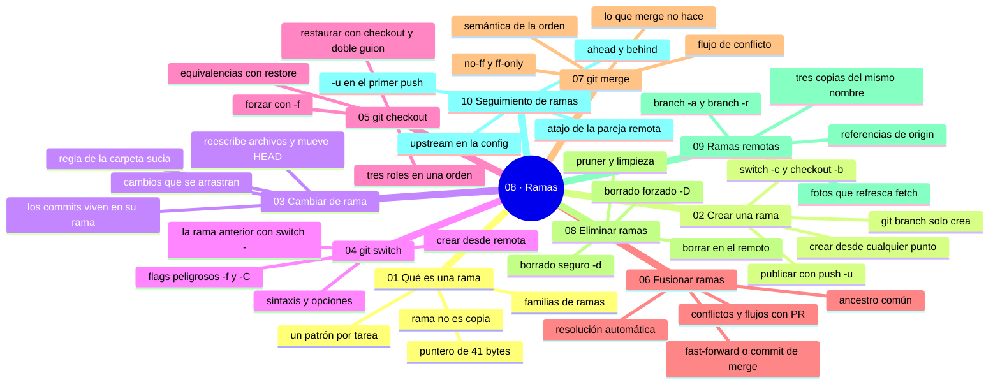

# 08 — Ramas

## Bienvenido a la sección de ramas

Las ramas son el día a día de Git: con ellas desarrollas una función, corriges un error, pruebas una idea o preparas un release sin tocar la línea principal del proyecto. Si los commits registran, las ramas organizan.

En esta sección no solo aprendes a teclear `git branch`: entiendes qué es una rama de verdad (un puntero de 41 bytes), cómo moverte entre ellas, cómo unirlas, cuándo borrarlas y cómo se relacionan con el mundo remoto. Es la sección que convierte el historial en un flujo de trabajo.

En esta sección estudiarás:

* qué es una rama y por qué crearla es gratis;
* crear ramas (`git branch`, `switch -c`, `checkout -b`);
* cambiar de rama con seguridad (y la regla de la carpeta sucia);
* `git switch`: la orden moderna de navegación;
* `git checkout`: la orden clásica y sus tres roles;
* fusionar: fast-forward, commits de merge y conflictos (concepto);
* `git merge` en profundidad, con su flujo de conflicto;
* eliminar ramas con criterio (`-d` vs. `-D`, remotas);
* ramas remotas: las tres copias del mismo nombre;
* seguimiento (upstream): el cable entre local y remoto.

Al finalizar esta sección podrás desarrollar por ramas con fluidez: crear desde el punto correcto, trabajar sin sustos, integrar con método, publicar y limpiar.

---

## Objetivos de aprendizaje

Al terminar esta sección serás capaz de:

* crear ramas desde el punto correcto y moverte entre ellas sin perder trabajo;
* diferenciar `git switch`, `git checkout` y cuándo usar cada uno;
* ejecutar un merge: fast-forward y commit de merge, y reconocer la diferencia;
* resolver un conflicto de merge con el método estándar de cinco pasos;
* eliminar ramas con criterio (`-d` vs. `-D`), incluidas las remotas;
* explicar las tres copias de una rama: local, de seguimiento y en el remoto.

## Mapa conceptual

---

## ¿Qué aprenderás en esta sección?

Cada capítulo de esta sección está diseñado para construir tu comprensión progresivamente:

1. **Qué es una rama** - El puntero con nombre, el mito de la copia y las familias de ramas.
2. **Crear una rama** - `branch`, `switch -c`, `checkout -b` y publicar con `-u`.
3. **Cambiar de rama** - Qué hace por dentro y la regla de la carpeta sucia.
4. **git switch** - La orden moderna: atajos, flags y creación desde remota.
5. **git checkout** - La orden clásica: navegar, restaurar y sus peligros.
6. **Fusionar ramas** - Ancestro común, fast-forward vs. merge commit y conflictos.
7. **git merge** - La orden completa: opciones, flujo de conflicto y qué NO hace.
8. **Eliminar ramas** - `-d` seguro, `-D` forzado, remotas y limpieza.
9. **Ramas remotas** - `refs/remotes`, las tres copias y `branch -a/-vv`.
10. **Seguimiento de ramas** - Upstream: `-u`, `@{upstream}` y ahead/behind.

---

## Cómo estudiar esta sección

Cada capítulo incluye:

* Diagramas ASCII del grafo con puntas que caminan;
* Salidas reales de terminal y mensajes de error explicados;
* Errores comunes con diagnóstico completo (qué ocurrió, por qué, cómo comprobarlo, opciones, riesgos, solución y cómo evitarlo);
* Prácticas guiadas encadenadas (se provocan fast-forwards, merges reales y conflictos que luego se abortan y resuelven);
* Un nivel profesional (políticas de integración, PRs, limpieza automatizada);
* Resúmenes con la idea principal y enlaces al siguiente capítulo.

Para practicar sin riesgo: el sandbox de la sección ([`recursos/sandboxes/08-ramas.md`](../recursos/sandboxes/08-ramas.md)) deja `main` y una `feature` divergentes listas para fusionar.

Hilo conductor: **el grafo con puntas** (sección 07). Si dudas, vuelve a dibujar dónde apunta cada nombre y qué contiene cada punta; casi cualquier pregunta de ramas se resuelve ahí.

---

## Referencias

* Chacon, S. y Straub, B. — *Pro Git* (cap. 3: Git branching).
* Driessen, V. — «A successful Git branching model» (2010).
* Learn Git Branching — lección de ramificación.

---

## Checkpoint 08 — Comprobación obligatoria

Antes de avanzar a `../09-git-remoto/`, demuestra que puedes (en un repositorio de práctica real):

1. **Crear y publicar** una rama desde `main` actualizado (`git pull` primero), con `git switch -c`, dos commits y `git push -u origin <rama>`, verificando con `git branch -vv` la pareja `[origin/<rama>]`.
2. **Provocar y cancelar** un conflicto de merge real (ediciones en las mismas líneas de un mismo archivo), leer `git status` en «Unmerged paths» y volver al estado previo con `git merge --abort`.
3. **Resolver** ese mismo conflicto con el método completo: borrar marcadores, `git diff --check` limpio, `git add` y `git commit`, y ver el commit de merge con dos padres en `git log --graph --oneline`.
4. **Diagnosticar** con `git status` y `git branch -vv` si estás adelante, atrás o divergido respecto a tu pareja remota, y decir qué comando ejecutarías en cada caso.
5. **Limpiar con criterio**: comprobar `git log main..rama --oneline` vacío, borrar la rama local con `-d`, borrar la remota con `git push origin --delete <rama>` y refrescar con `git fetch --prune`.
6. **Explicar** la diferencia entre `main`, `origin/main` y tu `main` local con seguimiento, señalando en qué carpeta vive cada una (`refs/heads/` y `refs/remotes/`) y quién la actualiza.

Si puedes hacerlo **sin mirar instrucciones**, el checkpoint está cerrado.

---

## Autopreguntas de cierre

Sin mirar el material, responde mentalmente y luego compruébalo con los capítulos de la sección:

1. ¿Qué hace Git exactamente cuando ejecutas `git branch feature`?
2. ¿Cuándo un merge produce fast-forward en vez de un commit de merge?
3. ¿Por qué `git branch -d` es más seguro que `-D`?
4. ¿Qué diferencia hay entre `main` y `origin/main`?
5. ¿Por qué crear una rama no copia archivos ni consume tiempo, y qué cambiaría en tu forma de trabajar si lo entendieras de verdad?
6. ¿En qué se diferencia un fast-forward de un commit de merge para quien lee el historial tres meses después?
7. Si `git log main..tu-rama` muestra commits justo antes de borrar la rama, ¿qué dos caminos tienes y qué implica cada uno?

---

## Próximo paso

Cuando completes esta sección, dominas el trabajo local con ramas.

Continúa con la conexión al mundo: el repositorio remoto y los comandos de sincronización.

[`../09-git-remoto/`](../09-git-remoto/)
