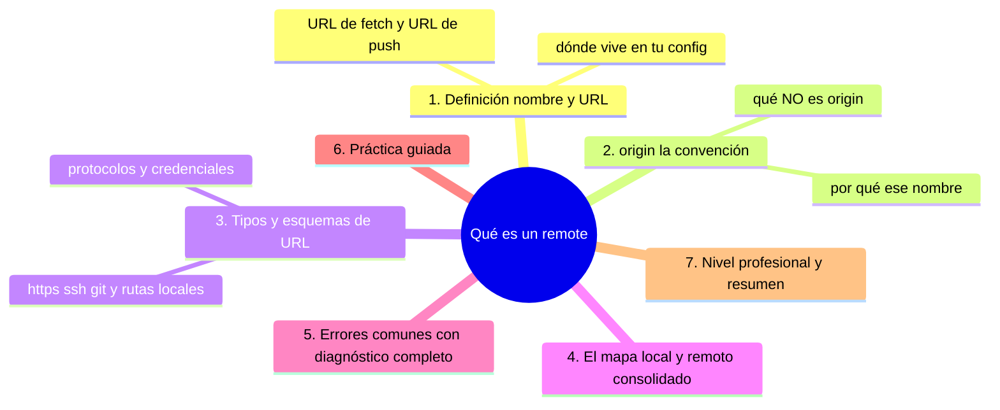
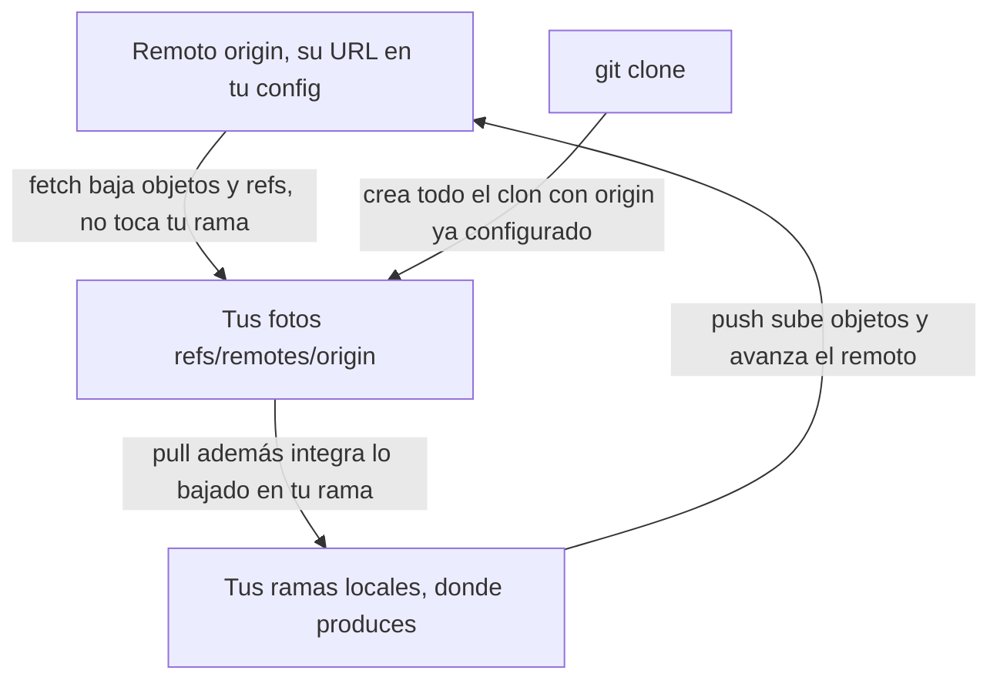

# Qué es un remote

## Introducción

**Remote** (o remoto) es la referencia de Git a «otro repositorio al que hablar»: normalmente tu copia en GitHub, pero también puede ser la máquina de una compañera, un servidor propio o un espejo. Sin remotos, Git es un sistema local brillante; con ellos, se convierte en colaboración.

Ya usaste remotos sin abstraerlos: `origin`, `push`, `pull`. Aquí damos estructura: qué es exactamente un remoto en la config, cómo se nombran, qué significa `origin` y cómo se relaciona con las ramas remotas que viste en la sección anterior.

En este capítulo aprenderás:

* la definición operativa de remote (nombre + URL);
* `origin`: por qué existe ese nombre y qué no es;
* tipos de remotos y esquemas de URL (https, ssh, git://);
* el mapa local ↔ remoto consolidado;
* errores comunes con diagnóstico completo, práctica guiada y nivel profesional (varios remotos, seguridad).

---

## Mapa conceptual de este capítulo



---

## 1. Definición: nombre + URL

### 1.1. Qué guarda Git

```text
Un remote es
──────────────────────────────────────────────
· un NOMBRE corto (origin, upstream, backup…)
· una URL (adónde hablar)
· implícitamente, dos destinos: para fetch (bajar)
  y para push (subir); por defecto la misma URL
```

```bash
git remote -v
```

```text
 origin  https://github.com/usuario/proyecto.git (fetch)
 origin  https://github.com/usuario/proyecto.git (push)
```

### 1.2. Dónde vive

```bash
git config --get-regexp '^remote\.' 
```

```text
[remote "origin"]
    url = https://github.com/usuario/proyecto.git
    fetch = +refs/heads/*:refs/remotes/origin/*

   │
   ├── en .git/config (config LOCAL de tu clon)
   │
   └── la línea fetch define CÓMO se mapean las ramas
       del servidor a tus «fotos» origin/* (el patrón
       refspec: sección 09)
```

### 1.3. Operaciones básicas

```bash
git remote add origen <URL>      # crear
git remote -v                    # listar (verbose)
git remote show origen           # detalle (con red)
git remote rename origen backup  # renombrar
git remote remove origen         # borrar (solo la
                                 # config local)
git remote set-url origen <URL>  # cambiar URL
```

---

## 2. `origin`: la convención

### 2.1. Por qué ese nombre

```text
   │
   ├── es el nombre por DEFECTO que git clone/remote
   │   add suelen poner: no tiene magia
   │
   ├── «origin» = «la fuente de la que cloné / a la que
   │   pertenezco por defecto»
   │
   └── podrías llamarlo «github», «casa» o «nube»:
       Git no distingue; el equipo sí (coherencia)
```

### 2.2. Qué NO es origin

```text
   │
   ├── no es «el verdadero original»: es solo un
   │   nombre; el «original» (upstream) es OTRO nombre
   │   que tú decides (forks)
   │
   ├── no es «la nube»: vive en tu config; borrarlo
   │   no borra nada allá (solo la referencia local)
   │
   └── no implica permisos: quién manda es el servidor
```

### 2.3. Varios remotos: el patrón de fork

```text
origin    →  mi fork (donde publico mi trabajo)
upstream  →  el repositorio oficial (de donde sale)

git remote add upstream https://github.com/equipo/proyecto.git
git fetch upstream
```

---

## 3. Tipos y esquemas de URL

### 3.1. Los esquemas

```text
Esquema        Ejemplo                        Uso típico
─────────────────────────────────────────────────────────────
https          https://github.com/u/p.git     público y
                                              privado con
                                              token/2FA
ssh            git@github.com:u/p.git         equipos,
                                              sin
                                              contraseña
                                              por
                                              operación
git://         git://host/p.git               clónos
                                              anónimos
                                              (poco
                                              común hoy)
local/archivo  /ruta/al/repo  o file://…      pruebas,
                                              espejos
                                         a veces rutas en
                                              servidores
```

### 3.2. Credenciales

```text
   │
   ├── https: Git Credential Manager guarda lo que
   │   necesitas (con 2FA en GitHub: token; nunca tu
   │   contraseña de cuenta en texto)
   │
   ├── ssh: par de claves; la pública está en GitHub,
   │   la privada en tu máquina (con passphrase)
   │
   └── cambiar de esquema: git remote set-url
```

### 3.3. Remoto como «carpeta local» (caso de prueba)

```bash
git remote add espejo /backup/mi-proyecto.git
git remote add espejo file:///d:/backup/mi-proyecto.git
```

```text
   │
   └── Git no distingue: un remote es «adónde hablo»;
       la red es solo un transporte más (útil para
       aprender y para backups)
```

---

## 4. El mapa local ↔ remoto (consolidado)



```text
Preguntas de diagnóstico
──────────────────────────────────────────────────────
¿con quién hablo?            git remote -v
¿qué me dice?                git fetch && git branch -r
¿dónde estoy respecto a él?  git status
¿qué me falta?               git log HEAD..@{upstream}
```

---

## 5. Errores comunes con diagnóstico completo

### Error 1: «No configured push destination» / «no remotes»

**Qué ocurrió:** push sin destino en un repo sin remotos (o rama sin upstream).

**Por qué:** nunca añadiste remoto (o no enlazaste rama).

**Cómo comprobarlo:** `git remote -v` (vacío); `git status`.

**Opciones:**
* `git remote add origin <URL>` + `git push -u origin <rama>`;
* si clonaste: algo se alteró (revisar config).

**Riesgos:** ninguno.

**Solución:** configura el remoto y publica con -u.

**Cómo se evita:** checklist al iniciar repo (raíz 26).

---

### Error 2: URL antigua (repo movido/renombrado)

**Qué ocurrió:** todos los fetch/push fallan con «not found».

**Por qué:** la URL de config quedó obsoleta.

**Cómo comprobarlo:** `remote -v` vs. la URL nueva del navegador.

**Opciones:** `git remote set-url origin <nueva>`.

**Riesgos:** ninguno (y en clonos múltiples: hay que actualizar cada uno).

**Solución:** set-url.

**Cómo se evita:** al renombrar/mover repos, avisar al equipo con la nueva URL.

---

### Error 3: «repository not found» con credenciales válidas

**Qué ocurrió:** la URL es correcta pero Git dice que no existe.

**Por qué posibles:**
* repo privado y sin permiso (o token caducado);
* URL con usuario antiguo;
* el repo fue transferido/deleted;
* error sutil de URL (guion, mayúscula).

**Cómo comprobarlo:** abrir la URL en el navegador (¿existe y la ves?); `remote -v`; probar `git ls-remote origin` (habla con el servidor y cuenta refs).

**Opciones:** corregir URL; regenerar credencial/ssh; pedir acceso.

**Riesgos:** autenticarse contra el repo equivocado.

**Solución:** `ls-remote` aísla el problema (¿red/auth? ¿URL?).

**Cómo se evita:** URLs copiadas de GitHub, nunca tecleadas.

---

### Error 4: Mezclar remotos en un fork sin querer

**Qué ocurrió:** `git pull` trae de upstream cuando esperabas tu fork (o push al sitio inesperado).

**Por qué:** remotos/parejas mal apuntando (capítulo 10 de la sección 08).

**Cómo comprobarlo:** `remote -v`; `branch -vv`.

**Opciones:** reconfigurar URLs y upstreams con intención.

**Riesgos:** integraciones en el lugar equivocado (aviso: en repos con permisos, el servidor te frena).

**Solución:** mapeo explícito (upstream vs. origin).

**Cómo se evita:** anotar el esquema al clonar un fork.

---

### Error 5: Borrar el remote «y se perdió todo»

**Qué ocurrió:** `git remote remove origin` y miedo a haber perdido el historial.

**Por qué:** confusión config vs. contenido.

**Cómo comprobarlo:** `git log` intacto; solo falta el nombre.

**Opciones:** `git remote add origin <URL>` (y `-u` si hacía falta re-enlazar).

**Riesgos:** pánico (nada).

**Solución:** recordar: el remote es una dirección en tu config.

**Cómo se evita:** capítulo 04 de la sección 07.

---

### Error 6: Credenciales incorrectas guardadas

**Qué ocurrió:** auth falla tras cambiar contraseña/2FA; GCM ofrece credencial vieja y falla en bucle.

**Por qué:** credencial cacheada obsoleta.

**Cómo comprobarlo:** navegador ok; Git falla; en Windows: Panel de credenciales de Windows (entrada de Git para Windows / `git credential-manager`).

**Opciones:** borrar la entrada de credencial (y volver a autenticar); para SSH: `ssh -T git@github.com` para probar clave.

**Riesgos:** bloqueo temporal.

**Solución:** renovar credencial.

**Cómo se evita:** 2FA + gestor desde el día uno (sección 03).

---

## 6. Práctica guiada

### Objetivo

Inspeccionar, crear y diagnosticar remotos en un repositorio real.

### Paso 1: inventario

```bash
git remote -v
git config --get-regexp '^remote\.'
```

1. Anota nombre(s) y URL(es); identifica fetch y push.

### Paso 2: simular un remoto local (sin red)

```bash
git init --bare /tmp/espejo.git      # o ruta Windows
                                     # (ej. %TEMP%\espejo.git)
git remote add espejo /ruta/espejo.git
git remote -v
git push -u espejo main
```

1. Comprueba: el «servidor» es una carpeta y funciona.

### Paso 3: renombrar y mover

```bash
git remote rename espejo servidor
git remote -v
git remote set-url servidor /otra/ruta/espejo.git
git remote -v
git remote remove servidor
git remote -v                       # vacío otra vez
```

### Paso 4: con tu GitHub

```bash
git remote add origin <URL-de-tu-repo>
git remote -v
git push -u origin main
git ls-remote origin                 # refs del servidor
```

### Paso 5: pruebas de diagnóstico

```bash
git remote -v            # ¿correcto?
git status               # ¿ahead/behind respecto a la
                         # pareja?
git ls-remote origin     # ¿responde el servidor?
```

1. Practica el orden: nombre → estado → contacto.

### Resultado Esperado

Capacidad de explicar exactamente a qué remotos hablas, con qué URL y qué verificación usar antes de culpar a «la nube».

### Conclusión esperada

Un remote es una línea en tu config: mínimo, local y bajo tu control. El misterio de «GitHub no me deja» se disuelve con `remote -v` + `ls-remote`.

### Ejercicio de transferencia

En un repositorio tuyo —o en uno de práctica con un espejo local— añade un segundo remoto con un nombre que no sea `origin`, compruébalo con `git remote -v` y después bórralo de nuevo. Entrega: la salida de `git remote -v` con los dos remotos y una frase escrita explicando qué conserva tu repositorio local si un día eliminas el remoto `origin` entero.

---

## 7. Nivel profesional + resumen

### 7.1. Remotos en repos serios

```text
Configuración típica
──────────────────────────────────────────────
· uno (origin) en proyectos de equipo
· dos (origin + upstream) en open source con forks
· espejos (backup) en infraestructura propia
· URLs SSH con claves por máquina y passphrase
· tokens HTTPS con permisos mínimos y caducidad
· TODA la config es local: cada quien la suya
```

### 7.2. Verificación profesional

```text
   │
   ├── git ls-remote <remote>     →  «¿responde y qué
   │   tiene?» sin tocar nada tuyo
   │
   ├── git remote show <remote>   →  HEAD remoto,
   │   ramas, seguimiento (necesita red)
   │
   └── en incidentes: remote -v es el primer paso de
       cualquier «no puedo sincronizar»
```

### 7.3. Resumen

En este capítulo aprendiste que:

* un remote es nombre + URL en tu `.git/config` (con refspec de fetch que genera tus fotos `origin/*`);
* `origin` es una convención sin magia; en forks conviven `origin` (tu copia) y `upstream` (el oficial);
* los esquemas: https (token/2FA), ssh (claves) y hasta rutas locales para pruebas; se gestionan con add/-v/show/rename/remove/set-url;
* el mapa: fetch/pull bajan, push sube, y `remote -v` + `status` + `ls-remote` son la tría de diagnóstico;
* los errores típicos (sin destino, URL vieja, not found, remotos confundidos, «borré el remote», credenciales caducadas) se resuelven leyendo config y probando con ls-remote;
* a nivel profesional: remotos mínimos, credenciales modernas y `ls-remote` como sonda.

La idea principal es:

> **El remoto no es una nube misteriosa: es una línea de config que tú escribes, tú cambias y tú verificas.**

---

## Autopreguntas de cierre

Sin mirar el material, responde mentalmente y luego compruébalo con este capítulo:

1. ¿Qué dos elementos forman un remote y en qué archivo local los guarda Git?
2. Si `git remote remove origin` no borra nada del servidor, ¿qué es exactamente lo que dejas de tener y cómo lo recuperas?
3. ¿Por qué `origin` puede no ser GitHub en tu máquina y qué comando te dice la verdad al respecto?
4. Tu repositorio es privado y cada operación de red pide credenciales: ¿qué esquema de URL conviene elegir y qué información NO debe viajar nunca en la URL?
5. Un clon usa https y otro ssh, ambos con `origin` apuntando al mismo repositorio: ¿qué tienen igual y qué difiere en sus configs?
6. El equipo renombró el repositorio en GitHub y ahora todos los fetch fallan con «not found»: ¿qué comando repara la conexión y por qué `git remote add` no es la respuesta?
7. ¿Para qué sirve la línea `fetch = +refs/heads/*:refs/remotes/origin/*` y qué notarías en tu `git branch -r` si faltara?
8. Tras clonar, haces `git remote -v` y ves una URL que no reconoces: ¿qué haces antes de tocar nada y por qué es mejor diagnosticar ahora que empujar y ver qué pasa?

---

## Próximo paso

Ya sabes qué es un remote.

El siguiente: los comandos que lo gestionan.

Continúa con:

[`02-git-remote.md`](02-git-remote.md)
