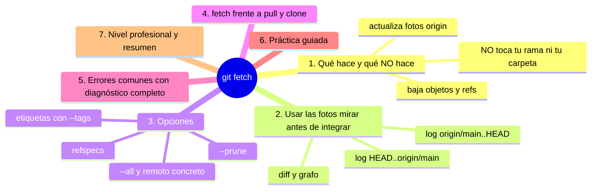
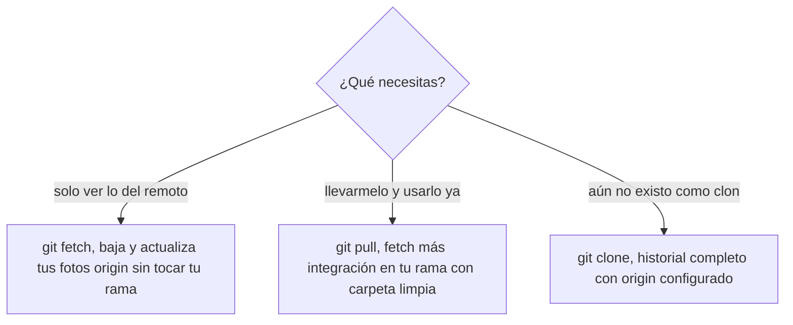
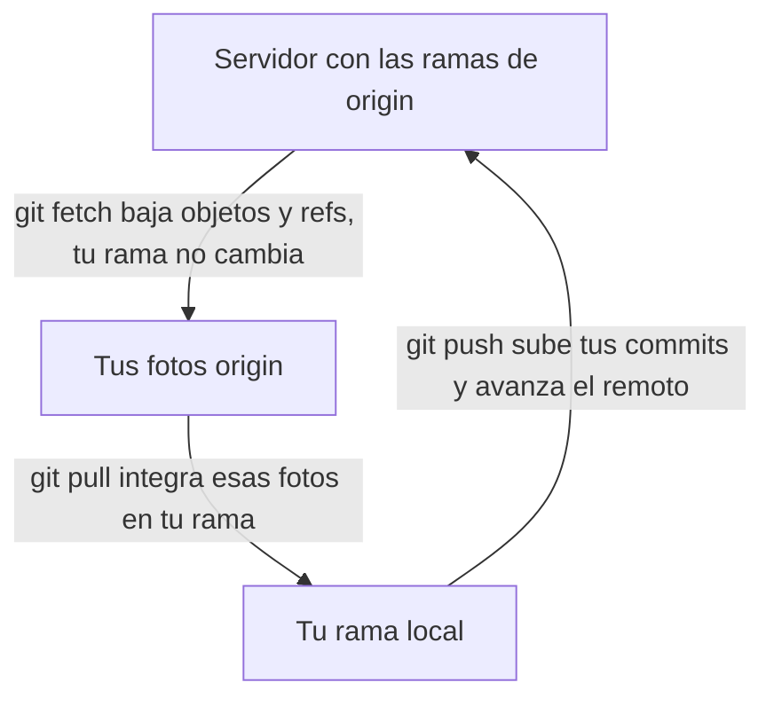

# git fetch

## Introducción

`git fetch` baja del remoto TODO lo nuevo —objetos y referencias— **sin tocar tu trabajo ni tu rama**: actualiza tus fotos `origin/*` y nada más. Es la operación de red más segura de Git: puedes hacerla en cualquier momento, con trabajo sucio y sin consecuencias sobre tu línea actual.

Por eso fetch es la herramienta de diagnóstico y de prudencia: mira qué hay «al otro lado» antes de integrar, actualiza tu mapa sin comprometerte y alimenta a pull (que sí integra). Quien hace fetch a menudo, nunca trabaja contra un mapa viejo.

En este capítulo aprenderás:

* qué hace fetch (y qué NO hace);
* cómo usar `origin/*` tras el fetch para mirar antes de integrar;
* opciones (`--prune`, `--all`, refspecs, etiquetas);
* fetch vs. pull vs. clone con precisión;
* errores comunes con diagnóstico completo, práctica guiada y nivel profesional (fetch en CI, monitoreo).

---

## Mapa conceptual de este capítulo



---

## 1. Qué hace y qué NO hace

### 1.1. La secuencia

```bash
git fetch origin
```

```text
1. habla con la URL de origin
2. descarga objetos que no tienes (commits, trees…)
3. actualiza refs/remotes/origin/* a las puntas del
   servidor (solo si avanzan)
4. (opcional) refresca etiquetas, con --prune limpia
   fotos huérfanas

NO hace: merge, rebase, cambios en tu rama, cambios
en tu carpeta (si estaba limpia, sigue igual)
```

### 1.2. Dónde queda tu trabajo

```text
Antes y después de fetch (tu lado intacto):
   │
   ├── tu rama local: MISMO hash
   ├── tu staging/carpeta: INTACTO (fetch no lo mira
   │   ni lo toca)
   └── lo nuevo vive en origin/*: disponible para
       MIRAR y luego decidir
```

### 1.3. Seguridad

```text
   │
   ├── «fetch nunca rompe nada» (solo consume espacio
   │   y red)
   │
   └── por eso: haz fetch cuando quieras, incluso con
       dudas — es el «refrescar» del sistema
```

---

## 2. Usar las fotos: mirar antes de integrar

### 2.1. Qué hay en el otro lado

```bash
git fetch origin
git log HEAD..origin/main --oneline     # lo que te falta
git log origin/main..HEAD --oneline     # lo que falta allí
git log origin/main --oneline -n 5      # sus últimos
```

### 2.2. Qué cambió exactamente

```bash
git diff HEAD..origin/main --stat
git diff HEAD...origin/main             # desde el común
```

### 2.3. El grafo completo

```bash
git log --graph --oneline --decorate --all -n 15
```

```text
Tras fetch, --all muestra también origin/*:
   │
   ├── ves la punta remota vs. la tuya
   ├── puedes valorar: ¿merge? ¿rebase? ¿pull directo?
   └── y si NO quieres integrar aún: ya está todo
       local para trabajar tranquilo (reconectar después)
```

---

## 3. Opciones

### 3.1. `--prune` (con su alias)

```bash
git fetch --prune origin     (o git fetch -p)
```

```text
   │
   ├── elimina fotos origin/* de ramas que ya no
   │   existen en el servidor
   │
   └── junto con config fetch.prune=true: limpieza
       automática (sección 08 anterior)
```

### 3.2. Alcance

```bash
git fetch                      # remoto con seguimiento
git fetch origin               # remoto concreto
git fetch --all                # todos los remotos
git fetch origin main          # solo esa rama (refspec)
git fetch origin +refs/heads/*:refs/remotes/origin/*
                               # el refspec completo
```

### 3.3. Etiquetas

```bash
git fetch --tags               # trae tags apuntados
                                # (y sus objetos)
git fetch --no-tags            # sin ellas
```

```text
   │
   ├── por defecto, el fetch sigue tags «apuntados»
   │   de lo que baja; --tags trae todas
   │
   └── necesario para ver releases recién publicadas
       (sección 19)
```

### 3.4. Profundidad (shallow)

```bash
git fetch --deepen 50          # más historia en clon
                                # superficial
git fetch --unshallow          # completo
```

---

## 4. fetch vs. pull vs. clone

```text
Orden     Trae objetos   Actualiza fotos   Toca tu rama/carpeta
──────────────────────────────────────────────────────────────
clone     sí (todo)      sí (origen)       sí (checkout inicial)
fetch     sí (nuevos)    sí                NO
pull      sí (nuevos)    sí                SÍ (integra:
                                            fetch + merge/
                                            rebase)
```





---

## 5. Errores comunes con diagnóstico completo

### Error 1: Fetch «ok» pero no veo los cambios donde trabajo

**Qué ocurrió:** hiciste fetch y tu rama sigue igual (esperaste verlo todo integrado).

**Por qué:** fetch solo actualiza fotos (eso ES lo que pidió).

**Cómo comprobarlo:** `git status` (¿behind?); `git log HEAD..origin/main`.

**Opciones:** `git pull` (integra) o merge/rebase manual con lo que ya bajó.

**Riesgos:** creer que fetch «falló».

**Solución:** recorrido mental fetch = ver, pull = integrar.

**Cómo se evita:** este capítulo.

---

### Error 2: «Connection refused / could not resolve host»

**Qué ocurrió:** no hay red (o proxy/firewall/DNS).

**Por qué:** el transporte falló.

**Cómo comprobarlo:** navegador; ping; `ssh -T git@github.com` si es ssh.

**Opciones:** reconectar; probar otro esquema (https vs ssh); revisar VPN/proxy corporativo.

**Riesgos:** confundir red con credenciales.

**Solución:** aislar capas: ¿URL? ¿red? ¿auth?

**Cómo se evita:** diagnóstico escalonado (ls-remote como sonda).

---

### Error 3: «Authentication failed» al hacer fetch

**Qué ocurrió:** hay red pero el servidor no te deja leer.

**Por qué posibles:**
* token/credencial caducada;
* SSH sin clave/agente;
* permisos revocados.

**Cómo comprobarlo:** navegador (¿ves el repo?); `ssh -T git@github.com`.

**Opciones:** renovar credencial; regenerar clave; pedir acceso.

**Riesgos:** bucles de password (GCM).

**Solución:** auth moderna.

**Cómo se evita:** 2FA + gestor.

---

### Error 4: Fotos fantasma (ramas borradas que siguen)

**Qué ocurrió:** `git branch -r` muestra ramas que ya no existen allí.

**Por qué:** falta prune.

**Cómo comprobarlo:** comparar con `git ls-remote --heads origin`.

**Opciones:** `fetch --prune` (o config fetch.prune=true).

**Riesgos:** confusiones y errores en scripts.

**Solución:** prune como hábito.

**Cómo se evita:** config.

---

### Error 5: Esperar que fetch descargue TODOS los remotos/tags siempre

**Qué ocurrió:** tags nuevas no aparecen o un segundo remoto no refresca.

**Por qué:** alcance por defecto (remoto con seguimiento; tags según política).

**Cómo comprobarlo:** `git fetch --all --tags` y comparar.

**Opciones:** indicar remoto y `--tags` explícitos.

**Riesgos:** diagnósticos incompletos.

**Solución:** saber el alcance por defecto.

**Cómo se evita:** en duda, fetch explícito.

---

### Error 6: Fetch con trabajo sucio (miedo infundado)

**Qué ocurrió:** alguien evitó fetch con cambios «por si acaso».

**Por qué:** pánico innecesario.

**Cómo comprobarlo:** probar: `git status` antes y después (idéntico).

**Opciones:** hacer fetch tranquilo.

**Riesgos:** trabajar con mapa viejo (el riesgo real).

**Solución:** fetch es seguro por diseño.

**Cómo se evita:** practicar una vez y deshacer el mito.

---

## 6. Práctica guiada

### Objetivo

Usar fetch como instrumento de observación: bajar, mirar y decidir sin integrar.

### Paso 1: baseline

```bash
git status
git remote -v
git log --oneline -n 3
```

### Paso 2: fetch y comparar fotos

```bash
git fetch origin
git branch -r
git status                  # ¿behind origin/main?
```

### Paso 3: mirar lo del otro lado

```bash
git log HEAD..origin/main --oneline
git diff HEAD..origin/main --stat
```

1. Si hay diferencias: anota de qué tratan.

### Paso 4: grafo completo

```bash
git log --graph --oneline --decorate --all -n 15
```

1. Identifica: tu punta y la punta `origin/…`.

### Paso 5: NO integrar (a propósito)

1. No hagas pull. Comprueba que tu rama y carpeta no cambiaron: `git status`, `git diff`.
2. Espera (o trabaja en otra cosa). El mapa ya lo tienes refrescado.

### Paso 6: prune

```bash
git fetch --prune
git fetch --all --tags          # alcance completo
git branch -r
```

### Paso 7: sonda sin efectos

```bash
git ls-remote --heads origin
```

1. Compara con tus fotos: ¿coinciden?

### Resultado Esperado

Capacidad de refrescar el mundo remoto y de leerlo (`log a..b`, diff, grafo) sin alterar un solo byte de tu trabajo.

### Conclusión esperada

Fetch es tu «actualizar mapa»: con él, decides integrar con información completa; sin él, trabajas con noticias viejas.

### Ejercicio de transferencia

En tu repositorio real, haz `git fetch`, anota con `git log HEAD..origin/main --oneline` qué falta por integrar y comprueba con `git status` que tu rama y tu carpeta siguen idénticas; después borra una rama remota en la web (o en un espejo local) y repite el fetch con `--prune`. Entrega: las dos listas de commits (o un «vacío») y la salida de `git branch -r` antes y después del prune.

---

## 7. Nivel profesional + resumen

### 7.1. Rutinas con fetch

```text
Momento                     Acción
──────────────────────────────────────────────────────
al empezar la jornada       fetch (+ status)
antes de abrir un PR        fetch + grafo (¿conflictos
                            previsibles?)
antes de rebase/merge       fetch (base fresca)
en diagnósticos «¿dónde     fetch --prune + log a..b
está el equipo?»
```

### 7.2. Fetch en automatización

```text
   │
   ├── CI: fetch explícito (a menudo con refspecs
   │   completas o `--depth` en pipelines ligeros)
   │
   ├── monitoreo: guiones que fetch + notifican ramas
   │   activas del equipo
   │
   └── es el paso 0 de cualquier operación remota
       seria: «traer verdad actual» antes de decidir
```

### 7.3. Resumen

En este capítulo aprendiste que:

* `git fetch` baja objetos y actualiza tus fotos `origin/*` sin tocar tu rama, staging ni carpeta: es la operación de red más segura;
* tras él, miras con `log HEAD..origin/main`, `log origin/main..HEAD`, `diff` y `log --graph --all` antes de integrar;
* opciones: `--prune` (limpieza de fotos), `--all`, `--tags`, refspecs y profundidad en clones shallow;
* la tríada: clone (nacer), fetch (ver), pull (ver + integrar);
* los errores típicos (esperar integración, red, auth, fotos fantasma, alcance, miedo injustificado) se resuelven con la distinción fetch/pull y sondas como ls-remote;
* a nivel profesional: fetch como paso cero de rutinas, CI y monitoreo.

La idea principal es:

> **Fetch actualiza lo que sabes; solo tú decides cuándo actualiza lo que haces — y por eso se hace siempre, sin miedo.**

---

## Autopreguntas de cierre

Sin mirar el material, responde mentalmente y luego compruébalo con este capítulo:

1. ¿Qué tres cosas hace `git fetch` y qué tres cosas se niega a hacer, por mucho que las pidas?
2. Después de un fetch, ¿cómo sabes con un único comando qué commits te faltan y cuáles te sobran respecto a `origin/main`?
3. ¿Qué diferencia hay entre `git fetch` y `git fetch --prune`, y qué molesta la segunda si la dejas de hacer durante meses?
4. ¿Por qué puedes hacer fetch con la carpeta llena de cambios sin miedo, y por qué el mismo gesto con `pull` sí te puede costar trabajo?
5. Si tras el fetch tu rama no ha cambiado, ¿has fallado en algo? Explica la confusión típica detrás de esa sensación.
6. ¿Qué te aporta `git log --graph --all` después de un fetch que no podías ver antes, y cómo ayuda a decidir entre merge y rebase?
7. ¿Cuándo tiene sentido `git fetch --all --tags` en lugar de un `git fetch` simple, y qué te pierdes en el caso simple?

---

## Próximo paso

Ya sabes mirar el otro lado.

El siguiente paso es integrar: `git pull`.

Continúa con:

[`05-git-pull.md`](05-git-pull.md)
