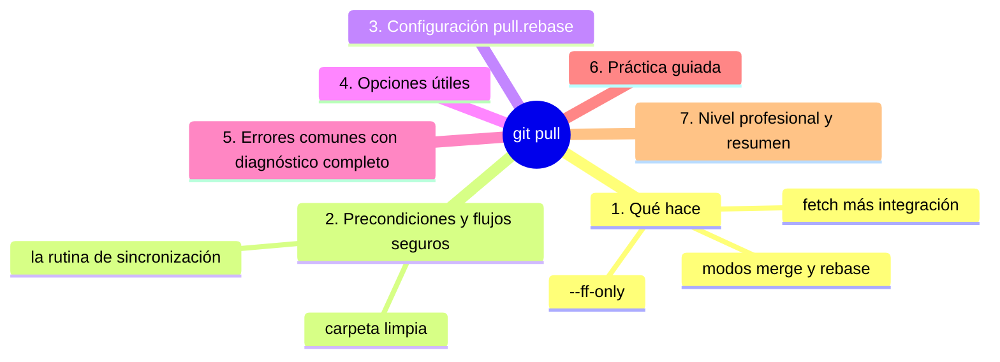
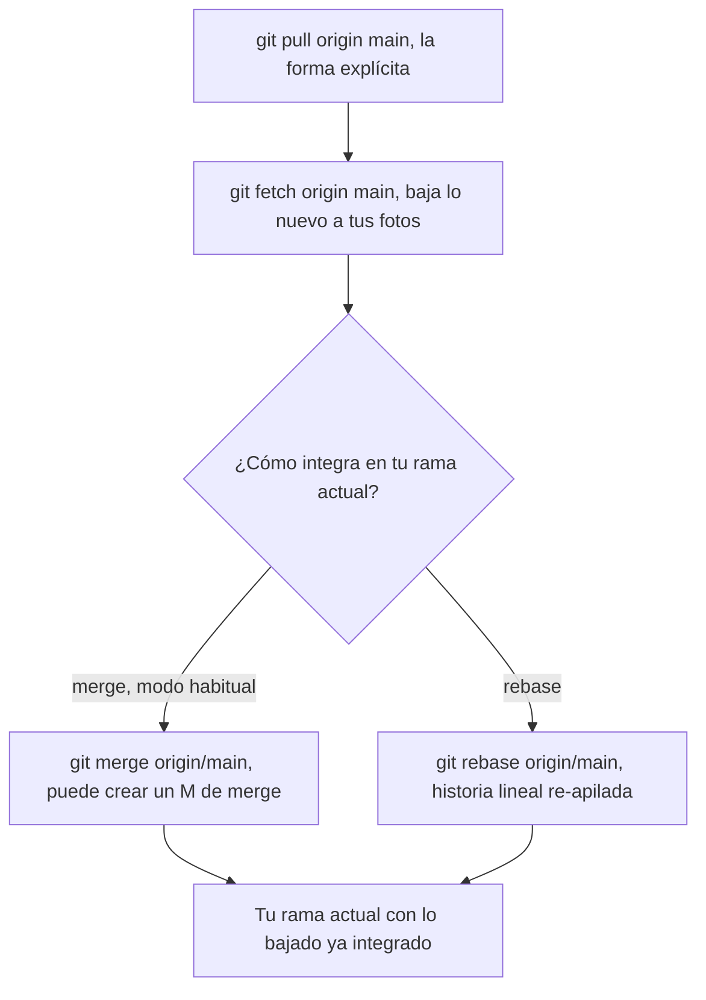

# git pull

## Introducción

`git pull` es fetch + integrar en un paso: baja lo nuevo del remoto y lo une a tu rama actual (por merge o rebase, según configuración). Es la orden de «ponerse al día» con el equipo — y la única de las tres (clone/fetch/pull) que puede tocar tu rama y tu carpeta, por lo que exige carpeta limpia y un poco de respeto.

Dominar pull es dominar la sincronización: saber qué trae, cómo integra, por qué a veces discute (conflictos) y cómo configurar su comportamiento por proyecto.

En este capítulo aprenderás:

* qué hace `git pull` (fetch + integración) y sus dos modos (merge y rebase);
* la regla de la carpeta sucia y los flujos seguros;
* configuración `pull.rebase` y sus implicaciones;
* `git pull --ff-only`, `--tags`, alcances;
* errores comunes con diagnóstico completo, práctica guiada y nivel profesional (políticas de equipo).

---

## Mapa conceptual de este capítulo



---

## 1. Qué hace

### 1.1. La composición

```bash
git pull
```



### 1.2. Modos de integración

```text
Modo            Comando interno        Resultado
──────────────────────────────────────────────────────────
merge (típico)  merge                  posible M de merge
                                        o fast-forward
rebase          rebase                 historia lineal:
                                        tus commits
                                        «re-apilados»
                                        sobre lo nuevo
ff-only         solo fast-forward      falla si hace
                                        falta un M
```

### 1.3. Alcance por defecto

```text
   │
   ├── sin argumentos: usa el upstream de tu rama
   │   (sección 10 de la sección 08)
   │
   ├── sin upstream: ERROR claro («no tracking
   │   information») → solúvelo con -u o argumentos
   │
   └── git pull --all: intenta todos los remotos
       (uso poco frecuente; cuidado en repos con
       remotos variados)
```

---

## 2. Precondiciones y flujos seguros

### 2.1. La regla

```text
Antes de pull:
   │
   ├── status: ¿limpia? → pull tranquilo
   ├── ¿cambios sucios sin commitear? → commit (o
   │   stash) PRIMERO
   │
   └── ¿cambios SUCIOS en conflictos con lo que
       llega? → Git se negará o pedirá resolución
```

### 2.2. La rutina de sincronización

```bash
git status                  # ¿limpia? ¿dónde estoy?
git pull                    # baja + integra
git status                  # ¿cómo quedó?
```

```text
Variantes conscientes:
   │
   ├── solo ver antes: git fetch + log a..b (cap. 04)
   ├── integrar sin M: git pull --ff-only
   └── integrar con M: git pull (merge) — por defecto
       en muchas configuraciones
```

### 2.3. Pull en la rama correcta

```text
   │
   ├── en tu rama de tarea: pull = traer main (o tu
   │   pareja) para mantenerte viva
   │
   └── en main: pull = ponerte al día con el equipo
       (antes de empezar trabajo nuevo: SIEMPRE)
```

---

## 3. Configuración: `pull.rebase`

```bash
git config pull.rebase true       # pull = rebase
git config pull.rebase false      # pull = merge
git config pull.rebase interactive # solo expertos
# por repositorio o --global (con criterio)
```

```text
Qué significa en la práctica
   │
   ├── false (común por defecto en Git moderno):
   │   pull crea M si tu rama tiene commits propios
   │   → honesto, conserva «qué lado vino»
   │
   ├── true: tus commits locales se re-apilan sobre
   │   lo bajado → línea recta; exige ramas personales
   │   (¡nunca en ramas compartidas!)
   │
   └── la política es DEL EQUIPO: se documenta y se
       aplica igual para todos (CONTRIBUTING)
```

---

## 4. Opciones útiles

```bash
git pull --ff-only          # solo si avanza en línea;
                            # si no: ERROR (y tú decides)
git pull --tags             # además etiquetas
git pull origin main        # fuente y rama concretas
                            # (aunque no sea tu pareja)
git pull --rebase           # este pull concreto con
                            # rebase (ignora config)
git pull --no-rebase        # este pull con merge
```

```text
Cuándo conviene --ff-only
   │
   ├── guiones y CI (fallar en vez de crear M raros)
   │
   ├── quien quiere merge explícito: pull en dos pasos
   │   (fetch + mirar + merge cuando toque)
   │
   └── politique: main solo avanza con ff/merge
       consciente
```

---

## 5. Errores comunes con diagnóstico completo

### Error 1: «You have unstaged changes» / merge conflict tras pull

**Qué ocurrió:** pull se negó (o abrió conflicto) con trabajo sucio tuyo.

**Por qué:** cambios locales chocan con lo que llegaba (o Git exige orden limpio).

**Cómo comprobarlo:** `git status`, `git diff`.

**Opciones:**
* commit de lo tuyo (y continuar);
* stash → pull → stash pop;
* resolver lo que el merge trajo (si ya entró en conflicto);
* abortar (`git merge --abort`) si pull está en curso.

**Riesgos:** descartar trabajo (nunca sin leer).

**Solución:** commit/stash antes del pull.

**Cómo se evita:** rutina status → pull.

---

### Error 2: «Pulling without specifying how to reconcile divergent branches»

**Qué ocurrió:** Git moderno pregunta (o falla) porque tu rama y la remota divergieron y no hay `pull.rebase` configurado.

**Por qué:** primera vez que divergen en ese repo sin política.

**Cómo comprobarlo:** mensaje exacto; `git config pull.rebase` (vacío).

**Opciones:** decidir y configurar:
* `git config pull.rebase false` (merge);
* `git config pull.rebase true` (rebase para ramas personales);
* o tirar del flag (`--rebase` / `--no-rebase`) esa vez.

**Riesgos:** elegir a ciegas (rebase en rama compartida molesta).

**Solución:** política del equipo documentada.

**Cómo se evita:** configurar en el primer día de proyecto.

---

### Error 3: Pull rechazado: «non-fast-forward» / «fetch first»

**Qué ocurrió:** el remoto avanzó y tú también: integración necesaria y no resuelta por ff.

**Por qué:** trabajo simultáneo (normal).

**Cómo comprobarlo:** `git log --graph HEAD @{upstream} --left-right`.

**Opciones:** `git pull` (integra según config); si el servidor exige PR: no empujes directo, abre PR.

**Riesgos:** `push --force` como «solución» (peligrosísimo en ramas ajenas).

**Solución:** pull primero, push después.

**Cómo se evita:** sincronizar a diario (ramas cortas).

---

### Error 4: Pull «no trae» mi rama (trae otra)

**Qué ocurrió:** esperabas una rama y vino otra.

**Por qué:** upstream mal enlazado o argumentos distintos a los que creías.

**Cómo comprobarlo:** `git branch -vv` (pareja), mensaje del pull.

**Opciones:** `git pull origin <rama>` explícito o re-enlazar pareja.

**Riesgos:** integrar en el sitio equivocado.

**Solución:** revisar pareja.

**Cómo se evita:** `-vv` como rutina (sección 10 de la 08).

---

### Error 5: Conflictos «de costumbre» en cada pull

**Qué ocurrió:** todas las integraciones discuten.

**Por qué posibles:**
* rama larga viva (acumula divergencia);
* archivos de formato/autogenerados chocando;
* fin de línea o espacios (sección 06/07);
* dos personas editando lo mismo sin coordinación.

**Cómo comprobarlo:** `git diff --check`; historial de conflictos en el grafo; revisar qué archivos chocan.

**Opciones:** ramas más cortas; formatos en CI; convención de zonas de archivo; conversación de equipo.

**Riesgos:** normalizar el conflicto (no es normal: es síntoma).

**Solución:** raíz del problema según diagnóstico.

**Cómo se evita:** integrar a menudo + prevención de formato.

---

### Error 6: Deshacer un pull no deseado

**Qué ocurrió:** hiciste pull «solo por mirar» y ahora tu historia cambió (M o rebase).

**Por qué:** pull integra (eso hace).

**Cómo comprobarlo:** `git reflog` (antes/después); grafo.

**Opciones:**
* si era merge reciente: `git reset --hard HEAD@{1}` (o `git reset --hard ORIG_HEAD`) — ORIG_HEAD apunta al estado anterior del merge (sección 11);
* si era rebase: `git rebase --abort` si sigue; si terminó: reflog (rebase guarda el punto).

**Riesgos:** reset a ciegas (verifica qué apunta ORIG_HEAD primero).

**Solución:** reflog + ORIG_HEAD son tus amigos.

**Cómo se evita:** en duda, fetch + mirar en vez de pull.

---

## 6. Práctica guiada

### Objetivo

Ejecutar pull en todos sus modos y ver exactamente qué cambia en cada uno.

### Paso 1: prepara dos clonos

```bash
git clone <URL> clonA
git clone <URL> clonB
# (o dos clones del espejo local de prácticas)
```

### Paso 2: trabajo en A, pull en B (ff)

```bash
# en A: commit + push
# en B:
git status                  # behind
git pull                    # ¿fast-forward? (sin M)
git log --graph --oneline -n 6
```

### Paso 3: divergencia y modos

```bash
# en B: commit propio
# en A: commit distinto + push
# en B:
git status                  # diverged / behind
git pull --no-rebase        # merge → ¿hay M?
git log --graph --oneline --decorate -n 8
```

Repite en un clon limpio con:
```bash
git pull --rebase           # historia lineal
git log --graph --oneline -n 8
```
1. Compara los dos grafos.

### Paso 4: config

```bash
git config pull.rebase false
git config --get pull.rebase
git pull                    # ahora sin flags
```

### Paso 5: ff-only

```bash
git pull --ff-only          # ¿ok o error según estado?
```

1. En estado divergido debe fallar (y no romper nada).

### Paso 6: seguridad con suciedad

```bash
# edita un archivo
git pull                    # ¿se niega?
git stash
git pull
git stash pop               # vuelve tu trabajo
git status
```

### Resultado Esperado

Capacidad de predecir el resultado de un pull (ff, M o conflicto) y de configurar el modo que el equipo necesita.

### Conclusión esperada

Pull es fetch con decisión de integración: con carpeta limpia y modo elegido, es el gesto natural de sincronización diaria.

### Ejercicio de transferencia

Con dos clonos de un espejo local, provoca una divergencia real y ejecuta el mismo `git pull` en dos copias limpias distintas: una con `--rebase` y otra con `--no-rebase`. Entrega: los dos grafos de `git log --graph --oneline --decorate` y una frase que explique cuál de los dos resultados publicarías en una rama compartida y por qué.

---

## 7. Nivel profesional + resumen

### 7.1. Políticas de equipo

```text
Configuración típica por contexto
──────────────────────────────────────────────────────
· ramas personales:      pull.rebase true
· main integrada:        pull (merge) o ff-only
  en CI
· open source:           fetch + rebase local + push
  (o PR update en web)
· documentar en CONTRIBUTING: el modo y por qué
```

### 7.2. Pull responsable

```text
   │
   ├── siempre con status previo
   │
   ├── pull en la rama correcta (no «en lo que esté»)
   │
   ├── tras pull: revisar el diff de integración si
   │   la rama es importante (git show HEAD / grafo)
   │
   └── en servidores/CI: pulls deterministas
       (ff-only o refspecs explícitos)
```

### 7.3. Resumen

En este capítulo aprendiste que:

* `git pull` = fetch + integración (merge o rebase según `pull.rebase`/flags), usando tu upstream por defecto;
* exige carpeta limpia cuando lo que llega toca lo tuyo; la rutina segura es status → pull → status;
* `--ff-only` falla en vez de inventar merges (ideal para CI); `--rebase`/`--no-rebase` deciden el modo por operación;
* los errores típicos (suciedad, divergencia sin política, non-fast-forward, pareja equivocada, conflictos recurrentes, pull no deseado) se diagnostican con status, grafo, reflog y ORIG_HEAD;
* a nivel profesional: pull.rebase documentado por equipo, pulls deterministas en automatización y revisión del diff tras integrar.

La idea principal es:

> **Pull no es «actualizar» a secas: es traer y decidir cómo unir — la política del equipo cabe en un flag, la seguridad, en tu status previo.**

---

## Autopreguntas de cierre

Sin mirar el material, responde mentalmente y luego compruébalo con este capítulo:

1. ¿Qué dos operaciones encadena exactamente `git pull` y cuál de las dos es la única que puede modificar tu carpeta de trabajo?
2. ¿Qué te aporta `git pull --ff-only` que un pull normal no te da, y en qué contexto conviene esa actitud?
3. Git te obliga a decidir entre merge y rebase al hacer pull: ¿qué dos caminos tienes y a qué tipo de rama conviene cada uno?
4. ¿Por qué la rutina segura es status → pull → status y no simplemente «pull y a ver»?
5. Hiciste un pull «solo para mirar» y ahora tu historia tiene un merge que no querías: ¿qué comandos te permiten localizar el punto de partida y deshacerlo con criterio?
6. Si haces pull en una rama que no es la que creías, ¿qué queda mal exactamente y con qué comando lo detectas antes de seguir?
7. ¿Qué diferencia hay entre `git pull --rebase` y `git config pull.rebase true`, y cuál de los dos deja huella en cómo trabajará tu equipo mañana?

---

## Próximo paso

Ya bajas y integras.

El siguiente paso es subir: `git push`.

Continúa con:

[`06-git-push.md`](06-git-push.md)
