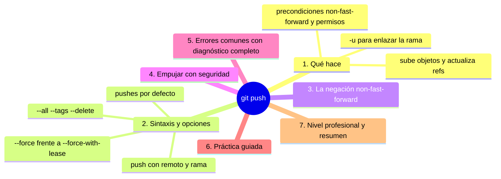
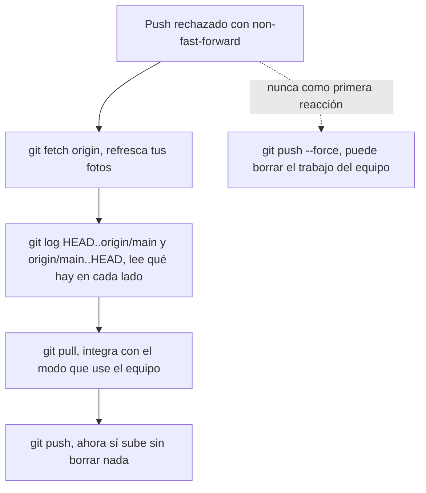

# git push

## Introducción

`git push` es la orden que sube tus commits al remoto: hace pública tu rama, actualiza la punta en el servidor y, con ello, tu trabajo pasa de «mío» a «del equipo». Es el momento en que tu historia se encuentra con la de los demás — y por eso tiene reglas: no empuja si el remoto avanzó, protege ramas y castiga los empujones a ciegas.

En este capítulo aprenderás:

* qué hace `git push` exactamente (objetos + refs);
* sintaxis y opciones clave (`-u`, `--force-with-lease`, `--all`, `--tags`);
* la negación non-fast-forward: cómo leerla y resolverla;
* empujar con seguridad: la alternativa a `--force`;
* errores comunes con diagnóstico completo, práctica guiada y nivel profesional (políticas de ramas, hooks de servidor).

---

## Mapa conceptual de este capítulo



---

## 1. Qué hace

### 1.1. La secuencia

```bash
git push origin main
```

```text
1. calcula qué commits tiene tu main y no el remoto
2. comprueba que tu punta DESCENDE de la remota
   (fast-forward posible)
3. sube los objetos que faltan (con verificación)
4. el servidor actualiza su ref main (si reglas lo
   permiten)
5. tu local refresca origin/main (foto)
```

### 1.2. Precondiciones del servidor

```text
El servidor puede NEGAR (y suele hacerlo bien):
   │
   ├── non-fast-forward (no quieres borrar trabajo)
   ├── rama protegida (no push directo: PR)
   ├── permisos insuficientes
   ├── hooks de servidor (reglas del equipo/CI)
   └── límites de tamaño / políticas
```

### 1.3. Qué NO hace

```text
   │
   ├── no integra nada en tu lado (eso es pull)
   │
   ├── no crea PR (eso es plataforma) ni revisa código
   │
   └── no sube tu staging: sube COMMITS ya hechos
```

---

## 2. Sintaxis y opciones

### 2.1. Formas

```bash
git push                    # remoto + rama del upstream
git push origin main        # explícito
git push origin main:dev    # local main → remota dev
git push origin HEAD        # «la rama actual»
git push -u origin feature  # publica + enlaza
```

### 2.2. `--force` y `--force-with-lease`

⚠️ **RIESGO:** `git push --force` sobrescribe la punta de la rama en el servidor: cualquier commit que esté allí y no en el tuyo deja de apuntar la rama remota (pierdes trabajo ajeno en esa referencia; en un repo compartido solo se recupera con el reflog del servidor o con las fotos locales de los afectados).

```bash
git push --force origin main           # brutal
git push --force-with-lease            # con garantías
```

```text
La diferencia (crítica):
   │
   ├── --force: la punta remota pasa a ser la tuya,
   │   PUNTO: borra lo que haya allí (¡trabajo ajeno!)
   │
   ├── --force-with-lease: solo fuerza si el remoto
   │   sigue donde TÚ CREÍAS que estaba (tu foto
   │   origin/* es la que comprueba): si alguien más
   │   empujó, RECHAZA
   │
   └── regla: force solo en RAMAS PROPIAS y con lease
       (mejor: ni eso; reescribir compartida = política
       de equipo)
```

### 2.3. Otras opciones

⚠️ **RIESGO:** `git push origin --delete rama` borra la rama en el servidor de forma inmediata (si alguien trabajaba en ella, su `push` posterior quedará rechazado; solo es recuperable mientras el servidor conserve la ref en su reflog). `git push --all` sube todas tus ramas locales al destino, incluidas las de prueba.

```bash
git push --all origin        # TODAS tus ramas locales
                             # (cuidado)
git push --tags              # etiquetas
git push origin --delete rama   # borrar remota
git push --dry-run           # «¿qué pasaría?» sin
                             # hacerlo
git push --atomic            # todo o nada (si el
                             # servidor lo soporta)
```

---

## 3. La negación non-fast-forward

### 3.1. Qué te dice el error

```text
! [rejected]  main -> main (non-fast-forward)
hint: Updates were rejected because the remote contains
work that you do not have locally.
```

```text
Traducción:
   │
   ├── el remoto avanzó desde tu última foto
   │
   └── Git REHUSA tu push para no pisar esos commits
```

### 3.2. Diagnóstico y resolución

```bash
git fetch origin
git log HEAD..origin/main --oneline   # lo que falta
git log origin/main..HEAD --oneline   # lo que traes
git pull                              # integrar (modo
                                      # del equipo)
git push                              # ahora sí
```



```text
NUNCA como primera reacción:
   │
   └── git push --force   (puedes borrar el trabajo
       del equipo)
```

### 3.3. Caso legítimo de force (y cómo)

```text
Situación legítima:
   │
   ├── reescribiste TU rama personal (rebase/amend) ya
   │   publicada
   │
   ├── NADIE más trabaja en ella (o estáis de acuerdo)
   │
   └── solución correcta: --force-with-lease
       (y aviso si el equipo la sigue)
```

---

## 4. Empujar con seguridad

### 4.1. Checklist

```text
Antes de push
──────────────────────────────────────────────
1. git status            → ¿rama correcta? ¿al día?
2. git log origin/<rama>..HEAD --oneline → ¿qué sube?
3. ¿hay secretos en el diff? (git show / diff --staged)
4. ¿rama compartida o protegida? → flujo PR si toca
5. push (con -u si es la primera vez)
```

### 4.2. Push y CI

```text
   │
   ├── en flujos con PR: push a TU rama (seguro) y la
   │   integración ocurre en el servidor
   │
   ├── el push dispara pipelines: lo que subes, se
   │   verifica (sección 21)
   │
   └── por eso «push roto» = pipeline roto: revisa
       antes de empujar a ramas con CI
```

### 4.3. Push frecuente

```text
   │
   ├── es respaldo (tu trabajo vive también en el
   │   servidor)
   │
   ├── da visibilidad (equipo ve progreso)
   │
   └── y reduce la divergencia acumulada (pocos
       conflictos)
```

---

## 5. Errores comunes con diagnóstico completo

### Error 1: non-fast-forward / «rejected»

**Qué ocurrió:** el remoto tiene commits que tú no tienes.

**Por qué:** alguien subió (o tú no bajaste).

**Cómo comprobarlo:** el mensaje; fetch + `log a..b`.

**Opciones:** pull (integrar) y re-push; si tu rama fue reescrita legítimamente: `--force-with-lease`.

**Riesgos:** `--force` a ciegas.

**Solución:** integrar, no pisar.

**Cómo se evita:** pull antes de push (rutina).

---

### Error 2: «Permission denied / protected branch»

**Qué ocurrió:** el servidor rechaza el push por reglas.

**Por qué posibles:**
* rama protegida (main);
* sin permisos de escritura;
* se exige PR/review/CI.

**Cómo comprobarlo:** mensaje; configuración del repo en GitHub (Settings → Branches); `git remote -v` (¿repo correcto?).

**Opciones:**
* push a TU rama y abrir PR;
* pedir permisos si te corresponde;
* revisar URL (¿estás empujando a tu fork?).

**Riesgos:** forzar accesos (nunca compartir credenciales).

**Solución:** flujo del equipo.

**Cómo se evita:** conocer las reglas desde el día uno (raíz 26).

---

### Error 3: push a la rama equivocada / repo equivocado

**Qué ocurrió:** subiste tu rama de pruebas a main, o tu trabajo al fork inesperado.

**Por qué:** sin verificar destino.

**Cómo comprobarlo:** `git status` (rama), `remote -v` (URL), historial en GitHub.

**Opciones:**
* rama protegida: lo impidió (suerte);
* si se publicó: revert/coordinación (nada de force unilateral);
* si es local/no protegida: plan de limpieza con el equipo.

**Riesgos:** historia compartida ensuciada.

**Solución:** checklist del punto 4.1.

**Cómo se evita:** mirar antes de empujar (siempre).

---

### Error 4: «no upstream branch» al hacer push sin argumentos

**Qué ocurrió:** `git push` en rama nueva sin enlace.

**Por qué:** nunca se publicó con `-u`.

**Cómo comprobarlo:** mensaje con la sugerencia exacta.

**Opciones:** `git push -u origin <rama>` (lo correcto) o `git push origin <rama>` (sin enlazar).

**Riesgos:** ninguno.

**Solución:** -u en la primera publicación.

**Cómo se evita:** rutina de creación (sección 08).

---

### Error 5: Subida enorme/lenta o «remote hung up»

**Qué ocurrió:** push cortado o eterno.

**Por qué posibles:**
* objetos pesados (imágenes/binarios sin LFS);
* red inestable;
* límite de tamaño del servidor.

**Cómo comprobarlo:** tamaño de lo que falta (`git log --stat`); mensaje del servidor.

**Opciones:** reintentar (Git retoma); LFS (sección 22); revisar política del repo.

**Riesgos:** repos ingobernables.

**Solución:** prevención en diseño (no versionar artefactos).

**Cómo se evita:** .gitignore y LFS desde el inicio.

---

### Error 6: force sin lease (y el pánico posterior)

**Qué ocurrió:** `push --force` borró commits de otra persona en la rama.

**Por qué:** se usó force como rutina.

**Cómo comprobarlo:** reflog en el servidor (GitHub conserva un tiempo); conversación con el equipo.

**Opciones:**
* los commits suelen recuperarse desde el reflog del servidor/fotos locales de los afectados;
* SIEMPRE avisa al equipo de inmediato.

**Riesgos:** pérdida temporal y confianza.

**Solución:** `--force-with-lease` como máximo y solo en ramas propias.

**Cómo se evita:** prohibirlo por convención; ramas protegidas.

---

## 6. Práctica guiada

### Objetivo

Publicar, actualizar, rechazar y resolver un push completo (con espejo local si no hay red).

### Paso 1: publicar con -u

```bash
git switch -c push-demo
echo contenido > push-demo.md
git add push-demo.md && git commit -m "Añade demo de push"
git push -u origin push-demo
git status                 # up to date con origin/…
git branch -vv
```

### Paso 2: second push normal

```bash
echo más >> push-demo.md
git add -A && git commit -m "Amplía demo"
git push                   # sin argumentos (gracias al -u)
```

### Paso 3: provocar non-fast-forward (dos clones)

```bash
# clon B: pull push-demo, commitea, push
# clon A (sin pull):
git commit -m "Otro cambio" --allow-empty
git push                    # ¡RECHAZADO!
git fetch
git log HEAD..origin/push-demo --oneline
git pull                    # integrar (merge o rebase
                            # según config)
git push                    # ahora sí
```

### Paso 4: dry-run

```bash
git commit -m "Para dry-run" --allow-empty
git push --dry-run          # te dice qué haría
git push                    # hacerlo de verdad
```

### Paso 5: force-with-lease (en TU rama, solo práctica)

⚠️ **RIESGO:** el último `git push --force-with-lease` sobrescribe la punta de la rama en el servidor: los commits que había allí dejan de estar en esa referencia (aquí solo los tuyos, porque es tu rama de práctica; en una rama compartida perderías trabajo ajeno).

```bash
git commit -m "Cambio" --allow-empty
git push
git commit --amend --no-edit        # REESCRIBE tu punta
git push                            # rechazado (esperado)
git push --force-with-lease         # ahora ok (si nadie
                                    # más empujó)
```

1. Comprueba: `git log origin/push-demo` refleja el commit enmendado.

### Paso 6: borrar la demo remota

⚠️ **RIESGO:** `git push origin --delete push-demo` borra la rama en el servidor (si alguien la tenía como pareja, su trabajo deja de tener destino hasta que se recupere desde el reflog del servidor) y `git branch -D` borra la rama local aunque no esté fusionada; en esta demo solo destruyes tu propia práctica.

```bash
git push origin --delete push-demo
git fetch --prune
git branch -r
git switch main
git branch -D push-demo            # local, ya no sirve
```

### Resultado Esperado

Fluidez con el ciclo publicar → actualizar → rechazo → integración → reempuje, y respeto real por la fuerza (lease).

### Conclusión esperada

Push es el acto de entrega: verifica destino y contenido, sube y deja foto al día; cuando algo lo frena, el camino es integrar, no arrasar.

### Ejercicio de transferencia

En un repositorio con una segunda cuenta o un espejo local, publica una rama con `-u`, provoca un rechazo non-fast-forward desde el otro clon y resuélvelo sin `--force`; después usa `git push --dry-run` en un commit nuevo y compara la salida con la del push real. Entrega: la salida del push rechazado, la del dry-run y una frase que explique qué habría pasado en el servidor si hubieras usado `--force` en lugar de integrar.

---

## 7. Nivel profesional + resumen

### 7.1. Políticas de empuje

```text
Equipo maduro
──────────────────────────────────────────────
· main protegida: sin push directo (PR + checks)
· ramas personales: push libre con -u
· force: prohibido por defecto; con lease y aviso si
  hace falta (rebase local de personales)
· --atomic en scripts donde importa todo-o-nada
· hooks de servidor (pre-receive) = reglas extra
  (tamaño, mensajes, firmas)
```

### 7.2. Push y trazabilidad

```text
   │
   ├── cada push es un punto verificable (CI corre)
   │
   ├── tags firmados en releases (sección 19)
   │
   └── ante incidentes: reflog del servidor + eventos
       de la plataforma muestran quién empujó qué
       (auditoría básica)
```

### 7.3. Resumen

En este capítulo aprendiste que:

* `git push` sube objetos y actualiza refs en el servidor (y tu foto `origin/*`), con precondiciones de fast-forward, permisos y políticas;
* `-u` enlaza upstream en la primera publicación; `--dry-run` permite ensayar; `--all`/`--tags`/`--delete` cubren operaciones especiales;
* la negación non-fast-forward se resuelve con fetch + lectura (`log a..b`) + pull/integración; `--force` es destructivo y `--force-with-lease` la versión mínimamente responsable;
* los errores típicos (rechazo, rama protegida, destino equivocado, sin upstream, subidas pesadas, force ciego) se prevén con el checklist previo al push;
* a nivel profesional: main protegida con PR+CI, force por convención prohibido y trazabilidad de cada publicación.

La idea principal es:

> **Push es entrega, no transporte: verifica qué subes, a dónde y con qué derecho — y si alguien te frena, primero entiendes, después integras.**

---

## Autopreguntas de cierre

Sin mirar el material, responde mentalmente y luego compruébalo con este capítulo:

1. ¿Qué dos cosas sube `git push` y cuál de las dos es la que el servidor realmente valida?
2. Tu push sale rechazado con non-fast-forward: ¿qué tres comandos ejecutas, en qué orden, y por qué el `--force` no es el tercero?
3. ¿Qué garantía adicional te da `--force-with-lease` frente a `--force` y en qué situación concreta te salva?
4. ¿Qué hace `-u` la primera vez que publicas una rama y qué comandos dejan de funcionar si no lo usas?
5. ¿Por qué subir un commit con un secreto dentro obliga a cambiar esa clave, aunque después borres el commit del historial?
6. ¿Qué ves con `git push --dry-run` que no arriesgas al ejecutarlo, y en qué casos merece la pena?
7. Si empujas por error una rama de pruebas a `main` en un repo sin protección, ¿qué camino correcto existe además de «force para deshacer»?
8. ¿Qué diferencia hay entre borrar una rama remota con `push --delete` y simplemente dejar de seguirla con `fetch --prune`?

---

## Próximo paso

Ya publicas con criterio.

El siguiente capítulo profundiza en `origin`: el nombre que lo conecta todo.

Continúa con:

[`07-origin.md`](07-origin.md)
