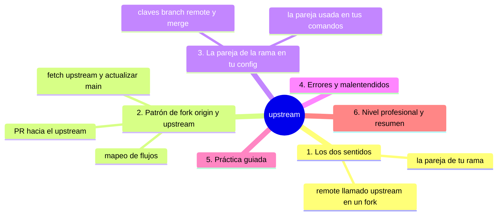
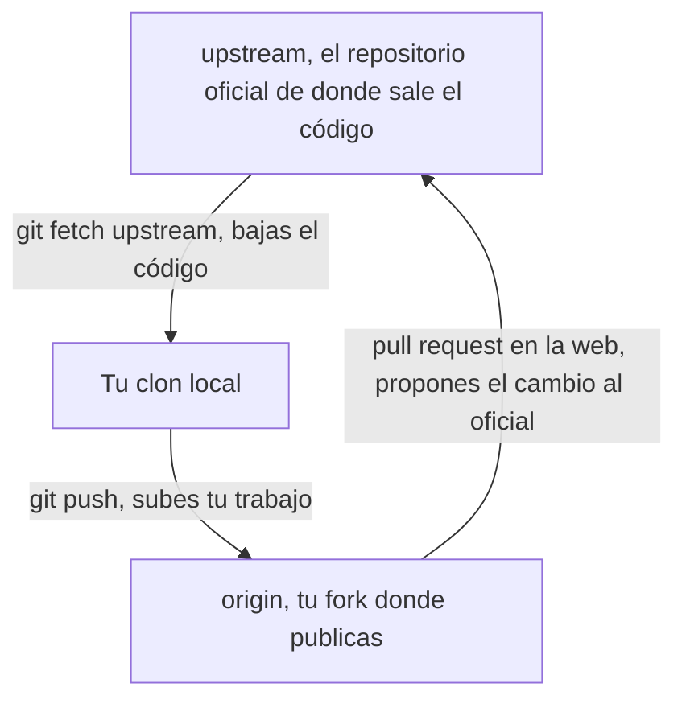

# upstream

## Introducción

La palabra `upstream` aparece en Git con dos sentidos cercanos que conviene separar de una vez:

1. **`upstream` como remoto**: el nombre habitual del repositorio ORIGINAL cuando trabajas en un fork (en open source: el de la comunidad).
2. **`upstream` como concepto de seguimiento**: la «pareja» de tu rama con la que hablan `pull`/`push` sin argumentos (`@{upstream}`).

Ambos usos coinciden en la idea de «de dónde viene mi flujo». En este capítulo los desentrañas y ves cómo se configuran, cómo conviven con `origin` y cómo evitar que se pisen.

En este capítulo aprenderás:

* `upstream` como remote de fork (patrón origin/upstream);
* cómo traer el original sin mezclar destinos de publicación;
* `@{upstream}` y `branch.*.merge/remote` (la pareja de rama);
* errores y malentendidos con diagnóstico completo, práctica guiada y nivel profesional (flujos de open source).

---

## Mapa conceptual de este capítulo



---

## 1. Los dos sentidos

### 1.1. Como remote (nombre de config)

```bash
git remote add upstream https://github.com/equipo/proyecto.git
git remote -v
```

```text
   │
   ├── convención de forks: origin = tú, upstream =
   │   el original
   │
   └── es solo un nombre: tú lo creas con `remote add`
```

### 1.2. Como relación de seguimiento

```bash
git branch -vv
# feature  7b21d04 ... [origin/feature]
git log @{upstream}..HEAD --oneline
```

```text
   │
   ├── @{upstream} = «la referencia remota que sigue
   │   esta rama» (su pareja)
   │
   ├── la pareja vive en config: branch.feature.remote
   │   + branch.feature.merge
   │
   └── ¡puede ser origin/… o upstream/… o cualquiera!
       (lo decide quién hizo -u/--track)
```

### 1.3. Por qué confunden

```text
Misma palabra, dos capas:
   │
   ├── capa remote:    «¿cuáles son mis direcciones?»
   │                    (origin, upstream, backup…)
   │
   └── capa tracking:  «¿con quién habla ESTA rama?»
                        (@{upstream}, -vv)
```

---

## 2. Patrón de fork: `origin` vs. `upstream`

### 2.1. El mapeo típico



```bash
git remote -v
# origin    git@github.com:tu-usuario/proyecto.git (…)
# upstream  git@github.com:equipo-oficial/proyecto.git (…)
```

### 2.2. Rutina de actualización

```bash
git fetch upstream
git switch main                       # tu main local
git merge upstream/main               # o reset/rebase
                                       # según política
git push origin main                  # si tu fork debe
                                       # reflejarlo
```

### 2.3. Rutina de contribución

```bash
git fetch upstream
git switch -c fix-tema upstream/main   # nace del OFICIAL
# trabajar + commits
git push -u origin fix-tema            # publica en TU
                                       # fork
# (en la web: PR desde tu fork hacia upstream)
```

```text
Reglas de oro del patrón:
   │
   ├── trabajar contra upstream (base fresca)
   ├── publicar en origin (tu fork)
   ├── NUNCA push a upstream (no tienes permiso, y si
   │   lo tienes, el flujo es PR)
   └── mantener tu main del fork al día (opcional pero
       ordenado)
```

---

## 3. La pareja de la rama (config)

### 3.1. Mirar la config

```bash
git config --get branch.feature.remote    # origin
git config --get branch.feature.merge     # refs/heads/feature
git branch -vv                            # resumen legible
```

### 3.2. Cambiar la pareja

```bash
git branch -u origin/feature feature       # enlazar
git branch --unset-upstream feature        # romper
```

### 3.3. @{upstream} en acción

```bash
git log @{upstream}..HEAD --oneline    # mis commits sin
                                       # subir
git log HEAD..@{upstream} --oneline    # suyos sin bajar
git diff @{upstream}...HEAD            # mi diff «de PR»
git rev-parse --abbrev-ref @{upstream} # ¿cuál es?
```

```text
   │
   └── atajo portable: no depende de que la pareja se
       llame origin/main (podría ser upstream/main)
```

---

## 4. Errores y malentendidos

### Error 1: Confundir el upstream remoto con el tracking de la rama

**Qué ocurrió:** «mi upstream es origin/main» dicho como remote (no lo es: origin/main es una referencia; el REMOTE se llama origin; la PAREJA de tu rama es origin/main).

**Por qué:** solapamiento de vocabulario.

**Cómo comprobarlo:** `remote -v` (remotes) vs. `branch -vv` (parejas).

**Opciones:** hablar con precisión: «mi rama trackea origin/main; el remoto origin apunta a X».

**Riesgos:** diagnósticos que mezclan capas.

**Solución:** dos preguntas separadas.

**Cómo se evita:** este capítulo.

---

### Error 2: PR desde el fork hacia el propio fork

**Qué ocurrió:** en la web se abrió «base: mi-main, compare: mi-fix».

**Por qué:** no se cambió la base del PR al upstream.

**Cómo comprobarlo:** pantalla de PR (base repository).

**Opciones:** editar base/comparación hacia upstream correcto (GitHub permite cambiarlo en el PR).

**Riesgos:** revisores perdidos; tiempo.

**Solución:** PR base = upstream oficial, compare = tu fork.

**Cómo se evita:** flujo del punto 2.3.

---

### Error 3: Push al upstream (permiso denegado)

**Qué ocurrió:** `git push` intentó subir al original (upstream) y fue rechazado.

**Por qué:** pareja mal enlazada: la rama trackea upstream en vez de origin.

**Cómo comprobarlo:** `git branch -vv`; `remote -v`.

**Opciones:** re-enlazar: `git branch -u origin/<rama> <rama>`; push explícito.

**Riesgos:** si tuvieras permiso: empujar al oficial sin revisión (¡política!).

**Solución:** revisar pareja antes de push.

**Cómo se evita:** `-u` correcto en la publicación.

---

### Error 4: Merge de upstream sin dirección («¿hacia dónde?»)

**Qué ocurrió:** se hizo `git merge upstream/main` con HEAD en el lugar equivocado (o en detached).

**Por qué:** HEAD no verificado.

**Cómo comprobarlo:** `status`; grafo.

**Opciones:** determinar: ¿actualizar main local? ¿¿actualizar mi rama de fix? (ambas válidas: en tu sitio correcto).

**Riesgos:** merges en el lugar equivocado.

**Solución:** status antes de merge (raíz 26).

**Cómo se evita:** frase explícita: «estoy en X, traigo Y».

---

### Error 5: Fork desactualizado y confusión de versiones

**Qué ocurrió:** tu origin/main está meses viejo; las PRs chocan constantemente.

**Por qué:** no se hace la rutina 2.2.

**Cómo comprobarlo:** `git log origin/main..upstream/main --oneline` (después de fetch).

**Opciones:** actualizar main del fork (merge/reset con criterio) y basar nuevas ramas en upstream/main.

**Riesgos:** conflictos de rotura.

**Solución:** rutina de actualización semanal o por necesidad.

**Cómo se evita:** trabajo sobre bases frescas.

---

### Error 6: Llamar upstream a cualquier cosa (confusión de equipo)

**Qué ocurrió:** en un equipo sin forks, alguien añadió `upstream` apuntando a… el mismo repo que origin.

**Por qué:** imitación sin necesidad.

**Cómo comprobarlo:** `remote -v` (dos URLs iguales).

**Opciones:** eliminar el redundante (o documentar por qué existe: p.ej. réplica).

**Riesgos:** dobles fetch, mensajes ambiguos.

**Solución:** un remote por propósito real.

**Cómo se evita:** añadir remotos solo con motivo.

---

## 5. Práctica guiada

### Objetivo

Configurar el patrón fork/upstream y practicar @{upstream} sin romper nada.

### Paso 1: tu mapeo actual

```bash
git remote -v
git branch -vv
```

1. ¿Cuántos remotos tienes? ¿Qué parejas siguen tus ramas?

### Paso 2: añadir upstream (fork real o simulado)

```bash
git remote add upstream <URL-del-original-o-espejo>
git remote -v
git fetch upstream
git branch -r                     # aparecen upstream/*
```

### Paso 3: actualizar desde upstream (en tu main)

```bash
git switch main
git merge upstream/main           # o la base que toque
git status
```

1. Si tu origin debe reflejarlo: `git push origin main`.

### Paso 4: rama nacida del oficial

```bash
git switch -c practica-upstream upstream/main
git commit --allow-empty -m "Prueba de base upstream"
git push -u origin practica-upstream    # pareja = origin
git branch -vv                      # verifica: [origin/…]
```

### Paso 5: @{upstream} en acción

```bash
git commit --allow-empty -m "Segundo commit"
git log @{upstream}..HEAD --oneline   # ¿1 o 2?
git push
git log @{upstream}..HEAD --oneline   # vacío
```

### Paso 6: cambiar pareja (demostración)

⚠️ **RIESGO:** `git push origin --delete practica-upstream` borra esa rama en el servidor (si alguien la seguía, su push quedará rechazado hasta recuperarla desde el reflog del servidor) y `git branch -D` borra la rama local aunque no esté fusionada; aquí solo destruyes la rama de práctica que creaste en el paso 4.

```bash
git branch -u upstream/main practica-upstream
git branch -vv                       # ¡pareja nueva!
git branch -u origin/practica-upstream practica-upstream
git branch -vv                       # vuelve
git push origin --delete practica-upstream   # limpieza
git switch main
git branch -D practica-upstream
```

### Resultado Esperado

Dos mapas nítidos en tu cabeza: direcciones (remotes) y parejas (tracking) — y fluidez con el flujo fetch-upstream → rama → push-origin.

### Conclusión esperada

Upstream es «de donde viene mi flujo»: en forks, el original; en tu rama, su pareja remota. Nombrar bien es diagnosticar a medias.

### Ejercicio de transferencia

Monta el patrón completo con un espejo local haciendo de oficial: añade `upstream`, nace una rama desde `upstream/main`, publícala en `origin` con `-u` y cambia su pareja dos veces con `git branch -u`. Entrega: la salida de `git remote -v` y de `git branch -vv` en cada paso, más una frase que explique a qué remoto respondería hoy un `git push` sin argumentos.

---

## 6. Nivel profesional + resumen

### 6.1. Flujo de contribución completo

```text
Open source maduro
──────────────────────────────────────────────
1. clone tu fork (origin) + remote add upstream
2. fetch upstream → rama nueva desde upstream/main
3. commits pequeños y limpios
4. push -u origin <rama>
5. PR: base upstream, compare origin:<rama>
6. revisiones → cambios → push (misma rama)
7. merge en upstream → fetch + borrar rama
8. (opcional) sincronizar main de tu fork
```

### 6.2. Config por defecto en plantillas

```text
   │
   ├── scripts de setup de equipo: remote add upstream
   │   cuando aplica
   │
   ├── CONTRIBUTING: define «de dónde se parte»
   │   (upstream/main) y «dónde se publica» (origin)
   │
   └── onboarding verificable: remote -v + branch -vv
       + una PR de prueba
```

### 6.3. Resumen

En este capítulo aprendiste que:

* `upstream` como remote es el original en el patrón de forks; `origin` es tu copia de publicación — y la rutina es fetch upstream → rama → push origin → PR;
* `@{upstream}` es la pareja de tu rama (config `branch.*.remote/.merge`), distinta del nombre del remote: puedes enlazarla, cambiarla o quitarla;
* los comandos diarios (`pull`, `push` sin args, `log @{upstream}..HEAD`) dependen de esa pareja, no de «GitHub»;
* los errores típicos (capas mezcladas, PR mal dirigido, push al original, merge sin rumbo, forks viejos, remotos redundantes) se resuelven con `remote -v`, `branch -vv` y rutinas escritas;
* a nivel profesional: flujo de contribución estandarizado y configuración verificable en onboarding.

La idea principal es:

> **Upstream es dirección de flujo: de donde mi código nace (el original) y hacia donde mi rama habla (su pareja) — nómbralos bien y la mitad de los enigmas desaparecen.**

---

## Autopreguntas de cierre

Sin mirar el material, responde mentalmente y luego compruébalo con este capítulo:

1. ¿En qué dos sentidos distintos se usa la palabra `upstream` en este capítulo y con qué comandos se comprueba cada uno?
2. En el patrón de fork, ¿de qué remoto debes bajar el código y en cuál publicar tu trabajo, y qué comando rompe esa regla si te equivocas?
3. ¿Dónde vive guardada la pareja de tu rama y qué comando te la muestra de forma legible?
4. ¿Por qué `git pull` y `git push` sin argumentos pueden hacer cosas distintas de lo que imaginas en un repo con dos remotos?
5. Si tu rama trackea `upstream/main` por error, ¿qué le pasa a tu siguiente `git push` y cómo lo reparas?
6. ¿Qué revisas en la pantalla de un PR antes de enviarlo para no acabar proponiendo cambios de tu fork contra tu propio fork?
7. ¿Por qué un fork desactualizado hace que todas tus PRs choquen, y con qué comando mides cuánto te has quedado atrás?

---

## Próximo paso

Ya dominas los nombres del flujo.

El capítulo final de la sección ensambla el ciclo completo de trabajo local y remoto.

Continúa con:

[`09-trabajo-local-y-remoto.md`](09-trabajo-local-y-remoto.md)
