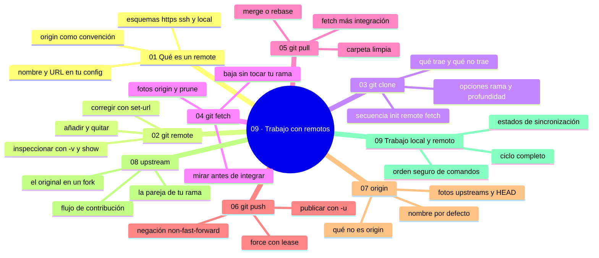

# 09 — Trabajo con remotos

## Bienvenido a la sección de remotos

Todo lo que hiciste hasta ahora —cuentas, web, Desktop, Git local, ramas— cobra sentido aquí: el momento en que tu repositorio habla con el de los demás. Los remotos son el cable de Git: clonar, bajar, subir y sincronizar sin perder el control de lo que haces.

En esta sección tomas el mando completo de la conexión: qué es un remote, cómo gestionarlo, cómo clonar en sus distintas formas, y las cuatro operaciones de red que gobiernan tu día a día — fetch, pull, push y sus nombres (origin, upstream). Terminas con el ciclo completo de trabajo local y remoto, la coreografía diaria de cualquier equipo.

En esta sección estudiarás:

* qué es un remote (nombre + URL) y por qué `origin` es solo una convención;
* `git remote`: añadir, inspeccionar, corregir y limpiar remotos;
* `git clone`: qué trae, qué opciones importan (profundidad, rama, bare);
* `git fetch`: bajar sin tocar tu trabajo (la operación más segura);
* `git pull`: bajar e integrar (merge vs. rebase) con carpeta limpia;
* `git push`: subir con criterio (y por qué `--force` es cirugía);
* `origin` y `upstream`: nombres, fotos y parejas de rama;
* el ciclo local ↔ remoto: rutina diaria, estados de sincronización y diagnóstico.

Al finalizar esta sección sabrás mover información en ambas direcciones con seguridad, diagnosticar cualquier desajuste de sincronización y trabajar con el ritmo que los equipos reales exigen.

---

## Objetivos de aprendizaje

Al terminar esta sección serás capaz de:

* gestionar remotos: añadir, inspeccionar, corregir y eliminar;
* clonar un repositorio con sus opciones relevantes (profundidad, rama, bare);
* diferenciar `git fetch` de `git pull` y saber cuándo cada uno es seguro;
* pushar con criterio y explicar por qué `--force` es cirugía, no rutina;
* diagnosticar estados de sincronización (adelante, atrasado, divergencia) y corregirlos.

## Mapa conceptual

---

## ¿Qué aprenderás en esta sección?

Cada capítulo de esta sección está diseñado para construir tu comprensión progresivamente:

1. **Qué es un remote** - Nombre, URL, `origin` como convención y el mapa local ↔ remoto.
2. **git remote** - Gestión completa: add, -v, show, set-url, prune.
3. **git clone** - El nacimiento del clon: opciones, shallow, bare y qué NO trae.
4. **git fetch** - Bajar y mirar sin tocar tu rama (fotos `origin/*`).
5. **git pull** - Fetch + integración: modos, `pull.rebase` y flujos seguros.
6. **git push** - Publicar: `-u`, non-fast-forward y force con lease.
7. **origin** - El nombre que lo conecta todo (y lo que NO es).
8. **upstream** - El patrón de forks y la pareja de tu rama (`@{upstream}`).
9. **Trabajo local y remoto** - El ciclo completo, la rutina diaria y el diagnóstico integral.

---

## Cómo estudiar esta sección

Cada capítulo incluye:

* Diagramas Mermaid del ciclo local ↔ remoto, de los flujos de fork y de las operaciones de red;
* Salidas reales de terminal y mensajes de error traducidos;
* Errores comunes con diagnóstico completo (qué ocurrió, por qué, cómo comprobarlo, opciones, riesgos, solución y cómo evitarlo);
* Prácticas guiadas con espejos locales (puedes practicar sin depender de red) y con tu repositorio real;
* Un nivel profesional (políticas de empuje, CI, flujos de open source);
* Resúmenes con la idea principal y enlaces al siguiente capítulo.

Hilo conductor: **fetch para mirar, pull para integrar, push para entregar** — y `status`/`-vv`/`remote -v` como tríada de diagnóstico. Si algo se mezcla, vuelve al capítulo 09 («Trabajo local y remoto»), que es la síntesis de la sección.

---

## Referencias

* Chacon, S. y Straub, B. — *Pro Git* (cap. 3: Working with Remotes).
* Git — Documentación oficial: «git clone», «git fetch», «git push».
* GitHub — Documentación oficial: «Syncing repositories».

---

## Checkpoint 09 — Comprobación obligatoria

Antes de avanzar a `10-git-conflictos/`, demuestra que puedes (en un repositorio de práctica real, con tu espejo local o con GitHub):

1. **Crear y revisar** un remoto: añadirlo con `git remote add`, comprobarlo con `git remote -v` y explicar qué diferencia hay entre la URL de fetch y la de push.
2. **Clonar** dos veces el mismo repo —una con `--depth 1` y otra con `-b <rama> --single-branch`— y comparar con `git branch -a` y `git log --oneline` qué trajo cada clon.
3. **Comparar fetch y pull**: hacer `git fetch`, leer `git log HEAD..origin/main`, comprobar con `git status` que tu rama no cambió y solo después integrar con `git pull`.
4. **Provocar y resolver** un rechazo non-fast-forward desde un segundo clon, leyendo el error y resolviéndolo con fetch + pull + push, sin usar `--force`.
5. **Diagnosticar** un desajuste con la tríada `git status` + `git branch -vv` + `git remote -v`, y decir qué comando toca en cada estado (adelante, atrás, divergida, sin pareja).
6. **Explicar** en dos frases la diferencia entre `origin` y `upstream` en un fork, y señalar en qué comando se usa la pareja `@{upstream}`.

Si puedes hacerlo **sin mirar instrucciones**, el checkpoint está cerrado.

---

## Autopreguntas de cierre

Sin mirar el material, responde mentalmente y luego compruébalo con los capítulos de la sección:

1. ¿Qué diferencia hay entre `git fetch` y `git pull`?
2. ¿Cuándo es aceptable `--force` y cuándo es catastrófico?
3. Tu rama va «atrasada» respecto al remoto: ¿qué haces y en qué orden?
4. ¿Qué es el `upstream` y para qué sirve?
5. Si haces `git fetch` con la carpeta llena de cambios sin commitear, ¿qué puede cambiar y qué no? ¿Por qué eso convierte a fetch en la única operación de red que puedes repetir sin miedo?
6. Tu push sale rechazado y un compañero te dice «échale `--force`»: ¿qué tres preguntas te haces antes y cuál es la alternativa correcta?
7. `git remote remove origin` no toca el servidor, pero sí deja un desajuste en tu equipo de trabajo: ¿qué se pierde exactamente y cómo lo reparas?
8. Después de clonar un fork, ¿cómo averiguas —sin preguntar a nadie y sin equivocarte de destino— si tu `git push` va a parar a tu copia o al repositorio oficial?

---

## Próximo paso

Cuando completes esta sección, dominas la sincronización.

Continúa con el siguiente bloque: cuando dos líneas de trabajo chocan de verdad — los conflictos.

[`../10-git-conflictos/`](../10-git-conflictos/)
