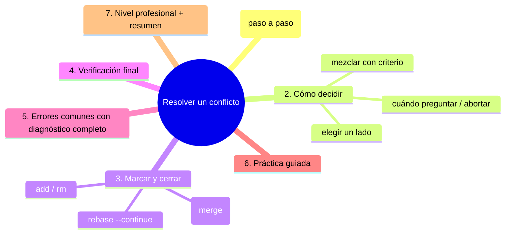

# Resolver un conflicto

## Introducción

Resolver es el trabajo humano: abrir los archivos, decidir qué debe quedar, borrar los marcadores y marcar la decisión con `git add`. No hay atajo mágico — pero sí hay un método que hace el proceso predecible, seguro y rápido, y por eso este capítulo es el corazón de la sección.

Aquí aprenderás el paso a paso completo: desde el status inicial hasta el cierre con commit o `--continue`, con trucos de revisión (`diff --check`), técnicas de decisión (qué lado, qué mezcla, cuándo preguntar) y cómo salir andando si algo se tuerce.

En este capítulo aprenderás:

* el método de resolución paso a paso (merge y rebase);
* cómo decidir: elegir lado, mezclar con criterio, delegar;
* marcar resolución con `add`/`rm` y cerrar (`commit`, `--continue`);
* verificación final (check, grep, diff, tests);
* errores comunes con diagnóstico completo, práctica guiada y nivel profesional.

---

## Mapa conceptual de este capítulo



---

## 1. El método (paso a paso)

```text
MÉTODO DE RESOLUCIÓN
──────────────────────────────────────────────────────
0. status → saber operación y archivos (cap. 03)
1. por CADA archivo unmerged:
   a. abrirlo
   b. leer cada bloque marcado
   c. decidir (cap. 2)
   d. dejar SOLO el resultado correcto
   e. quitar TODOS los marcadores
   f. guardar
   g. git add <archivo>          ← «resuelto»
      (o git rm <archivo> si la decisión es borrarlo)
2. git diff --check              ← sin residuos
3. git grep -n "<<<<<<<"         ← doble red
4. git status                    ← ¿unmerged vacío?
5. cerrar:
   · merge:    git commit (mensaje prediseñado o -m)
   · rebase:   git rebase --continue
6. verificar: log --graph / tests / CI
```

```text
Reglas de oro
   │
   ├── un archivo a la vez (nada de «todo de golpe»)
   ├── add = certificado de decisión
   └── sin status final, no se cierra nada
```

---

## 2. Cómo decidir

### 2.1. Estrategia A: elegir un lado

```bash
git checkout --ours <archivo>      # versión tuya (merge)
git checkout --theirs <archivo>    # versión entrante
# en rebase: ¡OJO! ours/theirs están INVERTIDOS
```

```text
Cuándo:
   │
   ├── un lado ya incorporó lo del otro (uno es el
   │   ganador lógico)
   │
   ├── cambios de prueba/estilo: uno de los dos es
   │   correcto
   │
   └── en rebase: recuerda la inversión (cap. 06)
```

### 2.2. Estrategia B: mezclar con criterio

```text
   │
   ├── dentro de un bloque: conservar las líneas que
   │   DEBEN quedar de ambos (edición manual)
   │
   ├── «los dos tenían razón en partes» → combinar
   │   lógicamente (no pegar bloques)
   │
   └── resultado: el archivo que habría escrito una
       persona que entendió ambas intenciones
```

### 2.3. Estrategia C: decidir con contexto

```bash
git log --oneline -n 5 -- <archivo>   # quién tocó y por qué
git show <commit>                     # mensaje (el porqué)
git diff :1:<archivo>                 # ancestro vs. (o usa
                                      # show :1/:2/:3)
```

```text
   │
   ├── lee los MENSAJES de ambos lados: suelen decir
   │   la intención
   │
   ├── si la intención es ambigua: ticket, pareja,
   │   revisión — 5 minutos de pregunta ahorran
   │   horas de bug
   │
   └── si hay duda total y es reversible: el lado más
       conservador + comentario en el PR
```

### 2.4. Estrategia D: abortar (también es resolver)

```bash
git merge --abort          # o rebase --abort / cherry-pick --abort
```

```text
   │
   ├── «no tengo cabeza/permisos para decidir esto
   │   ahora» → abortar es madurez, no derrota
   │
   └── volverás cuando toque (con la rama más viva o
       con mejor información)
```

---

## 3. Marcar y cerrar

### 3.1. `add` como «resuelto»

```bash
git add notas.md
git status        # desaparece de Unmerged paths
```

```text
   │
   ├── el contenido ACTUAL del archivo es la
   │   resolución: Git toma tu carpeta
   │
   └── si la decisión era BORRAR:
       git rm <archivo> (también lo marca resuelto)
```

### 3.2. Cerrar merge

```bash
git commit
# (se abre el editor con mensaje pre-cargado:
#  "Merge branch 'x' into y" — o usa -m)

git status        # "clean" → merge concluido
git log --graph --oneline -n 8
```

### 3.3. Cerrar rebase

```bash
git rebase --continue
```

```text
   │
   ├── aplica el commit (o el siguiente) y continúa
   │   con el resto de la serie
   │
   ├── puede parar OTRA VEZ (siguiente conflicto):
   │   repite el método desde el paso 1
   │
   └── pausar sin decidir: git rebase --skip (omite tu
       commit — con cuidado) o --abort
```

### 3.4. Cerrar cherry-pick / revert / stash (mención)

```text
   │
   ├── cherry-pick: add + git cherry-pick --continue
   │
   ├── revert: add + git commit / --continue
   │
   └── stash con conflicto en pop: add + git stash drop
       (o --abort de stash en versiones que lo soporten)
       → la sección 20 lo detalla
```

---

## 4. Verificación final

```bash
git diff --check           # 1. sin marcadores
git grep -n "<<<<<<<"      # 2. grep directo
git status                 # 3. sin unmerged
git diff                   # 4. el contenido resuelto
                           #    tiene sentido?
git log --graph --oneline  # 5. la estructura
# 6. tests / build / CI
```

```text
Nivel de rigor según importancia:
   │
   ├── rama personal, cambio trivial: 1-3
   ├── rama de equipo / PR: 1-5
   └── integración a main: 1-6 (CI obligatorio)
```

---

## 5. Errores comunes con diagnóstico completo

### Error 1: Continuar con archivos sin resolver

**Qué ocurrió:** `commit`/`rebase --continue` falla (o peor: cierra incompleto con flags).

**Por qué:** quedaron entradas unmerged.

**Cómo comprobarlo:** `git status` (lista la que falta).

**Opciones:** resolver+add los pendientes y reintentar.

**Riesgos:** cerrar a medias (nunca con --no-verify ni trucos).

**Solución:** status vacío antes de cerrar.

**Cómo se evita:** checklist.

---

### Error 2: Marcadores residuales en el commit

**Qué ocurrió:** se cerró con `<<<<<<<` dentro.

**Por qué:** add sin `diff --check`.

**Cómo comprobarlo:** `git grep -n "<<<<<<<" HEAD` (también sobre el commit); `git show HEAD -- <archivo>`.

**Opciones:** commit de corrección inmediato; si ya se publicó y rompe: revert o fix rápido.

**Riesgos:** build roto, vergüenza pública.

**Solución:** check SIEMPRE (paso 2 del método).

**Cómo se evita:** no saltarse pasos por prisa.

---

### Error 3: Resolver con `checkout --ours/--theirs` en rebase al revés

**Qué ocurrió:** en rebase se eligió «ours» pensando en lo tuyo y salió la base.

**Por qué:** en rebase, ours = base nueva; theirs = tu commit (invertido respecto a merge).

**Cómo comprobarlo:** mensaje del rebase; marcadores (HEAD es la base).

**Opciones:**
* si no cerró aún: rehacer la elección (volver a poblar el archivo con el lado correcto y add);
* si cerró: verificar contenido y corregir en el siguiente paso (o rehacer con reflog).

**Riesgos:** contenido al revés (funciona y no funciona: lo peor).

**Solución:** regla de inversión (cap. 06) o edición manual en vez de flags.

**Cómo se evita:** editar a mano cuando hay duda de lados.

---

### Error 4: Resolver «todos los archivos» sin mirar (patrón)

**Qué ocurrió:** todos los resueltos idénticos o contenido de un lado copiado indiscriminadamente.

**Por qué:** prisa.

**Cómo comprobarlo:** `git diff` del merge: sorprendentemente uniforme.

**Opciones:** revisar uno a uno los archivos tocados (puede ser legítimo: si la resolución era «coger todo el lado B»).

**Riesgos:** perder cambios de un lado en varios archivos.

**Solución:** método por archivo (cap. 04 paso 1).

**Cómo se evita:** checklist de `diff-filter=U`.

---

### Error 5: No actualizar la otra superficie

**Qué ocurrió:** se resolvió en la web (PR) y el local sigue con la rama vieja (o al revés): divergencias extra.

**Por qué:** dos fuentes de verdad sin sincronizar.

**Cómo comprobarlo:** `git fetch` + `log`/`status`.

**Opciones:** traer el resultado (pull) o terminar la resolución en el sitio donde vive el PR.

**Riesgos:** repetir trabajo.

**Solución:** una superficie por PR.

**Cómo se evita:** mapeo antes de empezar (cap. 03, Error 5).

---

### Error 6: Cerrar y NO verificar (CI roto / bug silencioso)

**Qué ocurrió:** merge «verde» en local, rojo en CI (o bug en lógica combinada).

**Por qué:** verificación insuficiente (resolución semánticamente mala).

**Cómo comprobarlo:** pipeline; tests locales omitidos.

**Opciones:** fix o revert; aprender.

**Riesgos:** regresión.

**Solución:** tests antes de cerrar integraciones importantes.

**Cómo se evita:** considerar resolución = decisión + verificación.

---

## 6. Práctica guiada

### Objetivo

Resolver un conflicto completo con el método y cerrarlo limpio (merge y una versión de rebase).

### Paso 1: montar conflicto (versión con historia)

```bash
git switch main
printf "uno\ndos\ntres\n" > resolver.md
git add resolver.md && git commit -m "Base: tres líneas"

git switch -c r-a
# edita: cambiar "dos" por "dos (A)"
git commit -am "A refina la línea dos"

git switch main && git switch -c r-b
# edita: cambiar "dos" por "dos (B)" y añade "cuatro"
git commit -am "B refina la línea dos y añade cuatro"

git switch main
git merge --no-ff r-a
git merge --no-ff r-b       # conflicto en resolver.md
```

### Paso 2: identificar (cap. 03)

```bash
git status
git ls-files -u
cat resolver.md             # (o Get-Content)
```

### Paso 3: decidir y resolver

1. Lee el bloque: dos versiones de «dos» y una adición de «cuatro».
2. Decisión (ejemplo): línea dos = «dos (A y B)»; conservar «cuatro».
3. Edita: solo el resultado; sin marcadores.
4. `git diff --check` → limpio.
5. `git add resolver.md`.

### Paso 4: cerrar y verificar

```bash
git status                  # sin unmerged
git commit                  # (mensaje prediseñado)
git log --graph --oneline -n 8
git show HEAD --stat
cat resolver.md             # contenido final correcto
```

### Paso 5: conflicto en rebase (la inversión)

```bash
git switch -c r-rebase main
git merge --no-ff r-b 2>$null   # (o prepara otra base)
# mejor: crea dos ramas sobre otra base y rebasea una:
git switch -c rbase-b main
# commit que cambia "tres"
git switch -c rbase-a main
# commit que cambia "tres" de otra forma
git switch rbase-b
git rebase rbase-a            # conflicto
git status                    # "rebase in progress"
# Lee marcadores: HEAD = base (rbase-a), >>>>>> = tu commit
# Resuelve (usa la intención correcta), add:
git add resolver.md
git rebase --continue
git log --graph --oneline -n 8   # línea recta con tus
                                 # commits re-apilados
```

1. Comprueba la inversión de lados respecto al merge.

### Paso 6: salida de emergencia

```bash
# (si quieres repetir desde cero en un conflicto)
git merge --abort             # / git rebase --abort
git status                    # limpio
```

### Resultado Esperado

Haber cerrado conflictos en merge y rebase con el método completo, incluida verificación.

### Conclusión esperada

Resolver es una receta corta: decidir, limpiar, marcar, comprobar, cerrar. La creatividad está en la decisión; el resto es disciplina.


### Ejercicio de transferencia
Aplica la secuencia de identificación (status → diff → índice) a un conflicto que involucre solo cambios de espacios en blanco. Usa `git diff --check --ignore-space-change` para detectar y verifica que el índice muestre `stage 1` igual en ambos lados. Entregable: captura de pantalla de los comandos y su salida mostrando que el conflicto es solo de espacios.

## Autopreguntas de cierre

Sin mirar el material, responde mentalmente y luego compruébalo con este capítulo:

1. ¿Cuáles son las tres señales principales que indican un conflicto en Git?
2. ¿En qué orden debe ejecutarse la secuencia de identificación según el método del capítulo?
3. ¿Qué comando te muestra los archivos con conflictos sin necesidad de revisar el mensaje?
4. ¿Cómo puedes determinar si estás en un merge o en un rebase mirando el repositorio?
5. ¿Qué indica la presencia de tres etapas (stage 1,2,3) en `ls-files -u` para un archivo?
6. ¿Por qué es importante comprobar residuos con `diff --check` antes de cerrar un conflicto?
7. ¿Qué debes hacer si `git status` muestra «unmerged paths» pero no recuerdas en qué operación estás?
8. ¿Cómo afecta el historial de cada lado a la decisión de resolución de un conflicto?
---

## 7. Nivel profesional + resumen

### 7.1. Resoluciones profesionales

```text
En PRs de equipo
──────────────────────────────────────────────────────
· decisión documentada (comentario en el PR: «en el
  conflicto de X, mantuve Y porque Z»)
· resolución con tests (si toca lógica: añadir/fijar
· evitar sorpresas: diff del merge revisado en la
  revisión
· una sola superficie (web o local)
· nunca --no-verify / --ours a ciegas en producción
```

### 7.2. Conflictos sistemáticos

```text
Si los mismos archivos vuelven a conflicto:
   │
   ├── extraer reglas de resolución al equipo
   │   («en config, prevalece X»)
   │
   ├── automatizar (formateadores, validadores) lo que
   │   sea mecánico
   │
   └── rediseñar el archivo/zona (cap. 02 de esta
       sección)
```

### 7.3. Resumen

En este capítulo aprendiste que:

* el método: identificar → archivo a archivo (decidir, limpiar, add) → `diff --check`/grep → status → cerrar (commit / `rebase --continue`) → verificar;
* decidir tiene cuatro estrategias: elegir lado (`--ours/--theirs` con inversión en rebase), mezclar con criterio, decidir con historia/contexto, o abortar;
* `add` marca la resolución en el índice; borrar decisión es `rm`; cerrar depende de la operación (merge: commit; rebase: continue);
* la verificación final (check, grep, diff, graph, tests) es parte de resolver, no un extra;
* los errores típicos (pendientes, residuos, inversión en rebase, resolución patrón, superficies dobles, sin tests) se evitan con el checklist;
* a nivel profesional: decisiones documentadas, tests de resolución y reglas de equipo para los conflictos sistemáticos.

La idea principal es:

> **Resolver es decidir con método: la creatividad cabe en la decisión — todo lo demás es un checklist que no admite atajos.**

---

## Próximo paso

Ya resuelves con método.

Los siguientes capítulos especializan el procedimiento: primero, conflictos en merge.

Continúa con:

[`05-conflictos-en-merge.md`](05-conflictos-en-merge.md)
