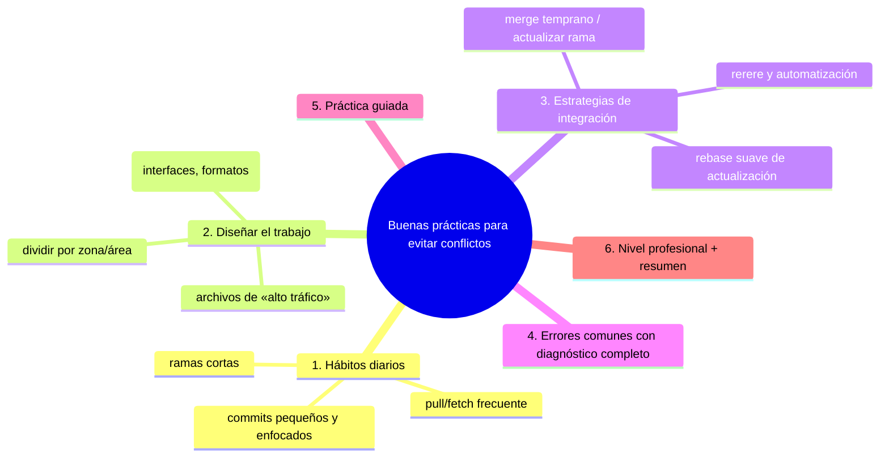

# Buenas prácticas para evitar conflictos

## Introducción

La mejor resolución de conflictos es la que no hace falta. Los conflictos son inevitables en equipos — Git incluso los considera una señal sana de que dos personas avanzan en paralelo — pero su frecuencia, tamaño y dolor se pueden reducir mucho con hábitos de trabajo: ramas cortas, integración frecuente, zonas de edición separadas y herramientas que automatizan lo mecánico.

Este capítulo es el cierre preventivo de la sección: desde el hábito individual (pull seguido, commits pequeños) hasta la estrategia de equipo (trunk-based, flujos de release, reglas de zonas). Aquí aprendes a diseñar trabajo que discute menos con el historial.

En este capítulo aprenderás:

* hábitos diarios que reducen conflictos (pull frecuente, ramas cortas);
* cómo dividir trabajo y archivos para que no choquen;
* estrategias de integración (rebase suave, merge temprano, rerere);
* automatización (formateadores, CI) como prevención;
* errores comunes con diagnóstico completo, práctica guiada y nivel profesional.

---

## Mapa conceptual de este capítulo



---

## 1. Hábitos diarios

### 1.1. Llegar actualizado

```text
RUTINA DE APERTURA:
   │
   ├── git fetch origin        (o pull con política FF)
   ├── mirar main/remoto: ¿movió?
   └── si tu rama vive días: actualizarla YA (merge o
       rebase según política)
```

```text
Por qué reduce conflictos:
   │
   ├── detectas el choque con horas de ventaja (no
   │   al final)
   │
   └── resuelves sobre contexto fresco (recuerdas qué
       hacías)
```

### 1.2. Ramas cortas

```text
Vida de la rama:  horas o 1-2 días          semanas
Conflicto típico: pequeño, puntual          grande, doloroso
Rebase/merge:     casi trivial              caro
```

### 1.3. Commits pequeños y enfocados

```text
   │
   ├── un commit = una intención (fácil de re-aplicar,
   │   fácil de omitir si es redundante)
   │
   ├── evitar «mega-commits» que tocan todo (choque
   │   garantizado)
   │
   └── mensajes descriptivos → al chocar, el historial
       explica qué decidir
```

---

## 2. Diseñar el trabajo

### 2.1. Dividir por zona/área (no por capricho)

```text
Dos personas, misma rama viva:
   │
   ├── ALTO choque: ambos editan el mismo archivo
   │   (config, index, imports, README)
   │
   ├── MEDIO: archivos distintos de la misma carpeta
   │   (configuraciones juntas)
   │
   └── BAJO: zonas separadas (módulos, servicios,
       archivos independientes)
```

```text
Regla de oro de planificación:
   │
   └── «en el reparto de trabajo, mira los ARCHIVOS
       que cada tarea tocará» (no solo las
       funcionalidades)
```

### 2.2. Archivos de alto tráfico

```text
Los que todo el mundo toca:
   │
   ├── package.json / lockfiles / dependencias
   ├── archivos de configuración globales
   ├── README y docs compartidos
   └── imports/registro central (routes, index)

Estrategias:
   │
   ├── reservar ventanas de edición («solo el dueño
   │   esta semana»)
   │
   ├── separar por bloques/convention (self-contained
   │   sections)
   │
   └── en lockfiles: dejar que la herramienta los
       regenere; conflictos de merge en lock →
       regenerar (resolver «estratégicamente»)
```

### 2.3. Contratos y formatos

```text
   │
   ├── definir interfaces/prototipos ANTES (los
   │   implementadores chocan menos)
   │
   ├── formatos estables (orden, secciones) → menos
   │   conflictos de estilo (se resuelven solos con
   │   formateadores)
   │
   └── separar datos de lógica en archivos distintos
       cuando el tráfico lo permite
```

---

## 3. Estrategias de integración

### 3.1. Merge temprano (traer lo de otros a la tuya)

```text
   │
   ├── frecuencia > tamaño: actualiza tu rama a diario
   │
   ├── el conflicto nace pequeño y lo resuelves tú,
   │   en tu ritmo (no al final, contra reloj)
   │
   └── coste: un poco de rutina; beneficio: cero
       sorpresas
```

### 3.2. Rebase de actualización (tu rama al día, historia recta)

```bash
# rama PRIVADA (no publicada / uso individual):
git fetch origin
git rebase origin/main      # tu historia re-apilada
# (con política de equipo: ver cap. 06)
```

```text
   │
   ├── mejor experiencia de historial en PRs
   │
   ├── regla: sólo donde reescribir esté permitido
   │
   └── alternativa universal: merge de main en tu rama
       (historia «honesta», sin reescritura)
```

### 3.3. rerere (recuerda resoluciones)

```bash
git config --global rerere.enabled true
```

```text
   │
   ├── si el mismo conflicto reaparece (rebase
   │   repetido, ramas vivas), Git lo resuelve como
   │   antes
   │
   └── ideal con flujos de rebase frecuente; no
       sustituye la comprensión (vigila los avisos de
       rerere)
```

### 3.4. Automatización como prevención

```text
   │
   ├── formateadores/linters automáticos → los
   │   conflictos de estilo desaparecen
   │
   ├── CI que valida formatos y contratos → detecta
   │   «conflicto semántico» aunque Git no marque nada
   │   (merge legal, build ilegal)
   │
   └── merge temprano + CI = detección continua
```

---

## 4. Errores comunes con diagnóstico completo

### Error 1: Ramas de semanas que nadie integra

**Qué ocurrió:** choque enorme al final, con 40 archivos.

**Por qué:** integración diferida («al cerrar»).

**Cómo comprobarlo:** `git log main..rama --oneline | measure` (commits viejos; fechas antiguas).

**Opciones:**
* ahora: actualizar a diario desde hoy (merge/rebase según política);
* el conflicto actual: método completo (caps. 04-06), sin prisa.

**Riesgos:** resoluciones apresuradas.

**Solución:** rutina de actualización diaria.

**Cómo se evita:** regla de ramas cortas (punto 1.2).

---

### Error 2: Dos personas en el mismo archivo «por costumbre»

**Qué ocurrió:** choque en el mismo fichero cada sprint.

**Por qué:** reparto por tareas, no por archivos.

**Cómo comprobarlo:** historial de conflictos (los mismos nombres se repiten).

**Opciones:**
* re-repartir por zonas;
* dividir el archivo (extracción de secciones/módulos);
* reglas de edición (ventanas/responsables).

**Riesgos:** desgaste del equipo.

**Solución:** planificación con mapa de archivos (punto 2.1).

**Cómo se evita:** revisar «superficie de edición» en cada plan de tarea.

---

### Error 3: Conflictos de lockfile/estilo repetidos

**Qué ocurrió:** choques en `package-lock.json`, formateos, imports cada vez.

**Por qué:** zonas mecánicas editadas a mano.

**Cómo comprobarlo:** frecuencia histórica de conflicto en esos archivos.

**Opciones:**
* lockfile: resolver regenerando (bajar/congelar dependencias y dejar que la herramienta escriba);
* estilo: formateador en CI/pre-commit;
* imports: ordenar automáticamente.

**Riesgos:** resolver a mano mal → instalaciones inconsistentes.

**Solución:** automatizar (punto 3.4).

**Cómo se evita:** «lo que la máquina puede alinear, nunca se resuelve a mano».

---

### Error 4: Rebase agresivo en rama compartida

**Qué ocurrió:** «actualicé» rebaseando y provocé conflictos dobles (y pánico en el equipo).

**Por qué:** estrategia de actualización sin política.

**Cómo comprobarlo:** divergencia respecto al upstream; historial reescrito.

**Opciones:**
* rama privada: seguir con rebase + `--force-with-lease` + aviso;
* rama pública: merge (o revert a estrategia acordada);
* coordinar en el equipo.

**Riesgos:** retrabajo, pérdida.

**Solución:** política documentada (punto 3.2 / cap. 06).

**Cómo se evita:** no improvisar estrategias de reescritura.

---

### Error 5: «Evitar ramas» para no tener conflictos (extremo)

**Qué ocurrió:** todo el mundo en main directo → micro-conflictos caóticos y entregas bloqueadas.

**Por qué:** reacción exagerada al conflicto.

**Cómo comprobarlo:** historial de main: merges/conflictos constantes, historias confusas.

**Opciones:**
* recuperar estructura: ramas cortas + integración frecuente;
* o adoptar trunk-based CON convenciones fuertes (feature flags, CI obligatorio) — a elección consciente.

**Riesgos:** caos sin disciplina.

**Solución:** equilibrio: ramas cortas integran pronto (no «sin ramas»).

**Cómo se evita:** conflicto como síntoma, no como enemigo (cap. 01).

---

### Error 6: Resoluir tarde, en caliente

**Qué ocurrió:** conflictos resueltos con rabia al final del sprint → bugs de resolución.

**Por qué:** contexto perdido y presión.

**Cómo comprobarlo:** post-mortems, CI roto tras integración.

**Opciones:** actualizar y resolver a diario; relevar si hay cansancio.

**Riesgos:** error humano.

**Solución:** hábito (punto 1.1).

**Cómo se evita:** conflicto pequeño y fresco > grande y viejo.

---

## 5. Práctica guiada

### Objetivo

Aplicar la prevención: rutina de actualización, plan por archivos y automatización básica.

### Paso 1: auditoría de tu histórico

1. Abre tu repositorio de práctica.
2. `git log --merges --oneline -n 20` — cuenta merges.
3. Identifica (por recuerdo o `git log --grep`) los conflictos que has tenido: ¿qué archivos? ¿dónde nacieron?

### Paso 2: rutina de apertura

```bash
git fetch origin
git status -sb
# ¿rama viva? actualiza:
git switch mi-rama
git merge origin/mi-rama      # o rebase según política
git status
```

1. Anota cuánto tarda: menos de un minuto.

### Paso 3: plan por archivos de una tarea

```text
Tarea: «añadir configuración de logging»
   │
   ├── archivos previstos: config/app.yaml, src/log.py,
   │   tests/test_log.py
   │
   ├── ¿alto tráfico? config/app.yaml → sí
   │
   ├── plan: editar config en ventana corta; el resto
   │   en paralelo seguro
   │
   └── commits: 1) config, 2) código, 3) tests
```

1. Repite con una tarea real tuya.

### Paso 4: rerere y formateo

```bash
git config --global rerere.enabled true
# si tu proyecto tiene formateador:
# npm run format / ruff format / gofmt -w ...
```

1. Comprueba que el formateador no genera diffs (base ya formateada).

### Paso 5: simulación de actualización temprana

```bash
git switch -c prev-a main
echo "x" > prev.md && git add . && git commit -m "a"
git switch main
# edita prev.md en main (otra tarea) y commit
git switch prev-a
git merge main                 # conflicto temprano, chico
# resuelve YA (método cap. 04), cierra, sigue
git status
```

1. Siente la diferencia: conflicto de 2 líneas hoy vs. el mismo «la semana que viene».

### Resultado Esperado

Una rutina personal de prevención: fetch diario, plan de archivos por tarea, automatización activa y conflictos pequeños.

### Conclusión esperada

Los conflictos no se eliminan, se administran: trabajo corto, integrado a menudo y en zonas compatibles.


### Ejercicio de transferencia
Aplica la secuencia de identificación (status → diff → índice) a un conflicto que involucre solo cambios de espacios en blanco. Usa `git diff --check --ignore-space-change` para detectar y verifica que el índice muestre `stage 1` igual en ambos lados. Entregable: captura de pantalla de los comandos y su salida mostrando que el conflicto es solo de espacios.

## Autopreguntas de cierre

Sin mirar el material, responde mentalmente y luego compruébalo con este capítulo:

1. ¿Cuáles son las tres señales principales que indican un conflicto en Git?
2. ¿En qué orden debe ejecutarse la secuencia de identificación según el método del capítulo?
3. ¿Qué comando te muestra los archivos con conflictos sin necesidad de revisar el mensaje?
4. ¿Cómo puedes determinar si estás en un merge o en un rebase mirando el repositorio?
5. ¿Qué indica la presencia de tres etapas (stage 1,2,3) in `ls-files -u` para un archivo?
6. ¿Por qué es importante comprobar residuos con `diff --check` antes de cerrar un conflicto?
7. ¿Qué debes hacer si `git status` muestra «unmerged paths» pero no recuerdas en qué operación estás?
8. ¿Cómo afecta el historial de cada lado a la decisión de resolución de un conflicto?
---

## 6. Nivel profesional + resumen

### 6.1. Políticas de equipo (ejemplos)

```text
POSIBLES ACUERDOS (adáptalos; no son universales):
   │
   ├── ramas viven < 2 días → regla del equipo
   ├── actualizar rama: a diario (merge) o rebase
   │   privado según política
   ├── lockfiles: solo regenerar, nunca editar a mano
   ├── formateador obligatorio en CI
   ├── conflictos en archivos de «dueño»: avisar al
   │   dueño
   ├── rerere: activo en equipos con rebase frecuente
   └── integración a main: con CI verde y revisión
```

### 6.2. Métricas simples (sin burocracia)

```text
   │
   ├── frecuencia de conflictos por rama
   │   (¿se repiten los mismos archivos?)
   │
   ├── edad media de ramas (menor = menos dolor)
   │
   └── tiempo en «unmerged» (menor = mejor contexto)
```

### 6.3. Resumen

En este capítulo aprendiste que:

* los hábitos diarios (fetch/pull frecuente, ramas cortas, commits pequeños) reducen tamaño y frecuencia de conflictos;
* el trabajo se reparte mirando ARCHIVOS, no solo tareas; los archivos de alto tráfico requieren reglas (ventanas, secciones, dueños);
* estrategias de integración: merge temprano (universal), rebase de actualización (donde esté permitido) y `rerere` para choques repetidos;
* la automatización (formateadores, CI) previene conflictos de estilo y detecta choques semánticos que Git no marca;
* los errores típicos (ramas eternas, mismo archivo por costumbre, lockfiles a mano, rebase compartido, extremo anti-rama, resolver en caliente) tienen diagnóstico y prevención claros;
* a nivel profesional: políticas de equipo explícitas y métricas simples (edad de ramas, archivos repetidos) para mejorar sin burocracia.

La idea principal es:

> **Los conflictos no se ganan resolviéndolos mejor — se ganan reduciéndolos: trabajo corto, integración temprana y zonas de edición que no chocan.**

---

## Próximo paso

Has completado la sección de conflictos: identificarlos, resolverlos (merge y rebase), abortarlos y prevenirlos.

Con el conflicto dominado, la siguiente sección trata de recorrer el historial hacia atrás y adelante con seguridad: deshacer, recuperar y ramificar.

Continúa con:

[`../11-git-deshacer-y-recuperar/`](../11-git-deshacer-y-recuperar/)
