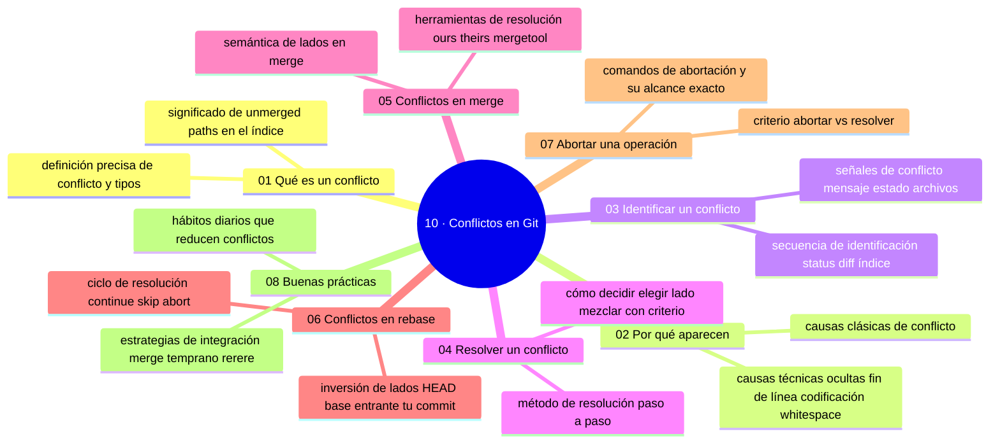

# 10 — Conflictos en Git

## Bienvenido a esta sección

Un conflicto es la señal de que Git no puede unir dos cambios por sí solo. No es un error: es Git deteniéndote y pidiendo una decisión humana. En esta sección aprendes a leerlo, resolverlo, cancelarlo y — sobre todo — a trabajar para que aparezca menos.

Es una de las secciones más prácticas del curso: cada capítulo termina en un método que puedes ejecutar en cualquier conflicto real.

## En esta sección estudiarás

* qué es un conflicto y qué NO es (y cómo se ven los marcadores);
* por qué aparecen (ediciones simultáneas, eliminaciones, estructura);
* cómo identificarlos con una secuencia de comandos (operación, archivos, lados);
* cómo resolverlos paso a paso (decidir, limpiar, marcar, verificar, cerrar);
* conflictos específicos de merge (lados estables) y de rebase (lados invertidos);
* cómo abortar operaciones y sanear estados a medias sin perder trabajo;
* buenas prácticas de trabajo que reducen conflictos.

## Objetivos de aprendizaje

Al terminar esta sección serás capaz de:

* identificar un conflicto y leer sus marcadores en merge y en rebase;
* explicar las tres causas típicas: ediciones simultáneas, eliminaciones y cambios estructurales;
* resolver un conflicto con el método de cinco pasos (decidir, limpiar, marcar, verificar, cerrar);
* abortar un merge o rebase en curso sin perder trabajo;
* aplicar prácticas que reducen los conflictos: ramas cortas, sincronización frecuente y commits atómicos.
## Mapa conceptual

## Mapa conceptual

---

---

## ¿Qué aprenderás en esta sección?

1. [`01-que-es-un-conflicto.md`](01-que-es-un-conflicto.md) — qué es, qué no es, los marcadores y su anatomía.
2. [`02-por-que-aparecen.md`](02-por-que-aparecen.md) — causas: cambios simultáneos, eliminaciones, renombres, estructura.
3. [`03-identificar-un-conflicto.md`](03-identificar-un-conflicto.md) — la secuencia de identificación (status, lados, residuos).
4. [`04-resolver-un-conflicto.md`](04-resolver-un-conflicto.md) — el método completo de resolución y verificación.
5. [`05-conflictos-en-merge.md`](05-conflictos-en-merge.md) — semántica de lados, herramientas y cierre en merge.
6. [`06-conflictos-en-rebase.md`](06-conflictos-en-rebase.md) — la inversión de lados y el ciclo `continue/skip/abort`.
7. [`07-abortar-una-operacion.md`](07-abortar-una-operacion.md) — cancelar sin dañar, estados colgados y recuperación.
8. [`08-buenas-practicas.md`](08-buenas-practicas.md) — prevención: hábitos, plan de archivos e integración temprana.

## Cómo estudiar esta sección

Sigue el orden: primero la teoría (01-02), luego el método (03-04) y después las especializaciones (05-06). Practica cada conflicto provocado antes de pasar de capítulo: se aprende resolviendo, no leyendo. Cierra con 07 (control) y 08 (prevención).

Y si quieres un conflicto de verdad sin armarlo a mano: el sandbox de la sección ([`recursos/sandboxes/10-conflicto.md`](../recursos/sandboxes/10-conflicto.md)) lo genera en segundos.

## Referencias

* Chacon, S. y Straub, B. — *Pro Git* (cap. 3: Merging).
* Git — Documentación oficial: «git merge», «git rebase --abort».
* Learn Git Branching — lección de conflictos.
---
 
## Checkpoint 10 — Comprobación obligatoria
1. Explica en tus propias palabras qué es un conflicto y cuándo ocurre.
2. Identifica en el historial de un repositorio los marcadores de conflicto <<<<<<<, =======, >>>>>>>.
3. Resuelve un conflicto simulado editando el archivo, marcándolo como resuelto y completando el merge.
4. Aborta un merge o rebase en marcha usando el comando adecuado y verifica que el estado vuelva al anterior.
5. Lista tres buenas prácticas que reducen la aparición de conflictos en tu flujo de trabajo.
Si puedes hacerlo **sin mirar instrucciones**, el checkpoint está cerrado.

## Autopreguntas de cierre

Sin mirar el material, responde mentalmente y luego compruébalo con los capítulos de la sección:

1. ¿Cuáles son las tres partes de un conflicto dentro de un archivo?
2. En un rebase, ¿qué lado es el tuyo y cuál el «ajeno» (vs. un merge)?
3. Estás a medias en un merge y quieres volver atrás: ¿qué escribes?
4. Antes de tocar el archivo, ¿qué es lo primero que tienes que entender de cada lado?
5. ¿Qué comando usas para continuar un rebase después de resolver un conflicto?
6. ¿Qué diferencia hay entre resolver un conflicto en merge y en rebase respecto a los lados?
7. ¿Cómo puedes evitar que un conflicto aparezca al trabajar en la misma línea de un archivo?
8. ¿Qué hace el comando `git rerere` y en qué situación es útil?

---

## Próximo paso

Cuando termines los ocho capítulos, continúa con la siguiente sección:

[`../11-git-deshacer-y-recuperar/`](../11-git-deshacer-y-recuperar/)
