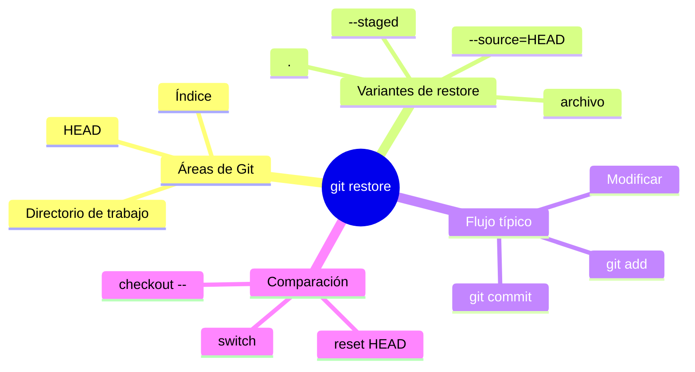
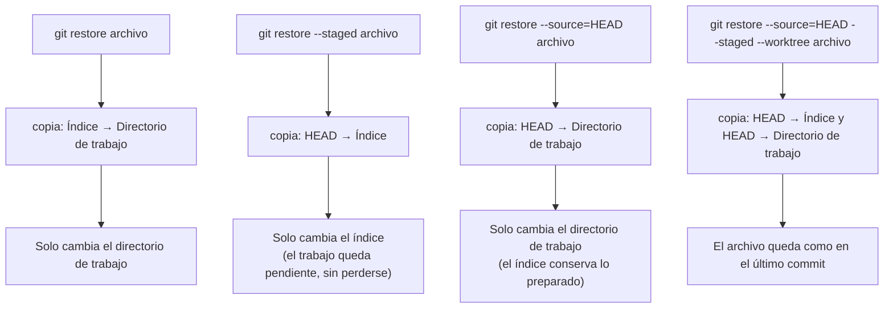

# git restore

## Introducción

Esta sección se llama «Git: deshacer y recuperar».

Su idea central es tranquilizadora: en Git, casi nada se pierde de verdad.

Cada cambio relevante que ocurre en tu repositorio local queda registrado: cada commit, cada movimiento del apuntador de la rama y cada cambio de referencia aparecen en un historial interno.

Por eso, deshacer no significa perder: significa utilizar los registros que Git ya guardó por ti.

En este capítulo aprenderás:

* qué es `git restore`;
* qué áreas de Git puede tocar;
* cómo deshacer cambios en el directorio de trabajo;
* cómo despreparar un archivo sin perder sus cambios;
* cómo restaurar un archivo desde el último commit;
* cómo aplicar el comando a varios archivos a la vez;
* qué relación tiene con el antiguo `git checkout --`.

Al terminar, podrás corregir cambios locales con precisión y sin miedo.




---

## 1. La recuperación es un superpoder

Imagina que vas escribiendo un informe y borras por accidente tres párrafos importantes.

Con un programa común, la única esperanza es la función «Deshacer» o una copia guardada antes.

Con Git, la situación es diferente.

Si el archivo está registrado en Git, el último estado confirmado sigue guardado dentro del repositorio local.

No necesitas hacer nada especial para encontrarlo: Git ya lo tiene.

```text
Archivo modificado (estado equivocado)
                 │
                 │  ¿y si el estado anterior ya estaba registrado?
                 ▼
Git conserva el estado anterior
                 │
                 ▼
Puedes volver a ese estado
```

Esta capacidad de recuperar estados anteriores es una de las mayores ventajas de utilizar Git.

El comando de este capítulo, `git restore`, es la herramienta más reciente para deshacer cambios dentro de las áreas locales.

Fue introducido en la versión 2.23 de Git, en 2019.

Los repositorios antiguos o los tutoriales viejos pueden mostrar otra sintaxis; por eso al final del capítulo verás también la comparación con `git checkout --`.

---

## 2. Las tres áreas de Git

Para entender `git restore`, conviene recordar las tres áreas locales que ya conoces.

```text
DIRECTORIO DE TRABAJO       ÍNDICE (STAGING AREA)      REPOSITORIO LOCAL (HEAD)
─────────────────────       ─────────────────────      ────────────────────────
Archivos que ves y          Versiones preparadas       Estado confirmado en el
modificas.                  para el siguiente commit.  último commit.
```

El recorrido típico de un cambio es:

```text
Modificas un archivo
        │
        ▼
git add (prepara el cambio)
        │
        ▼
git commit (registra el cambio)
```

`git restore` actúa sobre las dos primeras áreas y puede copiar contenido desde la tercera.

Hay una restricción importante: `git restore` solo afecta a archivos que Git ya conoce.

Es decir, archivos rastreados, aquellos que han sido preparados y registrados en algún momento.

Los archivos nuevos que todavía no fueron preparados nunca no pueden restaurarse, porque Git no guarda ningún estado anterior de ellos.

---

## 3. git restore archivo: deshacer en el directorio de trabajo

Supongamos que modificaste `leeme.txt` y el cambio no te gusta.

Antes de hacer nada, conviene saber exactamente qué está ocurriendo:

```bash
git status
```

Salida posible:

```text
On branch main
Changes not staged for commit:
  modified:   leeme.txt
```

El cambio existe solo en el directorio de trabajo: todavía no fue preparado con `git add`.

Para deshacerlo se utiliza:

```bash
git restore leeme.txt
```

Este comando copia el contenido del archivo desde el índice hacia el directorio de trabajo.

El resultado es que el archivo vuelve a tener el contenido que tenía cuando fue preparado por última vez.

```text
Antes de ejecutar el comando:

Índice:            contenido A
Directorio:        contenido B (modificación no deseada)

Después de ejecutar git restore leeme.txt:

Índice:            contenido A
Directorio:        contenido A (modificación descartada)
```

El índice no se toca.

El repositorio local tampoco se toca.

Solo se restaura el archivo del directorio de trabajo.

Para comprobar el resultado, vuelve a ejecutar:

```bash
git status
```

Si el cambio se descartó correctamente, el estado debería mostrar:

```text
On branch main
nothing to commit, working tree clean
```

### Recuperar un archivo eliminado por accidente

Hay un caso especialmente útil: si borraste un archivo rastreado del directorio de trabajo.

```text
Error: eliminaste leeme.txt por accidente
```

Si ese archivo ya estaba registrado en Git, puedes recuperarlo con el mismo comando:

```bash
git restore leeme.txt
```

Git vuelve a crear el archivo con el contenido guardado en el índice.

Por eso, si eliminas un archivo rastreado, no entrenes la costumbre de prepararlo de inmediato con `git add`.

Mientras no lo prepares, `git restore` puede devolverlo.

### Ver los cambios antes de descartarlos

Si tienes dudas sobre lo que vas a descartar, puedes comparar primero:

```bash
git diff leeme.txt
```

Este comando muestra las diferencias entre el directorio de trabajo y el índice para ese archivo.

Descartar un cambio es una operación local y rápida, pero conviene comprobarlo antes cuando el archivo es importante.

---

## 4. git restore --staged archivo: despreparar sin perder cambios

Ahora supongamos otra situación.

Preparaste un archivo con `git add` y después te das cuenta de que ese archivo no debía estar en el siguiente commit.

```bash
git add leeme.txt
git status
```

Salida posible:

```text
On branch main
Changes to be committed:
  modified:   leeme.txt
```

El cambio está en el índice, esperando a ser registrado.

Si ahora ejecutas `git restore leeme.txt`, el archivo del directorio de trabajo se iguala al índice: no ocurre nada visible, porque ambas áreas tienen el mismo contenido.

Para quitar el archivo de la preparación se utiliza la opción `--staged`:

```bash
git restore --staged leeme.txt
```

Esta variante copia el contenido desde HEAD (el último commit) hacia el índice.

El índice vuelve al estado del último commit, pero el directorio de trabajo no se modifica.

```text
Antes de ejecutar el comando:

HEAD:              contenido A
Índice:            contenido B
Directorio:        contenido B

Después de ejecutar git restore --staged leeme.txt:

HEAD:              contenido A
Índice:            contenido A
Directorio:        contenido B
```

El cambio no se perdió: dejó de estar preparado y volvió a ser un cambio pendiente en el directorio de trabajo.

Al ejecutar `git status` ahora verás:

```text
On branch main
Changes not staged for commit:
  modified:   leeme.txt
```

Esta es una de las utilidades más cotidianas del comando: corregir un `git add` sin perder el trabajo realizado.

### Despreparar una nueva incorporación

El mismo comando también sirve para archivos nuevos que ya fueron preparados.

```bash
git add nota-nueva.txt
git restore --staged nota-nueva.txt
```

El archivo `nota-nueva.txt` seguirá existiendo en tu carpeta, pero pasará a estar sin rastrear de nuevo.

No se borra nada del disco.

---

## 5. git restore --source=HEAD archivo: volver al último commit

Hay un tercer caso frecuente.

Tienes cambios en el directorio de trabajo y también en el índice, y quieres que el archivo vuelva exactamente a lo que está en el último commit.

La opción `--source` indica desde dónde tomar el contenido:

```bash
git restore --source=HEAD leeme.txt
```

Con `--source=HEAD`, el archivo del directorio de trabajo se reemplaza por la versión que está guardada en el último commit.

```text
Antes de ejecutar el comando:

HEAD:              contenido A
Índice:            contenido B
Directorio:        contenido C

Después de ejecutar git restore --source=HEAD leeme.txt:

HEAD:              contenido A
Índice:            contenido B
Directorio:        contenido A
```

Observa un detalle importante: esta variante, sin más opciones, solo toca el directorio de trabajo.

Si también quieres limpiar lo que está preparado, se añade `--staged`:

```bash
git restore --source=HEAD --staged --worktree leeme.txt
```

De esta forma el índice y el directorio de trabajo quedan en el estado del último commit para ese archivo.

### Restaurar desde otro commit

La opción `--source` no está limitada a HEAD.

También puede indicar otro commit del historial:

```bash
git restore --source=1d04f5b leeme.txt
```

Esto copia al directorio de trabajo la versión de `leeme.txt` que existía en el commit `1d04f5b`.

El historial no se modifica: simplemente vuelves a usar una versión antigua del contenido.

Para conocer el hash de un commit antiguo se utiliza:

```bash
git log --oneline leeme.txt
```

Este comando muestra los commits que tocaron ese archivo, en orden inverso al tiempo.

---

## 6. git restore .: aplicar a todos los archivos

En lugar de nombrar archivos uno a uno, se puede indicar una ruta.

El símbolo `.` representa la carpeta actual y su contenido.

```bash
git restore .
```

Este comando restaura todos los archivos modificados del directorio de trabajo de la carpeta actual (y sus subcarpetas) desde el índice.

Úsalo cuando quieres descartar de una vez todas las modificaciones que hay en el proyecto sin tocar nada que esté preparado.

Con `--staged`, el efecto se invierte en la dirección:

```bash
git restore --staged .
```

Con esa combinación se desprepara todo lo que había en el índice, volviendo cada archivo a estar en el estado del último commit dentro del índice, sin borrar ningún cambio del directorio de trabajo.

Hay dos límites que conviene recordar:

* los archivos sin rastrear no aparecen en `git status` como modificados ni desaparecen: `git restore` no los borra;
* los archivos eliminados sí pueden volver, porque Git conserva su último contenido.

Si necesitas descartar también archivos sin rastrear, esa es otra operación diferente y más peligrosa, que no estudiamos aquí.

---

## 7. Comparación con el antiguo git checkout --

Antes de Git 2.23, la forma habitual de deshacer cambios era:

```bash
git checkout -- leeme.txt
```

El comando `checkout` hacía muchas cosas a la vez: cambiar de rama, crear ramas y restaurar archivos.

Esa multiplicidad de funciones generaba confusión, sobre todo en repositorios compartidos, donde cambiar de rama sin querer tiene consecuencias.

Por eso Git separó las funciones:

* `git switch` se encarga de cambiar de rama;
* `git restore` se encarga de restaurar contenido.

La equivalencia entre sintaxis antigua y nueva es:

| Operación | Sintaxis antigua | Sintaxis moderna |
|---|---|---|
| Restaurar archivo desde el índice | `git checkout -- archivo` | `git restore archivo` |
| Restaurar archivo desde HEAD | `git checkout HEAD -- archivo` | `git restore --source=HEAD archivo` |
| Despreparar archivo | `git reset HEAD archivo` | `git restore --staged archivo` |

Ambas sintaxis siguen funcionando en la mayoría de los casos, pero en este curso utilizaremos la moderna.

Cuando leas material antiguo, ya sabrás traducirlo.

---

## 8. Diagrama final: qué toca cada variante

Esta imagen resume el comportamiento del comando.



Ninguna de estas variantes modifica el historial de commits.

`git restore` nunca crea, cambia o borra commits.

Solo mueve contenido entre las tres áreas locales.

---

## Práctica guiada

En esta práctica trabajarás con un repositorio de prueba.

No utilices tu proyecto real.

### Objetivo

Comprender qué áreas toca cada variante de `git restore`.

### Paso 1: crea un repositorio de prueba

Crea una carpeta nueva, por ejemplo `prueba-restore`, y entra a ella.

```bash
git init
```

### Paso 2: crea el primer archivo

Crea un archivo llamado `leeme.txt` con este contenido:

```text
Versión inicial del archivo.
```

### Paso 3: prepara y registra

```bash
git add leeme.txt
git commit -m "Añadir el archivo inicial"
```

### Paso 4: modifica el archivo sin prepararlo

Edita `leeme.txt` y añade esta línea:

```text
Cambio que quiero descartar.
```

Comprueba el estado:

```bash
git status
```

Deberías ver el archivo como `modified`, sin preparar.

### Paso 5: descarta el cambio

```bash
git restore leeme.txt
```

Abre el archivo y comprueba que la línea eliminada desapareció.

Comprueba también:

```bash
git status
```

El repositorio debe mostrar `nothing to commit, working tree clean`.

### Paso 6: prepara un archivo equivocado

Crea un archivo `borrador.txt`, prepáralo y verifica el estado:

```bash
git add borrador.txt
git status
```

Ahora desprepáralo sin perder su contenido:

```bash
git restore --staged borrador.txt
```

El archivo sigue en tu carpeta, pero `git status` lo muestra ahora como un archivo nuevo sin rastrear.

### Paso 7: restaura desde el último commit

Modifica de nuevo `leeme.txt`, prepáralo con `git add` y registra un commit nuevo:

```bash
git commit -m "Añadir una segunda versión"
```

Modifica el archivo una vez más y ejecuta:

```bash
git restore --source=HEAD leeme.txt
```

El archivo vuelve al contenido del último commit.

### Resultado esperado

Deberías poder explicar con claridad:

* qué descartó cada comando;
* qué área se modificó en cada caso;
* qué cambios se conservaron y cuáles no.


### Ejercicio de transferencia
Crea una rama nueva, agrega un archivo, modifícalo, prepáralo y luego usa `git restore --staged` para desaprepararlo sin perder los cambios, verificando con `git status` que el archivo aparezca como no preparado pero aún presente.
Luego, confirma el cambio con `git commit` y verifica que el historial mantenga el archivo preparado anteriormente.

---

## Errores comunes

### Error 1: creer que git restore borra el historial

`git restore` nunca toca los commits.

Solo mueve contenido entre las tres áreas locales.

El historial de commits permanece intacto.

### Error 2: usar git restore . sin revisar antes

Descartar todos los cambios a la vez es rápido y fácil de equivocarse.

Antes de ejecutar `git restore .`, revisa con `git status` qué archivos se verán afectados.

### Error 3: esperar recuperar archivos nunca registrados

Si un archivo nunca pasó por `git add`, Git no tiene ningún estado anterior de él.

`git restore` no puede devolver un archivo que Git nunca vio.

### Error 4: confundir --staged con descartar el trabajo

`git restore --staged` solo saca el archivo de la preparación.

El contenido modificado sigue intacto en el directorio de trabajo.

Si después escribes por encima, sí puedes perderlo.

### Error 5: olvidar la raya doble antes de la ruta

Cuando el nombre de archivo puede confundirse con un commit, Git ofrece la sintaxis con raya doble para despejar dudas:

```bash
git restore -- leeme.txt
```

Si el comando te indica un error de ambigüedad, usa esta forma.

### Error 6: intentar recuperar un archivo eliminado ya preparado

Si eliminaste un archivo y después ejecutaste `git add` para registrar la eliminación, el índice ya no lo contiene.

En ese caso `git restore archivo` no lo recupera desde el índice.

Necesitas la variante `--source=HEAD`, que toma el contenido desde el último commit.

---

## Buenas prácticas

* Ejecuta `git status` antes y después de cada comando de deshacer;
* Utiliza `git diff` para revisar un cambio antes de descartarlo;
* Descarta cambios archivo por archivo cuando el proyecto es importante;
* Reserva `git restore .` para situaciones en la que estés seguro de que quieres descartar todo;
* Prefiere `--staged` para corregir un `git add` equivocado: pierdes la preparación, no el trabajo;
* En repositorios compartidos, recuerda que `git restore` no modifica el historial, por lo que también es seguro cuando ya hiciste push.

---

## Cómo saber si lo entendiste

Deberías poder explicar con tus propias palabras:

* qué diferencia existe entre el directorio de trabajo, el índice y HEAD;
* qué hace exactamente `git restore archivo`;
* qué hace `git restore --staged archivo` y qué es lo que NO borra;
* para qué sirve `git restore --source=HEAD`;
* qué archivos quedan afectados por `git restore .`;
* por qué no puedes restaurar un archivo que Git nunca registró;
* por qué `git restore` es seguro aunque el historial esté compartido.

Si alguna respuesta todavía no está clara, vuelve a la sección correspondiente y repite la práctica.

---

## Resumen

En este capítulo aprendiste que:

* `git restore` restaura contenido entre las áreas locales de Git;
* `git restore archivo` copia desde el índice al directorio de trabajo y descarta la modificación;
* `git restore --staged archivo` copia desde HEAD al índice: desprepara sin perder cambios;
* `git restore --source=HEAD archivo` copia desde el último commit al directorio de trabajo;
* `git restore .` aplica la operación a todos los archivos modificados de la carpeta actual;
* la sintaxis moderna reemplaza a `git checkout -- archivo` y a `git reset HEAD archivo`;
* `git restore` nunca modifica los commits, por lo que es seguro en cualquier situación local.

La idea principal es:

> **git restore mueve contenido entre las áreas locales sin tocar el historial: descarta o desprepara cambios, pero no destruye commits.**

---
## Autopreguntas de cierre

Sin mirar el material, responde mentalmente y luego compruébalo con este capítulo:
1. ¿Cuál es la diferencia entre usar `git restore archivo` y `git restore --staged archivo` en cuanto a qué área de Git modifican?
2. ¿Qué ocurre con el historial de commits cuando se usa cualquiera de las variantes de `git restore`?
3. Si tienes un archivo preparado (en el índice) que no deseas incluir en el próximo commit, ¿qué comando usarías para desaprepararlo sin perder los cambios en el directorio de trabajo?
4. ¿Cómo puedes recuperar un archivo que eliminaste por accidente del directorio de trabajo, siempre que estuviera previamente registrado en Git?
5. ¿Qué indica la opción `--source=HEAD` al usar `git restore` y qué efecto tiene en el directorio de trabajo y el índice?
6. ¿Cuál es la ventaja de usar `git restore .` y qué limitación tiene respecto a los archivos sin rastrear?
## Próximo paso

Un cambio en el directorio de trabajo se deshace con `git restore`.

Pero ¿qué ocurre cuando el cambio equivocado ya es un commit registrado?

Ese problema lo resuelve el siguiente capítulo.

[`02-git-revert.md`](02-git-revert.md)
