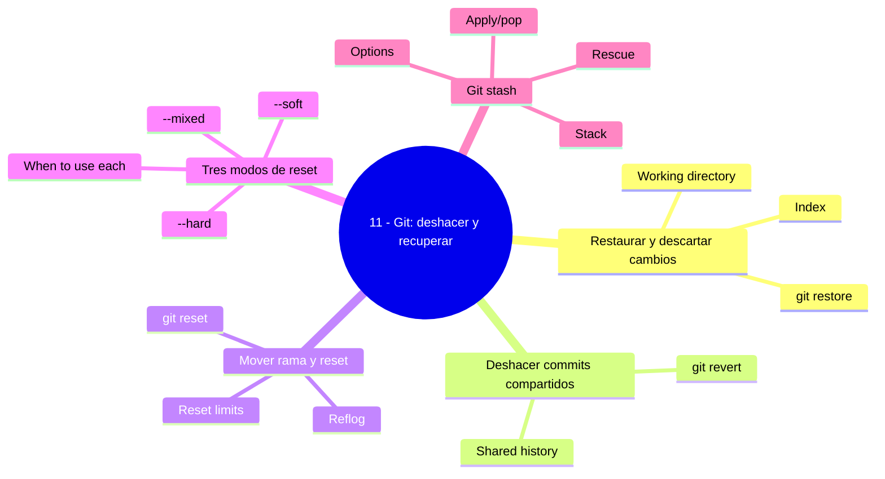

 + # 11 ù Git: deshacer y recuperar

## Bienvenido a esta secci≤n

Git es un sistema de control de versiones: casi nada se pierde del todo. Esta secci≤n ense±a a corregir en cada nivel ù archivo sin commitear, commit local, commit compartido ù y a guardar trabajo a medias con `stash`.

Cada herramienta tiene su ßmbito: usar mal `reset` donde toca `revert` (o al revΘs) es uno de los errores mßs costosos. Aquφ aprendes a elegir con criterio.


## Mapa conceptual de este capφtulo


## Mapa conceptual de este capítulo
```mermaid`r`nmindmap`r`n  root((11 - Git: deshacer y recuperar))`r`n    Restaurar y descartar cambios`r`n      Working directory`r`n      Index`r`n      git restore`r`n    Deshacer commits compartidos`r`n      git revert`r`n      Shared history`r`n    Mover rama y reset`r`n      git reset`r`n      Reflog`r`n      Reset limits`r`n    Tres modos de reset`r`n      --soft`r`n      --mixed`r`n      --hard`r`n      When to use each`r`n    Git stash`r`n      Stack`r`n      Apply/pop`r`n      Options`r`n      Rescue`r`n```r`n`r`n
## En esta secci≤n estudiarßs

* restaurar contenido entre las ßreas de Git sin tocar historial (`git restore`);
* deshacer commits compartidos a±adiendo cambios nuevos (`git revert`);
* mover el apuntador de la rama con `git reset` y sus tres modos;
* la diferencia profunda entre `--soft`, `--mixed` y `--hard`;
* guardar y recuperar trabajo temporal con `git stash`;
* el reflog como red de seguridad de todas las operaciones locales.

## Objetivos de aprendizaje

Al terminar esta secci≤n serßs capaz de:

* elegir la herramienta seg·n el nivel: `restore` (archivos), `revert` (historial compartido), `reset` (historial local);
* explicar la diferencia entre `--soft`, `--mixed` y `--hard`;
* deshacer un commit compartido con `revert` sin reescribir el historial;
* guardar y recuperar trabajo a medias con `git stash`;
* localizar commits ½perdidos╗ con `git reflog`.

---

## ┐QuΘ aprenderßs en esta secci≤n?

1. [`01-git-restore.md`](01-git-restore.md) ù restaurar y descartar cambios en working directory e φndice.
2. [`02-git-revert.md`](02-git-revert.md) ù deshacer commits con seguridad cuando el historial es compartido.
3. [`03-git-reset.md`](03-git-reset.md) ù mover la rama, el reflog y los lφmites del reset.
4. [`04-soft-mixed-hard.md`](04-soft-mixed-hard.md) ù los tres modos en profundidad, cußndo usar cada uno.
5. [`05-git-stash.md`](05-git-stash.md) ù guardar trabajo a medias: pila, apply/pop, opciones y rescate.

## C≤mo estudiar esta secci≤n

Primero el terreno com·n (01: las ßreas de Git y `restore`), luego la correcci≤n de historial en sus dos filosofφas (02 revert para compartir, 03-04 reset para local), y cierra con 05 (`stash`) como herramienta de diario. Practica cada comando en un repositorio de prueba antes de usarlo en uno real ù el sandbox de la secci≤n ([`recursos/sandboxes/11-reset.md`](../recursos/sandboxes/11-reset.md)) lo genera en segundos.

## Referencias

* Chacon, S. y Straub, B. ù *Pro Git* (cap. 2: Undoing Things; cap. 3).
* Git ù Documentaci≤n oficial: ½git restore╗, ½git reset╗, ½git revert╗, ½git reflog╗.
* Stack Overflow ù pregunta can≤nica: ½difference between git checkout, git restore, git reset and git revert╗.

---

## Autopreguntas de cierre
## Checkpoint 11 — Comprobación obligatoria
1. Usa git restore --staged <file> para desechar cambios en el índice sin tocar el working directory.
2. Ejecuta git revert <commit> para crear un commit que revierta un commit compartido.
3. Utiliza git reset --soft HEAD~1 para mover la rama manteniendo los cambios en el índice.
4. Guarda trabajo a medias con git stash push -m "mensaje" y récupelo con git stash pop.
5. Recupera un commit "perdido" usando git reflog y git reset --hard <hash>.
6. Si puedes hacerlo **sin mirar instrucciones**, el checkpoint está cerrado.
## Autopreguntas de cierre

Sin mirar el material, responde mentalmente y luego compruébalo con los capítulos de la sección:

1. Cometiste un error en una rama compartida: ¿qué comando usas y por qué no 
eset?
2. ¿Qué diferencia hay entre 
eset --hard y 
estore?
3. Tienes trabajo a medias y necesitas cambiar de rama: ¿qué haces?
4. “Perdiste” un commit con un reset: ¿dónde está y cómo lo recuperas?
5. ¿Cuándo es apropiado usar git reset --soft en lugar de --mixed o --hard?
6. ¿Cómo puedes recuperar un stash eliminado accidentalmente con git stash drop?

## Pr≤ximo paso

Cuando termines los cinco capφtulos, contin·a con la siguiente secci≤n:

[`../12-git-avanzado/`](../12-git-avanzado/)

TEST LINE

TEST LINE FROM SCRIPT
 + 


