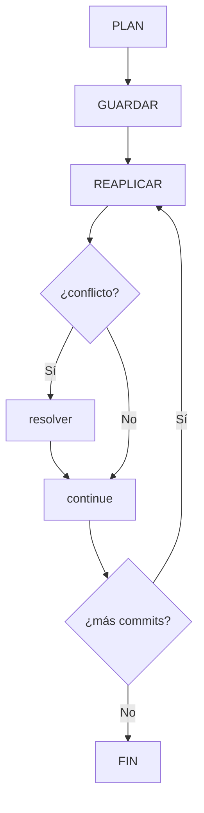

# Rebase interactivo

## Introducción

`git rebase -i` abre tu serie de commits en un editor de texto y te deja decir qué quieres hacer con cada uno: dejarlo, unirlo, reescribir su mensaje, pausarlo para editarlo, o quitarlo. Es la herramienta de precisión para limpiar historia antes de compartirla.

En los capítulos anteriores ya reescribiste historia con amend y reset; aquí el trabajo es sobre una SERIE, con un plan que tú diseñas.

En este capítulo aprenderás:

* el formato de la lista `pick/reword/squash/fixup/drop/edit/exec/break`;
* cómo se ejecuta el plan paso a paso (y qué pasa al guardar);
* el flujo de limpieza de una rama antes del Pull Request;
* conflictos durante la reaplicación;
* errores comunes con diagnóstico completo, práctica guiada y nivel profesional (alias y atajos).

## Mapa conceptual de este capítulo

```mermaid
mindmap
  root((Rebase interactivo))
    1. Qué abre y qué NO hace (aún)
    2. Las acciones del plan
    3. El ciclo de ejecución
    4. Flujo típico: limpiar antes del PR
    5. Conflictos y pausas (edit/break)
    6. Errores comunes con diagnóstico completo
    7. Práctica guiada
    8. Nivel profesional + resumen

---
## 1. Qué abre y qué NO hace

```bash
git rebase -i HEAD~4        # los últimos 4 commits
git rebase -i main          # todo lo que no está en
                            # main (¡ojo con el alcance!)
git rebase -i origin/main   # sobre lo publicado
```

```text
Al guardar y salir:
    │
    ├── Git AÚN no cambia nada: solo guardó tu plan
    │
    ├── al cerrar el editor, empieza la REAPLICIÓN
    │
    └── cada commit seleccionado se recrea sobre la
        base → hashes nuevos
```

```text
¡Cuidado con el alcance!
    │
    ├── HEAD~4 = exactamente 4 para atrás
    │
    └── main = TODA la diferencia respecto a main
        (si llevas 30 commits, verás 30 líneas)
```

---

## 2. Las acciones del plan

```text
Acción         Qué hace
──────────────────────────────────────────────────────
pick    mantiene el commit tal cual (cambia hash)
reword  lo re-aplica y te deja cambiar el MENSAJE
squash  lo une al anterior y combina los MENSAJES
fixup   lo une al anterior y descarta su mensaje
edit    pausa en ese commit (amend parcial, dividir)
drop    no lo aplica (lo elimina de la serie)
exec    ejecuta un comando en cada paso (tests, fmt)
break   pausa a mitad de serie para trabajar
```

```text
Ejemplo de plan:
    │
    pick   a1b2c34 feat: añade cálculo
    fixup  77aa88b typo
    reword 99zz111 feat: añade cálculo de total
    drop   55bb666 borrador
    exec   npm test
    │
    └── resultado: 2 commits limpios con tests
        ejecutados al final
```

```text
Reglas de uso:
    │
    ├── el orden del archivo es el orden final
    │
    ├── se puede REORDENAR líneas (con cuidado: cambia
    │   la base de cada una)
    │
    └── fixup + autosquash (abajo, punto 8) evita
        escribir planes grandes a mano
```

---

## 3. El ciclo de ejecución



---

## 4. Flujo típico: limpiar antes del PR

```text
Rama con historia ruidosa:
    │
    ├── "feat: wip"
    ├── "fix typo"
    ├── "wip 2"
    ├── "feat: terminado"
    └── "fix typo 2"
```

```text
Plan (git rebase -i origin/main):
    │
    ├── pick   "feat: wip"
    ├── fixup  "fix typo"
    ├── fixup  "wip 2"
    ├── reword "feat: terminado"   ← mensaje final
    ├── fixup  "fix typo 2"
    │
    └── resultado: UN commit claro «feat: ...»
```

```text
Antes de abrir el PR (checklist):
    │
    ├── 1. git rebase -i origin/main (alcance exacto)
    ├── 2. plan con reword/fixup
    ├── 3. tests (exec o manuales)
    ├── 4. git log -p -n 3 (revisar el resultado)
    └── 5. push (force-with-lease si ya existía)
```

---

## 5. Conflictos y pausas

```text
Durante la reaplicación puede salir conflicto:
    │
    ├── los LADOS están invertidos respecto a merge
    │   (cap. 06 de la sección 10): HEAD = base,
    >>>>>> = commit re-aplicado
    │
    ├── resolver → add → git rebase --continue
    │
    └── con varios commits: puede parar varias veces
```

```bash
# con edit (dividir un commit grande):
git reset --soft HEAD~1        # desmonta manteniendo
                                # staged
git commit -m "parte 1"
git add -p                     # elegir trozos
git commit -m "parte 2"
git rebase --continue
```

---

## 6. Errores comunes con diagnóstico completo

### Error 1: equivocarse en el alcance (HEAD~N vs. main)

**Qué ocurrió:** se editaron commits de otros (o de más) porque el rango era demasiado amplio.

**Por qué posibles:**
* `HEAD~N` calculado a ojo;
* rama con merges (HEAD~N salta padres distintos);
* base incorrecta respecto a la rama publicada.

**Cómo comprobarlo:** la lista del editor contiene commits que no son tuyos o que ya están en main (`git log main..rama --oneline` como referencia).

**Opciones:** `--abort` si aún no se ejecutó nada malo; rehacer desde el estado correcto con reflog.

**Riesgos:** reescribir historia ajena.

**Solución:** calcular el alcance con `git log --oneline <base>..HEAD` antes y usar esa base en el `-i`.

**Cómo se evita:** «si la lista tiene caras extrañas, cierra sin guardar» (escape: :cq).

---

### Error 2: guardar el editor sin entender el plan

**Qué ocurrió:** commits desaparecidos o mensajes rotos tras ejecutar.

**Por qué:** se guardó por costumbre (como al reordenar).

**Cómo comprobarlo:** `git log -p` vs. `git reflog` previo.

**Opciones:** abort/`reset --hard` a `HEAD@{n}` del reflog anterior al rebase; rehacer el plan leyendo cada línea.

**Riesgos:** pérdida aparente de trabajo.

**Solución:** leer las 10 líneas del plan antes de `:wq`.

**Cómo se evita:** practicar en repo de prueba (cap. 8).

---

### Error 3: fixup/squash en el commit equivocado (orden invertido)

**Qué ocurrió:** el `fixup` aparece ANTES del commit al que debe unirse → error o unión rara.

**Por qué:** recordar mal la dirección (el fixup se aplica hacia ARRIBA, al pick anterior).

**Cómo comprobarlo:** mensaje del propio rebase (Git avisa si falta un pick).

**Opciones:** corregir el plan en la pausa; o abort y rehacer.

**Riesgos:** historial ilógico.

**Solución:** convención: fixup SIEMPRE justo debajo de su pick.

**Cómo se evita:** planes cortos y con comentarios visuales.

---

### Error 4: olvidar que los hashes de TODA la serie cambian

**Qué ocurrió:** alguien tenía anotado un hash (ticket, comentario) y ya no existe.

**Por qué:** es la naturaleza de la reescritura.

**Cómo comprobarlo:** `git cat-file -t <hash>` → el hash viejo sigue en reflog pero no en la rama.

**Opciones:** usar referencias estables (nombres de rama, tags) en documentación, no hashes.

**Riesgos:** enlaces rotos en tickets.

**Solución:** documentar por rama/tag.

**Cómo se evita:** regla de oro del capítulo 01.

---

### Error 5: rebase -i sobre rama publicada sin coordinar

**Qué ocurrió:** el push posterior rechazó (o alguien pisó trabajo con force).

**Por qué:** el rebase de una rama con PR abierto afecta a revisores.

**Cómo comprobarlo:** `git status -sb` (divergencia), avisos del remoto.

**Opciones:** si nadie ha trabajado encima: `push --force-with-lease` + aviso en el PR; si hay comentarios/commits ajenos: no reescribir, añadir commits o acordar re-sincronizar.

**Riesgos:** perder revisiones; confusión en el equipo.

**Solución:** política: reescribir solo antes de abrir el PR (o con lease y aviso).

**Cómo se evita:** fase de limpieza ANTES de pedir revisión.

---

### Error 6: usar `edit` y no saber cómo salir

**Qué ocurrió:** el rebase se queda «pausado» y el usuario fuerza estados raros.

**Por qué:** no se entendió que `edit` es una pausa deliberada.

**Cómo comprobarlo:** `git status` («rebase in progress… you can amend»).

**Opciones:**
* terminar el trabajo del edit → `git rebase --continue`;
* no querías pausar → `git rebase --abort`;
* omitir → `--skip`.

**Riesgos:** dejar la rama a medias.

**Solución:** las tres salidas siempre disponibles (sección 07 de la sección 10).

**Cómo se evita:** no incluir `edit` en planes si no se necesita.

---

## 7. Práctica guiada

### Objetivo

Limpiar una rama de cuatro commits con un plan de rebase interactivo completo.

### Paso 1: rama ruidosa

```bash
git init rebint && cd rebint
echo base > app.txt && git add . && git commit -m "base"
git switch -c feature
echo 1 >> app.txt && git add . && git commit -m "wip"
echo 2 >> app.txt && git add . && git commit -m "fix typo"
echo 3 >> app.txt && git add . && git commit -m "wip 2"
echo 4 >> app.txt && git add . && git commit -m "feat: app lista"
git log --oneline
```

### Paso 2: plan

```bash
git rebase -i HEAD~4
# pick   wip
# fixup  fix typo
# fixup  wip 2
# reword feat: app lista   (cambia mensaje si quieres)
# guarda y cierra
```

### Paso 3: verificar

```bash
git log --oneline            # debe quedar base + 1 (o 2)
git show HEAD --stat
git diff HEAD~1..HEAD        # el contenido final es el
                             # esperado (líneas 1-4)
```

### Paso 4: práctica con edit

```bash
git rebase -i HEAD~1
# cambia pick → edit; guarda
git reset --soft HEAD~1
git commit -m "mitad"
echo extra >> app.txt && git add . && git commit -m "otra mitad"
git rebase --continue
git log --oneline
```

### Paso 5: práctica con exec

```bash
git rebase -i HEAD~2
# añade al final: exec echo "test simulado OK"
# guarda
# observa la salida durante la reaplicación
```

### Paso 6: recuperación

```bash
git reflog | Select-String rebase   # o reflog a secas
git reset --hard <commit previo al primer rebase>
git log --oneline            # historia original de vuelta
```

### Resultado esperado

Una rama limpiada con plan, dividida con edit y recuperada con reflog sin daños.

### Conclusión esperada

El rebase interactivo es un plan de texto ejecutado con precisión: leer el plan es tan importante como escribirlo.

---

## 8. Nivel profesional + resumen

### 8.1. Atajos profesionales

```bash
# fixup automático (los "fixup!" van solos a su sitio):
git commit --fixup <hash>
git rebase -i --autosquash <base>
# (sin --autosquash, añade al alias:
#  git config --global rebase.autosquash true)
```

```text
    │
    ├── trabajas normal (commits pequeños con fixup!)
    │
    └── al final: un solo rebase --autosquash con el
        plan ya armado por Git
```

```bash
# historial legible mientras trabajas:
git config --global alias.hist \
   "log --oneline --graph --decorate --date=short"
```

### 8.2. Rebase interactivo en CI

```text
    │
    ├── muchos equipos exigen historia plana por rama:
    │   squash merge en GitHub (la plataforma aplasta
    │   al integrar → el rebase manual es opcional)
    │
    └── cuando NO hay squash merge: el autor limpia con
        -i antes del PR (punto 4)
```

### 8.3. Resumen

En este capítulo aprendiste que:

* `rebase -i` guarda tu plan en un editor y solo entonces reaplica la serie (hashes nuevos);
* acciones: `pick`, `reword`, `squash`, `fixup`, `edit`, `drop`, `exec`, `break` — el orden del plan es el orden final;
* el alcance se calcula con `git log <base>..HEAD` y se respeta en el `-i`;
* conflictos y pausas se resuelven con el método de la sección 10 (lados invertidos en rebase);
* los errores típicos (alcance malo, plan no leído, fixup mal ubicado, hashes documentados, publicado sin coordinar, edit atrapado) se previenen con checklist y reflog;
* a nivel profesional: `--fixup` + `--autosquash`, `rebase.autosquash` y políticas de squash merge simplifican el trabajo.

La idea principal es:

> **El rebase interactivo convierte la historia en un plan que se lee antes de ejecutarse: quien no lee su propio plan, no conoce su propio historial.**

---

## Autopreguntas de cierre

Sin mirar el material, responde mentalmente y luego compruébalo con este capítulo:

1. ¿Qué acción de rebase -i usarías para corregir el mensaje de un commit sin cambiar su contenido?
2. ¿Cómo afecta el orden de las acciones en el plan de rebase -i al historial resultante?
3. ¿En qué situaciones sería útil usar el comando `exec` durante un rebase interactivo?
4. ¿Cómo risolves un conflicto que ocurre durante la reaplicación de un rebase interactivo?
5. ¿Qué ventaja tiene usar `--autosquash` con `git commit --fixup` frente a escribir el plan manualmente?
6. ¿Cómo determinarías el alcance adecuado para un `git rebase -i` si tu rama tiene merges?
7. ¿Qué política de equipo sería adecuada para decidir cuándo usar rebase interactivo en una rama compartida?
8. ¿Cómo puedes recuperar tu historial si accidentalmente ejecutas un rebase interactivo que elimina commits importantes?

---

## Ejercicio de transferencia

Toma una rama con tres commits consecutivos que corrigen errores tipográficos. Usa `git rebase -i` con las acciones `fixup` para unir los dos primeros commits en el tercero y verifica que el historial resultante tenga un solo commit con todos los cambios.

## Próximo paso

Ya editas series completas.

La siguiente herramienta mueve UN commit concreto entre ramas sin arrastrar la rama entera.

Continúa con:

[`03-cherry-pick.md`](03-cherry-pick.md)