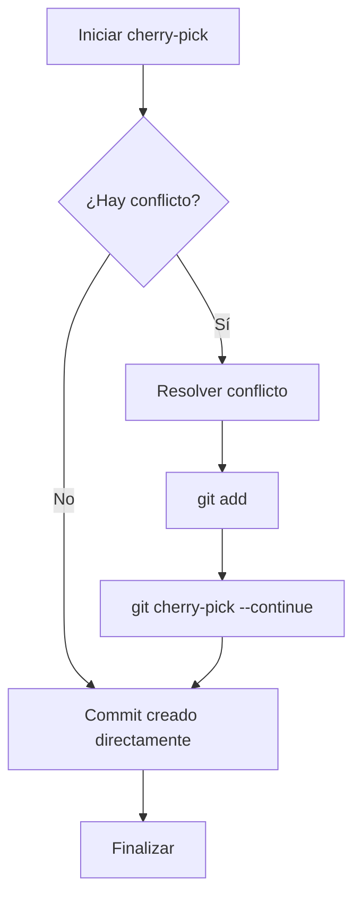

# git cherry-pick

## Introducción

A veces no quieres llevarse una rama entera, sino UN commit concreto: el arreglo de seguridad que hiciste en una versión, el fix que también hace falta en `main`, la feature que ya probaste en otro sitio.

`git cherry-pick` copia el cambio de un commit (o de varios) a tu rama actual, creando un commit nuevo con el mismo parche y un hash distinto.

Es una herramienta cotidiana en mantenimiento, liberaciones y correcciones cruzadas — y también una fuente clásica de conflictos «fantasma» cuando se repite el mismo cambio.

En este capítulo aprenderás:

* cómo funciona internamente (aplicar parche + nuevo commit);
* cherry-pick de un commit, un rango y varias ramas;
* `-x` para documentar el origen (invaluable en releases);
* conflictos y repetidos (el mismo fix dos veces);
* errores comunes con diagnóstico completo, práctica guiada y nivel profesional.

## Mapa conceptual de este capítulo

```mermaid
mindmap
  root((git cherry-pick))
    1. Qué hace (y qué NO hace)
    2. Selección: hash, rangos, -x
    3. Conflictos
    4. Cherry-picks repetidos y -n
    5. Errores comunes con diagnóstico completo
    6. Práctica guiada
    7. Nivel profesional + resumen

---
## 1. Qué hace (y qué NO hace)

```text
Situación:

main ── A ── B ── C
                │
release ── A ── B'        (necesitas C aquí)

git switch release
git cherry-pick <hash de C>

release ── A ── B' ── C'
                        │
                        └── mismo CAMBIO que C,
                            commit nuevo (padre:
                            B')
```

```text
Qué SÍ hace:
    │
    ├── aplica la diferencia (parche) del commit sobre
    │   tu HEAD actual
    │
    ├── crea un commit con mensaje (por defecto el
    │   original) y referencia (con -x)
    │
    └── funciona entre ramas, forks y hasta
        repositorios con el mismo origen
```

```text
Qué NO hace:
    │
    ├── NO mueve el commit original (sigue en su rama)
    │
    ├── NO arrastra los commits «entre medias» (solo
    │   los elegidos)
    │
    └── NO copia el historial: solo el cambio (pierde
        el contexto de los commits originales)
```

---

## 2. Selección: hash, rangos, `-x`

```bash
git cherry-pick a1b2c34               # uno
git cherry-pick a1b2c34 d5e6f77       # dos concretos
git cherry-pick a1b2c34^..f8g9h01     # rango (del
                                        # primero al
                                        # último inclusive)
git cherry-pick main..feature         # todo lo que
                                        # feature tiene y
                                        # main no
git cherry-pick -x a1b2c34            # deja constancia
                                        # del origen
```

```text
Mensaje con -x:
    │
    └── "fix: cálculo total (cherry picked from commit
        a1b2c34)"
        → en release se ve DE DÓNDE vino: auditoría
          gratis
```

```bash
# dónde conseguir los hashes:
git log --oneline main..feature
git log --oneline feature -n 5
```

---

## 3. Conflictos



---

## 4. Cherry-picks repetidos y `-n`

```bash
# preparar cambios SIN commit (para combinar varios):
git cherry-pick -n a1b2c34 d5e6f77
git commit -m "fix conjunto para release"
```

```text
Cuándo -n:
    │
    ├── varios fixes que se comunican (un solo commit
    │   de release)
    │
    └── o para traer cambios y amendar el commit actual
```

```text
Estrategia de mantenimiento:
    │
    ├── main recibe el fix → se etiqueta (tag) →
    │   release cherry-pick del tag/hash con -x
    │
    └── documentar en CHANGELOG el hash de origen
        (sección 14)
```

---

## 5. Errores comunes con diagnóstico completo

### Error 1: cherry-pick «de más» (arrastrar toda la rama)

**Qué ocurrió:** se aplicó un rango gigante en vez de un commit (o se copiaron commits ajenos).

**Por qué posibles:**
* rango mal calculado (`main..feature` sin revisar);
* usar el nombre de rama donde tocaba un hash.

**Cómo comprobarlo:** `git log --oneline -n 10` tras el pick; la lista no coincide con lo esperado.

**Opciones:**
* no publicado: `git reset --hard HEAD~k` (con cuidado) o reflog;
* publicado: revert del exceso o rehacer con coordinación.

**Riesgos:** historia de release contaminada.

**Solución:** antes del pick, `git log --oneline <rango>` y confirmar la lista exacta.

**Cómo se evita:** copiar hashes de `git log`, no de memoria.

---

### Error 2: cherry-pick de un commit de merge

**Qué ocurrió:** error o resultado confuso al aplicar un commit de fusión (dos padres).

**Por qué:** un commit de merge no tiene un «parche» obvio: Git necesita saber qué lado.

**Cómo comprobarlo:** `git show --stat <hash>` (es un merge) o `git log --merges`.

**Opciones:**
* elegir el contenido real (los commits de la rama fusionada) en vez del merge;
* o usar `-m 1` / `-m 2` cuando proceda (indicar el lado) — con criterio.

**Riesgos:** aplicar la versión equivocada.

**Solución:** cherry-pick de cambios, no de fusiones.

**Cómo se evita:** revisar con `show` antes.

---

### Error 3: repetir el mismo fix (doble aplicación)

**Qué ocurrió:** conflicto extraño o cambio duplicado tras aplicar un fix que ya estaba.

**Por qué:** el fix entró por merge y ahora por pick (o dos picks).

**Cómo comprobarlo:** `git log --grep "texto del mensaje"` en la rama actual; `git show` comparado.

**Opciones:**
* si está completo: abortar el pick;
* si está a medias: resolver y confirmar contenido final;
* si se aplicó de más: revert puntual.

**Riesgos:** código duplicado o comportamiento raro.

**Solución:** verificar antes (punto 3).

**Cómo se evita:** convención: un fix vive en una rama origen y se propaga por un solo mecanismo.

---

### Error 4: aplicar sin leer el contexto de la rama destino

**Qué ocurrió:** el parche encajó «sin conflicto» pero rompió supuestos de la rama destino (API antigua, dependencias distintas).

**Por qué:** cherry-pick copia texto, no garantiza compatibilidad.

**Cómo comprobarlo:** tests; revisión del diff resultante.

**Opciones:** ajustar manualmente y commitear; o abandonar el pick y portar a mano.

**Riesgos:** bug en release.

**Solución:** tests en la rama destino antes de push (también CI).

**Cómo se evita:** cherry-pick entre ramas lo más parecidas posible.

---

### Error 5: `--continue` en estado que no era cherry-pick

**Qué ocurrió:** comando rechazado («no cherry-pick in progress»).

**Por qué:** se confundió el operador (merge/rebase/cherry-pick) — el error clásico de la sección 07.

**Cómo comprobarlo:** `git status` (dice el estado real).

**Opciones:** ejecutar el `--continue` correcto o limpiar con el árbol correspondiente.

**Riesgos:** precipitar estados.

**Solución:** status primero, comando después.

**Cómo se evita:** método de identificación (sección 03 de la sección 10).

---

### Error 6: publicar rama con picks y después rebasearla

**Qué ocurrió:** historia con los mismos cambios dos veces (merge + pick) o conflictos redundantes en el PR.

**Por qué:** se combinaron mecanismos de propagación sin plan.

**Cómo comprobarlo:** `git log --graph --oneline`: parches duplicados visibles.

**Opciones:** limpiar con rebase -i/`drop` antes de compartir (si es privada); si no, revert/pull con política.

**Riesgos:** confusión en revisión.

**Solución:** elegir UN mecanismo por flujo.

**Cómo se evita:** estrategia de propagación documentada (sección 17).

---

## 6. Práctica guiada

### Objetivo

Portar un fix de una rama a otra con `-x`, resolver un conflicto de pick y detectar un pick duplicado.

### Paso 1: rama origen con un fix

```bash
git init chp && cd chp
echo "total = a + b" > calc.py && git add . && git commit -m "base"
git switch -c fix-origen
# edita calc.py: total = a + b + c  (corrigiendo bug)
git add . && git commit -m "fix: faltaba c en el total"
git log --oneline
```

### Paso 2: portar a main

```bash
git switch main
git cherry-pick -x <hash del fix>
git log -1                # mensaje con "cherry picked from"
git show --stat
```

### Paso 3: provocar conflicto de pick

```bash
git switch -c fix-b main
# modifica la MISMA línea de otra forma y commitea
git add . && git commit -m "fix alternativo"
git switch main
git cherry-pick <hash de fix-origen>   # conflicto
git status
# resuelve a mano (combinación), add, y:
git cherry-pick --continue
cat calc.py              # contenido final verificado
```

### Paso 4: detectar duplicado

```bash
git cherry-pick -x <hash del fix ya aplicado>
# observa: conflicto o "empty" → diagnóstico:
git log --grep "faltaba c"
git cherry-pick --abort   # o --skip según estado
git log --oneline
```

### Paso 5: varios en uno (-n)

```bash
git cherry-pick -n <hash1> <hash2>   # si tienes 2
git status                           # cambios staged
git commit -m "port conjunto de fixes"
git log --oneline -n 3
```

### Resultado esperado

Fix portado con referencia de origen, conflicto resuelto y duplicado detectado a tiempo.

### Conclusión esperada

Cherry-pick copia cambios, no historia: verificación de origen, de contexto y de duplicados es parte del comando.

---

## 7. Nivel profesional + resumen

### 7.1. Flujos profesionales con cherry-pick

```text
Mantenimiento de versiones:
    │
    ├── fix en main → tag vX.Y.Z
    │
    ├── git cherry-pick -x <hash> en release/1.x
    │
    ├── CHANGELOG anota: fix + hash de origen + release
    │
    └── CI ejecuta en ambas ramas
```

```text
    │
    ├── «hotfix forward-port»: también al revés (de
    │   release a main) cuando main aún no lo tiene
    │
    └── regla: un solo origen de verdad del cambio;
        los demás son ports documentados
```

### 7.2. Alternativas

```text
    │
    ├── ¿muchos commits relacionados? → merge de rama
    │
    ├── ¿todo el historial debe re-apilarse? → rebase
    │
    └── ¿un solo cambio? → cherry-pick (este capítulo)
```

### 7.3. Resumen

En este capítulo aprendiste que:

* cherry-pick aplica el parche de un commit sobre tu HEAD y crea un commit nuevo (el original no se mueve);
* se selecciona por hash, rango (`base..rama`) o lista, y `-x` documenta el origen para auditoría;
* `-n` trae cambios sin commit para combinarlos;
* conflictos y picks repetidos se resuelven con el método de la sección 10 y verificación (`log --grep`);
* los errores típicos (rango amplio, picks de merges, duplicados, contexto incompatible, operador confundido, mecanismos mezclados) se previenen con revisión previa y un solo mecanismo de propagación;
* a nivel profesional: el flujo fix → main → tag → cherry-pick `-x` a releases es el estándar de mantenimiento.

La idea principal es:

> **Cherry-pick mueve cambios, no historia: su valor está en lo que ahorra y su riesgo en lo que no arrastra — por eso se hace con -x y con verificación.**

---

## Autopreguntas de cierre

Sin mirar el material, responde mentalmente y luego compruébalo con este capítulo:

1. ¿Qué hace la opción `-x` en `git cherry-pick` y por qué es valiosa en flujos de liberación?
2. ¿Cómo seleccionarías un rango de commits para cherry-pick si quieres incluir los commits desde `main` hasta `feature` pero excluir el commit de `main`?
3. ¿Qué comandos usarías para abortar un cherry-pick en conflicto y para omitir un commit en un rango de cherry-pick?
4. ¿Cómo detectarías si un cherry-pick ya se había aplicado previamente en tu rama actual?
5. ¿En qué situación sería apropiado usar `git cherry-pick -n` y qué paso adicional se requiere después?
6. ¿Cómo evitarías aplicar un cherry-pick que duplica un cambio ya presente en tu rama?
7. ¿Qué riesgo implica aplicar un cherry-pick sin probar en la rama destino y cómo lo mitigarías?
8. ¿Cómo documentarías el origen de un cherry-pick en un changelog profesional?

---

## Ejercicio de transferencia

Tienes dos ramas: `feature` con un commit que añade una nueva función y `release` que necesita esa función pero no todo el historial de `feature`. Usa `git cherry-pick` para transferir solo ese commit a `release`, verifica que el historial de `release` tenga un nuevo commit con el mismo cambio pero hash diferente, y documenta el origen con `-x`.

## Próximo paso

Ya portas cambios con precisión.

Ahora fija versiones en el historial: tags, etiquetas anotadas y el vínculo con releases.

Continúa con:

[`04-tags-y-versionado.md`](04-tags-y-versionado.md)