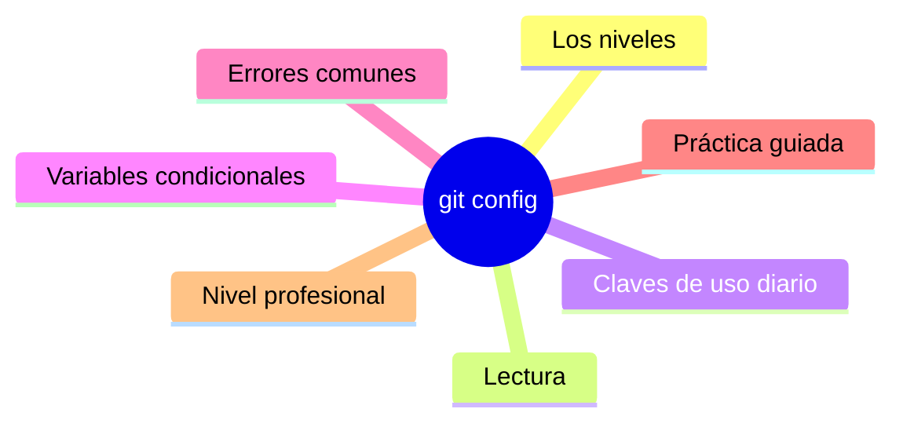

# git config

## Introducción

Git no tiene preferencias propias: todas las tuyas viven en configuración — nombre, correo, editor, estrategia de merge, alias, comportamientos por defecto. Entender los NIVELES de configuración (sistema, global, local, worktree) es lo que separa a quien «pelea con Git» de quien lo tiene a su medida.

En este capítulo aprenderás a leer, escribir y diagnosticar configuración, con las claves que de verdad importan en el día a día.

---

## Mapa conceptual de este capítulo



---

## 1. Los niveles

```text
Orden (de menor a mayor precedencia):
   │
   ├── sistema     /etc/gitconfig        (máquina)
   ├── global      ~/.gitconfig          (tu usuario)
   ├── local       .git/config           (el repo)
   └── worktree    (git config --worktree, con
                    extensions.worktreeConfig)

   la clave más específica GANA
   (local > global > sistema)
```

```bash
git config --global user.name "Ana Pérez"
git config --global user.email "ana@ejemplo.com"
git config --local core.autocrlf true   # solo este repo
git config --system merge.tool kdiff3   # máquinas
```

```text
La trampa clásica:
   │
   └── NO has puesto user.email en ESTE repo y Git
       pregunta (o usa un default) → commits con
       identidad equivocada. Ver Error 1.
```

---

## 2. Lectura: qué está activo

```bash
git config --list --show-origin       # todo + archivo
git config --list --show-origin | Select-String user    # (PowerShell)
git config user.name                  # un valor
git config --get user.email
git config --show-origin user.email   # valor + origen
git config --get-regexp "^alias\."    # alias por
                                      # prefijo
git config --unset [--global|--local] clave   # quitar
```

```text
Diagnóstico de conflicto de valores:
   │
   ├── --show-origin te dice DESDE QUÉ ARCHIVO sale
   │   cada clave
   │
   └── si algo se comporta raro: lista, localiza el
       archivo, corrige o elimina la entrada
       duplicada
```

---

## 3. Claves de uso diario

```bash
# identidad (los dos imprescindibles):
git config --global user.name "..."
git config --global user.email "..."

# rama por defecto (nuevos repos):
git config --global init.defaultBranch main

# editor y pager:
git config --global core.editor "code --wait"
git config --global core.pager "less -R"

# comportamientos:
git config --global core.autocrlf true   # Windows
#  true: al clonar convierte a LF; al commitear a CRLF
#  input: al commitear fuerza LF (servidores/Linux)
#  false: no hace nada (macOS/Linux muchos lo dejan)

git config --global pull.rebase false    # política de
                                         # pull (merge)
git config --global rebase.autoStash true
git config --global rerere.enabled true
git config --global push.default simple   # o current,
                                         # upstream
git config --global fetch.prune true     # borra ramas
                                         # remotas
                                         # eliminadas
git config --global diff.colorMoved zebra
git config --global branch.sort -committerdate
```

```text
Qué mirar siempre en una máquina nueva:
   │
   ├── user.name / user.email
   ├── init.defaultBranch
   ├── autocrlf (según sistema)
   └── política de pull/push del equipo
```

---

## 4. Variables condicionales (`includeIf`)

```bash
# .gitconfig — config distinta para repos de trabajo:
[includeIf "gitdir:~/trabajo/"]
    path = ~/.gitconfig-trabajo
```

```text
Casos de uso:
   │
   ├── identidad distinta (personal vs. empresa)
   │
   ├── alias y hooks distintos por ámbito
   │
   └── en Windows: gitdir:C:/trabajo/ (rutas
       concretas según versión)
```

```bash
# identidades múltiples por carpeta (ejemplo):
[includeIf "gitdir:~/trabajo/"]
    path = ~/.gitconfig-trabajo
# en ~/.gitconfig-trabajo:
# [user]
#     email = ana@empresa.com
```

---

## 5. Errores comunes con diagnóstico completo

### Error 1: commits con identidad equivocada o genérica

**Qué ocurrió:** `git log` muestra otro correo (o el del ordenador) en tus commits.

**Por qué posibles:**
* falta `user.email`/`user.name` en global y el sistema preguntó/dejó default;
* otro nivel (local) tiene una clave vieja que gana;
* identidad de empresa no configurada en esa carpeta.

**Cómo comprobarlo:** `git config --show-origin user.email` y `git log -1 --format='%an <%ae>'`.

**Opciones:**
* corregir el nivel adecuado (global para tí; includeIf para ámbitos);
* si el commit es reciente y NO publicado: `git commit --amend --reset-author`;
* si está publicado: muchos proyectos aceptan un commit de corrección; no reescribir historia compartida por esto.

**Riesgos:** atribución rota (métricas, blame, CLA).

**Solución:** identidad verificada como primer paso de instalación.

**Cómo se evita:** checklist de máquina nueva (punto 3).

---

### Error 2: cambiar `--global` y que algo siga igual

**Qué ocurrió:** se configuró en global pero el repo se comporta igual.

**Por qué posibles:**
* el repo tiene `--local` (gana sobre global);
* se editó el archivo equivocado (system);
* la clave aplica a otra cosa (p. ej. core.autocrlf no afecta lo ya rastreado).

**Cómo comprobarlo:** `git config --show-origin <clave>` (verás el origen).

**Opciones:** quitar la entrada local (`--unset`) o ajustarla ahí con conocimiento.

**Riesgos:** «Git hace lo que quiere» (no: hace lo que manda la precedencia).

**Solución:** diagnóstico por origen.

**Cómo se evita:** no duplicar claves sin necesidad.

---

### Error 3: `core.autocrlf` mal para el equipo (diferencias absurdas)

**Qué ocurrió:** diffs de todo un archivo con cambios de finales de línea al clonar en otro SO.

**Por qué posibles:**
* autocrlf distinto entre integrantes;
* repo sin `.gitattributes` que fije el tratamiento.

**Cómo comprobarlo:** `git diff` mostrando `^M` o archivos enteros modificados sin cambios reales.

**Opciones:** definir en el equipo: autocrlf consistente y/o `.gitattributes` (`* text=auto eol=lf`) — capítulo 04.

**Riesgos:** conflictos constantes de whitespace; historial ensuciado.

**Solución:** `.gitattributes` como fuente de verdad + config acorde.

**Cómo se evita:** decidir en la creación del repo, no en cada clon.

---

### Error 4: claves inventadas o mal escritas

**Qué ocurrió:** `git config pull.rebase alway` (typo) → Git lo guarda sin validar y no hace lo esperado.

**Por qué:** config no valida valores libres.

**Cómo comprobarlo:** `git config --show-origin <clave>`; documentación oficial de la clave.

**Opciones:** corregir el valor; `--unset` si se creó por error.

**Riesgos:** silencio (Git no avisa).

**Solución:** copiar claves de la documentación, no de memoria.

**Cómo se evita:** validar comportamiento con una prueba real (p. ej. `git pull` en repo de prueba).

---

### Error 5: editar `.git/config` a mano y romper formato

**Qué ocurrió:** archivo INI mal escrito → Git avisa de parse errors o ignora secciones.

**Por qué:** edición manual sin cuidado (comillas, secciones duplicadas).

**Cómo comprobarlo:** cualquier comando `git config` puede fallar mostrando el error de parseo.

**Opciones:** corregir el archivo (o restaurar de backup) usando `git config <clave> <valor>` la próxima vez.

**Riesgos:** en repos grandes, miedo innecesario (la solución es simple).

**Solución:** usar la interfaz `git config` para escribir; la lectura manual solo para inspeccionar.

**Cómo se evita:** no editar a menos que sepas exactamente la sección.

---

### Error 6: configuración que cambia en medio de una migración

**Qué ocurrió:** al pasar de un Git antiguo, claves dejaron de existir o cambiaron de nombre (p. ej. `pull.rebase` vs `branch.autosetuprebase`; `push.default` con new behavior).

**Por qué posibles:**
* notas de versión ignoradas;
* claves de terceros en config.

**Cómo comprobarlo:** avisos de deprecación en salida; `git config --list` con claves desconocidas.

**Opciones:** migrar según notas de versión; pedir ayuda (comunidad/como-pedir-ayuda.md) con la salida exacta.

**Riesgos:** comportamientos que «se corrigieron solos» sin que nadie entienda por qué.

**Solución:** revisar config al actualizar Git (como revisas changelogs).

**Cómo se evita:** mantener el config del equipo documentado (plantilla en repo de plantillas).

---

## 6. Práctica guiada

### Objetivo

Montar y auditar tu configuración completa en diez minutos.

### Paso 1: identidad y defaults

```bash
git config --global user.name "Tu Nombre"
git config --global user.email "tu@ejemplo.com"
git config --global init.defaultBranch main
git config --global fetch.prune true
```

### Paso 2: verificación con origen

```bash
git config --list --show-origin
git config --show-origin user.email
```

1. ¿De qué archivo sale? ¿Es el correcto?

### Paso 3: repositorio de prueba

```bash
git init configtest && cd configtest
git config --local core.autocrlf false   # local gana
git config --show-origin core.autocrlf   # confirma
git config --unset --local core.autocrlf
git config --show-origin core.autocrlf   # vuelve a
                                         # global
```

### Paso 4: alias de diagnóstico

```bash
git config --global alias.st "status -sb"
git config --global alias.hist "log --oneline --graph --decorate -n 20"
git config --global alias.last "log -1 --stat"
git st
git hist
```

### Paso 5: política de pull

```bash
git config --global pull.rebase false     # o true si
                                          # el equipo
                                          # lo pide
# pruébalo en dos ramas locales simulando divergencia
```

### Paso 6: includeIf (opcional)

```bash
# crea dos identidades por carpeta (pasos del punto 4)
git config --global --get-regexp includeIf
```

### Resultado esperado

Config auditada con `--show-origin`, alias funcionando y política de pull decidida.

### Conclusión esperada

Git obedece a la precedencia: global para ti, local para el repo, condicionales para los ámbitos — y todo se audita con `--show-origin`.

---

## 7. Nivel profesional + resumen

### 7.1. Config de equipo

```text
   │
   ├── plantilla de config documentada en el repo de
   │   plantillas (claves mínimas por proyecto)
   │
   ├── script de «setup de máquina» (una lista de
   │   git config --global ...)
   │
   ├── includeIf para empresas (identidad y email de
   │   trabajo solo en ~/trabajo/)
   │
   └── claves compartidas por proyecto vía local
       documentada (autocrlf, diff, merge) o
       .gitattributes (cap. 04)
```

### 7.2. Resumen

En este capítulo aprendiste que:

* la configuración tiene niveles (sistema, global, local, worktree) y el más específico gana;
* `--list --show-origin` y `--show-origin <clave>` diagnostican de dónde sale cada valor;
* las claves imprescindibles: identidad, `init.defaultBranch`, autocrlf, política de pull/push, prune y rerere;
* `includeIf` permite identidades y comportamientos por carpeta (personal/empresa);
* los errores típicos (identidad, precedencia, autocrlf inconsistente, claves inventadas, edición manual, migraciones) se previenen con diagnóstico por origen y plantillas de equipo;
* a nivel profesional: la config es parte del «setup de máquina» versionado y documentado.

La idea principal es:

> **No hay Git «raro»: hay niveles de configuración compitiendo — `--show-origin` te dice quién manda en cada decisión.**

---

## Próximo paso

Ya tienes Git a tu medida.

Ahora dile QUÉ debe ignorar: patrones y trampas de `.gitignore`.

Continúa con:

[`02-gitignore.md`](02-gitignore.md)
