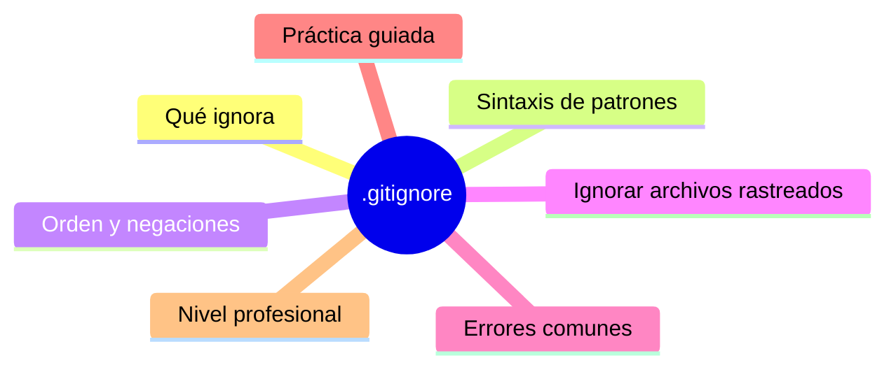

# .gitignore

## Introducción

Cada repositorio acumula archivos que Git debe ignorar: compilados, dependencias, cachés, notas personales, archivos generados. `.gitignore` es la lista de esos archivos — pero tiene reglas de patrón y una trampa conceptual importante que conocerás en el capítulo 05.

Este capítulo enseña a escribir `.gitignore` que funcionen a la primera, a entender el orden de las reglas y a arreglar el caso difícil: archivos ya rastreados que ahora quieres ignorar.

---

## Mapa conceptual de este capítulo



---

## 1. Qué ignora (y qué NO)

```text
Ignora:
   │
   ├── archivos NO rastreados (nuevos) que coincidan
   │   con un patrón → `status` no los muestra y
   │   `git add .` no los coge
   │
   └── también afecta a `git add -A`, add de
       directorios y avisos de «untracked files»
```

```text
NO ignora (las tres trampas clásicas):
   │
   ├── 1. archivos YA rastreados: el ignore solo
   │      aplica a no-rastreados (cap. 4)
   │
   ├── 2. no es seguridad: si un secreto ya se
   │      commiteó, seguirá ahí (cap. 05)
   │
   └── 3. no afecta a lo que otros ya tienen en su
       clon: cada persona lo clona y lo aplica
```

```bash
git status --ignored              # ver qué ignora
git check-ignore -v ruta/archivo   # ¿por QUÉ patrón
                                   # se ignora?
```

---

## 2. Sintaxis de patrones

```text
Patrón          Significado
──────────────────────────────────────────────────────
build/          directorio build en CUALQUIER nivel
/build/         solo el build de la RAÍZ
*.log           cualquier .log en cualquier nivel
**/*.log        idéntico (explícito)
notas.txt       solo ese nombre
temp            nombre «temp» en cualquier nivel
                (sin / final = archivo O directorio)
/archivo.txt    solo en la raíz
doc/**/tmp      tmp bajo doc, en cualquier profundidad
```

```text
Caracteres:
   │
   ├── # al inicio → comentario
   ├── línea vacía → se ignora
   ├── * no cruza / ; ** sí cruza
   └── \ para escapar (pocos casos)
```

```text
Ejemplo típico (JavaScript):
   │
   ├── node_modules/
   ├── dist/
   ├── *.log
   └── .env.local
```

```text
Ejemplo típico (Python):
   │
   ├── __pycache__/
   ├── .venv/
   ├── *.pyc
   └── build/, dist/, *.egg-info/
```

---

## 3. Orden y negaciones

```text
Regla: la ÚLTIMA línea que coincide manda.

   │
   ├── logs/
   │   → todo logs/ ignorado
   │
   └── !logs/importante.txt
       → pero ese archivo NO (negación)
```

```text
Trampa de la negación:
   │
   ├── NO puedes re-incluir un archivo si su
   │   DIRECTORIO padre está ignorado con «dir/»
   │   (Git no desciende a directorios ignorados)
   │
   └── solución: ignorar con patrón de contenidos
       (logs/*) en vez de logs/ , o no ignorar el
       directorio padre
```

```bash
# comprobar el efecto real:
git check-ignore -v logs/importante.txt
# → te muestra la línea exacta que gobierna
```

---

## 4. Ignorar archivos YA rastreados

```bash
# 1. quitar del índice (sigue en disco):
git rm --cached ruta/archivo

# 2. (si es directorio completo, versión segura):
git rm -r --cached carpeta/

# 3. añadir patrón en .gitignore
# 4. commit del cambio:
git add .gitignore
git commit -m "chore: ignora carpeta generada"
```

```text
   │
   ├── --cached no borra nada de tu disco
   │
   ├── el commit «borra» esos archivos del repo para
   │   los demás (ellos los tendrán que limpiar
   │   también con pull)
   │
   └── si era un secreto: NO basta (cap. 05: hay que
       purgar historial Y rotar)
```

```bash
# atajo para todo lo ignorado que esté rastreado:
git ls-files -i -c --exclude-standard   # lista
git ls-files -i -c --exclude-standard -z | git update-index --remove -z --stdin
```

---

## 5. Errores comunes con diagnóstico completo

### Error 1: escribir el patrón sin barra final

**Qué ocurrió:** `build` ignora también `build.sh`, `build.py` (nombres que empiezan igual) o al revés: se quería ignorar solo el directorio.

**Por qué posibles:**
* sin `/` final, el patrón coincide con archivos y directorios;
* sin `/` inicial, coincide en cualquier nivel.

**Cómo comprobarlo:** `git check-ignore -v build.sh` / `git check-ignore -v algo/build/`.

**Opciones:** ajustar patrón (`build/` = directorio; `/build/` = raíz).

**Riesgos:** ignorar de más (código no subido) o de menos (ruido en status).

**Solución:** escribir la intención concreta (¿raíz? ¿directorio? ¿extensión?).

**Cómo se evita:** check-ignore siempre que haya duda.

---

### Error 2: creer que ignoró un archivo ya rastreado

**Qué ocurrió:** se añadió el patrón pero `git status` sigue mostrando cambios del archivo.

**Por qué:** el ignore solo afecta a no-rastreados (punto 1).

**Cómo comprobarlo:** `git ls-files | grep archivo` (aparece = rastreado).

**Opciones:** `git rm --cached` + commit (punto 4); si es directorio grande, revisar qué archivos son rastreados antes de borrar del índice.

**Riesgos:** subir contenido generado por equivocación en el futuro.

**Solución:** los dos pasos (quitar del índice + patrón).

**Cómo se evita:** añadir .gitignore EN EL PRIMER COMMIT del proyecto generador.

---

### Error 3: negación que no funciona por directorio padre

**Qué ocurrió:** `!archivo.txt` no des-ignora nada.

**Por qué posibles:**
* el padre está ignorado con `dir/`;
* o la negación está antes de la regla que gana (el orden: última línea manda).

**Cómo comprobarlo:** `check-ignore -v` (te muestra cuál línea decide).

**Opciones:** reestructurar patrones (ignorar contenidos, no el padre).

**Riesgos:** frustración con sintaxis aparentemente correcta.

**Solución:** entender el orden (punto 3).

**Cómo se evita:** comprobar con `-v` tras cada cambio de ignore.

---

### Error 4: ignorar archivos que SÍ deben versionarse

**Qué ocurrió:** `.env.example`, lockfiles, migraciones o SQL de esquema no se subieron y el equipo se rompe la cabeza.

**Por qué posibles:**
* patrones demasiado amplios (`*.sql`, `*.env*`);
* copiar listas de ignore de otro proyecto sin revisar.

**Cómo comprobarlo:** `git check-ignore -v <archivo>`; revisar el diff del clon limpio.

**Opciones:** afinar patrones; forzar la inclusión con negación o renombrar (p. ej. `.env.example` sí se versiona).

**Riesgos:** proyectos no reproducibles.

**Solución:** plantilla de ignore revisada por el equipo, no copiada a ciegas.

**Cómo se evita:** regla: «¿necesita otra persona este archivo para que funcione su clon?» → sí → se versiona.

---

### Error 5: `.gitignore` no está en el commit / otro lo tiene distinto

**Qué ocurrió:** cada integrante ignora cosas distintas (ruido permanente en status).

**Por qué:** no se versionó el `.gitignore` o hay ignores personales en `~/.config/git/ignore` mezclados.

**Cómo comprobarlo:** `git check-ignore -v` (origen del patrón); `git ls-files .gitignore`.

**Opciones:** versionar `.gitignore` del proyecto; usar `core.excludesFile` para lo PERSONAL (notas.md locales, etc.) y no mezclar.

**Riesgos:** «en mi máquina no pasa».

**Solución:** proyecto = `.gitignore` versionado; persona = `core.excludesFile`.

**Cómo se evita:** revisar el ignore en la creación del repo.

---

### Error 6: borrar del repo sin `--cached` (borra de disco)

**Qué ocurrió:** `git rm carpeta/` borró los archivos del ordenador también.

**Por qué:** sin `--cached`, `rm` hace las dos cosas.

**Cómo comprobarlo:** carpeta desaparecida; `git status` (borrado staged).

**Opciones:** recuperar desde HEAD: `git checkout HEAD -- carpeta/` (o restore); y rehacer con `--cached`.

**Riesgos:** pérdida temporal (mitigable con restore).

**Solución:** memorizar `--cached` en este flujo.

**Cómo se evita:** practicarlo en repo de prueba (cap. 6).

---

## 6. Práctica guiada

### Objetivo

Crear un `.gitignore` correcto, verificar patrones con `check-ignore` y des-rastrear un archivo generado.

### Paso 1: proyecto ruidoso

```bash
git init igntest && cd igntest
echo app > app.py
echo datos > notas-personales.md
mkdir -p __pycache__ build
echo x > __pycache__/mod.pyc
echo y > build/salida.bin
echo z > error.log
git add . && git commit -m "base"
git status          # ¡ruido! (untracked: pycache, build, log, notas)
```

### Paso 2: .gitignore

```powershell
@'
__pycache__/
build/
*.log
/notas-personales.md
'@ | Set-Content .gitignore
```

```bash
git status              # solo lo esperado
git check-ignore -v build/salida.bin
git check-ignore -v error.log
git check-ignore -v app.py || echo "no ignorado (bien)"
git add .gitignore app.py && git commit -m "chore: ignore inicial"
```

### Paso 3: archivo ya rastreado

```bash
git add notas-personales.md
git commit -m "no debería estar"
# ahora aplicamos el ignore real:
git rm --cached notas-personales.md
git status              # staged: borrado + ignore ya
                        # presente
git commit -m "chore: saca notas personales del repo"
ls                      # sigue en disco
git status --ignored    # observa los ignorados
```

### Paso 4: negación

```powershell
@'
build/
!build/config-ejemplo.yaml
'@ | Set-Content .gitignore
```

```bash
git check-ignore -v build/config-ejemplo.yaml
# (si el padre está con «build/», verás que la
# negación NO funciona → usa «build/*» y negación)
```

### Paso 5: lista de rastreados ignorados

```bash
git ls-files -i -c --exclude-standard   # ¿alguno?
```

### Resultado esperado

Ignore funcional, verificado con check-ignore, con un des-rastreo limpio y sin pérdida de archivos en disco.

### Conclusión esperada

`.gitignore` gobierna lo que entra, no lo que ya está dentro — y cada patrón se confirma con `check-ignore -v`.
### Ejercicio de transferencia

Crea un .gitignore para un proyecto Java que ignore archivos .class y .jar, verifica con git check-ignore -v que funcionan.

---

## 7. Nivel profesional + resumen

### 7.1. Higiene de ignore

```text
   │
   ├── .gitignore versionado + plantilla por
   │   ecosistema (React, Python, Go...) revisada
   │
   ├── personal en core.excludesFile (fuera del repo)
   │
   ├── revisión en PR: patrones nuevos justificados
   │
   └── clon limpio como prueba: si un archivo
       generado es necesario para build, el build lo
       genera (o se versiona a propósito)
```

```text
Reglas de decisión:
   │
   ├── ¿lo genera build? → ignore
   ├── ¿lo necesita otro para compilar? → versiona
   │   (o plantilla .example)
   └── ¿es secreto? → nunca en repo (cap. 05 y 20)
```

### 7.2. Resumen

En este capítulo aprendiste que:

* `.gitignore` aplica solo a archivos NO rastreados y no es mecanismo de seguridad;
* patrones: `*`, `**`, `/` inicial (raíz), `/` final (directorio) y negaciones `!` con la regla «última línea que coincide manda»;
* `git check-ignore -v` dice qué línea gobierna cada archivo;
* des-rastrear: `git rm --cached` + ignore + commit (sin borrar de disco);
* los errores típicos (patrón ambiguo, trazado olvidado, negación fallida, ignorar lo necesario, ignores personales mezclados, rm sin --cached) se previenen con check-ignore y criterio de reproducibilidad;
* a nivel profesional: ignore versionado por proyecto, personal en excludesFile y plantillas revisadas.

La idea principal es:

> **El .gitignore decide lo que entra; lo que ya está dentro se saca con --cached — y todo patrón se demuestra con check-ignore -v.**

---

## Autopreguntas de cierre

Sin mirar el material, responde mentalmente y luego compruébalo con este capítulo:

1. ¿Cómo afecta el orden de las reglas en .gitignore cuando se usan negaciones?
2. ¿Qué comando usas para verificar por qué un archivo está siendo ignorado o no?
3. ¿Por qué un archivo ya rastreado no se ignora al añadir una regla en .gitignore?
4. ¿Cuál es la diferencia entre ignorar un directorio con "dir/" y con "dir/*"?
5. ¿Qué pasos debes seguir para dejar de.trackear un archivo grande sin borrarlo de tu disco?

## Próximo paso

Ya controlas el ruido.

El caso delicado sigue: archivos rastreados que deseabas ignorar, y por qué ignorar NO es suficiente para secretos.

Continúa con:

[`03-archivos-ya-rastreados.md`](03-archivos-ya-rastreados.md)
