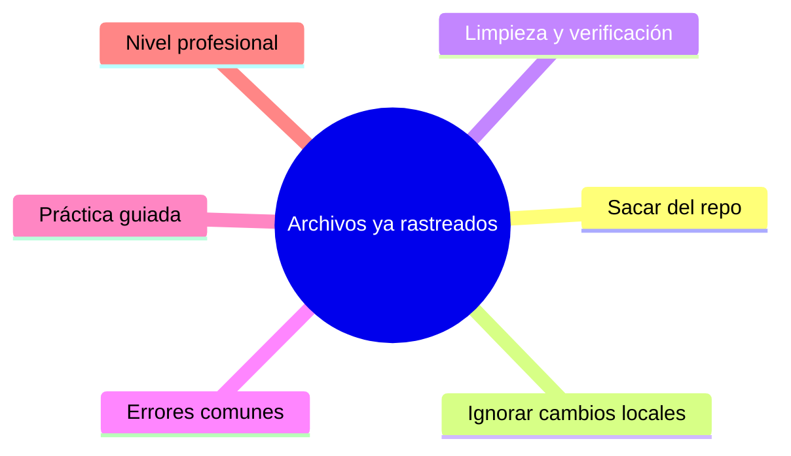

# Archivos ya rastreados y exclusión

## Introducción

Un archivo rastreado es un acuerdo: Git lo conoce, lo congela en commits y lo reparte a todos. Cuando decides que ya no debe viajar con el proyecto — o que debes ignorar sus cambios locales sin soltarlo del historial — necesitas herramientas distintas de `.gitignore`.

Este capítulo cubre los tres escenarios: sacar un archivo del repo manteniéndolo en disco, ignorar sus cambios locales sin quitarlo (`assume-unchanged`, `skip-worktree`) y limpiar lo que quedó rastreado por accidente.

---

## Mapa conceptual de este capítulo



---

## 1. Sacar del repo (`--cached`)

```bash
git rm --cached archivo            # quitar del índice
                                    # (disco intacto)
git commit -m "chore: deja de rastrear archivo"
# + añadir patrón en .gitignore y commitear juntos
```

```bash
# directorio:
git rm -r --cached carpeta/

# listar rastreados que coinciden con ignore actual:
git ls-files -i -c --exclude-standard
```

```text
Qué pasa para los demás:
   │
   ├── al hacer pull, el archivo se BORRA de sus
   │   discos (Git lo registra como borrado)
   │
   └── si es un archivo que necesitaban (build
       necesario): avisar — el flujo correcto es
       documentar la regeneración
```

```text
   │
   ├── el historial ANTERIOR sigue teniendo el
   │   archivo (borrar del pasado = filter-repo, cap.
   │   01 de la sección 12)
   │
   └── si contenía secretos → ver capítulo 05
```

---

## 2. Ignorar cambios locales: dos flags

```bash
git update-index --assume-unchanged archivo
git update-index --no-assume-unchanged archivo     # deshacer

git update-index --skip-worktree archivo
git update-index --no-skip-worktree archivo        # deshacer
```

```text
¿Qué hacen?
   │
   ├── ambos hacen que git status/diff NO muestren
   │   cambios locales del archivo
   │
   └── NO lo sacan del repo: sigue rastreado y otros
       lo ven normalmente
```

```text
Diferencia práctica:
   │
   ├── assume-unchanged → «no mires esto»: atajo de
   │   rendimiento/ignorancia; Git puede ignorarlo y
   │   dar sitio a actualizaciones
   │
   └── skip-worktree → «esto local es mío»: más
       persistente; pensado para archivos que Git
       debe respetar mientras tú los tienes
       personalizados (config local, versiones de
       tooling) — y que luego cuesta más desactivar
```

```text
Usos legítimos:
   │
   ├── config local de IDE/equipo en archivo
   │   versionado (p. ej. .editorconfig local)
   │
   ├── credenciales locales en archivo compartido
   │   (mejor: solución real de secretos, cap. 20)
   │
   └── evitar que build/watchers ensucien status
       (aunque lo normal es ignorarlos desde origen)
```

```bash
# ¿cuáles están en este estado?
git ls-files -v | Select-String '^[a-z]'   # minúscula
                                            # = flag activo
# (en Unix: git ls-files -v | grep '^[a-z]')
```

---

## 3. Limpieza y verificación

```bash
git status                     # ¿qué hay staged/borrado?
git diff --cached --stat       # contenido del próximo
                               # commit
git ls-files | grep nombre     # ¿sigue rastreado?
git check-ignore -v archivo    # ¿el ignore aplica?
git ls-files -v | grep '^[a-z]'   # flags activos
```

```text
Checklist «sacar archivo del repo»:
   │
   ├── 1. ¿es secreto? → capítulo 05 (otro flujo)
   ├── 2. git rm --cached (o -r)
   ├── 3. patrón en .gitignore
   ├── 4. commit conjunto
   └── 5. avisar al equipo (pull lo borrará de sus
          discos)
```

---

## 4. Errores comunes con diagnóstico completo

### Error 1: `git rm` sin `--cached` (borró el archivo)

**Qué ocurrió:** el archivo desapareció del disco.

**Por qué:** `rm` sin `--cached` borra índice Y working tree.

**Cómo comprobarlo:** archivo no existe; `git status` (deleted staged).

**Opciones:** `git checkout HEAD -- ruta` (o `git restore ruta`) para recuperarlo; repetir con `--cached`.

**Riesgos:** pánico (recuperable si estaba commiteado).

**Solución:** memorizar `--cached`.

**Cómo se evita:** práctica guiada.

---

### Error 2: quitarlo del repo pero del historial «sigue ahí» (secretos)

**Qué ocurrió:** se sacó el archivo y se pensó que el problema quedó resuelto; los commits viejos lo contienen.

**Por qué:** `rm --cached` solo afecta a la punta.

**Cómo comprobarlo:** `git log --all -- archivo` (aparece en commits anteriores).

**Opciones:** capítulo 05: purgar historial + ROTAR credenciales; el ignore no cambia nada.

**Riesgos:** exposición persistente.

**Solución:** el flujo de seguridad completo (sección 20).

**Cómo se evita:** nunca subir secretos (prevenir).

---

### Error 3: `assume-unchanged` olvidado («Git no me trae cambios»)

**Qué ocurrió:** al hacer pull, el archivo local no se actualiza (o el equipo se pregunta por qué).

**Por qué posibles:**
* el flag sigue activo en tu clon;
* o lo activó alguien sin avisar.

**Cómo comprobarlo:** `git ls-files -v | grep '^[a-z]'`.

**Opciones:** desactivar (`--no-assume-unchanged` / `--no-skip-worktree`) y hacer pull normal.

**Riesgos:** divergencias silenciosas.

**Solución:** revisar flags como parte del diagnóstico de «mi archivo no se actualiza».

**Cómo se evita:** anotar qué archivos y por qué se marcaron (doc de equipo).

---

### Error 4: usar skip-worktree como solución permanente de config

**Qué ocurrió:** meses después, nadie recuerda que `.tool-versions` está con skip-worktree y los cambios del equipo no llegan.

**Por qué:** el flag se convirtió en «arquitectura».

**Cómo comprobarlo:** ls-files -v; historia del archivo con cambios remotos ignorados.

**Opciones:**
* desactivar, sincronizar, reevaluar la necesidad;
* o institutionalizar: documentarlo en el README del equipo con su motivo.

**Riesgos:** una rama «fantasma» de divergencia individual.

**Solución:** flags = medida temporal con motivo escrito.

**Cómo se evita:** preferir soluciones estructurales (config externa, variables de entorno).

---

### Error 5: borrar del índice un archivo que necesitaba el equipo

**Qué ocurrió:** tras el pull de tu commit, los demás perdieron el archivo de sus discos y el build falló.

**Por qué:** el archivo sí era necesario (se ignoró por error).

**Cómo comprobarlo:** PR con «deleted file» sorprendente; build roto en CI.

**Opciones:** revert del commit que lo sacó; o si era correcto: añadir regeneración/documentación inmediata.

**Riesgos:** corte de entrega.

**Solución:** checklist punto 3 + revisión de PR.

**Cómo se evita:** «¿lo necesita otro para funcionar?» antes de quitar.

---

### Error 6: pensar que `ls-files -i` (ignorados rastreados) se limpia solo

**Qué ocurrió:** la lista sigue igual tras añadir ignore.

**Por qué:** hay que sacarlos explícitamente del índice (punto 1/atajo final del capítulo 02).

**Cómo comprobarlo:** `git ls-files -i -c --exclude-standard`.

**Opciones:** ejecutar la limpieza (`update-index --remove` o rm --cached manual) + commit.

**Riesgos:** status persistente.

**Solución:** paso del checklist.

**Cómo se evita:** hacerlo en el mismo commit del ignore.

---

## 5. Práctica guiada

### Objetivo

Sacar un archivo rastreado sin perderlo, y marcar otros con skip-worktree y deshacerlo.

### Paso 1: estado inicial

```bash
git init rastreados && cd rastreados
echo "secreto-de-ejemplo" > config-local.yaml
echo "dato" > datos.csv
git add . && git commit -m "base"
```

### Paso 2: sacar config-local.yaml

```powershell
@'
config-local.yaml
'@ | Set-Content .gitignore -NoNewline
git rm --cached config-local.yaml
git status                 # borrado staged + untracked
                           # ignorado
git commit -m "chore: config local fuera del repo"
ls config-local.yaml       # sigue ahí
git log --oneline -- config-local.yaml   # historial
                                         # anterior
```

### Paso 3: skip-worktree en datos.csv

```bash
echo "cambio local" >> datos.csv
git status                 # modificado
git update-index --skip-worktree datos.csv
git status                 # limpio (no lo muestra)
echo "otro" >> datos.csv
git status                 # ¡sigue limpio!
git ls-files -v | grep '^[a-z]'    # confirma S
```

### Paso 4: deshacer

```bash
git update-index --no-skip-worktree datos.csv
git status                 # «otro» aparece de nuevo
git diff datos.csv
# decide: descartar (restore) o commitear
```

### Paso 5: auditoría

```bash
git ls-files -i -c --exclude-standard
git ls-files -v | Select-String '^[a-z]'
git check-ignore -v config-local.yaml
```

### Resultado esperado

Un archivo fuera del repo con historial intacto, flags entendidos y desactivados a voluntad.

### Conclusión esperada

Sacar es `--cached` + ignore + commit; esconder cambios locales son flags temporales con diagnóstico visible en `ls-files -v`.

---

### Ejercicio de transferencia
Identifica un archivo en tu proyecto que actualmente esté rastreado pero que debería ser ignorado (por ejemplo, logs o archivos de compilación). Aplica el flujo completo: `git rm --cached`, añade la regla a `.gitignore`, commit y verifica con `git status --ignored` y `git check-ignore`.

## 6. Nivel profesional + resumen

### 6.1. Decisiones de equipo

```text
   │
   ├── avisar SIEMPRE en el PR cuando un archivo se
   │   deja de rastrear (el pull lo borra de discos)
   │
   ├── flags individuales: motivo documentado y fecha;
   │   revisados en la limpieza de rutina
   │
   ├── secrets reales: no se solucionan con flags ni
   │   ignore → flujo de seguridad (sección 20)
   │
   └── archivos de configuración personales: mejor
       fuera del repo (.example versionado) que
       skip-worktree perpetuo
```

### 6.2. Resumen

En este capítulo aprendiste que:

* `git rm --cached` saca un archivo del repo sin tocar tu disco; el historial previo permanece;
* `--assume-unchanged` y `--skip-worktree` esconden cambios locales de archivos rastreados; el segundo es más persistente y ambos requieren desactivación consciente;
* `git ls-files -v` (minúsculas) y `ls-files -i` diagnostican estados especiales;
* los errores típicos (rm sin cached, secretos «resueltos» aparentemente, flags olvidados, skip perpetuo, archivos necesarios borrados, limpieza ausente) se previenen con checklist y avisos en PR;
* a nivel profesional: flags temporales con motivo, `.example` versionado y flujo de secretos aparte.

La idea principal es:

> **Rastreado es un estado con superpoderes y responsabilidades: sacarlo es un acto de equipo, y esconder sus cambios es una excepción con fecha.**

---

## Autopreguntas de cierre

Sin mirar el material, responde mentalmente y luego compruébalo con este capítulo:

1. ¿Cuál es la diferencia entre `git rm --cached` y `git rm` al eliminar un archivo rastreado?
2. ¿Cómo puedes ocultar cambios locales de un archivo rastreado sin perderlos, y qué comando verifica el estado de los flags?
3. ¿Qué ocurre con el historial previo cuando sacas un archivo del repo con `--cached`?
4. ¿Por qué es necesario combinar `git rm --cached` con un patrón en `.gitignore` y un commit?
5. ¿Cuál es el riesgo de usar `assume-unchanged` como solución permanente para configuración local?

## Próximo paso

Ya manejas el estado rastreado/no rastreado.

Ahora fija reglas de contenido: finales de línea, diffs y merges con `.gitattributes`.

Continúa con:

[`04-gitattributes.md`](04-gitattributes.md)
