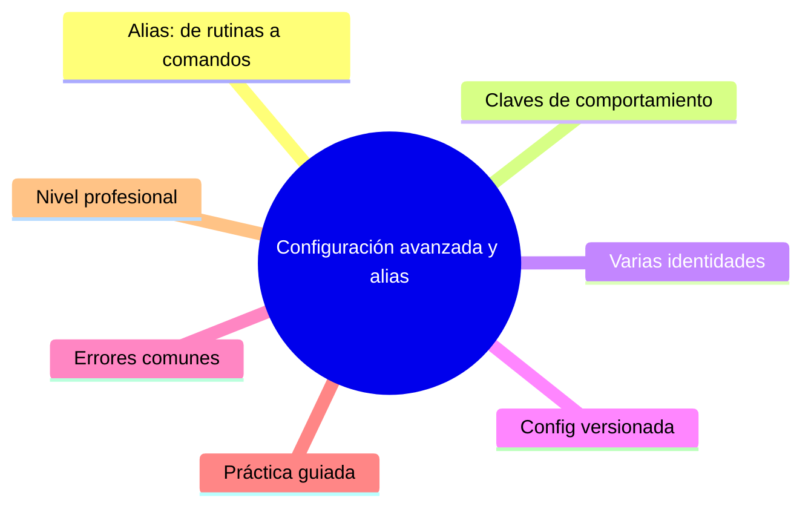

# Configuración avanzada y alias

## Introducción

La configuración básica (identidad, rama por defecto) ya está; este capítulo va al siguiente nivel: alias que comprimen tus rutinas, claves que ajustan el comportamiento diario y estructuras de config para personas con varios ámbitos de trabajo (personal, empresa, proyectos).

Al final, Git responde a comandos cortos tuyos y se comporta como tu equipo espera — sin memorizar sintaxis larga.

---

## Mapa conceptual de este capítulo



---

## 1. Alias: de rutinas a comandos

```bash
# básicos y universales:
git config --global alias.st "status -sb"
git config --global alias.co "switch -c"    # (o
                                             # checkout,
                                             # según gusto)
git config --global alias.last "log -1 --stat"
git config --global alias.unstage "restore --staged"
git config --global alias.amend "commit --amend --no-edit"

# diagnóstico potente:
git config --global alias.hist \
  "log --oneline --graph --decorate --all -n 30"
git config --global alias.wip \
  '!git add -A && git commit -m "wip: sin revisar"'
git config --global alias.unwip \
  '!git log -1 --format=%B | grep -q "^wip:" && git reset --soft HEAD~1'

# ¿quién tocó esto?
git config --global alias.blamefile "blame -w -C"
```

```text
Reglas de alias:
   │
   ├── empieza por git y lo normal: git <alias>
   │
   ├── con «!» ejecuta shell (más poder, más cuidado)
   │
   └── si el alias esconde algo destructivo, que el
       nombre lo diga (nada de alias «limpiar» =
       reset --hard)
```

```bash
# ver los tuyos:
git config --get-regexp "^alias\."
```

---

## 2. Claves de comportamiento que valen la pena

```bash
# revisión más cómoda:
git config --global diff.colorMoved zebra
git config --global diff.wsErrorHighlight error
git config --global status.showUntrackedFiles all   # o
                                                    # normal

# integración cómoda:
git config --global merge.conflictstyle zdiff3
#  zdiff3 muestra también el ANCESTRO en los
#  conflictos → decisiones informadas (sección 10)

# pulls y rebases:
git config --global pull.rebase false          # política
git config --global rebase.autoStash true
git config --global rerere.enabled true        # recuerda
                                               # resoluciones

# orden y limpieza:
git config --global fetch.prune true
git config --global branch.sort -committerdate
git config --global tag.sort -version:refname

# firmar commits (si el equipo exige):
git config --global commit.gpgsign true
git config --global user.signingkey <TU_LLAVE>

# push seguro y explícito:
git config --global push.default current
# → empuja la rama actual sin decir nombre (más
#   predecible en flujos de una rama por tarea)
```

```text
Criterio para añadir una clave:
   │
   ├── ¿resuelve un dolor repetido? → sí
   ├── ¿lo entiende quien llega nuevo? → documentarlo
   └── ¿es del proyecto o de la persona? → local/global
```

---

## 3. Varias identidades (`includeIf`)

```text
Escenario: trabajo con dos correos (personal y
empresa) y no quieres «olvidar» cuál usaste.
```

```bash
# ~/.gitconfig
[includeIf "gitdir:~/trabajo/"]
    path = ~/.gitconfig-trabajo
```

```bash
# ~/.gitconfig-trabajo
[user]
    name = Ana Pérez (Empresa)
    email = ana.perez@empresa.com
# opcional: alias y claves propias del trabajo
```

```text
   │
   ├── los repos bajo ~/trabajo/ usan la identidad de
   │   empresa; el resto, la personal
   │
   ├── verificación: git config --show-origin user.email
   │   dentro de cada carpeta
   │
   └── en Windows la sintaxis del gitdir difiere según
       versión (C:/... con barras; comprobar la
       documentación de tu versión)
```

---

## 4. Config versionada por equipo

```text
Opciones:
   │
   ├── plantilla de setup (lista de git config en el
   │   CONTRIBUTING o en un script docs/setup.sh|.ps1)
   │
   ├── claves del proyecto en .git/config documentadas
   │   (el clon nuevo sigue necesitando el paso: por
   │   eso se documenta)
   │
   ├── herramientas de dotfiles (no son de Git pero
   │   suelen incluir gitconfig) — mención honesta:
   │   elección personal/equipo
   │
   └── includeIf versionado como ejemplo (identidades)
```

```text
Mínimo «setup de máquina» documentado:
   │
   ├── user.name / user.email (o includeIf)
   ├── init.defaultBranch main
   ├── autocrlf / gitattributes del proyecto
   ├── política de pull y push.default
   ├── alias básicos del equipo (st, hist)
   └── core.hooksPath si el repo usa hooks (sección 12)
```

---

## 5. Errores comunes con diagnóstico completo

### Error 1: alias que oculta lo que Git está haciendo

**Qué ocurrió:** alguien con alias «git push = push --force» destrozó ramas.

**Por qué posibles:**
* alias con flags destructivos;
* nombres eufemísticos.

**Cómo comprobarlo:** `git config --get-regexp alias`.

**Opciones:** eliminar/renombrar el alias; reconstruir el daño (reflog).

**Riesgos:** automatizar el error.

**Solución:** alias que acortan, no que fuerzan; prohibidos los que esconden riesgo.

**Cómo se evita:** revisar alias como código del equipo.

---

### Error 2: alias de shell (`!`) no portátil

**Qué ocurrió:** el alias funciona en macOS pero no en Windows (usa `grep`, `xargs`… ausentes o distintos).

**Por qué:** shell + sintaxis Unix en entorno mixto.

**Cómo comprobarlo:** ejecutarlo en la otra plataforma; ver error de comando.

**Opciones:** alias simples (sin `!`) para equipos mixtos; o script versionado con portabilidad atendida (PowerShell/bash).

**Riesgos:** «a mí no me funciona».

**Solución:** distinguir alias personales (libres) de alias de equipo (portables).

**Cómo se evita:** probar en Windows y Unix antes de recomendar.

---

### Error 3: `includeIf` que no aplica (rutas mal)

**Qué ocurrió:** la identidad de empresa no se activa en los repos de trabajo.

**Por qué posibles:**
* gitdir mal escrito (barra final, mayúsculas de unidad, ~ no expandido);
* la carpeta real está en otra ruta.

**Cómo comprobarlo:** `git config --show-origin --get-regexp user.email` desde el repo; revisar notas de versión de tu Git para la sintaxis.

**Opciones:** corregir la ruta (prueba con un repo de mentira dentro de la carpeta); verificar con `git config --get includeIf.*`.

**Riesgos:** commits con identidad personal en repos de empresa (o al revés).

**Solución:** verificación obligatoria tras cada cambio de config (punto 6).

**Cómo se evita:** plantilla probada en tu SO.

---

### Error 4: claves de equipo puestas solo en `--global`

**Qué ocurrió:** la configuración «del proyecto» (p. ej. `diff.external`, `merge.tool`) no llega a quien clona.

**Por qué:** global = tú, no el proyecto.

**Cómo comprobarlo:** clon limpio sin la clave.

**Opciones:** documentar en setup; o usar mecanismos del proyecto (gitattributes, scripts) si el comportamiento debe garantizarse.

**Riesgos:** entornos divergentes.

**Solución:** criterio persona/proyecto (punto 2).

**Cómo se evita:** checklist de «claves que el proyecto necesita».

---

### Error 5: `push.default current` sin entenderlo

**Qué ocurrió:** push falló («branch has no upstream» en versiones antiguas) o subió la rama «equivocada» (la que estaba checked-out).

**Por qué posibles:**
* semántica de push.default según versión;
* rama actual no era la que se pretendía.

**Cómo comprobarlo:** `git status -sb` antes del push (siempre).

**Opciones:** ajustar semántica (`upstream` para flujos clásicos), o mantener `current` con la rutina del status.

**Riesgos:** subir la rama que «pasó por delante» (parecido al error de worktrees).

**Solución:** rutina de verificación antes de push.

**Cómo se evita:** elegir el valor con el flujo real del equipo (sección 17).

---

### Error 6: acumular config obsoleta o contradictoria

**Qué ocurrió:** `git config --list` tiene claves de proyectos viejos (hooksPath de un repo que ya no existe, editor que ya no instalas).

**Por qué:** añadir y nunca revisar.

**Cómo comprobarlo:** lectura completa con `--show-origin`; probar comandos cotidianos.

**Opciones:** limpieza anual (`--unset` de lo muerto); mantener un gitconfig «fuente» comentado.

**Riesgos:** comportamientos fantasma difíciles de diagnosticar.

**Solución:** revisión periódica (como limpiar dependencias).

**Cómo se evita:** tratar el config como parte del inventario de tu entorno.

---

## 6. Práctica guiada

### Objetivo

Montar un set de alias, aplicar claves avanzadas y verificar includeIf con `--show-origin`.

### Paso 1: alias de rutina

```bash
git config --global alias.st "status -sb"
git config --global alias.hist "log --oneline --graph --decorate --all -n 20"
git config --global alias.unstage "restore --staged"
git config --global alias.last "log -1 --stat"
git config --get-regexp "^alias\."
git st
```

### Paso 2: claves avanzadas

```bash
git config --global merge.conflictstyle zdiff3
git config --global diff.colorMoved zebra
git config --global fetch.prune true
git config --global push.default current
git config --list | Select-String -Pattern 'zdiff3|colorMoved|prune|push.default'
```

### Paso 3: conflicto con zdiff3

```bash
# provoca un conflicto rápido (sección 10) y observa
# el bloque con tres columnas: tuyo | ancestro | otro
```

### Paso 4: includeIf simulado

```bash
mkdir -p ~/trabajo/prueba
# añade el includeIf al ~/.gitconfig (punto 3)
cd ~/trabajo/prueba && git init x
git config --show-origin user.email   # debe salir del
                                      # archivo-trabajo
```

### Paso 5: alias de shell con cuidado

```bash
git config --global alias.files '!git ls-files | Select-String -Pattern "\.md$"'
# (PowerShell dentro del alias; en Unix: grep)
git files
```

### Paso 6: auditoría final

```bash
git config --list --show-origin
# revisa: ¿alguna clave de proyecto viejo? ¿alias
# redundantes? ¿identidad correcta por ámbito?
```

### Resultado esperado

Alias útiles, claves avanzadas activas e identidades condicionales verificadas por origen.

### Conclusión esperada

La config avanzada se gana con alias honestos, claves elegidas por dolor concreto e includeIf verificado — no con acumular entradas.

---

### Ejercicio de transferencia
Crea un alias que muestre los últimos 5 commits con ramas y fechas, y verifica que funciona en tu entorno. Luego, documenta ese alias en un archivo de setup de equipo para que otros lo puedan usar.

## 7. Nivel profesional + resumen

### 7.1. Setup de referencia (lista de arranque)

```bash
git config --global user.name "Tu Nombre"
git config --global user.email "tu@ejemplo.com"
git config --global init.defaultBranch main
git config --global fetch.prune true
git config --global push.default current
git config --global pull.rebase false        # o true
git config --global merge.conflictstyle zdiff3
git config --global alias.st "status -sb"
git config --global alias.hist "log --oneline --graph --decorate --all -n 20"
```

```text
Documenta en tu equipo:
   │
   ├── quién pone qué (global vs. setup de proyecto)
   ├── alias compartidos y su portabilidad
   └── includeIf de identidades, con verificación
```

### 7.2. Resumen

En este capítulo aprendiste que:

* alias acortan rutinas; con `!` ejecutan shell (poder y riesgo: nada destructivo escondido);
* claves avanzadas con valor: `zdiff3`, `colorMoved`, `fetch.prune`, `rerere`, `rebase.autoStash`, `push.default`;
* `includeIf` da identidades por carpeta y se verifica con `--show-origin`;
* la config de equipo se documenta (setup) porque global no viaja con el clon;
* los errores típicos (alias peligrosos, no portables, includeIf malo, claves solo globales, push.current sin rutina, acumulación obsoleta) se previenen con auditoría;
* a nivel profesional: setup de máquina versionado y revisión periódica del config.

La idea principal es:

> **Tu configuración es tu entorno de trabajo: alias honestos, claves elegidas por dolor concreto y verificación por origen — auditada como cualquier otro código.**

---

## Autopreguntas de cierre

Sin mirar el material, responde mentalmente y luego compruébalo con este capítulo:

1. ¿Cuál es la diferencia entre un alias sencillo y un alias de shell (`!`) en términos de portabilidad?
2. ¿Cómo puedes verificar que una clave de configuración se aplica desde el archivo correcto usando `--show-origin`?
3. ¿Qué ventaja tiene usar `includeIf` para gestionar múltiples identidades (personal vs empresa)?
4. ¿Por qué es recomendable documentar la configuración de equipo en un archivo de setup plutôt que confiar en la configuración global?
5. ¿Qué riesgos asociados hay con los alias que ejecutan shell y cómo mitigarlos?

## Próximo paso

Has completado la sección de configuración y archivos especiales.

Continúa con el cierre de la sección:

[`README.md`](README.md)
