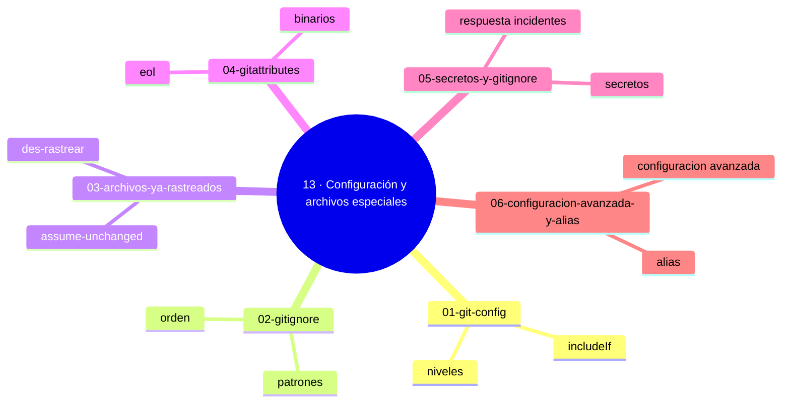

# 13 — Configuración y archivos especiales

## Bienvenido a esta sección

Git se adapta a ti y a tu proyecto: la configuración define cómo se comporta en tu máquina, `.gitignore` decide qué entra, `.gitattributes` cómo se tratan los archivos que ya entraron — y los secretos te recuerdan los límites de todo lo anterior.

Esta sección es higiene: el trabajo silencioso que evita la mitad de los problemas cotidianos (y todos los incidentes feos).

## En esta sección estudiarás

* los niveles de `git config` (sistema, global, local) y cómo diagnosticar con `--show-origin`;
* las claves imprescindibles y el setup de máquina;
* sintaxis de `.gitignore`, orden de patrones y negaciones;
* des-rastrear archivos ya rastreados y flags `assume-unchanged` / `skip-worktree`;
* `.gitattributes`: finales de línea, binarios y merges;
* por qué `.gitignore` NO protege secretos publicados y cuál es la respuesta correcta;
* alias y configuración avanzada con `includeIf`.

## Objetivos de aprendizaje

## Mapa conceptual

Al terminar esta sección serás capaz de:

* diagnosticar conflictos de configuración con `git config --list --show-origin`;
* escribir `.gitignore` con patrones, orden y negaciones, y comprobarlo con `git check-ignore`;
* des-rastrear archivos ya rastreados (o decidir conscientemente no hacerlo);
* aplicar `.gitattributes` a finales de línea, binarios y merges;
* explicar por qué `.gitignore` NO protege secretos ya publicados y cuál es el procedimiento real.

---

## ¿Qué aprenderás en esta sección?

1. [`01-git-config.md`](01-git-config.md) — niveles, precedencia, claves y diagnóstico.
2. [`02-gitignore.md`](02-gitignore.md) — patrones, orden, negaciones y `check-ignore`.
3. [`03-archivos-ya-rastreados.md`](03-archivos-ya-rastreados.md) — `--cached`, assume-unchanged y skip-worktree.
4. [`04-gitattributes.md`](04-gitattributes.md) — eol, binarios, merge drivers y renormalización.
5. [`05-secretos-y-gitignore.md`](05-secretos-y-gitignore.md) — la trampa del historial, respuesta a incidentes.
6. [`06-configuracion-avanzada-y-alias.md`](06-configuracion-avanzada-y-alias.md) — alias, claves avanzadas, identidades múltiples.

## Cómo estudiar esta sección

Ejecuta todo en un repositorio de prueba: la configuración se entiende cambiándola y verificando con `--show-origin`, `check-ignore -v` y `check-attr`. El capítulo 05 merece lectura atenta: su lección (ignore ≠ seguridad) evita incidentes reales.

## Referencias

* Git — Documentación oficial: «git config», «gitignore», «git attributes».
* GitHub — Documentación oficial: «About .gitignore files».
* Guías de incidentes de secretos (OWASP y documentación de GitHub Security).

---

## Checkpoint 13 — Comprobación obligatoria

Antes de avanzar a `../14-git-y-documentacion/`, demuestra que puedes (en un repositorio de práctica real):

1. **Configurar** tu identidad de usuario global y local usando `git config --global user.name "Nombre"` y `git config --local user.email "email@ejemplo.com"`.
2. **Crear** un `.gitignore` que ignore archivos `*.log` y verifica su efecto con `git check-ignore -v debug.log`.
3. **Des-rastrear** un archivo previamente tracked con `git rm --cached archivo.txt` y confirma que queda en el Working Tree pero no en el índice.
4. **Establecer** finales de línea con `.gitattributes` añadiendo `* text=auto eol=lf` y verifica con `git check-attr -a`.
5. **Crear** un alias `git config --global alias.ci commit` y úsalo para hacer un commit.
6. **Explicar** por qué `.gitignore` no protege secretos ya publicados y describe el procedimiento correcto (ej. rotar credenciales y usar `git filter-repo` o `bfg`).

Si puedes hacerlo **sin mirar instrucciones**, el checkpoint está cerrado.

## Autopreguntas de cierre

Sin mirar el material, responde mentalmente y luego compruébalo con los capítulos de la sección:

1. Una regla de `.gitignore` no funciona: ¿cuáles son las tres causas típicas?
2. ¿Cuál es el orden de precedencia entre configuración de sistema, global y local?
3. Un secreto quedó en el historial: ¿lo arregla `.gitignore`? ¿Qué sí lo arregla?
4. ¿Qué hace `.gitattributes` que no puede hacer `.gitignore`?
5. ¿Cómo afecta el orden de precedencia de los niveles de configuración cuando se usan variables condicionales `includeIf`?
6. Si un archivo está ignorado por `.gitignore` pero ya está tracked, ¿qué comando debes usar para dejar de.trackearlo sin eliminarlo del disco?
7. ¿Cuál es la diferencia entre `assume-unchanged` y `skip-worktree` en términos de comportamiento con `git pull` y `git push`?
8. Cuando se combina `.gitattributes` con atributos de merge, ¿cómo afecta a la resolución de conflictos de texto?

---

## Próximo paso

Cuando termines los seis capítulos, continúa con la siguiente sección:

[`../14-git-y-documentacion/`](../14-git-y-documentacion/)
