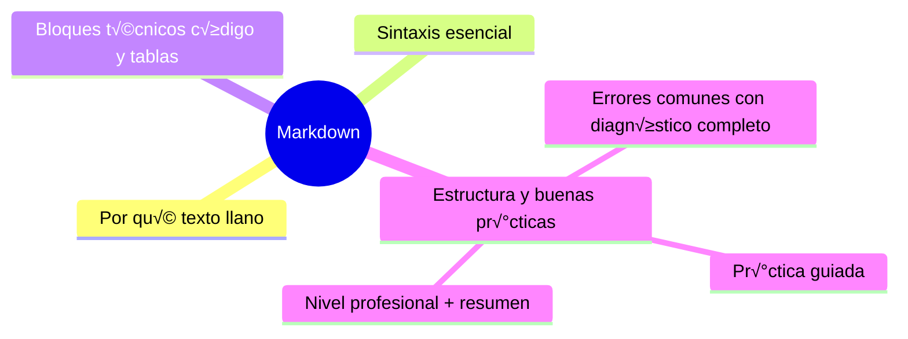

# Markdown
[`02-el-readme.md`](02-el-readme.md)

## Autopreguntas de cierre

Sin mirar el material, responde mentalmente y luego compruÈbalo con este capÌtulo:

1. øPor quÈ es importante que la documentaciÛn estÈ en texto llano y versionable como cualquier otro cÛdigo?
2. øCÛmo afecta el uso de encabezados consistentes (h1, h2, h3) a la generaciÛn autom·tica de Ìndices y la navegaciÛn en documentos largos?
3. øQuÈ criterios debes seguir para decidir si un bloque de informaciÛn debe ir en un bloque de cÛdigo, una tabla o una lista en Markdown?
4. øCÛmo ayuda un linter de Markdown (como markdownlint) a mantener la calidad y consistencia de la documentaciÛn en un equipo?
5. øQuÈ consecuencias tiene mezclar Markdown con HTML sin conocer el soporte de la plataforma de destino?
6. øCÛmo aplicarÌas la regla de extracciÛn (m·s de ~300 lÌneas) para dividir un documento grande manteniendo la usabilidad?

[`02-el-readme.md`](02-el-readme.md)
# Markdown

## Introducción

Casi todo lo que leerán de tu proyecto — README, mensajes de GitHub, documentación, plantillas — está escrito en Markdown: texto llano con marcas ligeras que el navegador convierte en formato.

No hace falta ser diseñador: con una decena de reglas escribes documentos profesionales. Este capítulo es el manual mínimo para este repositorio y para cualquier proyecto.

---
## Mapa conceptual de este capítulo



---
## 1. Por qué texto llano

```text
    │
    ├── vive en el repositorio: versionable, con diff,
    │   con revisión como cualquier código
    │
    ├── escribe en cualquier editor (sin herramientas
    │   propias)
    │
    ├── GitHub/GitLab lo renderizan en README, issues,
    │   PRs y páginas
    │
    └── el «formato» se mantiene en el texto: no hay
        archivos binarios de documentación
```

---
## 2. Sintaxis esencial

```text
# Título        → h1 (solo uno por documento)
## Sección      → h2
### Subsección  → h3

**negrita**     ‚Üí negrita
*cursiva*       ‚Üí cursiva
`código`        → código en línea

- ítem          → lista
* ítem          → también lista
1. ítem         → numerada

> cita          ‚Üí bloque de cita
---             ‚Üí separador (en algunos render)
[texto](url)    ‚Üí enlace
    ‚Üí imagen
```

```markdown
## Instalación

1. Clona el repositorio:
    ```bash
    git clone https://...
    ```
2. Instala dependencias.
```

```text
Sangría (indentación) = jerarquía:
    │
    ├── 4 espacios (o tabulador) bajo un ítem crea
    │   sub-lista
    │
    └── las listas se «continúan» con la misma
        sangría
```

---
## 3. Bloques técnicos

```markdown
```bash
git log --oneline
```
```

```markdown
| Comando | Para qué |
|---------|----------|
| `git status` | estado |
| `git diff`   | cambios |
```

```markdown
- [x] tarea hecha
- [ ] tarea pendiente   (checklist)
```

```text
Notas:
    │
    ├── el triple acento grave con lenguaje (`bash`,
    │   `text`, `json`) coloreado y copiable
    │
    ├── en tablas, la primera línea separa encabezado
    │   y contenido (los guiones son obligatorios)
    │
    └── GitHub añade extensiones (autolink de #issue,
        @usuario, emoji…): útiles y conocidas
```

---
## 4. Estructura y buenas pr√°cticas

```text
Documento técnico bien formado:
    │
    ├── 1. un título claro (h1)
    │
    ├── 2. párrafo inicial: qué es esto y para quién
    │
    ├── 3. secciones con h2 en orden lógico
    │
    ├── 4. ejemplos ANTES de teoría cuando el lector
    │       ejecuta
    │
    ├── 5. avisos con **Negrita:** o cita (>)
    │
    └── 6. enlaces relativos dentro del repo
            (../seccion/)
```

```text
Reglas de estilo:
    │
    ├── líneas cortas (mejor diff)
    │
    ├── frases que se leen en pantalla
    │
    ├── código entre comillas de acento SIEMPRE
    │
    └── nada de texto pegado con formato de Word (pega
        como texto plano)
```

---
## 5. Errores comunes con diagnóstico completo

### Error 1: código sin delimitador (se rompe el formato)

**Qué ocurrió:** un bloque de comandos se mezcla con el texto o «escapa» hacia el resto del documento.

**Por qué posibles:**
* faltan los tres acentos graves;
* falta el cierre;
* anidado sin sangría correcta.

**Cómo comprobarlo:** vista previa en el editor o en GitHub (editar el archivo → vista previa).

**Opciones:** delimitar con ```` ``` ```` y, si hay acentos dentro, usar cuatro ```` ```` ````.

**Riesgos:** README ilegible en la portada del repo.

**Solución:** revisar la vista previa antes de commitear (o hook con linter markdown).

**Cómo se evita:** plantillas con bloques de ejemplo.

---

### Error 2: pegar desde Word/web con formato oculto

**Qué ocurrió:** caracteres invisibles, raras comillas o HTML pegado que GitHub muestra raro.

**Por qué:** pegado con formato.

**Cómo comprobarlo:** ver el texto fuente (no la vista previa) y buscar `&nbsp;`, `<span>`, comillas tipográficas.

**Opciones:** re-pegar como texto plano; limpiar; linter.

**Riesgos:** apariencia poco profesional; errores de render.

**Solución:** texto llano siempre.

**Cómo se evita:** escribir directamente en el editor del repo.

---

### Error 3: encabezados inconsistentes (jerarquía rota)

**Qué ocurrió:** el índice (TOC) automático de GitHub no funciona o el documento salta de h1 a h4.

**Por qué:** se saltaron niveles o hubo varios h1.

**Cómo comprobarlo:** leer los encabezados con `Select-String '^#' archivo.md`.

**Opciones:** renumerar niveles (h1 título, h2 secciones, h3 subsecciones).

**Riesgos:** navegación mala en docs largos.

**Solución:** regla fija de niveles.

**Cómo se evita:** revisar estructura antes del PR.

---

### Error 4: enlaces relativos rotos

**Qué ocurrió:** el enlace funciona en tu editor local pero no en GitHub (o al mover el archivo).

**Por qué posibles:**
* ruta absoluta de tu m√°quina (`C:\...`);
* relativa mal calculada desde la nueva ubicación;
* may√∫sculas/min√∫sculas (servidores sensibles).

**Cómo comprobarlo:** clic en la vista previa de GitHub; linter de enlaces.

**Opciones:** corregir la ruta relativa; mover con `git mv` y arreglar enlaces en el mismo commit.

**Riesgos:** documentación que se desmorona al reorganizar.

**Solución:** enlaces relativos dentro del repo y verificación en PR.

**Cómo se evita:** revisar enlaces al renombrar carpetas.

---

### Error 5: documentos gigantes sin estructura

**Qué ocurrió:** un README de 800 líneas donde nadie encuentra nada.

**Por qué:** sin secciones ni índice.

**Cómo comprobarlo:** número de encabezados vs. longitud; feedback real de lectores.

**Opciones:** dividir en `docs/` con guías cortas; README = puerta de entrada (cap. 02).

**Riesgos:** nadie lee, nadie mantiene.

**Solución:** un documento = una pregunta del lector.

**Cómo se evita:** criterio de extracción (más de ~300 líneas → considerar dividir).

---

### Error 6: confundir Markdown con HTML y mezclarlos a ciegas

**Qué ocurrió:** se pegaron etiquetas HTML (`<br>`, `<details>`) y el render inconsistente entre editores.

**Por qué posibles:**
* uso sin conocer el soporte (GitHub permite un subconjunto de HTML);
* editores que lo muestran distinto.

**Cómo comprobarlo:** vista previa en el destino final (GitHub es la referencia si ahí se publica).

**Opciones:** usar sintaxis Markdown nativa cuando exista; HTML solo para lo que Markdown no cubre (p. ej. `<details>`), conociendo que GitHub lo soporta.

**Riesgos:** diferencias entre vistas.

**Solución:** la referencia de render es donde se publica.

**Cómo se evita:** verificar siempre en la plataforma objetivo.

---
## 6. Pr√°ctica guiada

### Objetivo

Escribir un README de proyecto con todas las estructuras esenciales.

### Paso 1: esqueleto

```markdown
# Mi Proyecto

Descripción en un párrafo.

## Características
- ...

## Instalación
```bash
git clone ...
```

## Uso

| Comando | Descripción |
|---------|-------------|
| `npm start` | arranca |

## Checklist de contribución
- [ ] Tests pasan
- [ ] Documentación actualizada

## Licencia
MIT
```

### Paso 2: vistas previas

1. Abre el archivo en tu editor (vista previa) y en GitHub (editar ‚Üí preview).

### Paso 3: enlaces relativos

```markdown
Ver también: [Glosario](../GLOSARIO.md)
```

1. Comprueba el clic dentro del repo.

### Paso 4: linter (opcional pero recomendable)

```text
Instala un linter de Markdown en tu editor o usa uno
en CI (categoría: markdownlint) y corrige lo que
señale: espacios, encabezados, listas.
```

### Paso 5: práctica de extracción

1. Coge 100 líneas de un documento largo y divídelo en dos con índice y enlaces.

### Resultado esperado

Un README renderizado correctamente con código, tabla, checklist y enlaces vivos.

### Conclusión esperada

Markdown es texto con estructura: la vista previa y la plataforma real son tu validación, y el linter hace el resto.

### Ejercicio de transferencia

Elige un proyecto pequeño (incluso uno de tus hobbies) y escribe su README siguiendo la estructura de tres preguntas, incluye al menos un bloque de código, una tabla y una lista de tareas. Luego, usa un linter de Markdown para corregir cualquier error y captura la salida del linter como entregable.

---
## 7. Nivel profesional + resumen

### 7.1. Markdown en equipo

```text
    │
    ├── linter en CI (consistencia de estilo)
    │
    ├── plantillas de documento (README, ADR, guías)
    │
    ├── enlaces relativos + revisión de enlaces al
    │   reorganizar
    │
    └── plataforma de referencia = donde se publica
        (GitHub render)
```

### 7.2. Resumen

En este capítulo aprendiste que:

* Markdown es texto llano versionable: encabezados, énfasis, listas, citas, enlaces, imágenes;
* bloques con triple acento grave + lenguaje; tablas con separador de guiones; checklists `- [ ]`;
* estructura: un h1, h2 ordenados, ejemplos √∫tiles, enlaces relativos;
* los errores típicos (bloques sin delimitar, pegado con formato, jerarquía rota, enlaces rotos, documentos gigantes, HTML a ciegas) se previenen con vista previa, linter y revisión en PR;
* a nivel profesional: linter en CI, plantillas y la plataforma real como validación.

La idea principal es:

> **Escribe texto llano con estructura: el formato vive en el archivo, se revisa como código y se valida donde se va a leer.**

---
## Próximo paso

Ya escribes documentación con formato.

Ahora la pieza central de cualquier repositorio: el README.

Contin√∫a con:

[`02-el-readme.md`](02-el-readme.md)
