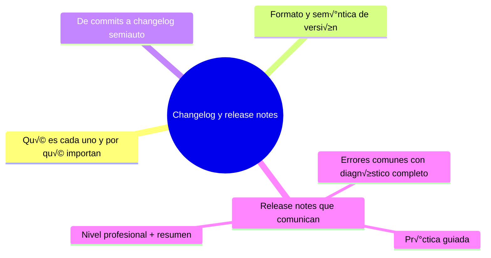

# Changelog y release notes
[`05-license-y-contributing.md`](05-license-y-contributing.md)

## Autopreguntas de cierre

Sin mirar el material, responde mentalmente y luego compruÈbalo con este capÌtulo:

1. øPor quÈ es importante distinguir entre un changelog (registro acumulado en el repo) y las release notes (narraciÛn de una entrega) y cÛmo afecta esto a la forma en que los usuarios eval˙an una actualizaciÛn?
2. øCÛmo influye la relaciÛn entre Conventional Commits y el versionado semver (feat ? MINOR, fix ? PATCH, breaking ? MAJOR) en la automatizaciÛn de la generaciÛn de changelogs y la toma de decisiones sobre el n˙mero de versiÛn?
3. En el flujo semiautom·tico de generaciÛn de changelog, øquÈ papel juega la ediciÛn humana despuÈs de que la herramienta propone un borrador, y por quÈ es esencial reescribir en lenguaje de usuario en lugar de dejar el output crudo?
4. øQuÈ elementos deben incluirse siempre en las release notes para comunicar efectivamente a los usuarios quÈ deben saber antes de actualizar, y por quÈ es recomendable colocar los breaking changes y deprecaciones al principio con instrucciones de migraciÛn?
5. øQuÈ riesgos conlleva publicar un tag sin asociarle release notes ni actualizar el changelog, y cÛmo puede un checklist de release prevenir estos errores tÌpicos?
6. øCÛmo diseÒarÌas un proceso de release que garantice que cada versiÛn sea trazable a commits especÌficos, issues y decisiones de compatibilidad, y quÈ papel juega la auditorÌa en ese proceso?

[`05-license-y-contributing.md`](05-license-y-contributing.md)
# Changelog y release notes

## Introducción

Los mensajes de commit documentan cambio a cambio; el changelog y las notas de versión documentan la historia por entregas: qué recibió el usuario en la 1.4.0 y qué debe saber antes de subir.

Son dos piezas distintas: el changelog es un registro acumulado (archivo vivo en el repo); las release notes son la narración de una entrega concreta (publicada con el tag o en la plataforma). Este capítulo enseña a producirlos, automatizarlos con cuidado y comunicar lo que importa.

---
## Mapa conceptual de este capítulo



---
## 1. Qué es cada uno

```text
CHANGELOG (archivo en el repo, ej. CHANGELOG.md)
    │
    ├── registro cronológico de versiones
    ├── lo leen: usuarios que evalúan actualizar,
    │   mantenedores, auditoría
    └── sobrevive a la plataforma: está en el repo
```

```text
RELEASE NOTES (por entrega)
    │
    ├── narración de UNA versión: qué cambió, cómo
    │   actualizar, qué rompe
    ├── se publican: GitHub Releases, blog, mails
    └── incluyen: destacados, breaking changes,
        deprecaciones, agradecimientos, enlaces
```

```text
    │
    ├── el changelog ACUMULA; las notas CONTAN
    │
    └── las herramientas generan borradores del
        changelog; el humano redacta las notas (lo que
        le importa al lector, en su idioma)
```

---
## 2. Formato y semántica de versión

```text
KEEP A CHANGELOG (estilo, popular):
    │
    ├── cabecera por versión: [1.4.0] - 2026-10-01
    ├── secciones: Añadido / Corregido /
    │   Cambiado (breaking) / Obsoleto / Eliminado
    ├── enlaces a comparaciones al pie
    └── sin entradas para cada commit: por entregas
```

```text
SEMVER (versión: MAJOR.MINOR.PATCH)
    │
    ├── MAJOR: cambios incompatibles (breaking)
    ├── MINOR: funcionalidad nueva, compatible
    └── PATCH: correcciones, compatible
```

```text
Relación con Conventional Commits (cap. 03):
    │
    ├── feat  → MINOR (o MAJOR con !)
    ├── fix   → PATCH
    └── BREAKING CHANGE → MAJOR
    (así el changelog y el número de versión se
    derivan del historial)
```

```text
Estado del proyecto sin versión estable:
    │
    └── 0.x: el cambio compatible también puede romper;
        an√∫ncialo igualmente
```

---
## 3. De commits a changelog (semiauto)

```text
FLUJO TÍPICO
──────────────────────────────────────────────────────
1. convención en commits (cap. 03)
2. herramienta genera borrador desde los commits
    desde el último tag (categoría: git-cliff,
    standard-version — como ejemplos)
3. humano edita: agrupa, reescribe en lenguaje de
    usuario (no jerga interna), corrige ruido
4. commit del changelog + tag + release
```

```bash
# inspección manual que la herramienta automatiza:
git log --oneline v1.3.0..HEAD
git log --oneline v1.3.0..HEAD --no-merges
```

```text
    │
    ├── los commits de rama («fusiona») no aportan:
        se omiten
    │
    └── si los mensajes son malos (cap. 03), la
        herramienta produce basura ‚Üí la calidad del
        changelog es la calidad del historial
```

---
## 4. Release notes que comunican

```markdown
# v1.4.0 — 2026-10-01

## Destacado
- Exportación a CSV (nuevo comando `export`).

## Cambios
- Añadido: `export --format csv`.
- Corregido: doble refresco de sesión (#482).

## Requiere acción (si aplica)
- El flag `--old-format` queda obsoleto; se eliminar√°
  en 2.0.

## Agradecimientos
- @colaboradora por el informe del parser.

Comparación completa: v1.3.0...v1.4.0
```

```text
Reglas:
    │
    ├── escribe para el USUARIO de esa versión, no
    │   para el equipo interno
    │
    ├── breaking changes y deprecaciones ARRIBA y
    │   con instrucción de migración
    │
    ├── enlaces: issue, PR, comparación
    │
    └── honestidad: si hay riesgos conocidos, dilo
```

```text
DÓNDE SE PUBLICAN:
    │
    ├── GitHub Releases (vinculado al tag: el tag es
    │   ancla en el historial; la release es la
    │   entrega con artefactos y notas)
    │
    └── el changelog vive en el repo; las notas, en
        la release (y opcionalmente enlazadas desde
        el changelog)
```

---
## 5. Errores comunes con diagnóstico completo

### Error 1: changelog desactualizado o ausente

**Qué ocurrió:** versión publicada hace meses sin entrada en CHANGELOG.

**Por qué posibles:**
* no hay dueño del proceso;
* se decide «al final» y se olvida.

**Cómo comprobarlo:** comparar tags con entradas: `git tag --sort=-v:refname` vs. cabeceras del changelog.

**Opciones:** generar desde el historial ahora; hacerlo parte de la rutina de release (checklist).

**Riesgos:** usuarios sin guía de actualización.

**Solución:** el release no se cierra sin changelog/notes.

**Cómo se evita:** plantilla de release con casillas.

---

### Error 2: volcado de commits sin editar

**Qué ocurrió:** el changelog es una lista de «fix fix refactor» incomprensible para usuarios.

**Por qué:** se usó la herramienta en crudo.

**Cómo comprobarlo:** leerlo como usuario externo.

**Opciones:** editar/reagrupar; reescribir en lenguaje de producto.

**Riesgos:** nadie lo lee ‚Üí in√∫til.

**Solución:** borrador automático + redacción humana (punto 3).

**Cómo se evita:** quien publica la release redacta (rol asignado).

---

### Error 3: número de versión que no refleja lo que cambió

**Qué ocurrió:** se publica PATCH con funcionalidad nueva o cambios que rompen compatibilidad sin subir MAJOR.

**Por qué:** prisa o desconocimiento de semver.

**Cómo comprobarlo:** leer diff de release vs. etiqueta; comprobar casillas «breaking».

**Opciones:** corregir versión (si aún no se comunicó), o comunicar claramente y corregir política.

**Riesgos:** automatizaciones de actualización se rompen en silencio.

**Solución:** regla feat→MINOR, fix→PATCH, breaking→MAJOR (o proyecto con política propia DOCUMENTADA).

**Cómo se evita:** decisión semántica en la revisión de release, no a última hora.

---

### Error 4: notas que esconden lo que rompe

**Qué ocurrió:** changelog amable, usuarios rotos al actualizar.

**Por qué:** evitar mala noticia.

**Cómo comprobarlo:** sección de breaking/deprecaciones presente y arriba.

**Opciones:** rehacer las notas; comunicar por los canales; añadir guía de migración.

**Riesgos:** confianza rota (peor que el cambio).

**Solución:** breaking changes primero y con instrucción.

**Cómo se evita:** checklist «¿algo deja de funcionar?».

---

### Error 5: tags creados sin notas ni vínculo

**Qué ocurrió:** el repo tiene tags `v1.4.0` pero ni notas ni release publicada.

**Por qué:** se tagueó desde la línea de comandos y ahí acabó.

**Cómo comprobarlo:** `git tag` + lista de releases en la plataforma.

**Opciones:** crear la release ahora con notas (el tag ya existe).

**Riesgos:** historial sin narración por entrega.

**Solución:** flujo único de release: changelog → commit → tag → publicación.

**Cómo se evita:** script/checklist de release del equipo.

---

### Error 6: agradecimientos y métricas falsos

**Qué ocurrió:** «+1000 commits, 50 colaboradores» inflados; agradecimientos a quien no aportó.

**Por qué:** automatización sin revisión.

**Cómo comprobarlo:** contraste con `git shortlog -sn`.

**Opciones:** corregir; usar métricas verificables.

**Riesgos:** ridículo y desconfianza.

**Solución:** datos del historial y revisión humana.

**Cómo se evita:** validar la plantilla de stats.

---
## 6. Pr√°ctica guiada

### Objetivo

Producir un changelog de verdad y unas release notes desde un historial de pr√°ctica.

### Paso 1: etiqueta de partida

```bash
git tag v0.1.0              # versión inicial
# ... trabaja: haz 2-3 commits con convención
# (feat:, fix:) ...
git log --oneline v0.1.0..HEAD
```

### Paso 2: borrador de entradas

```text
Clasa los commits del rango:
    │
    ├── feat  → Añadido
    ├── fix   → Corregido
    ├── docs/chore → normalmente NO entran
    └── breaking → Cambiado (arriba del todo)
```

### Paso 3: escribe CHANGELOG.md

```markdown
# Changelog

## [0.2.0] - 2026-10-02

### Añadido
- Exportación CSV (`export --format csv`)

### Corregido
- Doble refresco de sesión (#482)

[0.1.0]: https://.../releases/tag/v0.1.0
[0.2.0]: https://.../releases/tag/v0.2.0
```

### Paso 4: tag + release

```bash
git tag -a v0.2.0 -m "v0.2.0"
# (push de tag: git push origin v0.2.0)
# y en la plataforma: nueva Release con las notas
# del paso 3 (destacado, cambios, breaking)
```

### Paso 5: automatiza el borrador

```text
Configura en tu proyecto una herramienta de
generación desde Conventional Commits (elige según
tu lenguaje) y acordad: herramienta propone ‚Üí
humano redacta.
```

### Resultado esperado

CHANGELOG con dos versiones, tag anotado y notas publicadas con breaking visible.

### Conclusión esperada

El flujo release = historial limpio → borrador → redacción → tag → publicación; la herramienta acelera, el humano comunica.

### Ejercicio de transferencia

Imagina que estás preparando la versión 2.0.0 de una biblioteca de procesamiento de imágenes que rompe compatibilidad al cambiar el formato de salida de los filtros. Usando el historial de commits desde la versión 1.5.0, genera un borrador de changelog con una herramienta como git-cliff, edítalo para destacar los breaking changes y añadir instrucciones de migración, y crea una release note que explique a los usuarios qué deben hacer para actualizar. Entrega el changelog editado, la release note y una captura del tag y la release en GitHub.

---
## 7. Nivel profesional + resumen

### 7.1. Release engineering mínimo

```text
PIPELINE DE RELEASE
──────────────────────────────────────────────────────
1. congelar (rama/ventana) y revisar commits
2. decidir semver (¬øbreaking? ¬øfeat?)
3. changelog: borrador auto + redacción
4. tag anotado + commit del changelog
5. publicar: GitHub Release + notas + artefactos
6. post: anunciar deprecaciones, verificar installs
```

```text
    │
    ├── la plataforma es display; el repo es fuente
    │   (changelog y tags viajan con el código)
    │
    ├── notas en el idioma del usuario (aquí, español
    │   cuando el público lo es)
    │
    └── auditoría: cada versión rastreable a commits,
        issues y decisión de compatibilidad
```

### 7.2. Resumen

En este capítulo aprendiste que:

* el changelog es registro acumulado en el repo; las release notes narran una entrega y se publican con el tag;
* semver (MAJOR/MINOR/PATCH) y Conventional Commits se refuerzan: feat‚ÜíMINOR, fix‚ÜíPATCH, breaking‚ÜíMAJOR;
* el flujo es semiautom√°tico: herramienta propone desde `git log v-tag..HEAD`, la persona redacta en lenguaje de usuario;
* las notas comunican: destacados, cambios, breaking/deprecaciones con migración, agradecimientos, enlaces;
* los errores típicos (changelog ausente, volcado crudo, semver desalineada, breaking escondido, tags sin notas, métricas infladas) se previenen con checklist de release;
* a nivel profesional: pipeline de release documentado y verificable.

La idea principal es:

> **Cuenta la historia por entregas: el repositorio guarda los cambios, el changelog los acumula y las release notes explican al usuario qué debe saber antes de actualizar.**

---
## Próximo paso

Ya documentas versiones y entregas.

La siguiente capa legal y social del repositorio: licencia, contribución y convivencia.

Contin√∫a con:

[`05-license-y-contributing.md`](05-license-y-contributing.md)
