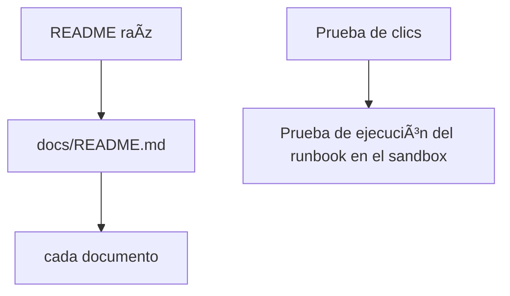

# Documentación técnica en `docs/`
[`README.md`](README.md)

## Autopreguntas de cierre

Sin mirar el material, responde mentalmente y luego compruébalo con este capítulo:

1. ¿Por qué es importante definir una regla de ubicación clara (por ejemplo, «¿lo busca alguien que ya entró?» ? docs/; «¿lo busca quien llega?» ? README) y cómo afecta esto a la experiencia de usuarios nuevos versus desarrolladores que ya están familiarizados con el proyecto?
2. ¿Cómo influye la presencia de un índice enlazado desde el README raíz en la capacidad de encontrar documentación técnica específica, y qué riesgos existen si el índice falta o está desactualizado?
3. ¿Qué ventajas ofrece utilizar ADRs (Architectural Decision Records) para documentar decisiones de arquitectura frente a simplemente incluir el «cómo» en la documentación de implementación, y cómo se evita que los ADRs se vuelvan obsoletos?
4. ¿De qué manera integrar revisiones de documentación en los PRs (por ejemplo, mediante checklists que verifiquen que los diagramas afectados estén actualizados) contribuye a mantener la documentación sincronizada con el código y a reducir la pudrición?
5. ¿Qué consecuencias tiene almacenar credenciales o información sensible en archivos de documentación dentro de un repositorio público, y cómo mitigarlo utilizando placeholders y referencias a gestores de secretos?
6. ¿Cómo diseñarías un proceso de revisión periódica de documentación que combine el uso de linters de Markdown, verificaciones de enlaces y builds de sitio estático para asegurar que la documentación permanezca útil y accesible a lo largo del tiempo?

[`README.md`](README.md)
# Documentación técnica en `docs/`

## Introducción

El README abre la puerta; detrás necesita una casa ordenada: `docs/` con guías, arquitectura, decisiones y API. Sin estructura, la documentación crece como cajón desastre; con convención, se mantiene y se encuentra.

Este capítulo enseña a organizar la documentación técnica de un repositorio: qué va en `docs/`, qué formatos usar, cómo documentar arquitectura y decisiones, y cómo evitar que se pudra.

---
## Mapa conceptual de este capítulo

```mermaid
mindmap
  root((Documentación técnica en docs/))
    Qué va en docs/ (y qué no)
    Estructura recomendada
    Formatos Markdown ADR diagramas
    Mantenerla viva
      Errores comunes con diagnóstico completo
      Práctica guiada
      Nivel profesional + resumen
```



---
## 1. Qué va en docs/ (y qué no)

```text
VA a docs/:
    │
    ├── guías (primeros pasos, recetas, troubleshooting)
    ├── arquitectura y diagramas de sistema
    ├── decisiones (ADR: arquitectónicas y de proceso)
    ├── referencia de API/CLI (generada o escrita)
    ├── convenciones del proyecto (estilo, seguridad)
    └── runbooks (operación, incidentes)
```

```text
NO va (está en otro sitio):
    │
    ├── README        → puerta de entrada (cap. 02)
    ├── CHANGELOG     → entregas (cap. 04)
    ├── CONTRIBUTING  → contribuir (cap. 05)
    └── código/comentarios → en el código, lo
        inseparable (docs «junto al código» para
        detalles micro)
```

```text
    │
    ├── regla de ubicación: «¿lo busca alguien que
    │   ya entró?» → docs/; «¿lo busca quien llega?»
    │   → README
    │
    └── documentos CORTOS con un objetivo; los
        gordos se dividen y se indexan
```

---
## 2. Estructura recomendada

```text
docs/
├── README.md          → índice de la documentación
├── primeros-pasos.md
├── guias/
│   ├── flujo-de-trabajo.md
│   └── troubleshooting.md
├── arquitectura/
│   ├── README.md      → vista general + diagramas
│   └── modulos.md
├── decisiones/
│   ├── 0001-usar-postgres.md
│   └── 0002-versionado-semver.md
├── referencia/
│   └── cli.md
└── operacion/
    └── runbook-despliegue.md
```

```text
Convenciones:
    │
    ├── índice (docs/README.md) enlazado desde el
    │   README raíz
    │
    ├── nombres en minúsculas-guion (coherente con el
    │   resto del repo)
    │
    ├── numeración solo en decisiones (ADR):
    │   0001, 0002…
    │
    └── fechas ISO (2026-10-02) cuando ayuden
```

---
## 3. Formatos: Markdown, ADR, diagramas

```text
MARKDOWN
    │
    ├── base de todo (cap. 01 de esta sección)
    └── plantillas por tipo (guía, runbook, ADR)
```

```markdown
<!-- ADR: registro de decisión -->
# ADR-0001: Postgres como base de datos

## Estado: Aceptada (2026-10-02)

## Contexto
Necesitamos transacciones y consultas ad-hoc…

## Decisión
Usamos PostgreSQL 16…

## Consecuencias
+ ecosistema, + SQL conocido
- operación del servidor propio…
```

```text
DIAGRAMAS
    │
    ├── ASCII en Markdown (portable, versionable,
    │   como en este curso) para esquemas simples
    │
    ├── Mermaid/PlantUML: bloques de código que la
    │   plataforma renderiza → orden de magnitud para
    │   diagramas grandes (mención: elegir uno y
    │   mantenerlo)
    │
    └── arquitectura: cajas y flechas con la
        frontera de datos y confianza visible (sección
        25)
```

```text
RECUERDA:
    │
    ├── el formato sigue al lector: runbook debe ser
    │   copiable en incidente (paso a paso, comandos)
    │
    └── ADR = «por qué decidimos», no «cómo está
        hecho» (ese es el doc de arquitectura)
```

---
## 4. Mantenerla viva

```text
Señales de pudrición:
    │
    ├── comandos/paths que ya no existen
    ├── contradicción entre README y docs/
    └── ADRs sin actualizar estado («Propuesta» de
        hace dos años)
```

```text
Higiene:
    │
    ├── los PR que cambian comportamiento tocan docs/
    │   (checklist, sección 05)
    │
    ├── docs con «dueño» (CODEOWNERS por carpeta,
    │   sección 18)
    │
    ├── ADRs: solo se cambia el estado con nuevo ADR
    │   (superseded por ADR-NNNN) — el pasado no se
    │   reescribe
    │
    └── revisión periódica: «¿seguiría siendo cierto
        este documento hoy?»
```

---
## 5. Errores comunes con diagnóstico completo

### Error 1: docs/ como cajón de sastre

**Qué ocurrió:** todo lo que sobró cayó en `docs/` sin índice ni orden.

**Por qué:** sin convención de entrada.

**Cómo comprobarlo:** listar `docs/`; contar documentos sin enlace en el índice.

**Opciones:** estructura del punto 2; mover, fusionar o eliminar.

**Riesgos:** nadie encuentra nada → docs muertos.

**Solución:** índice obligatorio y criterio de ubicación (punto 1).

**Cómo se evita:** plantilla de secciones al crear la carpeta.

---

### Error 2: documentar el «cómo» y olvidar el «por qué»

**Qué ocurrió:** docs que describen la implementación actual pero no las razones → cada lector reinterpreta y «mejora» lo que ya se decidió.

**Por qué:** no hay ADRs.

**Cómo comprobarlo:** buscar en la doc palabras como «decidimos», «porque»; si no hay, falta contexto.

**Opciones:** crear ADRs para las decisiones vivas (a posteriori, con fecha honesta).

**Riesgos:** decisiones re-hechas sin memoria.

**Solución:** separar ADR (porqué) de arquitectura (qué está así).

**Cómo se evita:** exigir ADR para cambios de arquitectura en el PR.

---

### Error 3: diagramas desactualizados (fotos del pasado)

**Qué ocurrió:** el diagrama muestra un componente que ya no existe.

**Por qué:** imagen pegada sin fuente, o dibujo no versionado.

**Cómo comprobarlo:** contrastar con el despliegue real.

**Opciones:** redibujar desde fuente (Mermaid/ASCII en repo); borrar si ya no se entiende.

**Riesgos:** ingenieros construyendo sobre una mentira.

**Solución:** diagramas como texto en el repo, actualizados en el mismo PR.

**Cómo se evita:** casilla «diagrama afectado actualizado» en PRs de arquitectura.

---

### Error 4: runbooks escritos como ensayo

**Qué ocurrió:** en un incidente, el runbook de 5 párrafos no se puede seguir con una mano.

**Por qué:** formato narrativo.

**Cómo comprobarlo:** intentar simular: leer en frío y ejecutar los pasos.

**Opciones:** reescribir paso a paso con comandos copiables, verificación por paso y «si falla →…».

**Riesgos:** MTTR peor; pánico.

**Solución:** plantilla de runbook operativa (pasos, comandos, verificación, rollback).

**Cómo se evita:** ensayar runbooks en ejercicios.

---

### Error 5: docs duplicados con versiones distintas

**Qué ocurrió:** el «cómo desplegar» aparece en README, en docs/ y en un wiki, con diferencias.

**Por qué:** crecimiento sin dueño.

**Cómo comprobarlo:** buscar el término en todo el repo (grep).

**Opciones:** elegir fuente única; los demás enlazan.

**Riesgos:** el lector elige la versión vieja.

**Solución:** una verdad, muchos enlaces.

**Cómo se evita:** revisión de duplicados al añadir documentos grandes.

---

### Error 6: documentación interna filtrada o insegura

**Qué ocurrió:** runbook con credenciales, IPs internas o vulnerabilidades en repo público (o en repo privado con acceso demasiado amplio).

**Por qué:** mezclar operación real con doc sin clasificar.

**Cómo comprobarlo:** escaneo de secretos (sección 13/20); revisar qué contiene cada doc.

**Opciones:** externalizar credenciales (referencias a gestor de secretos); clasificar acceso; si se publicó → flujo de incidente (cap. 05 sección 13).

**Riesgos:** incidente de seguridad.

**Solución:** docs con placeholders y mínima exposición.

**Cómo se evita:** escaneo en CI y revisión de seguridad (secciones 20/24).

---
## 6. Práctica guiada

### Objetivo

Crear un `docs/` ordenado con índice, una guía, un ADR y un runbook corto.

### Paso 1: esqueleto e índice

1. Crea la estructura del punto 2 (las carpetas que apliquen).
2. Escribe `docs/README.md` enlazando cada documento.

### Paso 2: guía

1. `docs/guias/troubleshooting.md`: 3 problemas frecuentes con «síntoma → diagnóstico → arreglo».

### Paso 3: ADR

1. `docs/decisiones/0001-<tema>.md` con contexto, decisión, consecuencias y estado (fecha ISO).

### Paso 4: runbook

1. `docs/operacion/runbook-despliegue.md`: pasos numerados con comandos, verificación y rollback.

### Paso 5: diagrama versionado

1. Añade en `docs/arquitectura/README.md` un diagrama ASCII (o Mermaid) del sistema de práctica.

### Paso 6: enlazar y verificar



### Resultado esperado

`docs/` con índice navegable, guía, ADR, runbook y diagrama vivo.

### Conclusión esperada

La documentación técnica se organiza como producto: ubicación por pregunta, formatos por propósito y dueños por área.

### Ejercicio de transferencia

Imagina que debes documentar el proceso de despliegue de una aplicación web en un entorno de staging para un equipo de operaciones que no conoce el código. Crea un runbook operativo en `docs/operacion/` que incluya pasos numerados con comandos copiables, verificación por paso y condiciones de rollback. Además, añade un diagrama de arquitectura actualizado en `docs/arquitectura/` que muestre los componentes involucrados y sus fronteras de confianza. Entiende que el runbook debe ser usable sin conexión a internet y que el diagrama debe estar en formato Mermaid para facilitar revisiones en PR. Entrega los archivos runbook y diagrama, junto con una captura de prueba de ejecución del runbook en un entorno aislado.

---
## 7. Nivel profesional + resumen

### 7.1. Doc como sistema

```text
    │
    ├── índice + plantillas + dueños (CODEOWNERS)
    │
    ├── ADR obligatorio para cambios de arquitectura
    │   (proceso del equipo, sección 15/25)
    │
    ├── diagramas como código (fuente en repo, revisión
    │   en PR, render en CI si aplica)
    │
    ├── docs como código: linter de Markdown, enlaces
    │   verificados en CI, builds de sitio estático
    │   (categoría: docs-as-code)
    │
    └── clasificación y escaneo: nada de credenciales
        en docs (secciones 20/24)
```

### 7.2. Resumen

En este capítulo aprendiste que:

* `docs/` recibe guías, arquitectura, decisiones (ADR), referencia y operación — con índice enlazado desde el README;
* formatos por propósito: guía corta, ADR de contexto/decisión/consecuencias, runbook paso a paso, diagramas versionados (ASCII/Mermaid);
* los ADRs preservan el «por qué» y no se reescriben: se superseden con nuevos ADRs;
* la vida de los docs depende de dueños, checklist en PRs y revisión periódica;
* los errores típicos (cajón desastre, solo «cómo», diagramas-foto, runbooks de ensayo, duplicados, credenciales en doc) se previenen con convención y automatización;
* a nivel profesional: docs-as-code con linter, enlaces y CI.

La idea principal es:

> **La documentación es infraestructura del conocimiento: se versiona, se revisa y tiene dueño — porque lo que no se mantiene, engaña.**

---
## Próximo paso

Has completado la organización de `docs/`.

Cierra la sección con el índice:

[`README.md`](README.md)
