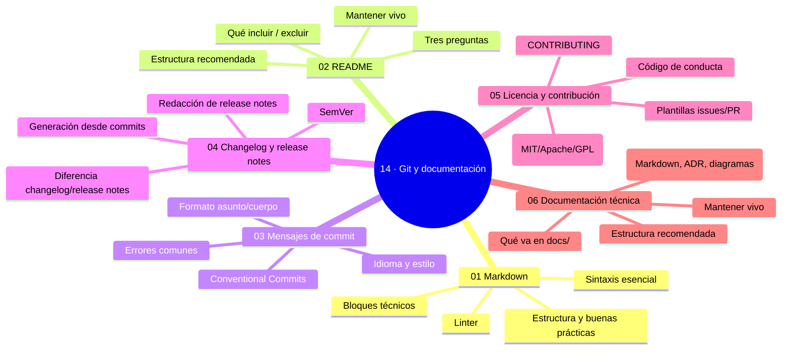

# 14 — Git y documentación

## Bienvenido a esta sección

El mejor código del mundo no sirve si nadie entiende qué hace, por qué existe ni cómo usarlo. La documentación no es un extra: es parte de la entrega.

 Aquí aprenderás a escribir con formato (Markdown), a construir la puerta de entrada (README), a dejar memoria en el historial (mensajes de commit), a contar la historia por entregas (changelog y release notes), a poner el marco legal y social (licencia y contribución) y a ordenar el conocimiento (`docs/`).

## En esta sección estudiarás

* Markdown esencial y bloques técnicos para repositorios;
* estructura y mantenimiento del README (las tres preguntas);
* mensajes de commit con asunto, cuerpo y convención (Conventional Commits);
* changelog y release notes ligados a semver y tags;
* licencia, CONTRIBUTING, código de conducta y plantillas de issues/PR;
* organización de `docs/` con guías, ADRs y runbooks.

## Objetivos de aprendizaje

Al terminar esta sección serás capaz de:

* escribir y formatear contenido con Markdown esencial (títulos, listas, código, enlaces);
* estructurar un README que responda qué es, cómo se usa y cómo se contribuye;
* redactar mensajes de commit con asunto, cuerpo y convención (Conventional Commits);
* mantener un changelog ligado a semver y a tags;
* organizar `docs/` con guías, ADRs y runbooks.

## Mapa conceptual

---
## ¿Qué aprenderás en esta sección?

1. [`01-markdown.md`](01-markdown.md) — sintaxis, bloques, estructura y linter.
2. [`02-el-readme.md`](02-el-readme.md) — qué es, por qué, cómo empezar.
3. [`03-mensajes-de-commit.md`](03-mensajes-de-commit.md) — el qué y el porqué del historial.
4. [`04-changelog-y-release-notes.md`](04-changelog-y-release-notes.md) — historia por entregas y semver.
5. [`05-license-y-contributing.md`](05-license-y-contributing.md) — el contrato legal y social.
6. [`06-plantillas-y-documentacion-tecnica.md`](06-plantillas-y-documentacion-tecnica.md) — `docs/` con guías, ADRs y runbooks.

## Cómo estudiar esta sección

Escribe mientras lees: cada capítulo termina con artefactos reales (README, plantilla de commit, CHANGELOG, CONTRIBUTING, `docs/`). En la sección 15 los PRs que abras consumirán todo lo que documentes aquí.

## Referencias

* CommonMark — especificación de Markdown (commonmark.org).
* Conventional Commits (conventionalcommits.org).
* «Keep a Changelog» (keepachangelog.com).
* GitHub — Documentación oficial: plantillas de PR y guías de código.

---
## Checkpoint 14 — Comprobación obligatoria

Antes de avanzar a `15-pull-requests/`, demuestra que puedes (en un repositorio de práctica real):

1. **Crear** un README que responda las tres preguntas (qué, por qué, cómo) usando una plantilla básica.
2. **Escribir** un mensaje de commit siguiendo Conventional Commits con asunto ≤50 caracteres y cuerpo que explique el porqué.
3. **Generar** un changelog desde commits usando una herramienta (ej. git-cliff) y redactar release notes con destacado y breaking changes.
4. **Añadir** una licencia MIT y un archivo CONTRIBUTING que describa el flujo de fork/rama → PR → revisión.
5. **Organizar** una carpeta `docs/` con índice, una guía, un ADR y un runbook corto, todos enlazados desde el README raíz.
6. **Usar** un linter de Markdown (markdownlint) para corregir errores de sintaxis y encabezados en un documento.

## Autopreguntas de cierre

Sin mirar el material, responde mentalmente y luego compruébalo con los capítulos de la sección:

1. ¿Cuáles son las tres preguntas que debe responder tu README?
2. ¿Qué comunica `feat: ...` que no comunica un mensaje libre?
3. ¿Cuándo escribes release notes y cuándo actualizas el changelog?
4. ¿Qué es un ADR y cuándo se escribe?
5. ¿Por qué es importante que los mensajes de commit usen el imperativo y qué impacto tiene en la lectura futura del historial?
6. ¿Cómo decides qué información va en el README y qué debe moverse a `docs/` según la regla de ubicación?
7. ¿Qué consecuencias tiene publicar una release sin actualizar el changelog ni las release notes para los usuarios que dependen de versionado automático?
8. ¿Cómo afecta la ausencia de un código de conducta con canal de denuncia a la capacidad de incorporar nuevos colaboradores en un proyecto?

---
## Próximo paso

Cuando termines los seis capítulos, continúa con la siguiente sección:

[`../15-pull-requests/`](../15-pull-requests/)