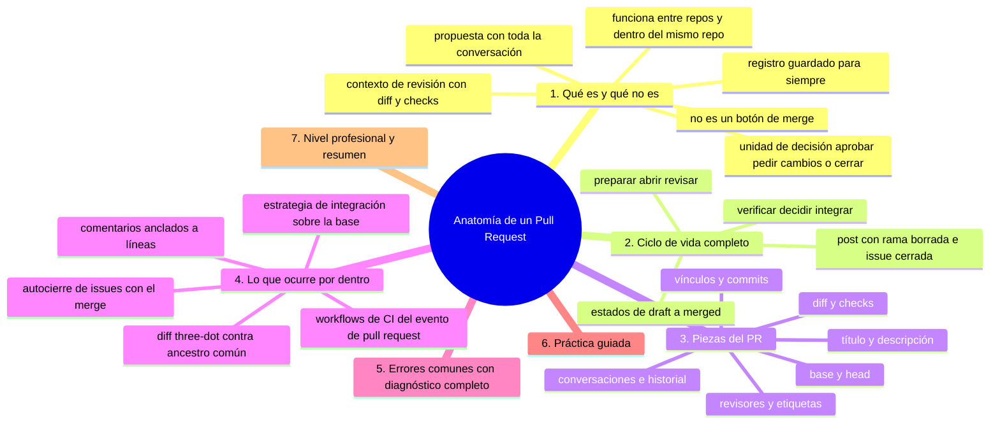
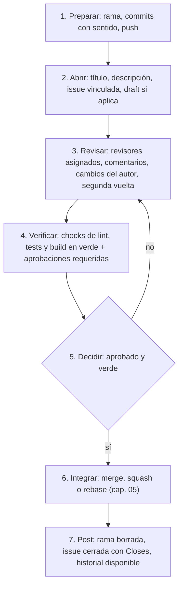

# Anatomía de un Pull Request

## Introducción

El Pull Request es la unidad de trabajo colaborativo de GitHub: una propuesta de cambio con discusión, revisión, verificación automática e historial. No es «un botón de merge»: es el contrato entre quien escribe y quien integra.

Este capítulo abre la sección describiendo qué es un PR, cómo es su ciclo de vida completo y qué piezas lo componen — desde la rama remota hasta la checks de CI.

---

## Mapa conceptual de este capítulo



---

## 1. Qué es (y qué no es)

```text
ES:
   │
   ├── una propuesta: «combina esta rama en base»
   │   con toda la conversación alrededor
   │
   ├── un contexto de revisión: diff, comentarios,
   │   checks, estado
   │
   ├── una unidad de decisión: aprobar / pedir
   │   cambios / cerrar
   │
   └── un registro: lo que se discutió antes de
       integrar, guardado para siempre
```

```text
NO ES:
   │
   ├── «mi trabajo personal» (la rama existe en el
   │   remoto y es visible; el PR es solo su versión
   │   propuesta)
   │
   ├── un sustituto de hablar (para temas grandes,
   │   hablar primero y dejar el acuerdo en el PR)
   │
   └── un correo: el diff es la verdad; el texto
       explica el porqué
```

```text
   │
   ├── nombre «Pull Request» = «solicito que se
   │   PULLee (traiga) mi cambio»
   │
   └── funciona entre repos (fork → upstream) y
       dentro del mismo repo (rama → rama)
```

---

## 2. Ciclo de vida completo



```text
Estados comunes (según configuración):
   │
   ├── Draft: trabajo en curso, no listo para revisar
   ├── Open: propuesta viva
   ├── Changes requested: bloqueado en el autor
   ├── Approved: aprobado (¿y verde?)
   └── Merged / Closed: terminal
```

---

## 3. Piezas del PR

```text
ANATOMÍA
──────────────────────────────────────────────────────
título          → «qué» (reglas del cap. 03 sección
                  14 aplicadas)
descripción     → porqué, contexto, cómo probarlo,
                  screenshots si aplica
vínculos        → «Closes #123» (autocierre)
commits         → historia de la propuesta
diff            → el cambio real (archivos, líneas)
checks          → CI de la rama (sección 19)
revisores       → quién decide
etiquetas       → clasificación (bug, docs…)
ramas           → base y head (¡vigila la base!)
conversaciones  → comentarios, sugerencias aplicadas
historial       → fuerzas nuevas, merges de corrección
```

```text
LA BASE IMPORTA:
   │
   ├── base = rama de destino (main/develop)
   ├── head  = tu rama con el cambio
   └── si la base es la rama equivocada, el diff
       muestra ruido ajeno (cap. 6)
```

---

## 4. Lo que ocurre «por dentro»

```text
Al abrir un PR:
   │
   ├── la plataforma compara head contra el ancestro
   │   común con base → muestra el diff three-dot
   │   (lo que TÚ cambias, no lo que «adelantó» la
   │   base)
   │
   ├── dispara workflows de CI asociados a pull_
   │   request (sección 19)
   │
   └── crea un contexto de revisión persistente
       (comentarios anclados a líneas del diff)
```

```text
Al integrar:
   │
   ├── la plataforma ejecuta la estrategia elegida
   │   (merge commit / squash / rebase) en la base
   │
   ├── enlaces de issue → se cierran con el evento
   │   de merge («Closes #x»)
   │
   └── los comentarios y el diff quedan en el
       historial del PR (auditoría futura)
```

```text
Reglas típicas de protección (sección 18):
   │
   ├── no se puede merge directo a la base
   ├── checks obligatorias
   └── N aprobaciones (N según el área)
```

---

## 5. Errores comunes con diagnóstico completo

### Error 1: abrir PR con base equivocada

**Qué ocurrió:** el diff está lleno de archivos que tú no tocaste.

**Por qué posibles:**
* elegiste otra rama como base;
* ramas divergidas (tu rama salió de un punto viejo).

**Cómo comprobarlo:** cabecera del PR (base ← head); `git merge-base` local.

**Opciones:** cambiar la base en la plataforma (si el diff se limpia); rebasear tu rama sobre la base correcta y forzar (rama no compartida).

**Riesgos:** revisar ruido ajeno; integrar cambios no revisados.

**Solución:** base = rama de integración del proyecto; verificar el diff ANTES de pedir revisión.

**Cómo se evita:** plantilla de PR con verificación de base.

---

### Error 2: PR que no cierra la issue (o la cierra mal)

**Qué ocurrió:** la issue sigue abierta tras el merge, o se cerró una que no correspondía.

**Por qué posibles:**
* falta el «Closes #n»;
* número de repo erróneo (PR en fork);
* «Fixes» mal escrito/no reconocido.

**Cómo comprobarlo:** descripción del PR; tras merge, estado de la issue.

**Opciones:** cerrar manualmente; corregir la convención para futuros PRs.

**Riesgos:** tablero mentiroso.

**Solución:** convención escrita («Closes #n» en la última línea).

**Cómo se evita:** checklist del PR (sección 04 de esta sección).

---

### Error 3: PR con 40 commits de ida y vuelta

**Qué ocurrió:** «aplica prettier», «fix typo», «wip», «merge master»×5 en la historia del PR.

**Por qué:** se trabajó sin pulir antes de compartir (o se corrige sobre la marcha sin cuidado).

**Cómo comprobarlo:** pestaña de commits del PR.

**Opciones:** rebase interactivo para agrupar/reordenar antes de la revisión final (rama en tu poder); o squash al integrar (cap. 05) como política.

**Riesgos:** revisión imposible; historial de ruido permanente si se hace merge de rama.

**Solución:** «limpiar historia antes de pedir revisión» como hábito.

**Cómo se evita:** convención de integración del equipo (cap. 05).

---

### Error 4: pedir revisión de un PR no listo

**Qué ocurrió:** el revisor pierde tiempo con trabajo a medio camino (o se cierra con «draft» mal usado).

**Por qué:** prisa por «tener el PR abierto».

**Cómo comprobarlo:** ¿pasan los checks? ¿el diff incluye TODO menos pulido?

**Opciones:** cerrar y reabrir cuando esté listo; usar Draft desde el inicio (Draft no pide revisión).

**Riesgos:** frustración y review fatigue.

**Solución:** «PR listo» = green + descripción completa + historia limpia.

**Cómo se evita:** etiquetas/Draft como parte del flujo (cap. 06).

---

### Error 5: comentarios personales o tono de reproche

**Qué ocurrió:** «esto está mal hecho» / «¿por qué hiciste esto?» → discusión tóxica.

**Por qué:** confundir el código con la persona.

**Cómo comprobarlo:** leer los comentarios en frío.

**Opciones:** reescribir en términos del código y el impacto («este path no escapa el error X; propongo…»); moderación del líder técnico.

**Riesgos:** gente que deja de aportar.

**Solución:** plantilla mental: observación → impacto → propuesta.

**Cómo se evita:** código de conducta (sección 14, cap. 05) y ejemplo del equipo.

---

### Error 6: dependencias cruzadas entre PRs

**Qué ocurrió:** tres PRs que se necesitan entre sí; nadie puede merge sin el otro; el base cambia.

**Por qué posibles:**
* desglose mal cortado de una feature grande;
* rama viva mucho tiempo.

**Cómo comprobarlo:** cada PR depende de cambios que solo viven en otro PR.

**Opciones:** apilar PRs (uno sobre otro, con base encadenada); o secuenciar merges (merge A primero, rebase B); o dividir distinto.

**Riesgos:** deadlock de revisión.

**Solución:** pensar el corte ANTES (feature flags, fases).

**Cómo se evita:** criterio de «cada PR mergeable por sí solo» (sección 17).

---

## 6. Práctica guiada

### Objetivo

Abrir un PR completo con descripción, vínculo a issue y verificación.

### Paso 1: prepara la rama

```bash
git switch main && git pull
git switch -c feat/exportar-csv
# ... trabaja y commitea con convención ...
git push -u origin feat/exportar-csv
```

### Paso 2: issue de destino

1. Abre (o localiza) una issue: «Añadir exportación CSV» → número #42.

### Paso 3: abre el PR

```text
Título: feat: añade exportación a CSV
Base: main ← feat/exportar-csv
Descripción:
  - Qué: comando `export --format csv`
  - Por qué: los usuarios piden exportar reportes
  - Cómo probar: pasos + ejemplo de salida
  - Closes #42
Etiquetas: feature
Revisor: (según área)
```

### Paso 4: checks

```text
Observa la pestaña de checks: espera a verde
(si falla: cap. 06 de la sección 19 para leer logs)
```

### Paso 5: pide revisión (o déjalo Draft)

```text
Si todo está: «Ready for review» + asigna revisor.
Si falta algo: deja el PR en Draft.
```

### Paso 6: ciclo de comentarios

1. Aplica una sugerencia desde la interfaz (cap. 04).
2. Fuerza nueva con `git push` y observa cómo el PR se actualiza.

### Resultado esperado

PR abierto con base correcta, descripción completa, checks verdes y vínculo a la issue.

### Conclusión esperada

Un PR es un paquete: propuesta + evidencia (checks) + contexto (descripción) + decisión (revisión).

### Ejercicio de transferencia

En un repositorio donde ya trabajes — o en uno simulado con una segunda cuenta — abre un PR real de cualquier cambio pequeño y recórrelo por sus piezas: base correcta, descripción con qué/porqué/cómo probar, vínculo a una issue y checks en verde. Entrega: el enlace al PR y la cabecera escrita (base ← head) con el estado de sus checks.

---

## 7. Nivel profesional + resumen

### 7.1. El PR como contrato de equipo

```text
   │
   ├── definición de «listo» (DoR): checks verde,
   │   historia limpia, descripción, pruebas, docs
   │
   ├── definición de «hecho» (DoD): aprobado +
   │   integrado + issue cerrada + rama borrada
   │
   ├── métricas con criterio: tiempo a primera
   │   revisión, tamaño medio (PRs de ~100-400 líneas
   │   revisan mejor), % de comentarios resueltos
   │
   └── la plataforma es display: todo lo crítico
       (rama, historia) vive en Git y se verifica
       aunque cambie de host
```

### 7.2. Resumen

En este capítulo aprendiste que:

* el PR es una propuesta con discusión, verificación y decisión — no un botón de merge;
* su ciclo: preparar → abrir → revisar → verificar → decidir → integrar → post;
* sus piezas: título/descripción, vínculos, commits, diff, checks, revisores, base y head;
* por dentro: diff three-dot contra ancestro común, workflows de CI y cierre automático de issues;
* los errores típicos (base errónea, issues sin cerrar, historia sucia, PR no listo, tono, dependencias cruzadas) se previenen con convención y Draft;
* a nivel profesional: DoR/DoD y PRs pequeños como métrica de salud.

La idea principal es:

> **El PR es el contrato entre quien escribe y quien integra: propuesta clara, evidencia verde y conversación respetuosa — el merge es solo la última línea.**

---

## Autopreguntas de cierre

Sin mirar el material, responde mentalmente y luego compruébalo con este capítulo:

1. ¿Por qué decimos que un PR no es «un botón de merge» y qué se pierde cuando lo tratas como tal?
2. ¿Qué diferencia hay entre lo que muestra el diff three-dot y lo que «adelantó» la base, y por qué importa eso para revisar?
3. Si el diff aparece lleno de archivos que tú no tocaste, ¿cuáles son las dos causas probables y cómo decides cuál aplica?
4. ¿Por qué un PR con checks verdes y aprobación puede seguir sin estar listo para integrar?
5. ¿Qué papel juega el estado Draft y por qué no pedir revisión de algo no listo ahorra tiempo al equipo entero?
6. ¿Qué cosas quedan guardadas para siempre cuando un PR se integra, aunque el historial quede lineal?

---

## Próximo paso

Ya conoces el mapa del PR.

Aprende a escribir los que se revisan bien: pequeños, atómicos y bien contados.

Continúa con:

[`02-como-escribir-un-buen-pr.md`](02-como-escribir-un-buen-pr.md)
