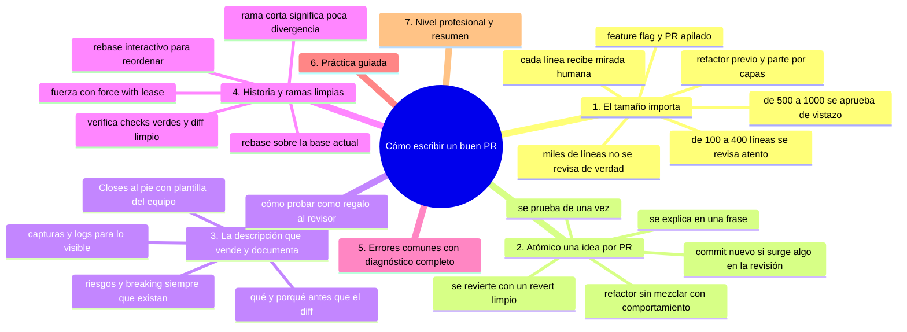
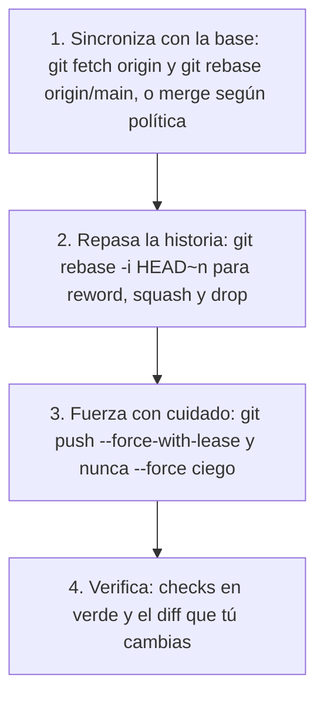

# Cómo escribir un buen PR

## Introducción

La calidad de una revisión depende casi tanto de la calidad del PR como del código. Un PR bien cortado, bien descrito y con historia limpia se revisa en minutos; un PR desordenado convierte diez minutos de trabajo en dos horas de discusión.

Este capítulo es el manual del autor: cómo partir cambios, qué escribir en la descripción, cómo mantener la rama y cómo presentar el trabajo para que la revisión fluya.

---

## Mapa conceptual de este capítulo



---

## 1. El tamaño importa

```text
TAMAÑO Y CALIDAD DE REVISIÓN
──────────────────────────────────────────────────────
~ 100-400 líneas  → revisión atenta, comentarios útiles
~ 500-1000       → se empieza a «aprobar de vistazo»
~ miles          → no se revisa de verdad; se archiva
```

```text
Criterios de «demasiado grande»:
   │
   ├── el revisor pregunta «¿por qué tanto?»
   ├── toca N subsistemas a la vez
   ├── lleva días abierta creciendo
   └── no cabe en una frase «este PR hace…»
```

```text
Qué hacer si es grande POR NATURALEZA:
   │
   ├── extraer refactor previo (PR aparte, cero
   │   cambio de comportamiento)
   ├── partir por capas: infra → lógica → UI
   ├── feature flag: integrar por partes y activar
   │   al final (sección 17)
   └── PR apilado (cap. 06): uno sobre otro
```

```text
   │
   └── el objetivo no es «PRs pequeños» por
       estética: es que CADA línea reciba mirada
       humana
```

---

## 2. Atómico: una idea por PR

```text
ATÓMICO = un cambio coherente que se explica en
una frase y se prueba de una vez
```

```text
EJEMPLOS
──────────────────────────────────────────────────────
✓ «Corrige el cálculo de IVA en la exportación»
  (arreglo + test)

✗ «Arregla IVA, renombra variables, actualiza docs y
   refactoriza el parser»
  (4 ideas: ¿se revisa junto? ¿se revierte junto?)

✗ PR «misc» con cambios de todo el mes
```

```text
Cómo lograrlo:
   │
   ├── commitea por unidades; si el día salió
   │   revuelto, separa con rebase -i ANTES de abrir
   │   el PR (sección 12)
   │
   ├── refactor NO mezclado con cambio de
   │   comportamiento («no mezclar toneladas»: la
   │   revisión distingue intención)
   │
   └── si surge algo durante la revisión: commit
       nuevo en la misma rama (o PR aparte si no
       pertenece)
```

```text
Revertibilidad:
   │
   └── un PR atómico se revierte con un «revert»
       limpio; uno mezclado no
```

---

## 3. La descripción que vende (y documenta)

```markdown
## Qué hace
Comando `export --format csv` que vuelca el reporte
actual a CSV con codificación UTF-8.

## Por qué (contexto)
Issue #42: los usuarios llevan los datos a hojas de
cálculo. Alternativa descartada: export XLSX (coste
de dependencia pesada).

## Cómo probarlo
1. `npm start` → `export --format csv`
2. Esperado: archivo `reporte.csv` con cabeceras.

## Capturas / logs
<captura si hay UI>

## Riesgos / breaking
Ninguno. No toca la API existente.

Closes #42
```

```text
Reglas:
   │
   ├── «qué» y «porqué» ANTES que el diff (el
   │   revisor necesita marco)
   ├── «cómo probar» = regalo al revisor (y a ti
   │   mañana)
   ├── screenshots/logs para lo visible
   ├── breaking y riesgos, SIEMPRE si existen
   └── «Closes #n» al pie (cap. 03 sección 14)
```

```text
Plantilla del equipo:
   │
   └── .github/PULL_REQUEST_TEMPLATE.md (sección 14,
       cap. 05) — el texto se rellena, no se inventa
```

---

## 4. Historia y ramas limpias



```text
Historia ideal de rama (ejemplo):
   │
   ├── feat: añade parser de CSV
   ├── feat: expone comando export
   └── test: cubre export con encabezados y acentos
   (3 commits con sentido, o 1 si el equipo prefiere
   squash — política, cap. 05)
```

```text
   │
   ├── rama corta en el tiempo = poca divergencia =
   │   rebase fácil = diff honesto
   │
   └── rama de días/meses: sincroniza con la base
       regularmente (sección 17)
```

---

## 5. Errores comunes con diagnóstico completo

### Error 1: «toda la feature de golpe» (big bang)

**Qué ocurrió:** un PR de 3000 líneas que nadie revisa y que nadie se atreve a bloquear.

**Por qué posibles:**
* la rama vivió semanas sin abrir PR;
* falta de práctica en partir trabajo.

**Cómo comprobarlo:** `git diff --stat origin/main...HEAD`.

**Opciones:** cerrar y partir (repartir cambios en varias ramas/PRs); extraer refactors; usar feature flags para integrar por tramos.

**Riesgos:** review ficción, deuda de revisión, conflictos crecientes.

**Solución:** abrir PRs pequeños temprano («PR de borrador» para alinear antes de codificar).

**Cómo se evita:** plan de corte en la estimación de la tarea.

---

### Error 2: descripción que solo repite el título

**Qué ocurrió:** «fix bug» como título y cuerpo vacío; el revisor deduce el contexto adivinando.

**Por qué:** prisa; sin plantilla.

**Cómo comprobarlo:** leer el PR sin ver el código.

**Opciones:** rellenar qué/porqué/cómo probar antes de pedir revisión.

**Riesgos:** preguntas cíclicas en comentarios, retraso.

**Solución:** checklist: «¿se entiende sin el diff?».

**Cómo se evita:** plantilla obligatoria (en repo).

---

### Error 3: PR con «solo un más» de ruido

**Qué ocurrió:** dentro del diff: cambios de formato de 200 líneas, imports ordenados, renombres — perdidos entre el cambio real.

**Por qué:** linter automático sobre archivos no tocados; IDE al guardar.

**Cómo comprobarlo:** mirar `--stat` antes de push; revisar el diff.

**Opciones:** deshacer ruido (restore de archivos ajenos al cambio); formato en PR aparte (o dejado al linter de CI sobre cambios).

**Riesgos:** el cambio real pasa desapercibido; conflictos innecesarios.

**Solución:** «commit solo lo relacionado» (add por archivo).

**Cómo se evita:** hooks/lint configurados y `git add` consciente.

---

### Error 4: historia sucia tras la revisión

**Qué ocurrió:** se aplicaron 15 «fix tras comentarios» y el historial quedó ilegible de reescribir (ya publicado, gente comentando encima).

**Por qué:** se fuerza rebase sobre rama ya revisada sin coordinar.

**Cómo comprobarlo:** comentarios anclados a commits que ya no existen (los «ghost» de la plataforma).

**Opciones:** dentro de una ronda: añadir commits (seguro); entre rondas grandes: avisar «voy a rebasear para limpiar» antes de forzar.

**Riesgos:** perder hilos de discusión.

**Solución:** política: fuerza solo con aviso; limpieza fina al final.

**Cómo se evita:** acordarlo en el equipo (cap. 06).

---

### Error 5: PR sin nada verificable

**Qué ocurrió:** el revisor no puede ejecutar nada (falta config, dependencias, pasos).

**Por qué:** el autor tenía el entorno «en la cabeza».

**Cómo comprobarlo:** seguir «Cómo probar» en entorno limpio.

**Opciones:** completar pasos; añadir test automatizado que lo demuestre.

**Riesgos:** aprobación a ciegas.

**Solución:** evidencia mínima: test o pasos ejecutables.

**Cómo se evita:** «cómo probar» como campo obligatorio.

---

### Error 6: PR que crece en silencio

**Qué ocurrió:** mientras esperaba revisión, el equipo movió la base; el PR acumula conflictos y comentarios viejos.

**Por qué:** rama dormida; sin sincronizar.

**Cómo comprobarlo:** pestaña de conflictos; fecha del último commit vs. actividad de main.

**Opciones:** rebase y re-respuesta; avisar al revisor; si el cambio ya no aplica → cerrar sin vergüenza (cerrar PR es válido).

**Riesgos:** PR zombi bloqueando decisiones.

**Solución:** sincronizar pronto y cerrar lo obsoleto.

**Cómo se evita:** vigilancia de PRs abiertos (etiqueta/panel del equipo).

---

## 6. Práctica guiada

### Objetivo

Convertir una rama desordenada en un PR modelo.

### Paso 1: mide

```bash
git diff --stat origin/main...HEAD
git log --oneline origin/main..HEAD | Measure-Object
# ¿demasiadas líneas/commits? → parte
```

### Paso 2: limpia la historia

⚠️ **RIESGO:** el rebase interactivo reescribe commits de tu rama: si ya los habías publicado, dejan de existir en la rama; recupéralos con `git reflog` si los necesitas.

```bash
git rebase -i HEAD~5
# → reword: mensajes con qué/porqué
# → squash: commits de prueba/«wip»
```

### Paso 3: rebase final

⚠️ **RIESGO:** el rebase cambia los hashes de tus commits y el push sobrescribe la rama remota: quien la tenga abierta pierde los comentarios anclados a commits que ya no existen; recupera lo anterior con reflog y avisa antes de forzar.

```bash
git fetch origin
git rebase origin/main
git push --force-with-lease
```

### Paso 4: descripción modelo

1. Rellena la plantilla: Qué / Por qué / Cómo probar / Riesgos / `Closes #n`.

### Paso 5: autocrítica del diff

```text
Recorre el diff archivo por archivo:
   │
   ├── ¿todos pertenecen a la idea?
   ├── ¿ruido de formato? → sácalo
   ├── ¿cambios que rompen? → declarados arriba
   └── ¿tests/docs? → presentes
```

### Paso 6: prueba del revisor

1. Pide a alguien (o a ti, mañana) que lea solo título+descripción: ¿sabe qué hace y cómo probarlo?

### Resultado esperado

PR con historia de pocos commits con mensajes, diff limpio, descripción completa y checks verdes.

### Conclusión esperada

Un buen PR es trabajo de empaque: parte, limpia, documenta y evidencia — la revisión hará el resto.

### Ejercicio de transferencia

Toma el trabajo más grande que hayas hecho esta semana — o inventa uno — y córtalo en dos PRs atómicos: uno de refactor sin cambio de comportamiento y otro de cambio de comportamiento, cada uno con su descripción de qué, porqué y cómo probarlo. Entrega: las dos descripciones escritas y la frase que justifica el corte.

---

## 7. Nivel profesional + resumen

### 7.1. Estándar de autoría

```text
CHECKLIST DEL AUTOR (antes de «Ready for review»)
──────────────────────────────────────────────────────
[ ] base correcta + rebase reciente
[ ] diff sin ruido ajeno
[ ] historia: mensajes con qué/porqué, sin wip
[ ] descripción: qué, por qué, cómo probar, riesgos
[ ] tests/docs actualizados
[ ] checks verdes
[ ] Closes #n
[ ] tamaño: si no cabe en una frase → partir
```

```text
   │
   ├── PRs pequeños y atómicos = métrica de equipo
   │   (no de individuo)
   │
   ├── para features grandes: plan de corte o
   │   apilado/flags (sección 17)
   │
   └── el autor es el primer revisor de su propio PR
       (leerlo en la plataforma ANTES de pedir)
```

### 7.2. Resumen

En este capítulo aprendiste que:

* el tamaño importa: ~100-400 líneas se revisan de verdad; más, se archivan;
* atómico = una idea, una frase, una reversión;
* la descripción lleva qué, porqué, cómo probar, riesgos y `Closes #n` — más screenshots cuando aplique;
* la historia se limpia con rebase -i y se rebasea sobre la base antes de pedir revisión (force-with-lease si hace falta);
* los errores típicos (big bang, cuerpo vacío, ruido en diff, fuerza sin avisar, sin evidencia, PR zombi) se previenen con checklist del autor;
* a nivel profesional: checklist de «ready» como estándar del equipo.

La idea principal es:

> **La revisión solo es tan buena como el paquete que recibe: parte el trabajo, limpia la historia, cuenta el porqué y deja la evidencia — el revisor aporta lo que tú no ves.**

---

## Autopreguntas de cierre

Sin mirar el material, responde mentalmente y luego compruébalo con este capítulo:

1. ¿Por qué un PR de 3000 líneas no se revisa de verdad, aunque el revisor sea meticuloso?
2. ¿Qué debe responder la descripción de un PR antes de que nadie mire el diff, y por qué ese orden ayuda al revisor?
3. ¿Por qué el refactor debe viajar en un PR distinto del cambio de comportamiento?
4. ¿Qué ganas y qué arriesgas al limpiar la historia con rebase interactivo justo antes de pedir revisión?
5. Si durante la revisión surge un cambio que no pertenece al PR, ¿qué haces y por qué no lo metes «ya que estamos»?
6. ¿Por qué cerrar un PR sin merge puede ser la mejor decisión y cómo evitas que un PR se convierta en zombi?

---

## Próximo paso

Ya sabes empaquetar el cambio.

Ahora la otra mitad: recibir y dar revisión con criterio.

Continúa con:

[`03-revision-de-codigo.md`](03-revision-de-codigo.md)
