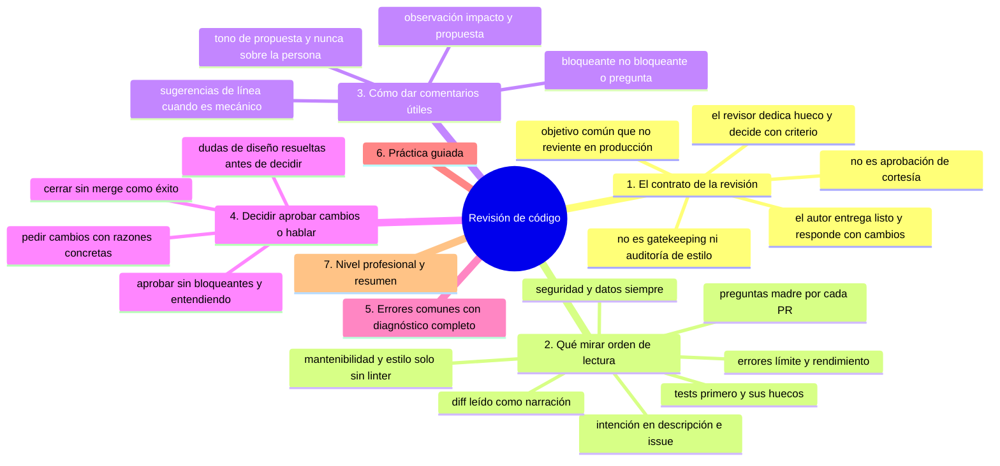
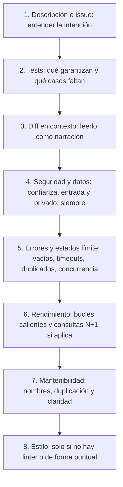
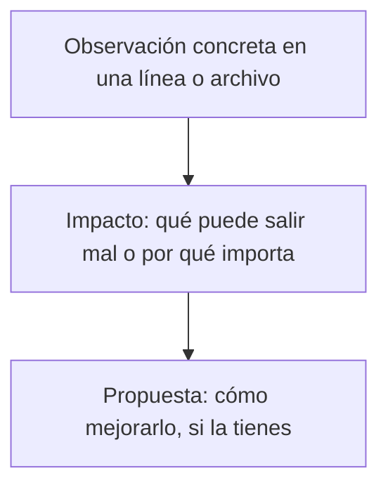

# Revisión de código

## Introducción

La revisión de código es la verificación humana del cambio: encuentra defectos que los tests no imaginan, enseña al equipo y mantiene la coherencia del sistema. Es también una de las actividades más malgastadas cuando se hace sin criterio: comentarios de estilo irrelevantes, vueltas infinitas o silencio absoluto.

Este capítulo enseña a revisar con método: qué mirar y en qué orden, cómo dar comentarios útiles y cómo decidir (aprobar, pedir cambios o discutir).

---

## Mapa conceptual de este capítulo



---

## 1. El contrato de la revisión

```text
PARTE DEL AUTOR:
   │
   ├── PR pequeño, listo y documentado (cap. 02)
   └── responde comentarios con cambios o argumentos

PARTE DEL REVISOR:
   │
   ├── prioriza: la revisión es trabajo, con hueco
   │   en el calendario (no «cuando pueda»)
   ├── mira el cambio y su impacto, no al autor
   ├── comenta lo que importa; calla lo cosmético si
   │   el linter puede (o da 1 línea)
   └── responde con claridad: aprobar / pedir cambios
       / seguir hablando
```

```text
Qué NO es:
   │
   ├── gatekeeping de ego
   ├── auditoría de estilo (eso es el linter)
   └── aprobación de cortesía («verde y firmo»)
```

```text
   │
   └── el objetivo compartido: «que esto no reviente
       en producción ni en seis meses»
```

---

## 2. Qué mirar (orden de lectura)



```text
Preguntas madre (por cada PR):
   │
   ├── ¿hace lo que dice la descripción?
   ├── ¿qué pasa si falla / vacío / concurrente?
   ├── ¿rompe algo fuera del diff? (contratos,
   │   clientes, scripts)
   ├── ¿se puede revertir limpio?
   └── ¿podré entenderlo en 6 meses con el mensaje
       y los tests?
```

```text
Técnica:
   │
   ├── lee el diff en la plataforma, pero ÁBRELO en
   │   local cuando haga falta (contexto completo,
   │   ejecutar pruebas)
   │
   └── revisa por ARCHIVOS, no por scroll infinito
```

---

## 3. Cómo dar comentarios útiles



```text
EJEMPLOS
──────────────────────────────────────────────────────
✗ «¿esto funciona?»
✓  «En error[] no se maneja timeout: si la API tarda
    30s el usuario ve un spinner infinito. Propongo
    catch + retry con backoff o al menos mensaje.»

✗ «malo»
✓  «La validación duplica la del módulo X; si la
    cambian ahí esta se queda vieja. ¿Importamos la
    función compartida?»

✗ «cambia esto ya» (estilo personal)
✓  «Esto es solo estilo; lo marca el linter en CI,
    déjalo correr.»
```

```text
Tipos de comentario y cuándo usarlos:
   │
   ├── bloqueante (changes request): bug, seguridad,
   │   pérdida de datos → pide cambios
   ├── no bloqueante (sugerencia): mejoras, deuda
   └── pregunta (duda): a veces es aprendizaje mutuo

Tono:
   │
   ├── «propongo», «¿qué pasa si…?», «me preocupa…»
   ├── elogia lo bueno brevemente (refuerza)
   └── nunca comentarios sobre la persona
```

```text
Sugerencias de línea (la plataforma las convierte en
commits propuestos) → usa ese recurso cuando la
corrección es mecánica
```

---

## 4. Decidir: aprobar, cambios o hablar

```text
ESTADOS Y SU CRITERIO
──────────────────────────────────────────────────────
Approve
  · no hay bloqueantes
  · tests/docs adecuados al cambio
  · entiendes qué hace y lo comprarías

Request changes
  · bug, riesgo de datos/seguridad, contrato roto
  · falta lo imprescindible (test de lo crítico)
  · NO usar por preferencias personales

Comentario / discusión
  · dudas de diseño que conviene resolver ANTES de
    decidir → comenta y espera (o propone charla)

Cierre (autor o revisor)
  · la propuesta ya no aplica → cerrar es éxito,
    no fracaso
```

```text
   │
   ├── si no puedes aprobar con honestidad y tampoco
   │   bloquear con razones → falta información:
   │   pregúntala
   │
   └── una segunda opinión (revisor senior) para
       cambios de diseño
```

---

## 5. Errores comunes con diagnóstico completo

### Error 1: revisión de estilo con bloqueo

**Qué ocurrió:** PR bloqueado por sangría, nombres de variables o preferencias de formato.

**Por qué posibles:**
* no hay linter;
* confundir gusto con defecto.

**Cómo comprobarlo:** ¿el comentario apunta a lógica/riesgo o a forma?

**Opciones:** aprobar y dejar sugerencia no bloqueante; o instalar linter y dejar que regule.

**Riesgos:** autor frustrado; revisiones lentas y resistentes.

**Solución:** bloquea solo defecto/riesgo; la forma la regula la herramienta.

**Cómo se evita:** acuerdo de equipo (checklist de lo bloqueante).

---

### Error 2: aprobar sin leer (rubber stamp)

**Qué ocurrió:** aprobación en 30 segundos con checks verdes; bugs que solo aparecen en producción.

**Por qué posibles:**
* presión de tiempo;
* PRs enormes (nadie lee 3000 líneas);
* fatiga de revisión.

**Cómo comprobarlo:** métricas de tiempo de revisión vs. tamaño; hallazgos por PR.

**Opciones:** pedir cambios por revisión incompleta (tú como segundo revisor); partir PRs.

**Riesgos:** la revisión deja de proteger.

**Solución:** tiempo proporcional y PRs pequeños (cap. 02).

**Cómo se evita:** carga repartida y límites de tamaño.

---

### Error 3: PR muerto en silencio

**Qué ocurrió:** abierto 5 días sin nadie mirarlo.

**Por qué posibles:**
* nadie asignado;
* no hay cultura de SLA de revisión;
* el PR es tan grande que se evita.

**Cómo comprobarlo:** tiempo hasta el primer comentario.

**Opciones:** asignar revisor explícito; acordar «primer comentario en 24h»; escalar al líder.

**Riesgos:** bloqueo de entrega, divergencia de ramas.

**Solución:** revisión como tarea con dueño.

**Cómo se evita:** métrica de tiempo a primera revisión (cap. 06).

---

### Error 4: discusión de diseño dentro del diff

**Qué ocurrió:** comentarios largos descubriendo que el enfoque entero está mal; vueltas y vueltas sobre líneas.

**Por qué:** el momento de diseñar fue tarde (o no hubo).

**Cómo comprobarlo:** el hilo de comentarios no habla de líneas, sino de arquitectura.

**Opciones:** parar el hilo: «¿lo hablamos 15 min y dejamos la decisión anotada?»; cerrar y reabrir PR con nuevo enfoque si hace falta.

**Riesgos:** discusión agotadora, decisiones a medias.

**Solución:** diseño previo para cambios grandes (cap. 06 / sección 15/25).

**Cómo se evita:** RFC breve para cambios estructurales (mención).

---

### Error 5: comentarios vago/hostiles o solo negativos

**Qué ocurrió:** «esto está mal», «¿por qué así?», cero reconocimiento → el autor se cierra.

**Por qué:** tono descuidado; revisar tarde y con prisa.

**Cómo comprobarlo:** leer el hilo completo en frío.

**Opciones:** reescribir con observación/impacto/propuesta; pedir moderação.

**Riesgos:** clima tóxico, gente que deja de aportar.

**Solución:** fórmula del punto 3 y ejemplo del senior.

**Cómo se evita:** COC (sección 14) y cultura visible (comentar también lo bueno).

---

### Error 6: comentarios que no se resuelven

**Qué ocurrió:** PR merge con 12 comentarios abiertos; nadie sabe cuáles están pendientes.

**Por qué posibles:**
* no se usan los estados de hilo;
* el autor responde sin aplicar ni argumentar.

**Cómo comprobarlo:** pestaña de conversaciones: ¿todos resueltos?

**Opciones:** resolver hilos al aplicar; marcar «resuelto con duda» y argumentar.

**Riesgos:** acuerdos perdidos.

**Solución:** «todo hilo termina resuelto o con decisión explícita».

**Cómo se evita:** checklist de PR (cap. 04).

---

## 6. Práctica guiada

### Objetivo

Revisar un PR real con el método de lectura por capas y dejar comentarios calificados.

### Paso 1: contexto (2 min)

1. Lee título, descripción e issue. Anota en una línea: «¿qué se promete?».

### Paso 2: tests primero (5 min)

1. Abre la pestaña de archivos «test». ¿Cubren el caso feliz y al menos un fallo límite? ¿Falta algo crítico?

### Paso 3: diff por capas

```text
Recorre con el orden del punto 2:
   │
   ├── lógica → ¿hace lo prometido?
   ├── errores → ¿maneja vacío/timeout?
   ├── seguridad → ¿entrada de usuario sin validar?
   │   ¿secretos? (marcar bloqueante)
   └── estilo → solo si no hay linter
```

### Paso 4: comenta con la fórmula

1. Deja al menos 2 comentarios: uno con observación+impacto+propuesta; otro no bloqueante o positivo.

### Paso 5: decide

1. Elige estado con criterio del punto 4 y déjalo explícito: «Aprobado con la sugerencia no bloqueante» / «Pido cambios por X».

### Paso 6: local si hace falta

```bash
git fetch origin
git switch -c revision-pr42 origin/feat/exportar-csv
# ejecuta, prueba, lee en contexto
git switch -
```

### Resultado esperado

Revisión con al menos un hallazgo útil, comentarios con propuesta y decisión explícita.

### Conclusión esperada

Revisar es un trabajo con método: intención → tests → lógica → riesgos → forma, comentando con propuesta y decidiendo con honestidad.

### Ejercicio de transferencia

Elige un PR real de un repositorio público que te interese y revísalo por capas sin tocar el código: ¿resuelve lo que promete?, ¿es correcto ante errores y seguridad?, ¿es mantenible en seis meses? Entrega: tres comentarios escritos con la fórmula observación → impacto → propuesta y tu decisión final con su razón (aprobar, pedir cambios, comentar o cerrar).

---

## 7. Nivel profesional + resumen

### 7.1. Revisión a escala de equipo

```text
   │
   ├── SLA: primer comentario en 1-2 días hábiles;
   │   PRs pequeños para que quepa
   │
   ├── CODEOWNERS: revisores por área (sección 18)
   │   — los que saben del dominio miran lo crítico
   │
   ├── carga repartida (evitar que 1 persona sea el
   │   cuello de botella)
   │
   ├── linter+CI filtran forma; humanos, lógica y
   │   diseño
   │
   └── métricas con cuidado: número de comentarios
       NO es productividad; sí importa tiempo a
       primera revisión y hallazgos de calidad
```

### 7.2. Resumen

En este capítulo aprendiste que:

* la revisión es contrato: autor entrega listo, revisor dedica tiempo y decide con criterio;
* el orden de lectura: intención → tests → diff → seguridad → errores límite → rendimiento → mantenibilidad → forma;
* los comentarios útiles llevan observación, impacto y propuesta; bloquea solo defecto/riesgo;
* aprobar exige entender; pedir cambios exige razones; dudar exige pregunta;
* los errores típicos (bloqueo por estilo, rubber stamp, PRs muertos, diseño en el diff, tono, hilos sin resolver) se previenen con acuerdos y métricas de proceso;
* a nivel profesional: SLA, CODEOWNERS y carga repartida.

La idea principal es:

> **Revisar es mirar por el equipo y por el futuro del código: intención primero, riesgos siempre, comentarios con propuesta — y una decisión honesta al final.**

---

## Autopreguntas de cierre

Sin mirar el material, responde mentalmente y luego compruébalo con este capítulo:

1. ¿Por qué se empieza la revisión por la descripción y los tests, y no por el diff?
2. ¿Qué diferencia hay entre un comentario bloqueante y una sugerencia, y qué se rompe cuando se confunden?
3. Si no puedes aprobar con honestidad ni bloquear con razones, ¿qué dice esa situación y qué deberías hacer?
4. ¿En qué se convierte «aprobar con las checks en verde» y en qué condiciones se vuelve costumbre peligrosa?
5. ¿Qué estructura hace que un comentario sea útil en lugar de ofensivo, y por qué importa el elogio breve?
6. ¿Por qué cerrar un PR sin merge se considera éxito y no fracaso?

---

## Próximo paso

Ya sabes dar y recibir comentarios con criterio.

La siguiente pieza: cómo gestionar la conversación del PR — sugerencias, resolución e iteración.

Continúa con:

[`04-comentarios-y-sugerencias.md`](04-comentarios-y-sugerencias.md)
