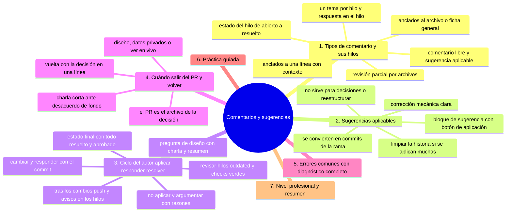
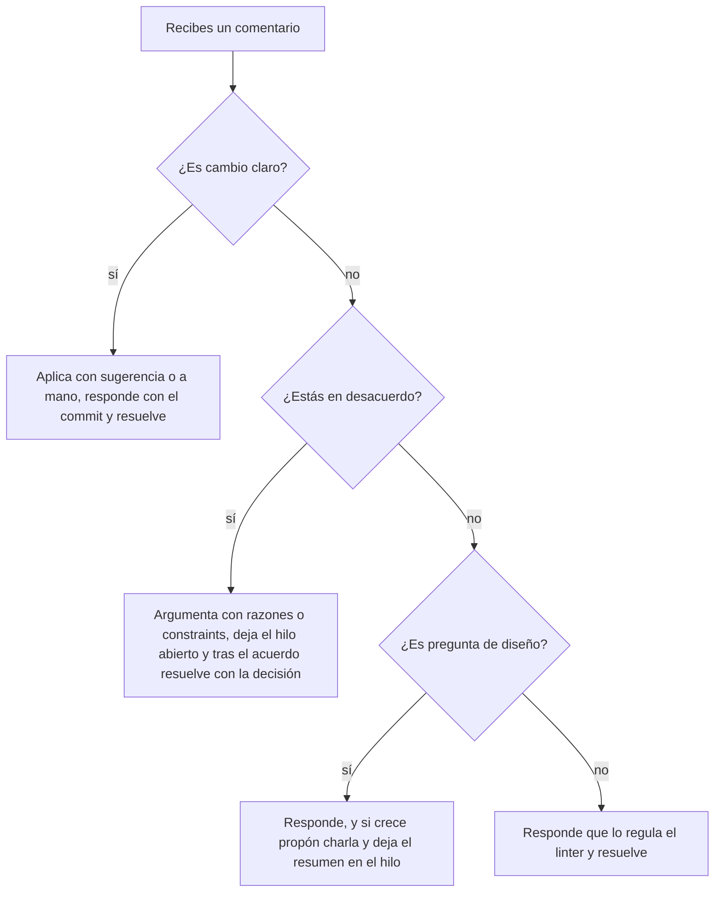

# Comentarios y sugerencias

## Introducción

La conversación del PR es donde la revisión se vuelve trabajo conjunto: el revisor señala, el autor responde y el cambio evoluciona. GitHub da para eso más que texto: hilos anclados a líneas, sugerencias aplicables con un clic, estados de resolución y ediciones que guardan contexto.

Este capítulo enseña a gestionar ese ciclo: cómo plantear sugerencias, aplicarlas, iterar sin enredar los hilos y cuándo llevar la conversación fuera del PR.

---

## Mapa conceptual de este capítulo



---

## 1. Tipos de comentario y sus hilos

```text
DÓNDE SE ANCLAN:
   │
   ├── a una línea del diff → hilo CONTEXTO (los
   │   archivos pueden desaparecer/rename →
   │   comentarios «obsoletos» de la plataforma)
   │
   ├── al archivo/ficha general → revisión amplia
   │
   └── commits concretos → mensajes de commit
       (raros en PR; usar en su sitio)
```

```text
TIPOS DE MENSAJE:
   │
   ├── comentario libre (duda, contexto, elogio)
   ├── sugerencia (```suggestion``` → botón de
   │   aplicación) — cap. 2
   ├── «aprobación parcial» (revisión por archivos:
   │   aprobar solo esos archivos)
   └── etiquetas de estado del hilo:
       abierto → resuelto (Resolved)
       + decisión: «no aplicado porque…»
```

```text
BUENA PRÁCTICA DE HILOS:
   │
   ├── un tema por hilo (no mezclar 3 temas en uno)
   ├── responde EN el hilo (el contexto vive ahí)
   └── al aplicar: resuelve el hilo; al rechazar:
       argumenta y resuelve igualmente
```

---

## 2. Sugerencias aplicables

```markdown
<!-- el revisor escribe en el comentario -->
La validación debería rechazar también el vacío:

```suggestion
if (!valor || !valor.trim()) {
  throw new Error("campo requerido");
}
```
```

```text
LO QUE OCURRE:
   │
   ├── la plataforma convierte el bloque en un diff
   │   propuesto
   │
   ├── el autor ve «Apply suggestion» → aplica con un
   │   clic (commit directo en la rama, si tiene
   │   permiso)
   │
   └── varios bloques en un mensaje → «aplicar
       todas»
```

```text
CUÁNDO USARLA:
   │
   ├── corrección mecánica clara (tipos, nombres,
   │   condiciones, texto)
   │
   └── NO para cambios que requieren decisión o
       reestructurar: ahí, comentario normal
```

```text
COMBINACIÓN DE SUGERENCIAS APLICADAS:
   │
   ├── se vuelven commits de la rama del PR (o un
   │   commit «suggestions applied»)
   │
   └── si aplicas muchas: limpia historia al final
       (cap. 02 de esta sección)
```

---

## 3. Ciclo del autor: aplicar, responder, resolver



```text
DESPUÉS DE CAMBIOS:
   │
   ├── push a la rama (el PR se actualiza solo)
   ├── responde en los hilos que tocaste (el revisor
   │   no adivina)
   └── si cambia algo grande respecto a lo acordado:
       comenta el porqué
```

```text
REVISAR EN CADA VUELTA:
   │
   ├── ¿quedan hilos abiertos sin decisión?
   ├── ¿los comentarios «outdated» siguen vigentes?
   │   (archivo cambió → reevaluar)
   └── ¿checks verdes otra vez?
```

```text
ESTADO FINAL (definición de «listo» del equipo):
   │
   └── todos los hilos resueltos con respuesta
       aplicada o decisión explícita + aprobación +
       verde
```

---

## 4. Cuándo salir del PR (y volver)

```text
SAL del hilo cuando:
   │
   ├── el tema es de DISEÑO y afecta a más PR →
   │   issue de discusión / RFC breve
   │
   ├── se necesita ver en vivo (UI, rendimiento) →
   │   compartir captura/repro y volver con datos
   │
   ├── hay desacuerdo de fondo → 15 min de charla y
   │   ACUERDO ESCRITO de vuelta en el PR
   │
   └── hay datos privados (cliente, incidente) →
       salir a canal privado (sección 20)
```

```text
VUELTA al PR siempre con:
   │
   ├── la decisión resumida en una línea
   ├── el enlace a la issue/RFC si aplica
   └── quién decide si no hay consenso (tech lead del
       área)
```

```text
   │
   └── el PR es el ARCHIVO de la decisión; la charla
       es solo el medio
```

---

## 5. Errores comunes con diagnóstico completo

### Error 1: comentarios fuera de contexto («comentario general» de todo)

**Qué ocurrió:** un muro de texto en el fichero general mezclando 5 temas.

**Por qué:** se escribió todo de una sentada.

**Cómo comprobarlo:** un solo hilo con varias respuestas de temas distintos.

**Opciones:** pedir «¿podemos separarlo en hilos?»; responder tema por tema numerado.

**Riesgos:** nada queda resuelto; hilos «perdidos».

**Solución:** un tema por hilo (punto 1).

**Cómo se evita:** revisar por archivos y comentar anclado.

---

### Error 2: sugerencias aplicadas sin leer el resto

**Qué ocurrió:** se aplicaron 20 sugerencias con un clic y se rompió la lógica (o se duplicó código).

**Por qué:** sugerencias que dependen entre sí / contexto cambiado.

**Cómo comprobarlo:** ejecutar tests tras aplicar; leer el diff final.

**Opciones:** revertir commit; aplicar a mano.

**Riesgos:** PR verde-en-teoría rojo-en-la-práctica.

**Solución:** aplicar en grupos pequeños y correr checks.

**Cómo se evita:** avisar del autor «aplico en 2 tandas y reviso».

---

### Error 3: responder sin aplicar ni argumentar

**Qué ocurrió:** «ya vi», «es complicado» y el hilo abierto para siempre.

**Por qué posibles:**
* falta de tiempo sin gestión;
* acuerdo informal no escrito.

**Cómo comprobarlo:** hilos abiertos al intentar merge (o checklist ignorada).

**Opciones:** cerrar cada hilo con «aplicado en x» o «no aplicado porque Y (aceptado por @revisor)».

**Riesgos:** decisiones perdidas y bloqueo silencioso.

**Solución:** «todo hilo termina resuelto» (sección 03).

**Cómo se evita:** plantilla/estado del PR del equipo.

---

### Error 4: discusión eterna en el hilo

**Qué ocurrió:** 30 respuestas, dos bandos, ningún cambio.

**Por qué:** tema de diseño tratado como comentario de línea.

**Cómo comprobarlo:** longitud del hilo; falta de commits nuevos.

**Opciones:** pausar y acordar fuera (cap. 4); decidir con autoridad si no hay consenso.

**Riesgos:** PR estancado; agotamiento.

**Solución:** límite informal («si pasa de N respuestas, lo hablamos»).

**Cómo se evita:** diseño previo para cambios grandes (sección 17/25).

---

### Error 5: discutir en público lo que es privado

**Qué ocurrió:** datos de cliente, credenciales o vulnerabilidad sin describir en el PR público.

**Por qué:** prisa por contexto.

**Cómo comprobarlo:** revisar enlaces y texto antes de publicar.

**Opciones:** si se filtró: incidente (rotar/limpiar según alcance, cap. 05 sección 13 / sección 20); volver al PR con referencia genérica («ver canal privado #x»).

**Riesgos:** exposición.

**Solución:** separar dato sensible de discusión pública.

**Cómo se evita:** regla de «nada sensible en PRs públicos».

---

### Error 6: el revisor no recibe respuesta y abandona

**Qué ocurrió:** el autor hizo cambios pero no avisó; el revisor no vuelve; PR colgado.

**Por qué posibles:**
* sin re-request de revisión;
* expectativa de «cómo saber si hay novedades».

**Cómo comprobarlo:** actividad del PR: ¿peticiones de revisión tras los cambios?

**Opciones:** marcar «Re-request review» tras cambios sustanciales; comentar resumen.

**Riesgos:** vueltas perdidas.

**Solución:** ritual: cambios → resumen en el PR → re-request.

**Cómo se evita:** checklist del autor (cap. 02).

---

## 6. Práctica guiada

### Objetivo

Recorrer un ciclo completo de sugerencias: aplicar, responder, resolver, re-pedir revisión.

### Paso 1: recibir

1. Con un segundo account o en un repo de práctica, deja un comentario con bloque ```suggestion``` en una línea.

### Paso 2: aplicar

1. Como autor, pulsa «Apply suggestion» (o aplica manualmente si no tienes permiso).
2. Comprueba el commit creado.

### Paso 3: responder y resolver

1. Responde en el hilo «aplicado en abc123».
2. Marca el hilo como **Resolved**.
3. Deja otro hilo sin resolver (uno de diseño) y responde con argumentos.

### Paso 4: acuerdo

1. En el hilo de diseño, llega a acuerdo (o acude a charla) y cierra con la decisión escrita.

### Paso 5: actualizar

```bash
git push        # si aplicaste a mano
# observa: checks vuelven a correr
```

1. Re-request de revisión con resumen: «2 sugerencias aplicadas; decisión en el hilo 2».

### Paso 6: checklist final

```text
[ ] todos los hilos resueltos
[ ] cambios con checks verdes
[ ] revisor re-notificado
```

### Resultado esperado

Ciclo completo: sugerencia → commit → hilo resuelto → decisión escrita → revisión re-pedida.

### Conclusión esperada

La conversación del PR es trabajo con estado: hilos que terminan, acuerdos que se escriben y cambios que se notifican.

### Ejercicio de transferencia

En tu repo de práctica con la segunda cuenta, deja un comentario con bloque de sugerencia sobre una línea y recorre el ciclo completo hasta cerrarlo: aplicar, responder con el commit y resolver el hilo. Entrega: el hilo resuelto y, si hubo desacuerdo, la decisión escrita en una línea dentro del mismo hilo.

---

## 7. Nivel profesional + resumen

### 7.1. Conversación como proceso

```text
   │
   ├── convención de hilos: un tema, respuesta,
   │   resolución — checklist de PR lo exige
   │
   ├── sugerencias para lo mecánico; comentarios con
   │   propuesta para lo conceptual
   │
   ├── acuerdos de diseño vuelven al PR (archivo) o a
   │   ADR/RFC (sección 14/25)
   │
   ├── canales: público en PR; privado para datos
   │   sensibles, volviendo con referencia
   │
   └── métricas: «tiempo con hilos abiertos» y % de
       hilos resueltos informan del flujo (con
       criterio, no como ranking)
```

### 7.2. Resumen

En este capítulo aprendiste que:

* los comentarios se anclan a líneas (contexto) o al fichero (visión general); un tema por hilo;
* las sugerencias aplicables convierten comentarios en commits con un clic — útiles para correcciones mecánicas;
* el ciclo del autor: aplicar o argumentar → responder → resolver → avisar → re-pedir revisión;
* fuera del PR solo por diseño, datos privados o verificación en vivo — siempre volviendo con acuerdo escrito;
* los errores típicos (hilos mezclados, aplicación ciega, sin resolver, discusión eterna, datos sensibles, revisor no avisado) se previenen con disciplina de hilos;
* a nivel profesional: conversación como proceso medible y acuerdos que quedan en el archivo.

La idea principal es:

> **Cada hilo es una micro-decisión: aplícala o argumenta, escríbela y ciérrala — el PR solo avanza cuando la conversación tiene estado.**

---

## Autopreguntas de cierre

Sin mirar el material, responde mentalmente y luego compruébalo con este capítulo:

1. ¿Por qué «todo hilo termina resuelto o con decisión explícita» y qué se pierde cuando un hilo se abandona?
2. ¿Cuándo es correcta una sugerencia aplicable y en qué se convierte cuando la usas para algo que exige decisión?
3. ¿Qué ocurre con la confianza del revisor cuando se responde «ya vi» sin aplicar ni argumentar?
4. ¿Por qué una decisión tomada en una charla debe volver escrita al PR?
5. Si un hilo llega a treinta respuestas sin decisión, ¿por qué conviene cortarlo y qué haces con lo hablado?
6. ¿Qué diferencia hay entre avisar de los cambios con un resumen y pedir de nuevo la revisión, y por qué ambos forman parte del ciclo?

---

## Próximo paso

Ya manejas la conversación.

Falta la decisión final: cómo integra el PR — merge, squash o rebase.

Continúa con:

[`05-merge-squash-y-rebase-en-el-pr.md`](05-merge-squash-y-rebase-en-el-pr.md)
