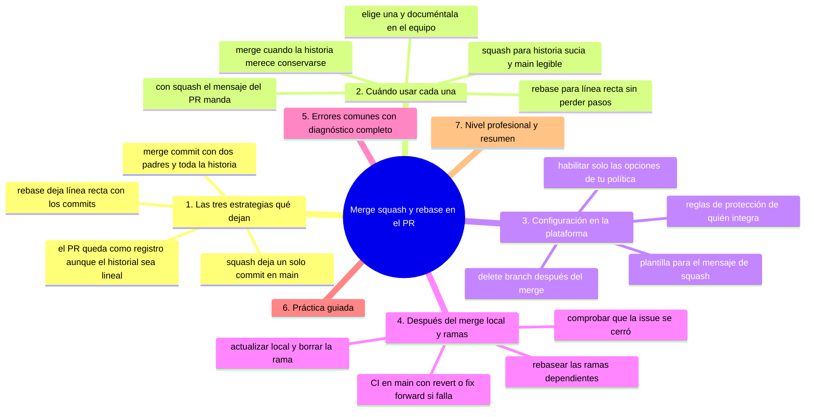
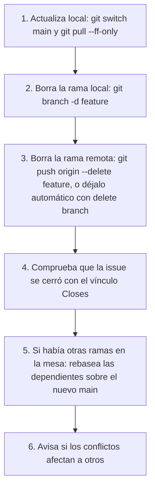

# Merge, squash y rebase en el PR

## Introducción

Llega el momento de integrar: la plataforma ofrece varios botones y cada uno deja un historial distinto. Elegir mal produce árboles ininteligibles o historiales sin contexto; elegir con criterio da un log que se lee solo.

Este capítulo explica las tres estrategias de integración de PR (merge commit, squash, rebase-and-merge), qué historial deja cada una, cómo se configuran en la plataforma y cómo coordinarlo con tu flujo local.

---

## Mapa conceptual de este capítulo



---

## 1. Las tres estrategias (qué dejan)

```text
SUPÓN: main ──A──B        rama: ──C──D──

1) CREATE A MERGE COMMIT (merge clásico)
   main: A──B──────M          M = merge commit
              \   /                (dos padres)
               C──D
   · conserva TODA la historia de la rama
   · el merge commit documenta «se integró aquí y
     qué se integró» (mensaje puede llevar Closes #n)

2) SQUASH AND MERGE
   main: A──B──S              S = UN commit con
                              todo el cambio
   · historia de main: plana, un commit por PR
   · la historia de la RAMA (C, D) NO entra a main
   · ideal si la rama tenía wip/fixups

3) REBASE AND MERGE
   main: A──B──C'──D'         commits re-aplicados
                              en la base (lineal, sin
                              merge commit)
   · conserva la historia de la rama SIN el merge
   · cambia hashes → fuerza reescritura (la
     plataforma lo hace en su espacio de integración)
```

```text
   │
   ├── «fast-forward» puro no aplica aquí como
   │   distinta opción de plataforma: rebase-and-merge
   │   produce línea recta equivalente
   │
   └── la plataforma guarda el PR como registro
       aunque el historial quede lineal
```

---

## 2. Cuándo usar cada una

```text
SQUASH (un commit por PR)
   │
   ├── rama con historia sucia pero PR bien
   ├── equipos que quieren main legible: «un PR, un
   │   commit»
   └── cuidado: se pierde la granularidad interna
       (si cada commit era un paso valioso, no squashes)

MERGE COMMIT (historia completa)
   │
   ├── PRs pequeños y bien commiteados (la historia
   │   merece conservarse)
   ├── necesitas rastrear «quién integró qué y
   │   cuándo» con contexto en el merge commit
   └── flujos con ramas de larga duración donde el
       merge es un hito

REBASE AND MERGE (línea recta con historia)
   │
   ├── quieres main lineal SIN perder los commits
   │   individuales del PR
   └── el equipo mantiene historia limpia por PR
       (cap. 02) — si no, rebase reparte el ruido
```

```text
POLÍTICA COMÚN (elige una y documéntala):
   │
   ├── proyectos pequeños/librerías: squash por
   │   defecto
   ├── equipos con convención fuerte de commits:
   │   rebase o merge
   └── lo crítico: TODOS igual → el log tiene estilo
```

```text
   │
   └── importancia de los MENSAJES: con squash, el
       mensaje del PR sustituye al de los commits →
       título+descripción del PR deben ser el commit
       final bueno (cap. 03 sección 14)
```

---

## 3. Configuración en la plataforma

```text
Ajustes del repositorio → Pull Requests:
   │
   ├── allow merge commits ✓/✗
   ├── allow squash merging ✓/✗
   └── allow rebase merging ✓/✗
   (habilita solo las de tu política)
```

```text
   │
   ├── «Delete branch after merge»: activado → la
   │   rama remota se borra al integrar (buena
   │   higiene)
   │
   ├── reglas: en repos con protecciones, solo
   │   ciertos roles pueden integrar (sección 18)
   │
   └── squash: el mensaje editable en el botón →
       plantilla del equipo (asunto = «tipo: qué»)
```

⚠️ **RIESGO:** el `git rebase` de la rama reescribe sus commits con hashes nuevos: sobre una rama compartida rompes el historial de los demás; recupéralo con `git reflog` y reescribe solo ramas que estén en tu poder.

```bash
# equivalencias en línea de comandos (si integras
# sin plataforma):

# merge clásico:
git switch main && git merge --no-ff feature

# rebase + fast-forward:
git switch main && git merge --ff-only \
  $(git rebase main feature)  # (conceptual: rebase
                               # la rama y ff)

# squash local:
git merge --squash feature && git commit
```

---

## 4. Después del merge (local y ramas)



```text
Local desfasado:
   │
   ├── tu main local no sabe del merge remoto →
   │   pull antes de empezar la siguiente tarea
   │
   └── si integraste con rebase y tienes la rama
       vieja local: bórrala (no la «mantengas viva»)
```

```text
Post-merge checks:
   │
   ├── CI en main debe pasar tras integrar (sección
   │   19: workflow de push a main)
   │
   └── si rojo: revert o fix-forward INMEDIATO
       (cap. 05 sección 10 / sección 29)
```

---

## 5. Errores comunes con diagnóstico completo

### Error 1: mezclar estrategias sin criterio

**Qué ocurrió:** el log de main alterna merges, squashes y rebases → nadie sabe leerlo.

**Por qué posibles:**
* la plataforma dejó las tres activas y cada quien clicó lo que vio;
* falta de política.

**Cómo comprobarlo:** `git log --graph --oneline -30`.

**Opciones:** decidir política y documentarla (CONTRIBUTING); dejar habilitadas solo esas opciones.

**Riesgos:** historial incoherente permanente.

**Solución:** una política de integración por repo.

**Cómo se evita:** revisión del historial en la retro del equipo.

---

### Error 2: squash con mensaje de PR malo

**Qué ocurrió:** el commit en main dice «Actualiza rama» o repite texto de plantilla.

**Por qué:** el mensaje squash editable se dejó por defecto.

**Cómo comprobarlo:** `git log -1` tras merge.

**Opciones:** si no está compartido: `git commit --amend` en main antes de push (¡cuidado si hay reglas!); si ya se publicó: siguiente PR corrige (o política de revert solo si grave).

**Riesgos:** ancla de historia ilegible.

**Solución:** plantilla de mensaje squash (título = convención, cuerpo = porqué).

**Cómo se evita:** checklist del autor antes de pulsar (cap. 02).

---

### Error 3: rebase-and-merge con historia sucia

**Qué ocurrió:** la opción lineal esparció «wip, fix, wip» en main.

**Por qué:** se eligió rebase sin limpiar la rama.

**Cómo comprobarlo:** historial de main tras merge.

**Opciones:** (histórico) vivir con ello + corregir política; futuro: exigir historia limpia o usar squash.

**Riesgos:** bisect por ruido.

**Solución:** rebase-and-merge exige disciplina de la sección 02.

**Cómo se evita:** opción squash para equipos sin esa disciplina.

---

### Error 4: integrar con conflictos «resueltos» a ciegas

**Qué ocurrió:** la plataforma pidió merge de la base en la rama; se resolvieron conflictos eligiendo «theirs» por todo.

**Por qué:** prisa + miedo al conflicto.

**Cómo comprobarlo:** revisar los commits de resolución; ejecutar tests.

**Opciones:** rehacer resolución en local (`git rebase`/`git merge` consciente, sección 10); pedir segunda revisión de la resolución.

**Riesgos:** pérdida de cambios de la base o de la rama.

**Solución:** conflictos se resuelven entendiendo ambos lados (sección 10) y con revisor de ese tramo.

**Cómo se evita:** ramas cortas (menos conflicto) y práctica de resolución.

---

### Error 5: borrar rama antes de que todas estén enteradas

**Qué ocurrió:** «delete branch after merge» borró una rama que otra persona tenía checkout-ada con trabajo sin push.

**Por qué posibles:**
* trabajo local sin publicar;
* ramas compartidas sin coordinar.

**Cómo comprobarlo:** avisos de la plataforma; estado local de esa persona.

**Opciones:** recuperar desde reflog local; reabrir PR si hace falta.

**Riesgos:** pérdida de trabajo (temporal) y pánico.

**Solución:** ramas con trabajo importante siempre push temprano; aviso antes de borrar ramas compartidas.

**Cómo se evita:** «delete branch» solo para ramas de PR (no ramas permanentes del equipo).

---

### Error 6: no actualizar dependientes tras merge

**Qué ocurrió:** la rama B dependía de A; A se integró; B quedó desfasada con conflictos evitables.

**Por qué posibles:**
* flujo con ramas vivas simultáneas;
* falta de rutina de sync.

**Cómo comprobarlo:** ramas abiertas con días de edad.

**Opciones:** rebase de B sobre main (sección 17); si era apilado, rebase de la cadena.

**Riesgos:** conflictos tardíos y doble trabajo.

**Solución:** sincronizar al integrar dependencias; PRs apilados con base encadenada.

**Cómo se evita:** flujo de ramas cortas (sección 16/17).

---

## 6. Práctica guiada

### Objetivo

Integrar un PR con cada estrategia y comparar el historial resultante.

### Paso 1: prepara entorno

```bash
git init integra && cd integra
echo uno > a.txt && git add . && git commit -m "A"
echo dos > b.txt && git add . && git commit -m "B"
git switch -c feature
echo x >> a.txt && git add . && git commit -m "feat: cambia a"
echo y >> b.txt && git add . && git commit -m "wip: prueba"
git switch main
```

### Paso 2: merge clásico

```bash
git merge --no-ff feature -m "Merge de feature

Closes #1"
git log --graph --oneline
# → merge commit con dos padres
```

### Paso 3: squash (en rama de prueba)

⚠️ **RIESGO:** `git reset --hard` descarta los commits señalados de un plumazo; en esta rama de práctica son prescindibles, pero en un repo con trabajo sin publicar solo se recuperan con `git reflog`.

```bash
git reset --hard HEAD~2   # deshaz el merge
                           # (práctica local)
git merge --squash feature
git commit -m "feat: cambia a y b (squash)"
git log --graph --oneline
# → UN commit en main
```

### Paso 4: rebase lineal

⚠️ **RIESGO:** `reset --hard` descarta commits y `rebase` reescribe la rama con hashes nuevos; ejecuta esto solo en la rama de práctica y comprueba antes en qué rama estás.

```bash
git reset --hard HEAD~1
git switch feature
git rebase main
git switch main
git merge --ff-only feature
git log --graph --oneline
# → línea recta con los commits de la rama
```

### Paso 5: compara

```text
Tres resultados sobre el MISMO cambio:
   │
   ├── merge: contexto del hito + historia rama
   ├── squash: limpieza máxima, historia interna
   │   fuera
   └── rebase: línea recta conservando pasos
```

### Paso 6: configura la política real

1. En tu repo: ajustes → PR → deja SOLO las opciones de tu política.
2. Documenta la elección en CONTRIBUTING («Integración: squash con mensaje…»).

### Resultado esperado

Historiales comparados y política de integración elegida y documentada.

### Conclusión esperada

No hay estrategia «mejor»: hay historial que tu equipo puede leer y mantener — elígete una y hazla cumplir.

### Ejercicio de transferencia

Con los tres historiales que acabas de comparar, elige la estrategia que usarías en tu proyecto o trabajo real y defiéndela en tres líneas: qué historial deja, qué información se pierde y para quién es legible. Entrega: la política escrita («Integración: …») lista para pegarse en un CONTRIBUTING.

---

## 7. Nivel profesional + resumen

### 7.1. Política de integración como decisión de equipo

```text
CHECKLIST DE POLÍTICA
──────────────────────────────────────────────────────
[ ] estrategias habilitadas (solo las elegidas)
[ ] mensaje de squash con plantilla
[ ] «delete branch after merge» para ramas de PR
[ ] reglas de protección: quién integra (sección 18)
[ ] CI obligatoria en el PR y post-merge en main
[ ] documentado en CONTRIBUTING
[ ] revisión anual: ¿el log es legible? (bisect
    funciona: sección 12)
```

```text
   │
   ├── el historial es una herramienta: sirve a
   │   bisect, blame, changelog y auditoría
   │
   └── política ≠ dogma: si un PR excepcional
       necesita merge con contexto (hotfix grande),
       se puede apartar del flujo COMUNICÁNDOLO
```

### 7.2. Resumen

En este capítulo aprendiste que:

* merge commit conserva historia y da hito; squash da un commit por PR; rebase da línea recta con los commits del PR;
* cada una sirve a un perfil de equipo: squash para historia plana, rebase para disciplina de commits, merge para contexto de integración;
* la política se configura en la plataforma (habilitar solo las opciones) y se documenta en CONTRIBUTING;
* tras merge: pull --ff-only, borrar rama, comprobar issue y CI post-merge;
* los errores típicos (estrategias mezcladas, mensaje squash malo, rebase con wip, conflictos a ciegas, borrado prematuro, ramas desfasadas) se previenen con política y rutina;
* a nivel profesional: checklist de política de integración revisada periódicamente.

La idea principal es:

> **Integrar es elegir qué historia quedará: el botón que pulsas decide si tu log de dentro de un año es un mapa o un laberinto.**

---

## Autopreguntas de cierre

Sin mirar el material, responde mentalmente y luego compruébalo con este capítulo:

1. Si tu PR tiene diez commits con «wip» y arreglos, ¿qué historial deja en main cada una de las tres estrategias?
2. ¿Por qué elegir squash obliga a cuidar el título y la descripción del PR como si fueran el mensaje de commit final?
3. ¿Qué se pierde para bisect y blame si cada quien elige la estrategia que le apetece en cada PR?
4. ¿Por qué rebase-and-merge exige historia limpia y quién paga el ruido si no la hay?
5. ¿Qué relación hay entre el tamaño del PR y la estrategia de integración que conviene elegir?
6. Si la CI de main se pone roja justo después de integrar, ¿qué haces primero y por qué no esperas a ver qué pasa?

---

## Próximo paso

Ya decides cómo entra el cambio a la base.

Cierra el ciclo con el PR como disciplina de equipo: drafts, revisiones y métricas.

Continúa con:

[`06-pr-como-disciplina-de-equipo.md`](06-pr-como-disciplina-de-equipo.md)
