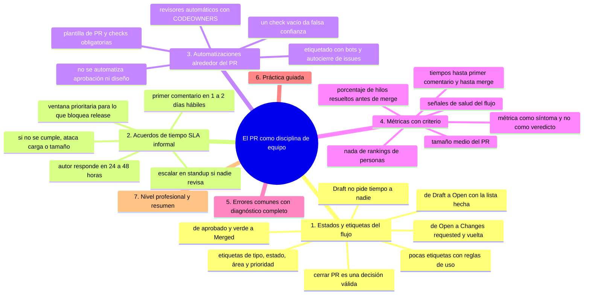
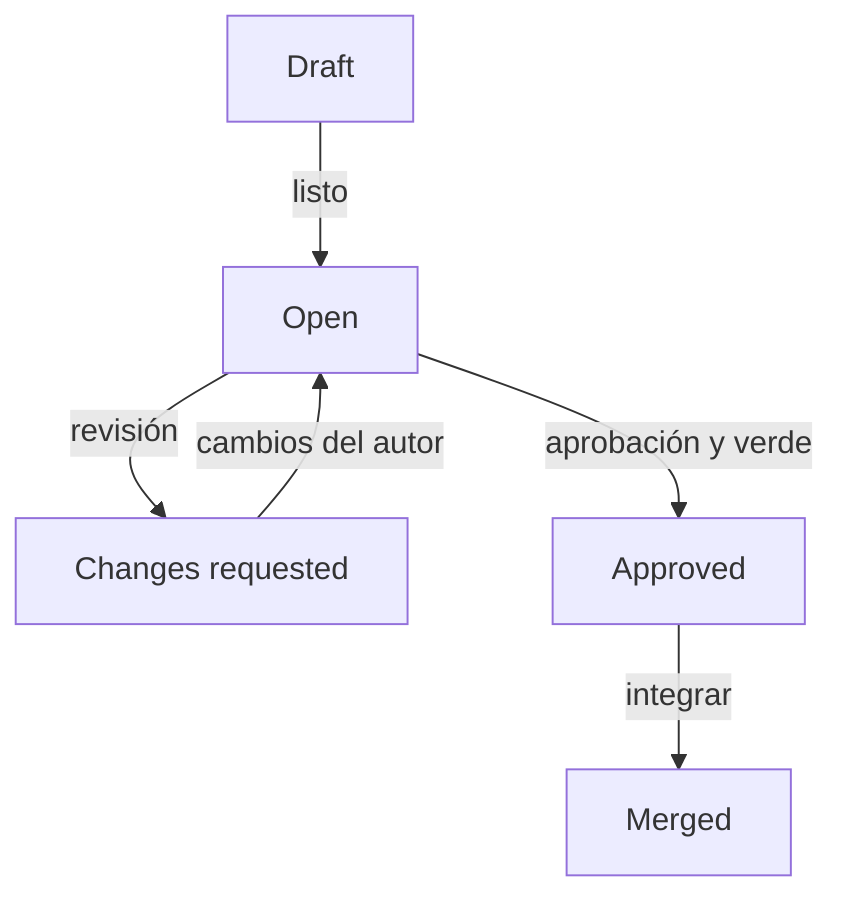

# El PR como disciplina de equipo

## Introducción

Hasta aquí el PR visto como pieza (anatomía, autoría, revisión, conversación, integración). Este capítulo lo sube de nivel: cómo un EQUIPO convierte los PRs en un flujo predecible — con estados, etiquetas, automatizaciones, acuerdos de tiempo y métricas con criterio.

Un buen flujo de PR no es burocracia: es la cadencia que permite entregar a diario sin que nadie se atasque.

---

## Mapa conceptual de este capítulo



---

## 1. Estados y etiquetas del flujo

**FLUJO VISIBLE**



```text
Etiquetas (labels) útiles:
   │
   ├── tipo: bug, feature, docs, refactor, chore
   ├── estado: needs-review, needs-author, blocked
   ├── área: frontend, backend, infra
   └── prioridad: P0…P2 (usar con cuidado)
```

```text
CONVENCIONES DE ESTADO:
   │
   ├── Draft = no revisar aún (no pide tiempo a
   │   nadie)
   ├── «changes requested» = la pelota está en el
   │   autor
   ├── «author» y «reviewer» alternándose = flujo
   │   sano; días sin alternancia = atasco
   └── cerrar PR = decisión válida (idea descartada,
       reemplazada)
```

```text
   │
   └── las etiquetas son PARA EL EQUIPO (filtro del
       panel), no adorno: pocas y con reglas de uso
```

---

## 2. Acuerdos de tiempo (SLA informal)

```text
ACUERDOS QUE EVITAN EL ATASCO (ejemplos, ajústalos):
   │
   ├── primer comentario en 1-2 días hábiles
   │   («lo miro hoy/tarde» ya cuenta)
   ├── PRs pequeños → respuesta misma semana
   ├── autor responde comentarios en < 24-48h
   ├── si nadie revisa: escalar en standup /
   │   canal del equipo (no en silencio)
   └── PR bloqueante para release: ventana de
       revisión prioritaria
```

```text
CÓMO SE ACUERDA:
   │
   ├── en la retro: «¿dónde se atascó?» → 2-3
   │   acuerdos escritos en CONTRIBUTING
   │
   └── si el SLA se incumple siempre: el problema es
       de CARGA (pocos revisores) o de TAMAÑO (PRs
       grandes) — ataca la causa, no el síntoma
```

---

## 3. Automatizaciones alrededor del PR

```text
EN LA PLATAFORMA (mención; detalle en secciones
posteriores):
   │
   ├── asignación automática de revisores por área
   │   (CODEOWNERS — sección 18)
   ├── plantilla de PR (sección 14)
   ├── checks obligatorias: lint, tests, build
   │   (sección 19)
   ├── etiquetado/encuesta automática con bots
   │   (categoría: apps de marketplace — úsalas con
   │   criterio)
   └── autocierre de issues («Closes #n»)
```

```text
LO QUE NO SE AUTOMATIZA (aunque se pueda):
   │
   ├── aprobar en nombre de alguien
   ├── cerrar discusiones de diseño
   └── «verde» sin tests significativos
       (automatizar un check vacío da falsa confianza)
```

```text
CI en el PR (ya visto, se refuerza):
   │
   ├── fallo = bloquea merge → feedback inmediato
   ├── el revisor empieza por los checks
   └── la plataforma debe mostrar checks claras (no
       «negocio con el script»)
```

---

## 4. Métricas con criterio

```text
ÚTILES (de PROCESO, no de personas):
   │
   ├── tiempo hasta el primer comentario (SLA)
   ├── tiempo desde «ready» hasta merge
   ├── tamaño medio del PR (¿crece? → señal de
   │   corte mal hecho)
   ├── % de PRs con revisión de 2 personas en áreas
   │   críticas
   └── % de hilos resueltos antes de merge
```

```text
PELIGROSAS (no usadas como ranking):
   │
   ├── nº de PRs por persona → incentiva ruido
   ├── nº de comentarios por revisor → incentiva
   │   microgestión
   ├── % de aprobación rápida → incentiva rubber
   │   stamp (sección 03)
   └── LOC añadidas → incentiva volumen
```

```text
   │
   └── métrica se lee como SÍNTOMA (¿dónde hay
       fricción?) no como VEREDICTO (quién rinde)
```

```text
Señales de salud del flujo:
   │
   ├── PRs abiertos: pocos y viejos es malo; muchos
   │   y frescos es normal
   ├── ramas cortas (días, no semanas)
   └── pocos «changes requested» en bucle largo
       (>2 vueltas → diseño previo)
```

---

## 5. Errores comunes con diagnóstico completo

### Error 1: revisor único (cuello de botella)

**Qué ocurrió:** todo pasa por una persona; si no está, nada se integra.

**Por qué posibles:**
* conocimiento concentrado;
* no se reparte la carga.

**Cómo comprobarlo:** métrica de primer comentario por asignado; cantidad de PRs por persona.

**Opciones:** CODEOWNERS con varios por área; rotar revisores; formar a más gente en el dominio.

**Riesgos:** punto único de fallo, agotamiento.

**Solución:** revisión como responsabilidad compartida.

**Cómo se evita:** revisión cruzada obligatoria en áreas críticas.

---

### Error 2: flujo con muchos estados que nadie usa

**Qué ocurrió:** 15 etiquetas, 4 columnas en el tablero; todo el mundo usa «bug» y «to-do».

**Por qué:** se diseñó el flujo perfecto sin alinear al equipo.

**Cómo comprobarlo:** etiquetas creadas vs. usadas (la plataforma muestra conteos).

**Opciones:** reducir a lo que se decide usar (punto 1); eliminar obsoletas.

**Riesgos:** panel mentiroso.

**Solución:** pocas etiquetas con regla de uso escrita.

**Cómo se evita:** revisar taxonomía en la retro.

---

### Error 3: «ready» que no lo está

**Qué ocurrió:** PRs marcados listos con checks rojos o sin descripción → el revisor pierde tiempo en averiguar.

**Por qué:** falta de checklist o se salta (cap. 02).

**Cómo comprobarlo:** PRs en «ready» con CI roja.

**Opciones:** devolver el PR al autor de inmediato («nada de revisión hasta verde + descripción»); bloquear merge con checks.

**Riesgos:** review fatigue y confianza erosionada.

**Solución:** definición de «listo» verificable (checks automáticas + campos de plantilla).

**Cómo se evita:** plantilla con campos obligatorios y práctica del equipo.

---

### Error 4: PRs eternos (días/meses abiertos)

**Qué ocurrió:** un PR con dos semanas, conflictos acumulados, nadie lo quiere tocar.

**Por qué posibles:**
* cambió la prioridad y nadie lo cerró;
* demasiado grande;
* dependencia bloqueada.

**Cómo comprobarlo:** antigüedad de PRs abiertos (panel).

**Opciones:** cerrar/reabrir (la idea puede volver mejor); partir; decisión explícita en standup.

**Riesgos:** memoria dividida, divergencia.

**Solución:** regla informal: «PR de más de N días se revisa o se cierra en la retro».

**Cómo se evita:** límite de edad y revisión de colas.

---

### Error 5: aprobar por presión de release

**Qué ocurrió:** «ya es viernes, hay que sacar» → aprobación sin mirar, incidente el lunes.

**Por qué:** la fecha pisa al proceso.

**Cómo comprobarlo:** merge cercano a release con revisión de segundos.

**Opciones:** planificar ventanas de release (no viernes-noche); si es hotfix, protocolo acelerado CON doble revisión y tests (sección 29: hotfix).

**Riesgos:** el proceso solo protege cuando no hay prisa — inútil.

**Solución:** release temprano y hotfix consciente (distinto flujo, no flujo roto).

**Cómo se evita:** calendario de releases y priorización realista.

---

### Error 6: métricas usadas para medir personas

**Qué ocurrió:** ranking de «quién comenta más» o «quién cierra más PRs» → juegos y ansiedad.

**Por qué:** mal interpretar indicadores de proceso.

**Cómo comprobarlo:** cambios de comportamiento tras publicar métricas.

**Opciones:** retirar el ranking; volver a indicadores de proceso anónimos/aggregate.

**Riesgos:** conductas perversas (competir en vez de colaborar).

**Solución:** las métricas miran el FLUJO (punto 4).

**Cómo se evita:** gobernanza de métricas (sección 18/26).

---

## 6. Práctica guiada

### Objetivo

Diseñar el flujo de PR de un equipo de práctica y automatizar lo verificable.

### Paso 1: estado actual

```text
En tu equipo/proyecto, dibuja:
   │
   ├── ¿cuántos pasos tiene hoy un PR?
   ├── ¿dónde se atascan? (SLA, tamaño, revisores)
   └── ¿qué etiquetas existen y cuáles se usan?
```

### Paso 2: flujo mínimo acordado

```text
Propuesta (3 estados + 6 etiquetas):
   │
   ├── estados: Draft · Open · (implicit: changes
   │   requested / approved por la plataforma)
   ├── etiquetas: bug · feature · docs ·
   │   needs-review · blocked · P0
   └── SLA: primer comentario en 2 días hábiles;
       autor responde en 48h
```

1. Escribe esto en CONTRIBUTING → «Flujo de PR».

### Paso 3: automatiza lo verificable

1. Plantilla de PR con campos obligatorios (sección 14).
2. Checks de CI obligatorias (sección 19: workflow de pull_request).
3. «Delete branch after merge» activado (cap. 05).

### Paso 4: métricas de proceso

```text
Durante 2-3 semanas, registra a mano (o con la
plataforma):
   │
   ├── días hasta primer comentario
   ├── días de ready a merge
   └── tamaño medio (líneas del diff)
Interpétalos como síntomas: ¿dónde hay fricción?
```

### Paso 5: retro del flujo

1. Con los datos: ¿SLA se cumple? ¿PRs grandes? ¿revisor único?
2. Elige UNA mejora y escríbela en CONTRIBUTING.

### Resultado esperado

Flujo documentado (estados, etiquetas, SLA), automatización básica y primeras métricas de proceso.

### Conclusión esperada

La disciplina de PR es un contrato operativo pequeño que se escribe, se automatiza donde se puede y se revisa con datos de proceso.

### Ejercicio de transferencia

En un proyecto donde colaboras — o en uno simulado con una segunda cuenta — escribe el flujo mínimo de PR: tres estados, seis etiquetas con regla de uso y dos acuerdos de tiempo. Entrega: el fragmento de CONTRIBUTING listo para pegar y la lista de métricas de proceso que registrarías durante dos semanas.

---

## 7. Nivel profesional + resumen

### 7.1. Flujo que escala

```text
EQUIPO EN CRECIMIENTO:
   │
   ├── revisores por área (CODEOWNERS) + rotación
   ├── SLA y colas visibles (etiquetas + panel)
   ├── checks: lint, tests, build, seguridad
   │   (secciones 19/20)
   ├── revisiones exigentes solo donde importa
   │   (riesgo alto = 2 aprobaciones; docs = 1)
   └── retros de flujo con métricas de proceso
```

```text
MADUREZ:
   │
   ├── nivel 1: PRs con plantilla y checks básicas
   ├── nivel 2: SLA, etiquetas, revisores por área
   └── nivel 3: métricas de proceso, mejora
       continua, hotfix con protocolo propio
```

### 7.2. Resumen

En este capítulo aprendiste que:

* el flujo visible usa estados (Draft/Open/changes/approved) y pocas etiquetas con reglas de uso;
* los SLA informales (primer comentario, respuesta del autor, escalamiento) evitan atascos — si no se cumplen, ataca carga o tamaño;
* se automatiza lo verificable (plantilla, checks, asignación, autocierre) y no lo que exige juicio (aprobación, diseño);
* las métricas miran el proceso (tiempos, tamaño, vueltas), nunca a las personas como ranking;
* los errores típicos (revisor único, flujo decorativo, «ready» sucio, PRs eternos, presión de release, métricas perversas) se previenen con acuerdos escritos y retros;
* a nivel profesional: niveles de madurez del flujo de PR.

La idea principal es:

> **La disciplina de PR es la cadencia del equipo: estados claros, tiempos acordados, checks automáticas y métricas que miran el flujo — no a las personas.**

---

## Autopreguntas de cierre

Sin mirar el material, responde mentalmente y luego compruébalo con este capítulo:

1. ¿Por qué un flujo con quince etiquetas y cuatro columnas puede ser peor que no tener flujo ninguno?
2. Si el acuerdo de revisión se incumple siempre, ¿qué dos causas reales debes mirar antes de culpar al equipo?
3. ¿Qué métricas miden el proceso y cuáles miden a las personas, y por qué esa distinción lo cambia todo?
4. ¿Por qué automatizar un check sin tests significativos da falsa confianza en lugar de proteger?
5. ¿Qué debe poder responder un PR marcado como «ready» sin que nadie pregunte, y quién lo garantiza?
6. ¿Por qué cerrar en la retro un PR viejo es señal de un flujo sano y no un fracaso?

---

## Próximo paso

Has completado la sección de Pull Requests.

Continúa con el cierre de la sección:

[`README.md`](README.md)
