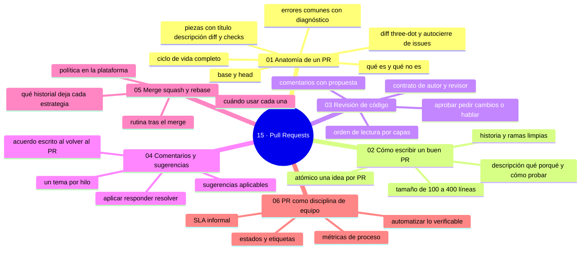

# 15 — Pull Requests

## Bienvenido a esta sección

El Pull Request es la pieza central del trabajo con Git en equipo: donde el código se propone, discute, verifica y decide. No es un botón de merge — es el contrato entre quien escribe y quien integra.

En esta sección estudiarás el PR completo: su anatomía y ciclo de vida, cómo escribir los que se revisan bien, cómo revisar con criterio, cómo gestionar la conversación, qué estrategia de integración deja el historial que quieres y cómo un equipo convierte todo esto en flujo disciplinado.

## En esta sección estudiarás

* las piezas del PR (título, descripción, diff, checks, revisores, base y head) y su ciclo de vida;
* autoría: tamaño, atómico, descripción y historia limpia;
* revisión: orden de lectura, comentarios útiles y decisión honesta;
* conversación: sugerencias aplicables, hilos y acuerdos escritos;
* integración: merge commit, squash y rebase-and-merge con criterio;
* disciplina de equipo: estados, etiquetas, SLA y métricas de proceso.

## Objetivos de aprendizaje

Al terminar esta sección serás capaz de:

* describir la anatomía y el ciclo de vida completo de un PR;
* escribir PRs del tamaño correcto: pequeños, atómicos y documentados;
* revisar un PR por capas: ¿resuelve? → ¿es correcto? → ¿es mantenible?;
* elegir la estrategia de integración (merge, squash, rebase) según el historial que quieres;
* aplicar la disciplina de equipo: estados, etiquetas, SLA y métricas de proceso.

## Mapa conceptual

---

## ¿Qué aprenderás en esta sección?

1. [`01-anatomia-de-un-pr.md`](01-anatomia-de-un-pr.md) — qué es, ciclo de vida y piezas.
2. [`02-como-escribir-un-buen-pr.md`](02-como-escribir-un-buen-pr.md) — pequeño, atómico, documentado.
3. [`03-revision-de-codigo.md`](03-revision-de-codigo.md) — qué mirar y cómo comentar.
4. [`04-comentarios-y-sugerencias.md`](04-comentarios-y-sugerencias.md) — hilos, sugerencias y resolución.
5. [`05-merge-squash-y-rebase-en-el-pr.md`](05-merge-squash-y-rebase-en-el-pr.md) — qué historial deja cada integración.
6. [`06-pr-como-disciplina-de-equipo.md`](06-pr-como-disciplina-de-equipo.md) — flujo, SLA y métricas.

## Cómo estudiar esta sección

Abre PRs reales de principio a fin mientras lees: anotar sin abrir no basta. Practica dar y recibir comentarios (capítulos 03-04) en un repo de prueba con una segunda cuenta, y compara los tres historiales del capítulo 05 con tus propios ojos.

## Referencias

* GitHub — Documentación oficial: «About pull requests» y «About code review».
* Google Engineering Practices — «Code review guidelines».
* Driessen, V. — «A successful Git branching model».

---

## Checkpoint 15 — Comprobación obligatoria

Antes de avanzar a `16-trabajo-en-equipo/`, demuestra que puedes (en un repo de práctica real):

1. **Abrir** un PR con descripción que responda qué, porqué y cómo probarlo.
2. **Recibir** un comentario y responderlo con un commit nuevo (no con un comentario suelto).
3. **Distinguir** qué historial deja squash frente a merge commit y elegir uno con una razón.
4. **Revisar** un PR ajeno (o el de una segunda cuenta) con la capa ¿resuelve? → ¿es correcto? → ¿es mantenible?
5. **Explicar** en qué estado del PR se tomaría la decisión de cerrarlo sin merge.

Si puedes hacerlo **sin mirar instrucciones**, el checkpoint está cerrado.

---

## Autopreguntas de cierre

Sin mirar el material, responde mentalmente y luego compruébalo con los capítulos de la sección:

1. ¿Cuáles son las capas de una revisión, en orden?
2. ¿Qué diferencia deja en el historial un squash respecto a un merge commit?
3. ¿Qué hace «inrevisable» a un PR antes de empezar?
4. ¿Qué diferencia hay entre una sugerencia y una exigencia al comentar?
5. Un PR de 3000 líneas: ¿por qué el revisor lo aprueba sin leer de verdad y qué deberías cambiar en tu forma de partir el trabajo?
6. Antes de mirar el diff, ¿qué tres preguntas debe responder la descripción de un PR y por qué en ese orden?
7. Las checks están verdes y el revisor aprobó: ¿qué te queda comprobar antes de integrar y por qué no basta con eso?
8. Si integras con squash un PR de diez commits, ¿qué historial queda en main y qué información se pierde para dentro de seis meses?

---

## Próximo paso

Cuando termines los seis capítulos, continúa con la siguiente sección:

[`../16-trabajo-en-equipo/`](../16-trabajo-en-equipo/)
