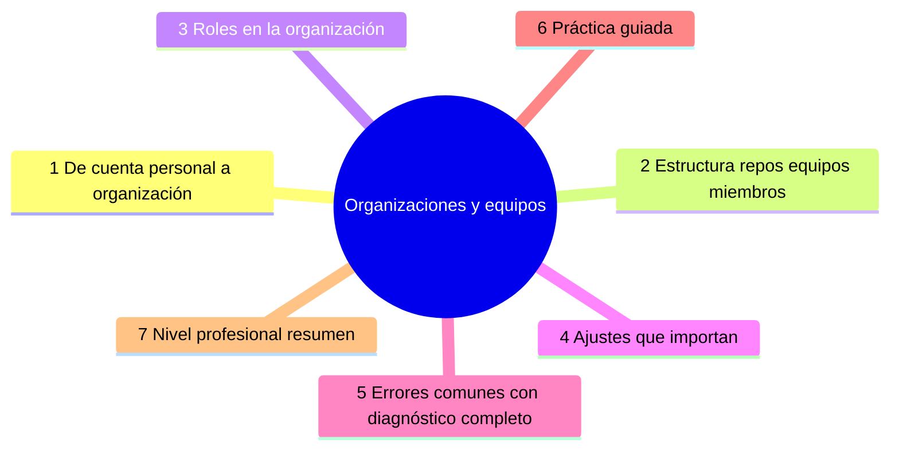

# Organizaciones y equipos

## Introducción

Un equipo de más de dos o tres personas no debería vivir en cuentas personales: los repos sueltos, los permisos uno a uno y la facturación dispersa se vuelven inmanejables. La **organización** de GitHub es el contenedor profesional: agrupa repositorios, personas, permisos y políticas bajo un mismo techo.

Este capítulo enseña a montar y gobernar una organización: estructura, equipos, roles de la org y los ajustes que mantienen todo coherente sin ahogar el trabajo diario.

---

## Mapa conceptual de este capítulo



---

## 1. De cuenta personal a organización

```text
CUENTA PERSONAL          ORGANIZACIÓN
─────────────────────── ────────────────────────────
repos propios        →   repos del «espacio»
permiso por permiso  →   equipos con rol base
facturación personal →   facturación única
sin políticas comunes →  ajustes y seguridad globales
nombre del dueño     →   identidad del equipo/empresa
```

```text
CUÁNDO MIGRAR:
   │
   ├── >1 persona trabajando en los mismos repos
   ├── necesitas políticas comunes (2FA, SSO,
   │   plantillas)
   ├── licencias/facturación de planes
   └── identidad de marca (organización, no el
       usuario de alguien)
```

```mermaid
flowchart TD
    A[Crear organización] --> B[Transferir o clonar/mover repos]
    B --> C[Transferir repositorio (mantiene historia, issues, PRs; cambia owner)]
    C --> D[Transferir cuenta personal a organización]
```

---

## 2. Estructura: repos, equipos, miembros

```text
ORGANIZACIÓN BIEN FORMADA
──────────────────────────────────────────────────────
miembros (personas con acceso mínimo a la org)
   │
   ├── equipos (unidades de acceso)
   │     · backend · frontend · infra · datos
   │     · cada equipo: repos + rol base
   │
   ├── repositorios
   │     · propiedad del equipo/proyecto
   │     · CODEOWNERS por área (sección 15 cap. 06)
   │
   └── ajustes globales (seguridad, plantillas)
```

```text
EQUIPOS:
   │
   ├── reflejan QUIÉN hace qué (no «equipo de
   │   prueba»): coinciden con áreas reales
   │
   ├── subequipos si creces (backend/api,
   │   backend/worker)
   │
   └── anidados: los hijos heredan el padre (mención:
       plan de equipos)
```

```text
ORGANIZACIÓN vs REPO:
   │
   ├── equipo + rol = acceso base a TODOS los repos
   │   que lo incluyas
   │
   └── en el repo solo se ajustan las EXCEPCIONES
       (un repo que un equipo no ve)
```

```bash
# ver teams y membresías (gh, concepto):
gh api orgs/{org}/teams --jq '.[].name'
```

---

## 3. Roles en la organización

```text
ROLES DE ORGANIZACIÓN (resumen)
──────────────────────────────────────────────────────
Visible / Base
  · miembro con acceso a los repos que los equipos
    le den (Read mínimo por defecto en org)

Member (miembro)
  · participa; su capacidad real viene de sus equipos

Owner (propietario)
  · gobierna la org: ajustes globales, seguridad,
    apps, billing, eliminar org
  · POUCOS: 2-3, con 2FA obligatorio
```

```text
   │
   ├── la distinción clave: Owner configura la ORG;
   │   Maintain/Admin configura el REPO (cap. 01)
   │
   └── dentro de repos, los roles del cap. 01 siguen
       aplicando; el equipo aporta el rol BASE y las
       excepciones afilan
```

```text
PERMISOS SENSIBLES (org):
   │
   ├── invitar/eliminar miembros → Owner (y admins
   │   de repo según ajuste)
   ├── apps e integraciones → Owner
   └── políticas de seguridad (SSO, 2FA, patrones de
       secreto) → Owner
```

---

## 4. Ajustes que importan

```text
SEGURIDAD (Settings → Member privileges / OAuth…)
   │
   ├── 2FA obligatorio para miembros (fuerte
   │   recomendación; sección 20)
   ├── restricción de repos al crear (privado por
   │   defecto)
   └── SSO/SCIM si usas proveedor corporativo
       (mención: plan empresarial)
```

```text
COLABORACIÓN
   │
   ├── repos por defecto: ¿los repos nuevos son
   │   privados?
   ├── base permission para miembros sin equipo
   │   (Read por defecto es prudente)
   └── discusiones/ projects habilitados si los
       usáis (cap. 04-05)
```

```text
AUTOMATIZACIÓN Y GOBERNANZA
   │
   ├── Apps autorizadas a nivel org (revisar: cada
   │   app es un permiso delegado — sección 18/20)
   ├── plantillas de repositorio de la org
   │   (sección 18)
   └── Actions/secretos de org (sección 19/20)
```

```text
AUDITORÍA
   │
   ├── log de auditoría: quién invitó, quién cambió
   │   permisos, qué app se autorizó
   │   (plan Team/Enterprise — revisar disponibilidad)
   └── revisión periódica: miembros, equipos, apps
```

---

## 5. Errores comunes con diagnóstico completo

### Error 1: organización que es «cuenta personal con nombre nuevo»

**Qué ocurrió:** todos los repos transferidos pero sin equipos: cada repo invitando personas a mano.

**Por qué:** migración a medias.

**Cómo comprobarlo:** pocos equipos; invitaciones por repo.

**Opciones:** crear equipos por área y asignar repos; limpiar invitaciones duplicadas.

**Riesgos:** el crecimiento vuelve a ser caótico (el problema inicial).

**Solución:** la estructura de equipos es el motivo principal de la org (punto 2).

**Cómo se evita:** plan de migración con estructura ANTES de transferir.

---

### Error 2: un solo Owner (y otra persona bloqueada)

**Qué ocurrió:** la persona con la que se creó la org se fue o está de baja; nadie más puede ajustar nada.

**Por qué:** un solo Owner por prisa.

**Cómo comprobarlo:** lista de owners.

**Opciones:** añadir 2-3 owners de confianza (pedir acceso a quien sigue siendo responsable).

**Riesgos:** punto único de fallo administrativo.

**Solución:** mínimo 2 owners con 2FA.

**Cómo se evita:** plantilla de org: «owners = líder + suplente».

---

### Error 3: equipos que no reflejan el trabajo real

**Qué ocurrió:** «equipo-1, equipo-2» o un único «devs» con todo.

**Por qué:** se crearon al revés (por completar el formulario).

**Cómo comprobarlo:** pedir a alguien «¿en qué equipo estás y qué repos ves?».

**Opciones:** renombrar/reagrupar según áreas; partir el monolito.

**Riesgos:** permisos incomprensibles; pruebas largas al añadir gente.

**Solución:** equipos = áreas reales (punto 2).

**Cómo se evita:** revisar estructura al cambiar de fase del proyecto.

---

### Error 4: base permission demasiado alta

**Qué ocurrió:** cualquier miembro de la org escribe en todos los repos nuevos (o al revés, Read por defecto y todos piden acceso para una línea).

**Por qué posibles:**
* base permission en «Write» para «facilitar»;
* no se entendió que los equipos resuelven el «Read».

**Cómo comprobarlo:** ajuste de «base permissions» + repos sin equipo.

**Opciones:** bajar a Read y dar Write por equipo (mínimo privilegio); documentar el alta.

**Riesgos:** escritura no vigilada en repos ajenos.

**Solución:** Write por equipo, Read como base.

**Cómo se evita:** revisar ajustes al crear la org (checklist del cap. 6).

---

### Error 5: apps/bots con acceso org amplio sin dueño

**Qué ocurrió:** integraciones de CI/coverage/bots instaladas «para probar» con permisos sobre toda la org.

**Por qué:** el permiso es org-wide y nadie lo revisa.

**Cómo comprobarlo:** Settings → Installed GitHub Apps; permisos que piden.

**Opciones:** quitar lo innecesario; reinstalar con permisos mínimos/repo por repo; asignar dueño de la app.

**Riesgos:** superficie de incidente (un token de app = todo el acceso).

**Solución:** inventario de apps con responsable.

**Cómo se evita:** revisión trimestral (secciones 18/20).

---

### Error 6: sin plantillas ni convención de creación de repos

**Qué ocurrió:** cada quien crea repos con nombres, licencias y README dispares (y olvidados en «personal»).

**Por qué:** no hay plantillas ni convención (sección 18).

**Cómo comprobarlo:** inventario de repos: ¿todos tienen README, LICENSE, dueño?

**Opciones:** plantilla de org; script de creación; mover los sueltos.

**Riesgos:** inventario incontrolable («shadow repos»).

**Solución:** creación desde plantilla + checklist.

**Cómo se evita:** regla escrita en la wiki/doc interna del equipo.

---

## 6. Práctica guiada

### Objetivo

Crear (o sanear) una organización de práctica con equipos por área.

### Paso 1: crea o revisa la org

```text
1. Crea una organización (plan gratuito sirve).
2. Revisa: base permissions → Read.
3. Revisa: repos nuevos → privados por defecto.
```

### Paso 2: equipos por área

```text
Crea: backend · frontend · infra
   │
   ├── a cada uno: repos + rol base (Write donde
   │   corresponda)
   └── infra: Maintain en los repos de configuración
       (si aplica)
```

### Paso 3: mueve un repo

1. Transfiere un repo de prueba (o clona y recrea si prefieres evitar cambios de propiedad) y añádelo a un equipo.

### Paso 4: miembros

1. Invita 1-2 usuarios de prueba a la org y asígnalos a equipos (no sueltos).
2. Comprueba con sus credenciales qué ven y qué pueden.

### Paso 5: seguridad básica

```text
[ ] 2FA requerido para miembros (si el plan lo
    permite)
[ ] apps instaladas: solo las necesarias
[ ] Owner: al menos 2
```

### Paso 6: documenta

```text
Escribe en tu doc interna (o CONTRIBUTING de la org):
   │
   ├── estructura de equipos
   ├── quién es Owner y por qué
   └── cómo se pide acceso a un repo nuevo
```

### Resultado esperado

Org con equipos por área, permisos base prudentes, 2 owners y repos asignados por equipo.

### Conclusión esperada

La organización convierte permisos dispersos en una estructura: personas → equipos → repos → rol base, con ajustes globales de seguridad.

---

## Ejercicio de transferencia

En una organización de práctica, crea tres equipos (frontend, backend, infra) con roles base adecuados, asigna dos repositorios de ejemplo a cada equipo, configura protección de rama main con aprobación de equipos de infra, y documenta el proceso en un archivo CONTRIBUTING. Entrega capturas de la configuración de equipos, protección de rama y el archivo CONTRIBUTING.

## 7. Nivel profesional + resumen

### 7.1. Org que gobierna sin frenar

```text
NIVELES DE MADUREZ
──────────────────────────────────────────────────────
1. estructura: equipos por área + repos con dueño
2. seguridad: 2FA, apps vigiladas, base Read,
   plantillas
3. auditoría: log de la org + revisión trimestral de
   miembros/apps/accesos
4. escala: subequipos, SSO, políticas de archivo,
   retención (planes de pago — mención)
```

```text
   │
   ├── la org es el marco; el día a día sigue siendo
   │   el PR (sección 15) — no poner burocracia que
   │   el equipo no usa
   │
   └── dueño de cada app, de cada team y de cada
       integración: nombres, no «alguien»
```

### 7.2. Resumen

En este capítulo aprendiste que:

* la organización agrupa repos, personas y políticas; migrar tiene sentido cuando trabajáis más de uno o necesitas control común;
* la estructura son los EQUIPOS (áreas reales) que aportan rol base a los repos — las excepciones se afinan por repo;
* roles: members con acceso vía teams, Owners escasos para gobernanza (2-3, 2FA);
* ajustes que importan: base permissions prudentes, repos privados por defecto, apps auditadas, log de auditoría;
* los errores típicos (org sin equipos, un solo Owner, equipos ficticios, permiso base alto, apps huérfanas, repos sin plantilla) se previenen con plan de migración y revisiones;
* a nivel profesional: madurez por niveles (estructura → seguridad → auditoría → escala).

La idea principal es:

> **La organización es la estructura de gobierno: personas en equipos, equipos con rol, repos con dueño — y la seguridad puesta a nivel global una sola vez.**

---


## Autopreguntas de cierre

Sin mirar el material, responde mentalmente y luego compruébalo con este capítulo:

1. ¿Por qué es estructurar una organización en equipos por área más eficaz que asignar permisos uno a uno en cada repositorio?
2. ¿Cómo afecta la configuración de permisos base de la organización (como Read por defecto) al principio de mínimo privilegio y cuándo se necesita sobrescribirlo a nivel de equipo o repositorio?
3. ¿Qué ventajas y riesgos presentan tener pocos Owners (2-3 con 2FA) frente a muchos Owners en una organización, y cómo se relaciona con la gobernanza y la seguridad?
4. ¿De qué manera las plantillas de organización y los ajustes globales (como SSO y 2FA obligatorio) reducen la superficie de incidente y mejoran la consistencia en la creación de repositorios?
5. ¿Cómo utilizarías el registro de auditoría de la organización para detectar cambios no autorizados en permisos, aplicaciones o membresías, y qué acciones tomarías tras una alerta?
6. ¿Qué pasos seguirías para migrar una colección de repositorios personales a una organización asegurando que se conserven los issues, PRs y el historial, mientras se establece una estructura de equipos por área antes de la transferencia?

---

## Próximo paso

Ya tienes la casa ordenada.

La siguiente pieza: el trabajo diario del equipo — issues, etiquetas y milestones.

Continúa con:

[`03-issues-y-etiquetas.md`](03-issues-y-etiquetas.md)
