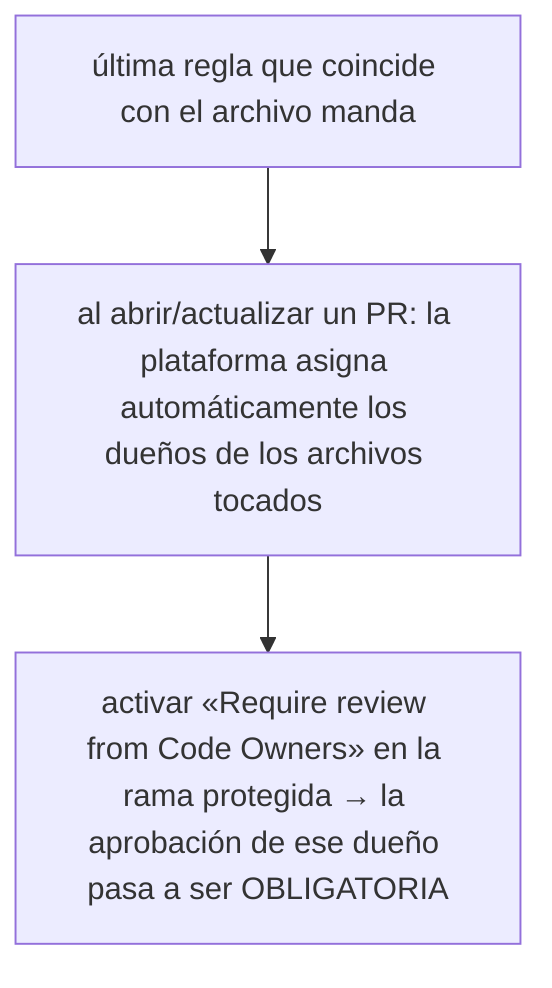

# CODEOWNERS y responsabilidades

## Introducción

En un repositorio con varias áreas, «alguien revisará» significa «nadie revisará». CODEOWNERS resuelve asignando, por ruta de archivo, a quién le pertenece el código y quién debe aprobarlo: el frontend revisa frontend, infra revisa infra — y nada crítico se integra sin la mirada correcta.

Este capítulo enseña a escribir CODEOWNERS, a combinarlo con reglas de rama y a repartir responsabilidades (de revisión y de respuesta) sin crear cuellos de botella.

---

## Mapa conceptual de este capítulo

```text
CODEOWNERS y responsabilidades
       │
       ├── 1. Qué es y cómo se aplica
       ├── 2. Escribir reglas útiles
       ├── 3. Integración con ramas protegidas
       ├── 4. Responsabilidad más allá de revisar
       │
       ├── 5. Errores comunes con diagnóstico completo
       ├── 6. Práctica guiada
       └── 7. Nivel profesional + resumen
```

---

## 1. Qué es y cómo se aplica

```text
ARCHIVO: .github/CODEOWNERS  (o /CODEOWNERS, docs/)
```

```text
SINTAXIS
──────────────────────────────────────────────────────
# comentarios con #
*.md            @equipo-docs
/docs/          @equipo-docs
/src/api/       @backend-team   ana@example.com
/src/ui/        @frontend-team
infra/          @infra-team
*.yml           @infra-team     # pipelines
```



```text
   │
   └── rule of thumb: las reglas son POR ÁREA
       (carpetas/extensiones), no por archivo único
       (a no ser que sea un archivo de gobernanza)
```

```bash
# quién es dueño de un archivo concreto:
gh api repos/{owner}/{repo}/contents/.github/CODEOWNERS
# (lectura; la plataforma lo resuelve en cada PR)
```

---

## 2. Escribir reglas útiles

```text
BUENA ESTRUCTURA (de lo general a lo concreto)
──────────────────────────────────────────────────────
*               @org/triagers        # default
*.md            @org/docs
/src/api/       @org/backend
/src/ui/        @org/frontend
/infra/         @org/infra
/.github/       @org/infra @org/tech-leads
/deploy/        @org/infra            # doble dueño
```

```text
REGLAS PRÁCTICAS:
   │
   ├── carpeta > archivo suelto (legibilidad)
   ├── los dueños deben ser EQUIPOS (la gente se
   │   va/vuelve; el equipo persiste — sección 02)
   ├── 1-2 dueños por área; equipo con 2+ para no
   │   parar cuando falte alguien
   └── archivos de gobernanza (.github/, SECURITY.md)
       con doble dueño (infra + leads)
```

```text
LÍMITES:
   │
   ├── CODEOWNERS no sustituye conocimiento del
   │   dominio: alguien puede ser dueño de ruta sin
   │   entender el negocio → combinar con revisión
   │   cruzada
   │
   └── si un archivo cambia de área (refactor),
       actualiza CODEOWNERS en el mismo PR
```

---

## 3. Integración con ramas protegidas

```text
AJUSTES (Settings → Branches → protección)
──────────────────────────────────────────────────────
[✓] Require a pull request before merging
[✓]   Require review from Code Owners
[✓]   Number of approvals: 1 (o 2 en crítico)
[✓] Require status checks to pass
[✓] Do not allow bypassing the above settings
     (salvo excepción consciente de admin)
```

```text
QUÉ PRODUCE:
   │
   ├── PR que toca src/ui/ necesita aprobación de
   │   @frontend (no basta con cualquiera)
   │
   ├── PR mixto (ui + infra): necesita AMBOS dueños
   │
   └── «bypass» solo para incidentes, con registro
```

```text
   │
   ├── la combinación mínima seria = CODEOWNERS +
       aprobación de dueños + checks + no-bypass
   │
   └── en repos pequeños sin equipos: dueños
       individuales con respaldo (2 por archivo
       crítico)
```

---

## 4. Responsabilidad más allá de revisar

```text
QUÉ IMPLICA SER DUEÑO:
   │
   ├── revisar los PR de tu área en el SLA (sección
   │   15 cap. 06)
   ├── responder por calidad de lo integrado
   │   (incidentes → tu área)
   ├── mantener docs/tests de tu área y aprobar su
   │   cambio
   ├── on-call / guardia si el sistema lo requiere
   │   (mención: rotaciones, sección 23)
   └── formar relevo: dueño único = riesgo
```

```text
REPARTO DE RESPONSABILIDADES (tabla mental)
──────────────────────────────────────────────────────
Área        Dueños (CODEOWNERS)   Relevo
backend     @backend @lead-be     @backend2
frontend    @frontend             @frontend2
infra       @infra @tech-lead     (doble siempre)
docs        @docs                 @docs2
```

```text
   │
   └── responsabilidad SIN capacidad (sin tiempo de
       revisar) = cuello de botella con firma:
       revisar la carga antes de firmar el
       CODEOWNERS
```

```text
RESPUESTA ANTE INCIDENTES (rollo):
   │
   ├── el archivo tocado define quién se entera
   ├── sin dueños claros → el incidente busca a
   │   «quién toca esto» a ciegas
   └── CODEOWNERS es también el mapa de llamadas
```

---

## 5. Errores comunes con diagnóstico completo

### Error 1: CODEOWNERS que nadie revisa en el PR

**Qué ocurrió:** el archivo existe pero los PR no piden dueños (la regla de rama no está activa).

**Por qué posibles:**
* se añadió el archivo sin activar «Require review from Code Owners»;
* nadie sabía que son dos piezas.

**Cómo comprobarlo:** rama protegida: ¿está la casilla?

**Opciones:** activar la regla (y avisar al equipo: ahora sus aprobaciones son obligatorias).

**Riesgos:** archivo decorativo, falsa sensación de control.

**Solución:** archivo + regla de rama juntos (punto 3).

**Cómo se evita:** checklist de protección de rama (sección 18).

---

### Error 2: dueños personales sin respaldo

**Qué ocurrió:** la única dueña de infra se va de vacaciones → sus PRs no se pueden aprobar.

**Por qué:** CODEOWNERS con un @usuario.

**Cómo comprobarlo:** leer el archivo: ¿algún área con un solo dueño?

**Opciones:** añadir segundo dueño (o equipo); migrar usuarios → equipos.

**Riesgos:** punto único de fallo humano.

**Solución:** mínimo 2 por área crítica (punto 2).

**Cómo se evita:** revisión del archivo al cambiar de equipo.

---

### Error 3: reglas demasiado granulares o contradictorias

**Qué ocurrió:** 300 líneas de CODEOWNERS con solapamientos; nadie entiende quién manda.

**Por qué:** se fue añadiendo archivo a archivo durante meses.

**Cómo comprobarlo:** longitud y duplicados de rutas; pedir a alguien que adivine dueños.

**Opciones:** reescribir por áreas (de lo general a lo concreto); una regla por carpeta raíz.

**Riesgos:** revisión con dueños incorrectos → frustración.

**Solución:** estructura del punto 2 (general → específico).

**Cómo se evita:** «reescritura de CODEOWNERS» en la retro trimestral.

---

### Error 4: dueños que no pueden/revisan (brecha capacidad-responsabilidad)

**Qué ocurrió:** el equipo dueño no tiene capacidad; PRs esperan días y la excepción se hace «bypass».

**Por qué:** se asignó responsabilidad sin recursos.

**Cómo comprobarlo:** tiempo de primera revisión por área.

**Opciones:** ampliar dueños, reducir carga, revisar SLA; en última instancia, quitar la exigencia de un área y confiar en checks + revisión cruzada.

**Riesgos:** proceso que se salta siempre = no existe.

**Solución:** equilibrar capacidad con responsabilidad (punto 4).

**Cómo se evita:** firmar CODEOWNERS junto con la capacidad real.

---

### Error 5: área sin dueño (zonas grises)

**Qué ocurrió:** archivos nuevos (scripts, utilidades) sin nadie asignado → pasan con cualquier aprobación.

**Por qué posibles:**
* sin regla default `*`;
* carpetas nuevas que no entraron al archivo.

**Cómo comprobarlo:** un PR que toca carpeta nueva: ¿pide dueños?

**Opciones:** añadir default y carpeta nueva; regla: «carpeta nueva → CODEOWNERS en su PR».

**Riesgos:** huecos de responsabilidad.

**Solución:** `*` con dueños de triage como red (punto 2).

**Cómo se evita:** checklist de PR que crea áreas nuevas.

---

### Error 6: responsabilidad diluida en el equipo entero

**Qué ocurrió:** `* @org/todos` → todo el mundo es dueño de todo = nadie es dueño.

**Por qué:** eludir el conflicto de asignar.

**Cómo comprobarlo:** revisores cambiando al azar; sin respuesta estable.

**Opciones:** asignar por área; rotar triage si el default es «revisar entrada».

**Riesgos:** falsa cobertura.

**Solución:** dueño = área concreta (punto 2).

**Cómo se evita:** principios escritos en CONTRIBUTING.

---

## 6. Práctica guiada

### Objetivo

Escribir CODEOWNERS para un repo multi-área y activar su exigencia.

### Paso 1: inventario de áreas

```text
Carpetas y quién sabe:
   │
   ├── /src/api/     → backend
   ├── /src/ui/      → frontend
   ├── /infra/       → infra
   ├── /docs/ y *.md → docs
   └── /.github/     → infra + tech-lead
```

### Paso 2: escribe el archivo

```text
.github/CODEOWNERS
──────────────────────────────────────────────────────
*               @tu-org/triagers
*.md            @tu-org/docs
/docs/          @tu-org/docs
/src/api/       @tu-org/backend
/src/ui/        @tu-org/frontend
/infra/         @tu-org/infra @tu-org/tech-lead
/.github/       @tu-org/infra @tu-org/tech-lead
```

### Paso 3: protege la rama

```text
Protección de main:
   │
   ├── Require PR ✓
   ├── Require review from Code Owners ✓
   ├── approvals: 1
   └── status checks: tu test principal
```

### Paso 4: prueba el efecto

1. Abre un PR que toque `/src/ui/` y otro que toque `/infra/`.
2. Comprueba quién se asigna automáticamente y qué aprobaciones pide cada uno.

### Paso 5: simula el hueco

1. Crea un PR en carpeta sin regla (p. ej. `/scripts/`).
2. Observa: ¿pide dueño default? Si no, añade la regla `*`.

### Paso 6: documenta responsabilidades

```text
Tabla en CONTRIBUTING:
   │
   ├── área · dueños · relevo · SLA de revisión
   └── «ser dueño implica: revisar en 48h, mantener
       docs/tests, participar en incidentes»
```

### Resultado esperado

CODEOWNERS por áreas con respaldo, regla activa en la rama y tabla de responsabilidades escrita.

### Conclusión esperada

CODEOWNERS solo funciona con la regla de rama activa, dueños en equipo con respaldo y capacidad real para revisar.

---

## Ejercicio de transferencia

En un repositorio de práctica multi-área (backend, frontend, infra), crea un archivo CODEOWNERS que asigne equipos a cada carpeta, activa la regla de rama «Require review from Code Owners» en la rama principal, abre un PR que toque código de frontend y verifica que se solicita aprobación del equipo de frontend, y otro PR que toque infra y verifica que se solicita aprobación del equipo de infra y/o tech-lead. Entrega capturas del archivo CODEOWNERS, la configuración de la rama y los PRs mostrando las asignaciones de revisores.

## 7. Nivel profesional + resumen

### 7.1. Responsabilidad a escala

```text
   │
   ├── CODEOWNERS + «require code owner review» +
   │   no-bypass + checks = piso de calidad por área
   │
   ├── dueños por EQUIPO con relevo; revisión
   │   trimestral de capacidad vs. responsabilidad
   │
   ├── archivos de gobernanza con doble dueño
   │
   ├── CODEOWNERS como mapa de incidentes (quién se
   │   entera de qué) — secciones 23/24
   │
   └── madurez: archivos de gobernanza también
       revisados (SECURITY.md, workflows) con dos
       miradas (sección 20)
```

### 7.2. Resumen

En este capítulo aprendiste que:

* CODEOWNERS asigna dueños por ruta con sintaxis de última-coincidencia (como .gitignore);
* solo cobra fuerza con «Require review from Code Owners» en la rama protegida — son dos piezas;
* los dueños se escriben por equipo (no persona), con 2+ por área crítica y regla default;
* ser dueño implica revisión en plazo, calidad del área, docs/tests y relevo;
* los errores típicos (archivo sin regla, dueño sin respaldo, granularidad enferma, capacidad insuficiente, zonas grises, «todos dueños de todo») se previenen con diseño y revisión de capacidad;
* a nivel profesional: CODEOWNERS como piso de calidad y como mapa de incidentes.

La idea principal es:

> **La responsabilidad necesita nombre, ruta y relevo: CODEOWNERS dice de quién es cada línea — y la regla de rama obliga a que alguien lo mire.**

---


## Autopreguntas de cierre

Sin mirar el material, responde mentalmente y luego compruébalo con este capítulo:

1. ¿Cómo determina CODEOWNERS qué revisor se asigna automáticamente a un pull request y qué regla de prioridad utiliza?
2. ¿Por qué es necesario combinar CODEOWNERS con la regla de rama «Require review from Code Owners» para que tenga efecto en las aprobaciones obligatorias?
3. ¿De qué manera estructurar los dueños por equipos (en lugar de individuos) y incluir un dueño por defecto mejora la resiliencia frente a cambios de personal?
4. ¿Qué responsabilidades adicionales implica ser dueño de un área según CODEOWNERS, más allá de revisar pull requests?
5. ¿Cómo utilizarías CODEOWNERS como mapa de incidentes para determinar rápidamente quién debe ser notificado cuando se modifica un archivo crítico?
6. ¿Qué pasos seguirías para escalar el uso de CODEOWNERS a nivel de organización, asegurando que los equipos tengan la capacidad real de revisión y que haya relevo definido?
7. ¿Cómo equilibras la granularidad de las reglas en CODEOWNERS para evitar tanto reglas demasiado específicas como zonas grises sin dueño?
8. ¿De qué forma integrarías CODEOWNERS con otras prácticas de calidad como pruebas automatizadas y revisiones cruzadas para reforzar la responsabilidad?

---

## Próximo paso

Has completado la sección de trabajo en equipo.

Continúa con el cierre de la sección:

[`README.md`](README.md)
