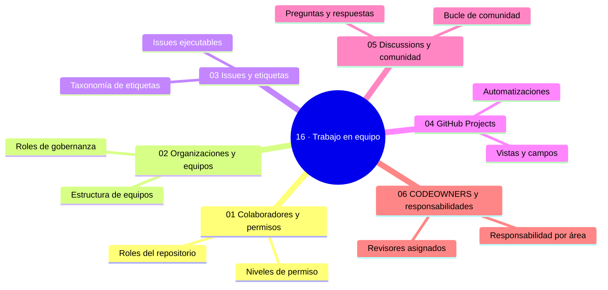

# 16 — Trabajo en equipo

## Bienvenido a esta sección

La pregunta cambia de «¿cómo uso Git yo solo?» a «¿cómo puede trabajar un equipo con Git y GitHub?». Y con ella cambian las herramientas: permisos, organización, planificación, conversación y responsabilidades.

En esta sección estudiarás el andamiaje que sostiene el trabajo colaborativo: quién puede qué (colaboradores y permisos), dónde vive el equipo (organizaciones y equipos), cómo se organiza el trabajo (issues, etiquetas, milestones, Projects), dónde se conversa (Discussions) y de quién es cada código (CODEOWNERS).

## En esta sección estudiarás

* roles del repositorio y jerarquía de permisos (repo, rama, plataforma);
* organizaciones, equipos y roles de gobernanza;
* issues ejecutables, taxonomías de etiquetas y milestones con objetivo;
* GitHub Projects: vistas, campos y automatizaciones sin duplicar verdad;
* Discussions frente a issues y el bucle de comunidad;
* CODEOWNERS, revisores y responsabilidad por área.

## Objetivos de aprendizaje

Al terminar esta sección serás capaz de:

* asignar permisos de repositorio con el principio de mínimo privilegio;
* estructurar una organización con equipos y roles de gobernanza;
* convertir ideas en issues ejecutables con taxonomía de etiquetas y milestones;
* usar GitHub Projects como vista sin duplicar la fuente de verdad;
* explicar cómo `CODEOWNERS` define responsabilidad por área.

## Mapa conceptual

---

## ¿Qué aprenderás en esta sección?

1. [`01-colaboradores-y-permisos.md`](01-colaboradores-y-permisos.md) — roles, mínimo privilegio, outside collaborators.
2. [`02-organizaciones-y-equipos.md`](02-organizaciones-y-equipos.md) — estructura y gobernanza de la org.
3. [`03-issues-y-etiquetas.md`](03-issues-y-etiquetas.md) — issues ejecutables, taxonomía y triage.
4. [`04-github-projects.md`](04-github-projects.md) — tableros, campos y automatización.
5. [`05-discussions-y-comunidad.md`](05-discussions-y-comunidad.md) — preguntas, respuestas y conocimiento.
6. [`06-codeowners-y-responsabilidades.md`](06-codeowners-y-responsabilidades.md) — dueños por ruta y aprobación exigida.

## Cómo estudiar esta sección

Practica cada pieza en una organización de prueba con una segunda cuenta: nada enseña tanto como sentir los permisos desde el otro lado (quien no puede pushear, quien aprueba, quien es dueño). Escribe los acuerdos (roles, SLA, taxonomías) en CONTRIBUTING mientras avanzas: son la mitad del valor.

## Referencias

* GitHub — Documentación oficial: «Permission levels», «Managing teams», «About milestones».
* GitHub Flow (github.com/blog/introducing-github-flow).
* CONTRIBUTING.md de este repositorio como ejemplo de acuerdo escrito.

---

## Checkpoint 16 — Comprobación obligatoria

Antes de avanzar a `17-estrategias-de-git/`, demuestra que puedes (en un repositorio de práctica real):

1. Asignar permisos de repositorio siguiendo el principio de mínimo privilegio (por ejemplo, dar rol Write a quien solo necesita empujar a ramas).
2. Crear un equipo en una organización y asignarle rol de mantenimiento para un conjunto de repositorios.
3. Convertir una idea en un issue ejecutable con etiquetas de prioridad y un milestone vinculado.
4. Configurar un GitHub Project con vistas de tablero y automatización que mueve tarjetas al cerrar issues.
5. Crear un archivo CODEOWNERS que defina responsabilidad por área y revisarlo en una pull request.
6. Habilitar Discussions en un repositorio y convertir una pregunta técnica en una discusión productiva.

## Autopreguntas de cierre

Sin mirar el material, responde mentalmente y luego compruébalo con los capítulos de la sección:

1. Un desarrollador debe proponer cambios pero no integrarlos: ¿qué rol le asignas y por qué?
2. ¿Qué diferencia hay entre un milestone y un Project?
3. ¿Qué hace `CODEOWNERS` que un acuerdo humano no garantiza?
4. ¿Cuándo corresponde usar Discussions en lugar de Issues?
5. ¿Por qué es peligroso otorgar permisos Admin a múltiples personas en un repositorio privado y cómo afecta la trazabilidad de cambios?
6. ¿Cómo decidiría entre usar un milestone y un GitHub Project para planificar una liberación de software, y qué información proporciona cada uno que el otro no da?
7. ¿Qué consecuencias tiene definir incorrectamente los patrones en CODEOWNERS y cómo puede detectarlo antes de que cause bloqueos en PRs?
8. ¿En qué situación sería apropiado usar Discussions en lugar de Issues para resolver una duda sobre la arquitectura del proyecto?

---

## Próximo paso

Cuando termines los seis capítulos, continúa con la siguiente sección:

[`../17-estrategias-de-git/`](../17-estrategias-de-git/)